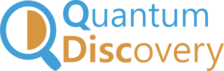
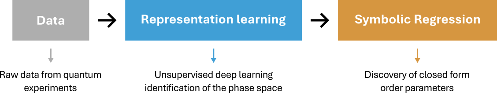

# QDisc


<!-- WARNING: THIS FILE WAS AUTOGENERATED! DO NOT EDIT! -->

<p align="center">


</p>

<h3 align="center">

<em>Interpretable Machine Learning • Quantum Physics • Scientific
Discovery</em>
</h3>

<p align="center">

=3.11">


</p>

<p align="center">

<a href="https://qic-ibk.github.io/qdisc/">Get started</a> \|
<a href="https://qic-ibk.github.io/qdisc/nbs/lib_nbs/index_docs.html">Documentation</a>
\|
<a href="https://qic-ibk.github.io/qdisc/nbs/tutorials/J1J2_tuto1_vae.html">Tutorials</a>
</p>

`QDisc` is a library for discovering quantum phenomena from raw quantum
data via interpretable machine learning. Without any prior knowledge on
the input data, the pipeline aims to uncover unknown regimes and find
order parameters that can help us identify interesting physics in a
human readable form.

The pipeline is composed of two main components: first, a variational
autoencoder (VAE) learns representations that compress the input into
the minimal set of physical parameters needed to understand the data.
Second, and based on the learned representations, a symbolic regression
(SR) module finds closed form equations able to distinguish the
different identified regimes.

<p align="center">



## Getting Started

To begin using the library, we recommend starting with the [tutorial
notebooks](https://qic-ibk.github.io/qdisc/tutorials/J1J2_tuto1_vae.html).
We cover the two pillars of the `Qdisc` pipeline:

1.  Using variational autoencoders to extract interpretable
    representations
    ([link](https://qic-ibk.github.io/qdisc/tutorials/J1J2_tuto1_VAE.ipynb))
2.  Finding closed forms for order paramters via symbolic regression
    ([link](https://qic-ibk.github.io/qdisc/tutorials/J1J2_tuto2_SR.ipynb))

Additional [example
notebooks](https://qic-ibk.github.io/qdisc/examples/index_examples.html)
are used to illustrate specific applications, as those covered in the
[manuscript (TODO)](). For these examples, the quantum data are not
provided:

1.  Measurement snapshots of Rydberg atom systems
    ([link](https://qic-ibk.github.io/qdisc/examples/qdisc_Rydberg.html)).
2.  Classical shadows of the cluster Ising model
    ([link](https://qic-ibk.github.io/qdisc/examples/qdisc_clusterising.html)).
3.  Hybrid data from a fermionic system
    ([link](https://qic-ibk.github.io/qdisc/examples/qdisc_FKM.html)).

## Usage

### Installation

Install latest from the GitHub
[repository](https://github.com/qic-ibk/qdisc):

``` sh
$ pip install git+https://github.com/PaulinDS/qdisc.git
```

### Documentation

The library comprises three core modules. First, `qdisc.Dataset` enables
to handle and preprocess the data efficiently. Next, `qdisc.vae`
provides tools to construct, customize, and train variational
autoencoders (VAEs), including predefined architectures and high-level
training modules. Finally, `qdisc.sr` allows to train symbolic
regression (SR) models based on insights gained from the VAEs.

Documentation can be found hosted on this GitHub
[repository](https://github.com/qic-ibk/qdisc)’s
[pages](https://qic-ibk.github.io/qdisc/).

## Citing

If you find the librairy usefull in your projects, please cite the
accompanying [paper](paper):

TODO add the citation
