# Cluster Ising model


<!-- WARNING: THIS FILE WAS AUTOGENERATED! DO NOT EDIT! -->

This notebook presents how to use QDisc to reproduce the results on the
classical shadows of the cluster Ising model. Its Hamiltoinian is given
by

$$
H\_{\mathrm{cluster}}
=  -\sum\_{i=1}^{N} \sigma^z\_{i-1} \sigma^x_i \sigma^z\_{i+1}
   - h_1 \sum\_{i=1}^{N} \sigma^x_i
    -h_2 \sum\_{i=1}^{N-1}\sigma_i^x\sigma\_{i+1}^x
$$

where
*σ*<sub>*i*</sub><sup>*x*</sup>, *σ*<sub>*i*</sub><sup>*y*</sup>, *σ*<sub>*i*</sub><sup>*z*</sup>
are Pauli operators acting on site *i*. We consider open boundary
conditions defined by
*σ*<sub>0</sub><sup>*z*</sup> = *σ*<sub>*N* + 1</sub><sup>*z*</sup> = 𝟙.
We sweep the transverse-like field *h*<sub>1</sub> ∈ \[0.05, 1.20\] and
the Ising coupling *h*<sub>2</sub> ∈ \[−1.5, 1.5\] to probe the
competition between the cluster term, the transverse-field
(paramagnetic) term, and nearest-neighbor Ising correlations.

## dataset and training

The dataset is produced by first computing the exact ground state
wavefunction using Netket, similar to the J1J2 model (see tutorial).
Then, classical shadows are generated by randomly sampling the Paulis
and their respective outcomes using the probabilities given by the
wavefunction. This is done using the
[`get_classical_shadow()`](https://qic-ibk.github.io/qdisc/lib_nbs/dataset/core.html#get_classical_shadow)
function from `QDisc.dataset`.

``` python
## loading the exact wavefunction ##
with open('data_exact2_clusterN15.pkl', 'rb') as f:
    data_exact = pickle.load(f)

wave_fcts = data_exact['wave_fcts']
```

``` python
## generating classical shadows across the parameter space ##
from qdisc.dataset.core import get_classical_shadow

N = 15
all_h1 = jnp.arange(0.05, 1.25, 0.05)
all_h2 = jnp.arange(-1.5, 1.5, 0.1)

num_sample_per_params = 2000
data = jnp.zeros([jnp.size(all_h1), jnp.size(all_h2), num_sample_per_params, 2*N])

key = jax.random.PRNGKey(12345)

wave_fcts = data_exact['wave_fcts']

for i, h1 in enumerate(all_h1):
    for j, h2 in enumerate(all_h2):
      key, subkey = jax.random.split(key)
      s = get_classical_shadow(psi=wave_fcts.astype('float32')[i,j], num_shots=num_sample_per_params, N=15, rng_key=subkey)
      data = data.at[i,j].set(s)

data = data.astype('int32')
```

``` python
## casting everything in a QDisc Dataset object ##
from qdisc.dataset.core import Dataset

dataset = Dataset(data=data, thetas=[all_h1, all_h2], data_type='shadow', local_dimension=2, local_states=jnp.array([0,1]))
```

``` python
## We use the transformer architecture for the encoder and decoder ##
from qdisc.nn.core import Transformer_encoder
from qdisc.nn.core import Transformer_decoder
from qdisc.vae.core import VAEmodel

encoder = Transformer_encoder(latent_dim=5, d_model=16, num_heads=2, num_layers=3, data_type='shadow')
decoder = Transformer_decoder(d_model=32, num_heads=4, num_layers=3, data_type='shadow')

myvae = VAEmodel(encoder=encoder, decoder=decoder)
```

``` python
## Training ##
from qdisc.vae.core import VAETrainer

myvaetrainer = VAETrainer(model=myvae, dataset=dataset)
key = jax.random.PRNGKey(67483)
num_epochs = 1000
myvaetrainer.train(num_epochs=num_epochs, batch_size=10000, beta=0.65, gamma=0., key=key, printing_rate=50, re_shuffle=True)
```

    Start training...
    epoch=0 step=0 loss=12.347687967698652 recon=10.325565010988841
    logvar=[-0.33022366  0.0294409   0.55953395  0.33956828 -0.45126546]
    epoch=50 step=0 loss=6.487059499221326 recon=2.747702826860476
    logvar=[ 1.60891616e-03 -3.79395645e+00 -5.48110009e+00 -2.10693801e+00
      5.09911842e-03]
    epoch=100 step=0 loss=6.315230991856255 recon=2.176506179580368
    logvar=[-2.18324061e-04 -4.26282124e+00 -5.74415987e+00 -2.89566177e+00
      4.52455450e-04]
    epoch=150 step=0 loss=6.351402070119837 recon=2.0416517952765454
    logvar=[-5.49586326e-03 -4.39419643e+00 -5.77676345e+00 -3.12499072e+00
     -1.05409432e-03]
    epoch=200 step=0 loss=6.185613846957846 recon=1.7170996274912897
    logvar=[-1.38495516e-03 -4.54206555e+00 -5.94358400e+00 -3.26664121e+00
     -4.34269675e-03]
    epoch=250 step=0 loss=6.050364744366315 recon=1.5615449391153347
    logvar=[-1.69562970e-03 -4.60882494e+00 -5.98703399e+00 -3.21580383e+00
     -2.02698014e-03]
    epoch=300 step=0 loss=6.036482538330654 recon=1.4641840750033226
    logvar=[-3.20047955e-03 -4.75379596e+00 -6.11155958e+00 -3.27105191e+00
     -3.88773909e-03]
    epoch=350 step=0 loss=5.979178257724279 recon=1.36887668916349
    logvar=[-3.00514521e-03 -4.81439014e+00 -6.02593182e+00 -3.20735086e+00
      3.48975305e-04]
    epoch=400 step=0 loss=6.009092607946348 recon=1.3728353644820985
    logvar=[-4.44492938e-03 -4.86656668e+00 -6.14489616e+00 -3.26099531e+00
     -1.30218320e-03]
    epoch=450 step=0 loss=6.0220570107792675 recon=1.3389792237164384
    logvar=[-1.68795052e-03 -4.92355700e+00 -6.21856915e+00 -3.31008028e+00
     -2.30367859e-03]
    epoch=500 step=0 loss=5.878122122223036 recon=1.1998018678705789
    logvar=[-1.78353210e-03 -4.95608013e+00 -6.17991373e+00 -3.31688653e+00
     -8.28107691e-04]
    epoch=550 step=0 loss=5.8924336223879115 recon=1.1629692225343342
    logvar=[ 1.08417498e-03 -4.99906500e+00 -6.19032347e+00 -3.34672249e+00
     -1.57586230e-03]
    epoch=600 step=0 loss=5.869670156405646 recon=1.1941889331655504
    logvar=[-4.22815722e-03 -4.98837830e+00 -6.16033137e+00 -3.33722931e+00
     -1.55730017e-03]
    epoch=650 step=0 loss=5.886251256088388 recon=1.1376111060560081
    logvar=[ 5.63655146e-04 -4.94382154e+00 -6.10970727e+00 -3.32718383e+00
      1.95764407e-03]
    epoch=700 step=0 loss=5.899222298427608 recon=1.1503704721551113
    logvar=[-6.42165385e-05 -4.99184416e+00 -6.17988897e+00 -3.41264614e+00
     -2.59477361e-03]
    epoch=750 step=0 loss=5.91955405139542 recon=1.1814203181427434
    logvar=[-1.18126475e-03 -4.99585559e+00 -6.15080361e+00 -3.34256863e+00
      2.21841012e-05]
    epoch=800 step=0 loss=5.8189250483184525 recon=1.130771261113764
    logvar=[ 2.39445420e-03 -4.95950694e+00 -6.15326103e+00 -3.38301455e+00
     -1.38216248e-03]
    epoch=850 step=0 loss=5.81849541244368 recon=1.1504030272990962
    logvar=[-8.11978773e-04 -4.94414587e+00 -6.05133513e+00 -3.36805270e+00
     -1.21090328e-03]
    epoch=900 step=0 loss=5.801429250694841 recon=1.0742724399110732
    logvar=[ 1.54916973e-03 -4.97436513e+00 -6.08436959e+00 -3.45073402e+00
      1.43229962e-03]
    epoch=950 step=0 loss=5.78974498377786 recon=1.0764884790490885
    logvar=[-1.32754115e-03 -4.94436411e+00 -6.00759037e+00 -3.45056866e+00
     -1.69056105e-03]
    Training finished.

``` python
#load the trained model
from qdisc.vae.core import VAETrainer
with open('clusterIsingN15_data_cpVAE2_QDisc.pkl', 'rb') as f:
    all_data = pickle.load(f)

myvaetrainer = VAETrainer(model=myvae, dataset=dataset)

myvaetrainer.init_state(jax.random.PRNGKey(0), dataset.data[0,0])
myvaetrainer.state = myvaetrainer.state.replace(params=all_data['params'])
num_epochs = 1000
myvaetrainer.history_recon = all_data['history_recon']
myvaetrainer.history_logvar = all_data['history_logvar']
```

``` python
## plot the training ##
myvaetrainer.plot_training(num_epochs = num_epochs)
```

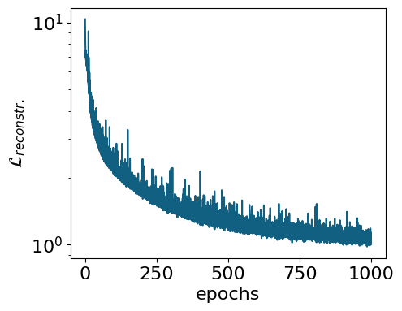

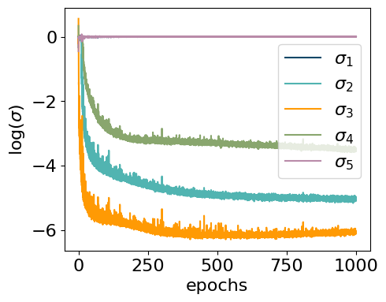

``` python
## compute and plot the representation ##
myvaetrainer.compute_and_plot_repr2d(subplot=False)
```

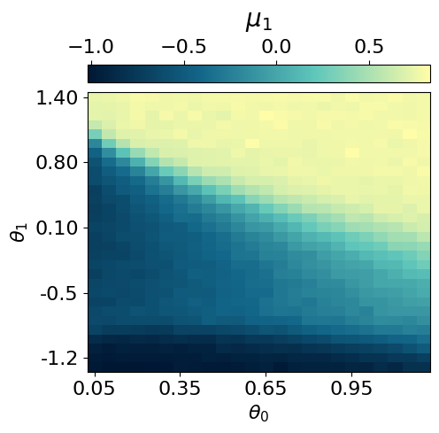

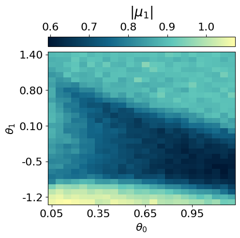

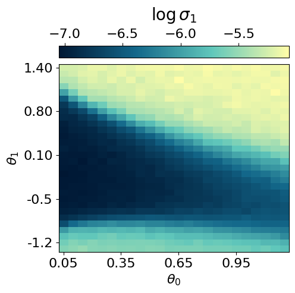

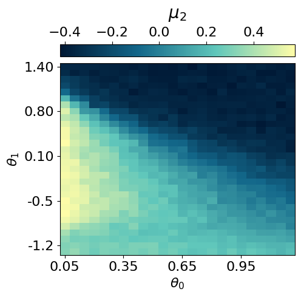

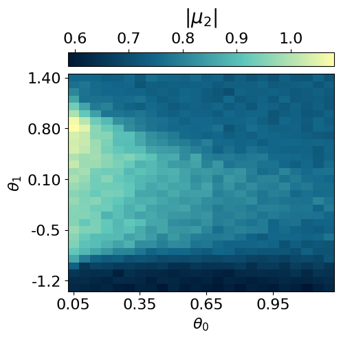

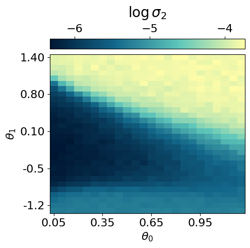

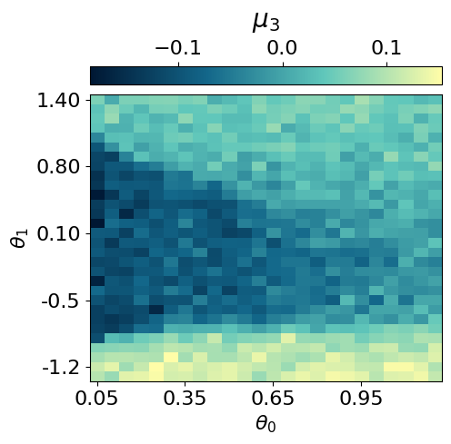

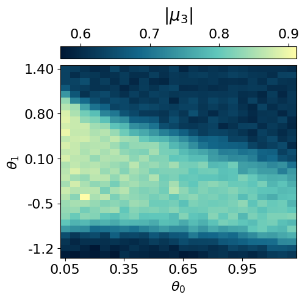

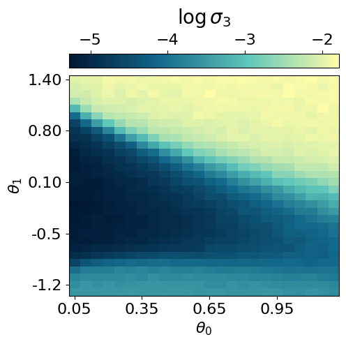

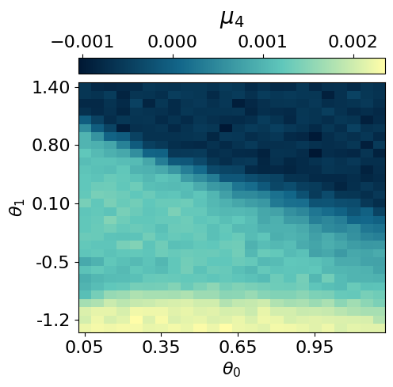

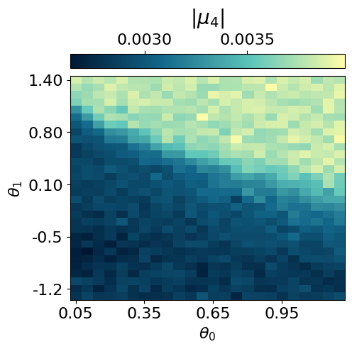

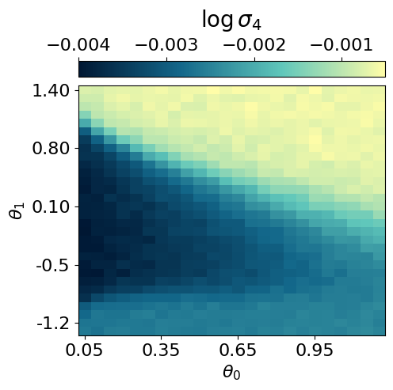

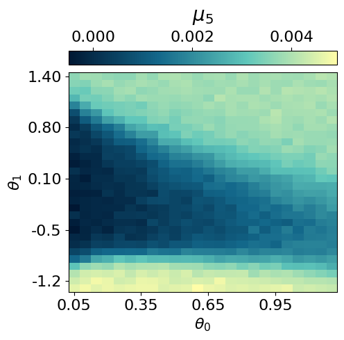

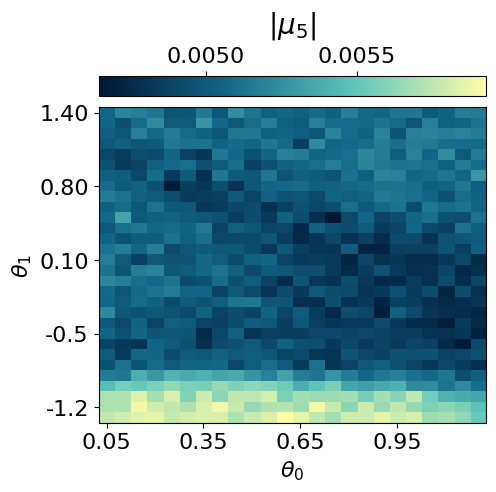

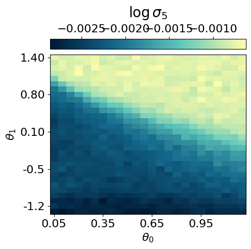

``` python
# or plot using subplots (more compact)
myvaetrainer.plot_repr2d(subplot=True)
```

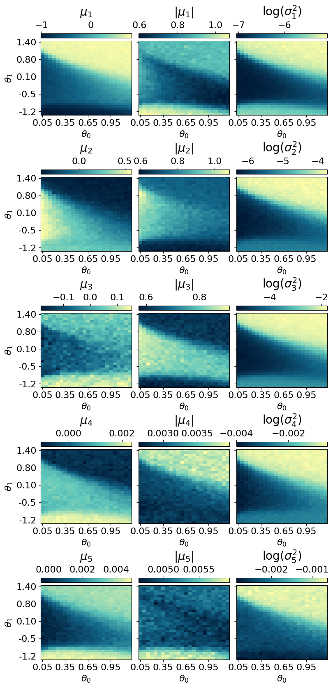

``` python
all_data = myvaetrainer.get_data()

with open('clusterIsingN15_data_cpVAE2_QDisc.pkl', 'wb') as f:
    pickle.dump(all_data, f)
```

## Reconstruction of physical quantities

In this section, we analyze how the **cpVAE can reconstruct physical
quantities**, such as energy and stabilizers. We first reconstruct each
shadows and then compute the **Median-of-means estimate** of the various
observables.

``` python
## shadows reconstruction, from testset random measurements ##

# generate random measurement
N = 15
all_h1 = jnp.arange(0.05, 1.25, 0.05)
all_h2 = jnp.arange(-1.5, 1.5, 0.1)

num_sample_per_params = 2000
test_data = jnp.zeros([jnp.size(all_h1), jnp.size(all_h2), num_sample_per_params, 2*N])

key = jax.random.PRNGKey(7654)

wave_fcts = data_exact['wave_fcts']

for i, h1 in enumerate(all_h1):
    for j, h2 in enumerate(all_h2):
      #we dont need the measurement output but just the random basis. Easier to just use the function already inplemented and ignore the output
      key, subkey = jax.random.split(key)
      s = get_classical_shadow(psi=wave_fcts.astype('float32')[i,j], num_shots=num_sample_per_params, N=15, rng_key=subkey)
      test_data = test_data.at[i,j].set(s)

test_data = test_data.astype('int32')

# use the decoder to predict the outcomes of each shadows

key = jax.random.PRNGKey(347856)
S_reconstructed = jnp.zeros_like(test_data)

for i, h1 in enumerate(all_h1):
    for j, h2 in enumerate(all_h2):
        d = test_data[i,j]
        key, subkey = jax.random.split(key)
        s = myvaetrainer.reconstruct_sample(d, subkey)
        S_reconstructed = S_reconstructed.at[i,j].set(s)
```

``` python
## estimate of the energy ##
@jax.jit
def sqe_cal_energy(sqe: jnp.ndarray,
                   J_cluster: float,
                   h1: float,
                   h2: float) -> jnp.ndarray:
    """
    Estimate ⟨H⟩ from a batch of classical‐shadows `sqe` of shape (T, 2*num_bits),
    where columns alternate (basis, outcome), with basis encoded {X→2, Y→3, Z→4}
    and outcome ∈ {0,1}. Returns the average energy over the batch.
    """
    # split into per‐site basis and outcome
    basis   = sqe[:, 0::2]   # shape (T, num_bits)
    outcome = sqe[:, 1::2]   # shape (T, num_bits)

    # single‐shot estimators: ±3 for X and Z, zero otherwise
    expX = jnp.where(basis == 2,
                     jnp.where(outcome == 1, +3.0, -3.0),
                     0.0)
    expZ = jnp.where(basis == 4,
                     jnp.where(outcome == 1, +3.0, -3.0),
                     0.0)

    # two‐site and three‐site terms
    expXX  = expX[:, :-1] * expX[:, 1:]          # shape (T, num_bits-1)
    expZXZ = expZ[:, :-2] * expX[:, 1:-1] * expZ[:, 2:]  # shape (T, num_bits-2)

    # sums per snapshot
    sumZXZ = expZXZ.sum(axis=1)   # (T,)
    sumX   = expX.sum(axis=1)     # (T,)
    sumXX  = expXX.sum(axis=1)    # (T,)

    # instantaneous energies, then mean over T
    energies = -sumZXZ * J_cluster - sumX * h1 - sumXX * h2
    return energies.mean()


def MoM_energy(J_cluster: float,
               h1: float,
               h2: float,
               sqe: jnp.ndarray,
               num_parts: int) -> jnp.ndarray:
    """
    Median‐of‐means estimate of ⟨H⟩ from shadows `sqe` of shape (T, 2*num_bits),
    partitioned into `num_parts` blocks of equal size.
    """
    T = sqe.shape[0]
    part_size = T // num_parts
    if part_size * num_parts != T:
        raise ValueError(f"T={T} not divisible by num_parts={num_parts}")

    # compute block‐means
    means = []
    for k in range(num_parts):
        block = sqe[k*part_size:(k+1)*part_size]
        means.append(sqe_cal_energy(block, J_cluster, h1, h2))
    means = jnp.stack(means)  # (num_parts,)

    # return the median of the block‐means
    return jnp.median(means)
```

``` python
energy_from_dataset = jnp.zeros((len(all_h1),len(all_h2)))

for i, h1 in enumerate(all_h1):
    for j, h2 in enumerate(all_h2):
        energy_from_dataset = energy_from_dataset.at[i,j].set(MoM_energy(J_cluster=1.0, h1=h1, h2=h2, sqe=dataset.data[i,j], num_parts=10))


energy_recon = jnp.zeros((len(all_h1),len(all_h2)))

for i, h1 in enumerate(all_h1):
    for j, h2 in enumerate(all_h2):
        energy_recon = energy_recon.at[i,j].set(MoM_energy(J_cluster=1.0, h1=h1, h2=h2, sqe=S_reconstructed[i,j], num_parts=10))
```

``` python
exact_energies = data_exact['energies']
#energy_from_dataset = clusterIsingN15_VAE2_reconstruction['energy_from_dataset']
#energy_recon = clusterIsingN15_VAE2_reconstruction['energy_recon']

energy_max = jnp.max(jnp.array([jnp.max(exact_energies),jnp.max(energy_from_dataset),jnp.max(energy_recon)]))
energy_min = jnp.min(jnp.array([jnp.min(exact_energies),jnp.min(energy_from_dataset),jnp.min(energy_recon)]))


plt.rcParams['font.size'] = 16
plt.figure(figsize=(7,5),dpi=100)


plt.imshow(jnp.rot90(exact_energies),cmap=cmap_green3, vmin=energy_min, vmax=energy_max)
plt.colorbar()
plt.title(r'Exact energy')
plt.xlabel(r'$h_1$')
plt.ylabel(r'$h_2$')
plt.xticks([0,10,20], [0,0.5,1])
plt.yticks([5,15,25], [-1,0,1])
plt.show()


plt.rcParams['font.size'] = 16
plt.figure(figsize=(7,5),dpi=100)


plt.imshow(jnp.rot90(energy_from_dataset),cmap=cmap_green3, vmin=energy_min, vmax=energy_max)
plt.colorbar()
plt.title(r'Dataset energy')
plt.xlabel(r'$h_1$')
plt.ylabel(r'$h_2$')
plt.xticks([0,10,20], [0,0.5,1])
plt.yticks([5,15,25], [-1,0,1])
plt.show()


plt.rcParams['font.size'] = 16
plt.figure(figsize=(7,5),dpi=100)


plt.imshow(jnp.rot90(energy_recon),cmap=cmap_green3, vmin=energy_min, vmax=energy_max)
plt.colorbar()
plt.title(r'Recon. energy')
plt.xlabel(r'$h_1$')
plt.ylabel(r'$h_2$')
plt.xticks([0,10,20], [0,0.5,1])
plt.yticks([5,15,25], [-1,0,1])
plt.show()
```

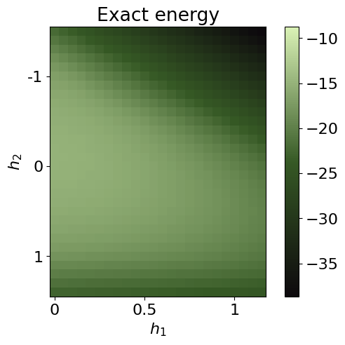

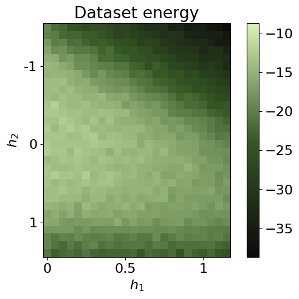

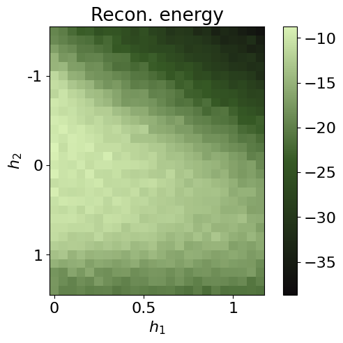

``` python
energies = {}
energies['exact'] = exact_energies
energies['dataset'] = energy_from_dataset
energies['recon'] = energy_recon

data['energies'] = energies
```

``` python
## same for the stabilizers ##
@jax.jit
def sqe_cal_stab(sqe: jnp.ndarray) -> jnp.ndarray:

    # split into per‐site basis and outcome
    basis   = sqe[:, 0::2]   # shape (T, num_bits)
    outcome = sqe[:, 1::2]   # shape (T, num_bits)

    expX = jnp.where(basis == 2,
                     jnp.where(outcome == 1, +3.0, -3.0),
                     0.0)
    expZ = jnp.where(basis == 4,
                     jnp.where(outcome == 1, +3.0, -3.0), #3 for unbiased estim (see classical shadows th.)
                     0.0)
    all_ZX_XZ = []
    for i in range(2,N):
      expZX_XZ = expZ[:, :-i]
      for j in range(1,i):
        expZX_XZ = expZX_XZ * expX[:, j:-i+j]
      expZX_XZ = expZX_XZ * expZ[:, i:]

      #sums per samples
      ZX_XZ = expZX_XZ.sum(axis=1).mean()

      all_ZX_XZ.append(ZX_XZ)


    all_ZX_XZ = jnp.array(all_ZX_XZ)    # shape

    return all_ZX_XZ


def MoM_stab(sqe: jnp.ndarray,
               num_parts: int) -> jnp.ndarray:
    """
    Median‐of‐means estimate of ⟨H⟩ from shadows `sqe` of shape (T, 2*num_bits),
    partitioned into `num_parts` blocks of equal size.
    """
    T = sqe.shape[0]
    part_size = T // num_parts
    if part_size * num_parts != T:
        raise ValueError(f"T={T} not divisible by num_parts={num_parts}")

    # compute block‐means
    means = []
    for k in range(num_parts):
        block = sqe[k*part_size:(k+1)*part_size]
        means.append(sqe_cal_stab(block))
    means = jnp.stack(means)  # (num_parts,k)

    # return the median of the block‐means
    return jnp.median(means, axis=0)
```

``` python
stab_dataset = jnp.zeros((len(all_h1),len(all_h2),N-2))

for i, h1 in enumerate(all_h1):
    for j, h2 in enumerate(all_h2):
      stab = MoM_stab(sqe=dataset.data[i,j], num_parts=10)
      stab_dataset = stab_dataset.at[i,j].set(stab)

stab_recon = jnp.zeros((len(all_h1),len(all_h2),N-2))

for i, h1 in enumerate(all_h1):
    for j, h2 in enumerate(all_h2):
      stab = MoM_stab(sqe=S_reconstructed[i,j], num_parts=10)
      stab_recon = stab_recon.at[i,j].set(stab)

plt.rcParams['font.size'] = 16
plt.figure(figsize=(7,5),dpi=100)

plt.imshow(jnp.rot90(stab_dataset[...,0]),cmap=cmap_brown, vmin=0, vmax=N)
plt.colorbar()
plt.title(r'Dataset ZXZ stab')
plt.xlabel(r'$h_1$')
plt.ylabel(r'$h_2$')
plt.xticks([0,10,20], [0,0.5,1])
plt.yticks([5,15,25], [-1,0,1])
plt.show()


plt.rcParams['font.size'] = 16
plt.figure(figsize=(7,5),dpi=100)

plt.imshow(jnp.rot90(stab_recon[...,0]),cmap=cmap_brown, vmin=0, vmax=N)
plt.colorbar()
plt.title(r'Reconstr. ZXZ stab')
plt.xlabel(r'$h_1$')
plt.ylabel(r'$h_2$')
plt.xticks([0,10,20], [0,0.5,1])
plt.yticks([5,15,25], [-1,0,1])
plt.show()

plt.rcParams['font.size'] = 16
plt.figure(figsize=(7,5),dpi=100)

plt.imshow(jnp.rot90(stab_dataset[...,1]),cmap=cmap_brown)
plt.colorbar()
plt.title(r'Dataset ZXXZ stab')
plt.xlabel(r'$h_1$')
plt.ylabel(r'$h_2$')
plt.xticks([0,10,20], [0,0.5,1])
plt.yticks([5,15,25], [-1,0,1])
plt.show()


plt.rcParams['font.size'] = 16
plt.figure(figsize=(7,5),dpi=100)

plt.imshow(jnp.rot90(stab_recon[...,1]),cmap=cmap_brown)
plt.colorbar()
plt.title(r'Reconstr. ZXXZ stab')
plt.xlabel(r'$h_1$')
plt.ylabel(r'$h_2$')
plt.xticks([0,10,20], [0,0.5,1])
plt.yticks([5,15,25], [-1,0,1])
plt.show()
```

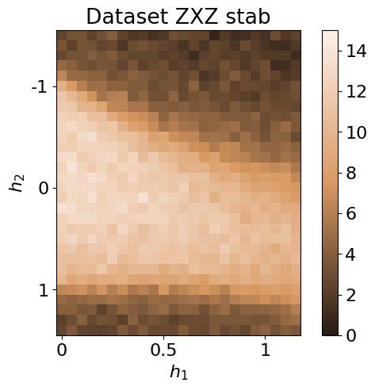

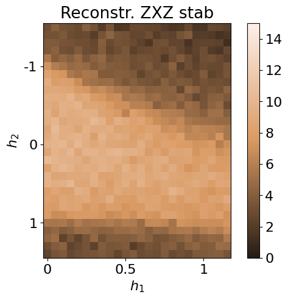

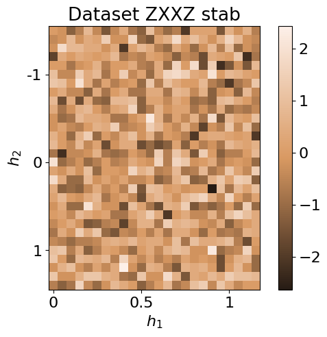

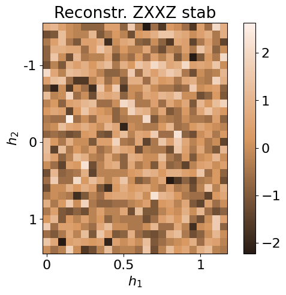

``` python
data['stabilizers'] = {}
data['stabilizers']['dataset'] = stab_dataset
data['stabilizers']['recon'] = stab_recon
```

``` python
with open('clusterIsingN15_data_cpVAE2_QDisc.pkl', 'wb') as f:
    pickle.dump(data, f)
```

## Symbolic regression

In this section, we employ `QDisc.SR.SymbolicRegression` to investigate
the **nature of the additional cluster** observed in the latent
representation. We will use the `'2_body_correlator'` ansatz with the
**SR1** objective.

``` python
## specifying the index of the cluster and the 'out' data ##

idx_add_cluster = jnp.array([[ 0, 21],
       [ 0, 22],
       [ 0, 23],
       [ 0, 24],
       [ 1, 21],
       [ 1, 22],
       [ 1, 23],
       [ 2, 22]])

idx_add_cluster2 = jnp.array([[ 0, 17],
       [ 0, 18],
       [ 0, 19],
       [ 0, 20],
       [ 0, 21],
       [ 0, 22],
       [ 0, 23],
       [ 0, 24],
       [ 0, 25],
       [ 0, 26],
       [ 1, 17],
       [ 1, 18],
       [ 1, 19],
       [ 1, 20],
       [ 1, 21],
       [ 1, 22],
       [ 1, 23],
       [ 1, 24],
       [ 1, 25],
       [ 2, 17],
       [ 2, 18],
       [ 2, 19],
       [ 2, 20],
       [ 2, 21],
       [ 2, 22],
       [ 2, 23],
       [ 2, 24],
       [ 3, 17],
       [ 3, 18],
       [ 3, 19],
       [ 3, 20],
       [ 3, 21],
       [ 3, 22],
       [ 3, 23],
       [ 4, 17],
       [ 4, 18],
       [ 4, 19],
       [ 4, 20],
       [ 4, 21],
       [ 4, 22],
       [ 4, 23],
       [ 5, 17],
       [ 5, 18],
       [ 5, 19],
       [ 5, 20],
       [ 5, 21],
       [ 5, 22],
       [ 6, 17],
       [ 6, 18],
       [ 6, 19],
       [ 6, 20],
       [ 6, 21],
       [ 7, 17],
       [ 7, 18],
       [ 7, 19],
       [ 7, 20],
       [ 7, 21],
       [ 8, 17],
       [ 8, 18],
       [ 8, 19],
       [ 8, 20],
       [ 9, 17],
       [ 9, 18],
       [ 9, 19],
       [10, 18]])

array_add_cluster = jnp.zeros((len(all_h1),len(all_h2)))

for i,j in idx_add_cluster:
  array_add_cluster = array_add_cluster.at[i,j].set(1)

for i,j in idx_add_cluster2:
  array_add_cluster = array_add_cluster.at[i,j].add(1)


plt.rcParams['font.size'] = 16
plt.figure(figsize=(5,4),dpi=200)


plt.imshow(jnp.rot90(array_add_cluster ),cmap=cmap_blue)
plt.colorbar()
plt.title(r'add cluster id')
plt.xlabel(r'$h_1$')
plt.ylabel(r'$h_2$')
plt.xticks([0,10,20], [0,0.5,1])
plt.yticks([5,15,25], [-1,0,1])
plt.show()
```

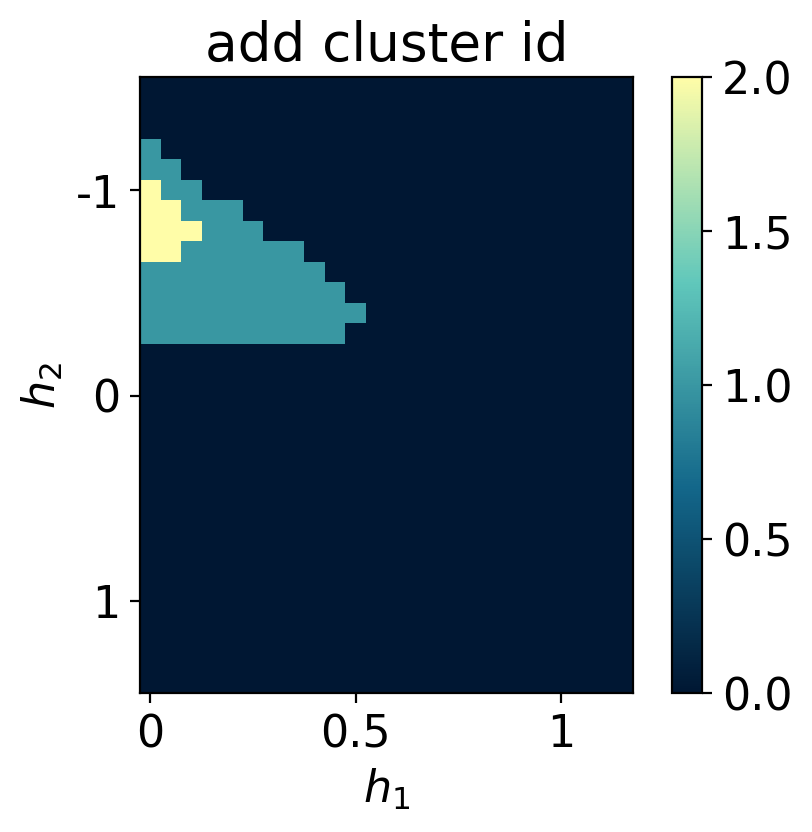

``` python
## try using only Z measurements ##
N = 15
all_h1 = jnp.arange(0.05, 1.25, 0.05)
all_h2 = jnp.arange(-1.5, 1.5, 0.1)

num_sample_per_params = 2000
data = jnp.zeros([jnp.size(all_h1), jnp.size(all_h2), num_sample_per_params, 2*N])

key = jax.random.PRNGKey(12345)

wave_fcts = data_exact['wave_fcts']

for i, h1 in enumerate(all_h1):
    for j, h2 in enumerate(all_h2):
      key, subkey = jax.random.split(key)
      s = get_classical_shadow(psi=wave_fcts.astype('float32')[i,j], num_shots=num_sample_per_params, N=15, rng_key=subkey, bases='Z')
      data = data.at[i,j].set(s)

data = data.astype('int32')[...,1::2]

dataset_onlyZ = Dataset(data=data, thetas=[all_h1, all_h2], data_type='shadow', local_dimension=2, local_states=jnp.array([0,1]))
```

``` python
## 2BC with SR1 on just Z measurements ##
from qdisc.sr.core import SymbolicRegression

cluster_idx_out = jnp.argwhere(array_add_cluster == 0)


mySR = SymbolicRegression(dataset_onlyZ,
                          cluster_idx_in=idx_add_cluster,
                          cluster_idx_out=cluster_idx_out,
                          objective='SR1',
                          shift_data=False)

key = jax.random.PRNGKey(7654)
modelSR1 = mySR.train_2BC(key, dataset_size=10000)

## plot the alpha ##
topology = [[i for i in range(N)]]
mySR.plot_alpha(topology=topology, edge_scale=5, name='SR1')

## plot the prediction ##
p = mySR.compute_and_plot_prediction(name='SR1')
```

``` python
## try using only X measurements ##
N = 15
all_h1 = jnp.arange(0.05, 1.25, 0.05)
all_h2 = jnp.arange(-1.5, 1.5, 0.1)

num_sample_per_params = 2000
data = jnp.zeros([jnp.size(all_h1), jnp.size(all_h2), num_sample_per_params, 2*N])

key = jax.random.PRNGKey(12345)

wave_fcts = data_exact['wave_fcts']

for i, h1 in enumerate(all_h1):
    for j, h2 in enumerate(all_h2):
      key, subkey = jax.random.split(key)
      s = get_classical_shadow(psi=wave_fcts.astype('float32')[i,j], num_shots=num_sample_per_params, N=15, rng_key=subkey, bases='X')
      data = data.at[i,j].set(s)

data = data.astype('int32')[...,1::2]

dataset_onlyX = Dataset(data=data, thetas=[all_h1, all_h2], data_type='shadow', local_dimension=2, local_states=jnp.array([0,1]))
```

``` python
## 2BC ansatz with SR1 on just X measurements ##

cluster_idx_out = jnp.argwhere(array_add_cluster == 0)


mySR = SymbolicRegression(dataset_onlyX,
                          cluster_idx_in=idx_add_cluster,
                          cluster_idx_out=cluster_idx_out,
                          objective='SR1',
                          shift_data=False)

key = jax.random.PRNGKey(7654)
modelSR1 = mySR.train_2BC(key, dataset_size=10000)

## plot the alpha ##
topology = [[i for i in range(N)]]
mySR.plot_alpha(topology=topology, edge_scale=5, name='SR1')

## plot the prediction ##
p = mySR.compute_and_plot_prediction(name='SR1')
```

    ### Start preparing the dataset ###
    ### Dataset prepared, start the trainnig ###
    ### Training finished ###
      message: CONVERGENCE: NORM OF PROJECTED GRADIENT <= PGTOL
      success: True
       status: 0
          fun: 0.5106711659251788
            x: [ 1.540e+00  3.770e-02 ...  2.136e-01  1.452e+00]
          nit: 55
          jac: [ 2.176e-06  2.887e-06 ...  1.443e-06  6.439e-07]
         nfev: 6678
         njev: 63
     hess_inv: <105x105 LbfgsInvHessProduct with dtype=float64>

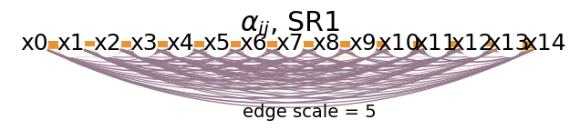

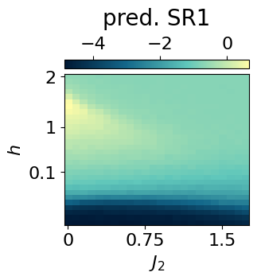

``` python
alpha_ij = mySR.model.alpha
alpha_ij
```

    array([ 1.53990705,  0.03770259, -0.04346825, -0.13149565, -0.20346243,
           -0.216187  , -0.12516161, -0.23463057, -0.14797347, -0.16969701,
           -0.01672046, -0.26892908, -0.251428  , -0.18952416,  0.90347631,
           -0.07494612, -0.16222789, -0.29326692, -0.17400529, -0.26595568,
           -0.12645806, -0.2897381 , -0.16483247, -0.27759441, -0.1555185 ,
           -0.16111236, -0.16457265,  1.06849548, -0.24298301, -0.14912591,
           -0.24760999, -0.27366484, -0.23243181, -0.16129378, -0.11605931,
           -0.27185235, -0.19379922, -0.1133317 , -0.25916324,  1.05848648,
           -0.16312015, -0.21815877, -0.14621403, -0.29572144, -0.15435303,
           -0.29049595, -0.33689923, -0.14333938, -0.17874212, -0.12713576,
            1.15864417, -0.17555103, -0.11184462, -0.2233854 , -0.11609519,
           -0.40802327, -0.16249469, -0.26187147, -0.1974241 , -0.19273916,
            1.04689131, -0.18818199, -0.08297489, -0.2684967 , -0.21047272,
           -0.27824555, -0.07299964, -0.13854064, -0.16618549,  1.0737933 ,
           -0.23992408, -0.15637794, -0.15867473, -0.0993864 , -0.26412637,
           -0.07127817, -0.18548937,  1.0084792 , -0.17280045,  0.05488786,
           -0.02439849, -0.34237022, -0.14169306, -0.24500431,  1.07123984,
           -0.13488342, -0.21586478, -0.18640315, -0.24594356, -0.04409138,
            1.06001665, -0.26047844, -0.0571735 , -0.24347058, -0.12175681,
            1.12084896, -0.3204326 , -0.16197169, -0.25358765,  1.18735147,
           -0.19385288, -0.14679398,  0.76954958,  0.21358879,  1.45176713])

we can further reduce the form of *f*(*x*) by mapping the 2 body weights
*α*<sub>*i**j*</sub> to a compact analytical formula. This can be done
using the `reduce_alpha()` method.

``` python
g = mySR.reduce_alpha(random_state = 5732)
```

    PySRRegressor imported

    /usr/local/lib/python3.12/dist-packages/pysr/sr.py:2811: UserWarning: Note: it looks like you are running in Jupyter. The progress bar will be turned off.
      warnings.warn(
    [ Info: Started!


    Expressions evaluated per second: 6.080e+04
    Progress: 319 / 6200 total iterations (5.145%)
    ════════════════════════════════════════════════════════════════════════════════════════════════════
    ───────────────────────────────────────────────────────────────────────────────────────────────────
    Complexity  Loss       Score      Equation
    1           2.035e-01  0.000e+00  y = -0.0070507
    3           1.909e-01  3.189e-02  y = 0.63834 / x₁
    5           1.358e-01  1.702e-01  y = 0.57163 / (x₁ - x₀)
    7           2.778e-02  7.935e-01  y = -0.20651 / ((x₁ - x₀) + -1.1858)
    9           1.197e-02  4.208e-01  y = (-0.14197 / (0.89362 - (x₁ - x₀))) + -0.22225
    19          1.191e-02  4.953e-04  y = ((x₁ / (x₁ * ((((x₁ - 1.1846) - (x₀ - x₁)) - 0.61262) ...
                                          - x₀))) * 0.26971) - 0.22255
    ───────────────────────────────────────────────────────────────────────────────────────────────────
    ════════════════════════════════════════════════════════════════════════════════════════════════════
    Press 'q' and then <enter> to stop execution early.

    Expressions evaluated per second: 6.010e+04
    Progress: 694 / 6200 total iterations (11.194%)
    ════════════════════════════════════════════════════════════════════════════════════════════════════
    ───────────────────────────────────────────────────────────────────────────────────────────────────
    Complexity  Loss       Score      Equation
    1           2.035e-01  0.000e+00  y = -0.0070507
    3           1.909e-01  3.189e-02  y = 0.63834 / x₁
    5           1.357e-01  1.705e-01  y = -0.59076 / (x₀ - x₁)
    7           2.778e-02  7.932e-01  y = -0.20651 / ((x₁ - x₀) + -1.1858)
    9           1.170e-02  4.324e-01  y = (-0.087259 / (0.93359 - (x₁ - x₀))) + -0.20745
    15          1.143e-02  3.890e-03  y = ((-0.035063 / (0.97307 - (x₁ - x₀))) + -0.21702) - (-0...
                                          .026586 / (x₀ - -0.34569))
    ───────────────────────────────────────────────────────────────────────────────────────────────────
    ════════════════════════════════════════════════════════════════════════════════════════════════════
    Press 'q' and then <enter> to stop execution early.

    Expressions evaluated per second: 7.340e+04
    Progress: 1210 / 6200 total iterations (19.516%)
    ════════════════════════════════════════════════════════════════════════════════════════════════════
    ───────────────────────────────────────────────────────────────────────────────────────────────────
    Complexity  Loss       Score      Equation
    1           2.035e-01  0.000e+00  y = -0.0070507
    3           1.909e-01  3.189e-02  y = 0.63834 / x₁
    5           1.357e-01  1.705e-01  y = -0.59076 / (x₀ - x₁)
    7           2.778e-02  7.932e-01  y = -0.20686 / ((x₁ + -1.1859) - x₀)
    9           1.168e-02  4.332e-01  y = (-0.070531 / (0.94634 - (x₁ - x₀))) + -0.20238
    11          1.168e-02  6.703e-05  y = ((0.44765 / (0.94717 - (x₁ - x₀))) * -0.15478) + -0.20...
                                          168
    13          1.071e-02  4.346e-02  y = (-0.11097 / ((0.91048 - (x₁ - x₀)) + (0.022285 / x₁)))...
                                           - 0.21383
    15          1.029e-02  1.995e-02  y = ((-0.12132 / (0.90642 - (x₁ - x₀))) + (0.38011 / (x₁ *...
                                           x₁))) + -0.22749
    17          9.572e-03  3.606e-02  y = (-0.11953 / (0.90714 - (x₁ - x₀))) + ((0.078487 / ((0....
                                          19978 - x₀) * x₁)) + -0.22525)
    19          9.415e-03  8.301e-03  y = ((-0.12599 / (0.90378 - (x₁ - x₀))) + ((-0.22172 / (x₁...
                                           * (x₀ - 0.57073))) / x₁)) - 0.21898
    21          9.313e-03  5.413e-03  y = ((-0.10962 / (0.91595 - (x₁ - x₀))) + ((-0.18398 / ((x...
                                          ₁ * x₀) - 0.57641)) / (x₁ + -0.2413))) - 0.22248
    23          9.221e-03  4.986e-03  y = ((-0.18437 / ((x₀ * (x₁ * 0.6088)) - 0.57172)) / (x₁ +...
                                           -0.24692)) + ((-0.11029 / (0.916 - (x₁ - x₀))) - 0.22135)
    25          9.214e-03  3.672e-04  y = ((-0.11045 / (0.91633 - (x₁ - x₀))) + ((-0.24069 / (((...
                                          x₁ * x₀) / -0.70687) - -0.707)) / (x₀ - (x₁ + -0.2411)))) ...
                                          - 0.22194
    ───────────────────────────────────────────────────────────────────────────────────────────────────
    ════════════════════════════════════════════════════════════════════════════════════════════════════
    Press 'q' and then <enter> to stop execution early.

    Expressions evaluated per second: 8.140e+04
    Progress: 1757 / 6200 total iterations (28.339%)
    ════════════════════════════════════════════════════════════════════════════════════════════════════
    ───────────────────────────────────────────────────────────────────────────────────────────────────
    Complexity  Loss       Score      Equation
    1           2.035e-01  0.000e+00  y = -0.0070507
    3           1.909e-01  3.189e-02  y = 0.63834 / x₁
    5           1.357e-01  1.705e-01  y = -0.59076 / (x₀ - x₁)
    7           2.778e-02  7.932e-01  y = -0.20687 / (x₁ + (-1.1859 - x₀))
    9           1.168e-02  4.332e-01  y = (-0.070531 / (0.94634 - (x₁ - x₀))) + -0.20238
    11          1.168e-02  6.703e-05  y = ((0.44765 / (0.94717 - (x₁ - x₀))) * -0.15478) + -0.20...
                                          168
    13          1.071e-02  4.347e-02  y = (-0.11094 / (((0.022242 / x₁) + 0.91038) - (x₁ - x₀)))...
                                           - 0.21384
    15          1.027e-02  2.093e-02  y = (-0.11646 / ((0.90857 - (x₁ - x₀)) + (0.02394 / (x₁ * ...
                                          x₁)))) - 0.21942
    17          9.563e-03  3.555e-02  y = (-0.13043 / (0.90043 - (x₁ - x₀))) + ((-0.080147 / (x₁...
                                           * (x₀ + -0.20308))) - 0.22673)
    19          9.362e-03  1.060e-02  y = ((-0.2884 / ((x₀ - 0.56878) * x₁)) / x₁) + ((-0.12642 ...
                                          / (0.90323 - (x₁ - x₀))) - 0.21861)
    21          9.301e-03  3.307e-03  y = ((-0.10962 / (0.91595 - (x₁ - x₀))) + ((-0.18398 / ((x...
                                          ₁ * x₀) - 0.57641)) / (x₁ + -0.29705))) - 0.22248
    23          9.220e-03  4.358e-03  y = (-0.10962 / (0.91595 - (x₁ - x₀))) + (((-0.18398 / ((x...
                                          ₁ * x₀) - 0.57641)) / ((x₁ - x₀) + -0.2413)) - 0.22248)
    25          9.183e-03  1.991e-03  y = (((-0.24069 / (((x₁ * x₀) / -0.80273) - -0.76212)) / (...
                                          x₀ - (x₁ + -0.2411))) + (-0.11045 / (0.91633 - (x₁ - x₀)))...
                                          ) - 0.22194
    ───────────────────────────────────────────────────────────────────────────────────────────────────
    ════════════════════════════════════════════════════════════════════════════════════════════════════
    Press 'q' and then <enter> to stop execution early.

    Expressions evaluated per second: 8.590e+04
    Progress: 2272 / 6200 total iterations (36.645%)
    ════════════════════════════════════════════════════════════════════════════════════════════════════
    ───────────────────────────────────────────────────────────────────────────────────────────────────
    Complexity  Loss       Score      Equation
    1           2.035e-01  0.000e+00  y = -0.0070507
    3           1.909e-01  3.189e-02  y = 0.63864 / x₁
    5           1.357e-01  1.705e-01  y = -0.59076 / (x₀ - x₁)
    7           2.778e-02  7.932e-01  y = -0.20687 / (x₁ + (-1.1859 - x₀))
    9           1.168e-02  4.333e-01  y = (-0.070507 / (0.94622 - (x₁ - x₀))) + -0.20238
    13          1.071e-02  2.173e-02  y = (-0.11094 / (((0.022242 / x₁) + 0.91038) - (x₁ - x₀)))...
                                           - 0.21384
    15          1.027e-02  2.093e-02  y = (-0.11646 / ((0.90857 - (x₁ - x₀)) + (0.02394 / (x₁ * ...
                                          x₁)))) - 0.21942
    17          9.501e-03  3.882e-02  y = (-0.16832 / (x₁ * (x₀ - 0.4115))) + ((-0.10962 / (0.91...
                                          595 - (x₁ - x₀))) - 0.22248)
    19          9.358e-03  7.580e-03  y = (((-0.18398 / (x₁ * (x₀ - 0.4115))) / x₁) - 0.22248) +...
                                           (-0.10962 / (0.91595 - (x₁ - x₀)))
    21          9.279e-03  4.203e-03  y = (-0.10962 / (0.91595 - (x₁ - x₀))) + (((-0.18398 / ((x...
                                          ₁ - x₀) * (x₀ - 0.4115))) / x₁) - 0.22248)
    23          9.186e-03  5.073e-03  y = (-0.11036 / (0.9167 - (x₁ - x₀))) + (((-0.18398 / ((x₁...
                                           * x₀) - 0.57641)) / (x₁ + (-0.27416 - x₀))) - 0.22238)
    25          9.167e-03  9.969e-04  y = (-0.11036 / (0.9167 - (x₁ - x₀))) + (((-0.18398 / ((x₁...
                                           * x₀) - 0.63347)) / (x₁ + ((-0.18289 - 0.151) - x₀))) - 0...
                                          .22238)
    ───────────────────────────────────────────────────────────────────────────────────────────────────
    ════════════════════════════════════════════════════════════════════════════════════════════════════
    Press 'q' and then <enter> to stop execution early.

    Expressions evaluated per second: 9.520e+04
    Progress: 2806 / 6200 total iterations (45.258%)
    ════════════════════════════════════════════════════════════════════════════════════════════════════
    ───────────────────────────────────────────────────────────────────────────────────────────────────
    Complexity  Loss       Score      Equation
    1           2.035e-01  0.000e+00  y = -0.0070507
    3           1.909e-01  3.189e-02  y = 0.63864 / x₁
    5           1.357e-01  1.705e-01  y = -0.59076 / (x₀ - x₁)
    7           2.778e-02  7.932e-01  y = -0.20687 / (x₁ + (-1.1859 - x₀))
    9           1.168e-02  4.333e-01  y = (-0.070507 / (0.94622 - (x₁ - x₀))) + -0.20238
    13          1.063e-02  2.361e-02  y = (-0.083855 / ((0.015808 / x₁) + (0.93208 - (x₁ - x₀)))...
                                          ) + -0.20815
    15          1.024e-02  1.861e-02  y = ((-0.10962 / (0.91595 - (x₁ - x₀))) + ((0.39086 / x₁) ...
                                          / x₁)) - 0.22248
    17          9.429e-03  4.116e-02  y = ((-0.11036 / (0.9167 - (x₁ - x₀))) + ((-0.13326 / x₁) ...
                                          / (x₀ + -0.32639))) - 0.22238
    19          9.328e-03  5.427e-03  y = (-0.19149 / ((x₀ - 0.41169) * (x₁ * x₁))) + ((-0.11311...
                                           / (0.9128 - (x₁ - x₀))) - 0.21693)
    21          9.255e-03  3.892e-03  y = ((-0.18405 / ((x₀ - 0.41169) * (x₁ * (x₁ - x₀)))) + (-...
                                          0.11311 / (0.9128 - (x₁ - x₀)))) - 0.21693
    23          9.167e-03  4.784e-03  y = (-0.11036 / (0.9167 - (x₁ - x₀))) + (((-0.18398 / ((x₁...
                                           * x₀) - 0.63347)) / (x₁ + (-0.32639 - x₀))) - 0.22238)
    ───────────────────────────────────────────────────────────────────────────────────────────────────
    ════════════════════════════════════════════════════════════════════════════════════════════════════
    Press 'q' and then <enter> to stop execution early.

    Expressions evaluated per second: 9.050e+04
    Progress: 3224 / 6200 total iterations (52.000%)
    ════════════════════════════════════════════════════════════════════════════════════════════════════
    ───────────────────────────────────────────────────────────────────────────────────────────────────
    Complexity  Loss       Score      Equation
    1           2.035e-01  0.000e+00  y = -0.0070507
    3           1.909e-01  3.189e-02  y = 0.63864 / x₁
    5           1.357e-01  1.705e-01  y = -0.59076 / (x₀ - x₁)
    7           2.778e-02  7.932e-01  y = -0.20656 / ((x₁ + -1.1857) - x₀)
    9           1.168e-02  4.333e-01  y = (-0.070507 / (0.94622 - (x₁ - x₀))) + -0.20238
    13          1.063e-02  2.361e-02  y = (-0.083855 / ((0.015808 / x₁) + (0.93208 - (x₁ - x₀)))...
                                          ) + -0.20815
    15          1.024e-02  1.862e-02  y = (-0.10962 / (0.91595 - (x₁ - x₀))) + (((0.37674 / x₁) ...
                                          / x₁) - 0.22248)
    17          9.410e-03  4.216e-02  y = (-0.11294 / (0.91371 - (x₁ - x₀))) + (((-0.11809 / x₁)...
                                           / (x₀ + -0.32599)) - 0.21897)
    19          9.325e-03  4.581e-03  y = (-0.1942 / (((x₀ - 0.41169) * x₁) * x₁)) + ((-0.11311 ...
                                          / (0.9128 - (x₁ - x₀))) - 0.21693)
    21          9.226e-03  5.292e-03  y = ((-0.1915 / ((x₀ - 0.41169) * (x₁ * (x₁ - x₀)))) + (-0...
                                          .11356 / (0.91326 - (x₁ - x₀)))) - 0.21687
    23          9.167e-03  3.249e-03  y = (((-0.18397 / ((x₁ * x₀) - 0.63347)) / ((x₁ + -0.32639...
                                          ) - x₀)) - 0.22237) + (-0.11032 / (0.91659 - (x₁ - x₀)))
    25          9.129e-03  2.082e-03  y = (-0.11058 / (0.91677 - (x₁ - x₀))) + (((-0.18397 / ((x...
                                          ₁ * x₀) - 0.65149)) / ((x₁ - (x₀ / 0.93262)) + -0.31388)) ...
                                          - 0.2223)
    ───────────────────────────────────────────────────────────────────────────────────────────────────
    ════════════════════════════════════════════════════════════════════════════════════════════════════
    Press 'q' and then <enter> to stop execution early.

    Expressions evaluated per second: 8.930e+04
    Progress: 3762 / 6200 total iterations (60.677%)
    ════════════════════════════════════════════════════════════════════════════════════════════════════
    ───────────────────────────────────────────────────────────────────────────────────────────────────
    Complexity  Loss       Score      Equation
    1           2.035e-01  0.000e+00  y = -0.0070507
    3           1.909e-01  3.189e-02  y = 0.63864 / x₁
    5           1.357e-01  1.705e-01  y = -0.59076 / (x₀ - x₁)
    7           2.778e-02  7.932e-01  y = -0.20667 / ((x₁ + -1.1858) - x₀)
    9           1.168e-02  4.333e-01  y = (-0.070507 / (0.94622 - (x₁ - x₀))) + -0.20238
    13          1.062e-02  2.373e-02  y = (-0.085704 / (((0.016837 / x₁) - (x₁ - x₀)) + 0.93069)...
                                          ) + -0.20749
    15          1.003e-02  2.884e-02  y = (0.06626 / (x₁ + -0.8544)) + ((-0.11243 / (0.9124 - (x...
                                          ₁ - x₀))) - 0.22761)
    17          9.407e-03  3.186e-02  y = ((-0.11294 / (0.91371 - (x₁ - x₀))) + ((-0.11809 / x₁)...
                                           / (-0.31971 + x₀))) - 0.21897
    19          9.325e-03  4.413e-03  y = (-0.11311 / (0.9128 - (x₁ - x₀))) + ((-0.1942 / ((x₁ *...
                                           x₁) * (x₀ - 0.41169))) - 0.21693)
    21          9.226e-03  5.292e-03  y = ((-0.1915 / ((x₀ - 0.41169) * (x₁ * (x₁ - x₀)))) + (-0...
                                          .11356 / (0.91326 - (x₁ - x₀)))) - 0.21687
    23          9.167e-03  3.249e-03  y = (((-0.18397 / ((x₁ * x₀) - 0.63347)) / ((x₁ + -0.32639...
                                          ) - x₀)) - 0.22237) + (-0.11032 / (0.91659 - (x₁ - x₀)))
    25          8.044e-03  6.535e-02  y = (-0.11313 / (0.91633 - (x₁ - x₀))) + (((-0.18553 / ((x...
                                          ₀ * x₁) - 0.65126)) / ((x₁ + -0.1135) - (x₀ / 0.93144))) -...
                                           0.22113)
    ───────────────────────────────────────────────────────────────────────────────────────────────────
    ════════════════════════════════════════════════════════════════════════════════════════════════════
    Press 'q' and then <enter> to stop execution early.

    Expressions evaluated per second: 9.210e+04
    Progress: 4258 / 6200 total iterations (68.677%)
    ════════════════════════════════════════════════════════════════════════════════════════════════════
    ───────────────────────────────────────────────────────────────────────────────────────────────────
    Complexity  Loss       Score      Equation
    1           2.035e-01  0.000e+00  y = -0.0070507
    3           1.909e-01  3.189e-02  y = 0.63864 / x₁
    5           1.357e-01  1.705e-01  y = -0.59076 / (x₀ - x₁)
    7           2.778e-02  7.932e-01  y = -0.20667 / ((x₁ + -1.1858) - x₀)
    9           1.168e-02  4.333e-01  y = (-0.070507 / (0.94622 - (x₁ - x₀))) + -0.20238
    13          1.062e-02  2.373e-02  y = (-0.085704 / ((0.016837 / x₁) - (x₁ - (0.93069 + x₀)))...
                                          ) + -0.20749
    15          1.002e-02  2.907e-02  y = (0.06626 / (x₁ + -0.8544)) + ((-0.11243 / (0.9128 - (x...
                                          ₁ - x₀))) - 0.22761)
    17          9.407e-03  3.163e-02  y = ((-0.11294 / (0.91371 - (x₁ - x₀))) + ((-0.11809 / x₁)...
                                           / (-0.31971 + x₀))) - 0.21897
    19          9.199e-03  1.117e-02  y = ((-0.26978 / ((x₁ * x₁) * (x₀ - 0.56967))) + (-0.08713...
                                          3 / (0.93283 - (x₁ - x₀)))) - 0.21323
    21          9.153e-03  2.506e-03  y = (-0.26978 / (x₁ * ((x₁ * (x₀ - 0.10441)) - 0.56967))) ...
                                          + ((-0.087133 / (0.93283 - (x₁ - x₀))) - 0.21323)
    23          9.146e-03  4.010e-04  y = (-0.26978 / (x₁ * (((0.10441 - x₀) * (x₁ / -1.0391)) -...
                                           0.56967))) + ((-0.087133 / (0.93283 - (x₁ - x₀))) - 0.213...
                                          23)
    25          8.039e-03  6.454e-02  y = (-0.11313 / (0.91633 - (x₁ - x₀))) + (((-0.18553 / ((x...
                                          ₀ * x₁) - 0.64223)) / (x₁ + (-0.1135 - (x₀ / 0.93144)))) -...
                                           0.22113)
    ───────────────────────────────────────────────────────────────────────────────────────────────────
    ════════════════════════════════════════════════════════════════════════════════════════════════════
    Press 'q' and then <enter> to stop execution early.

    Expressions evaluated per second: 8.990e+04
    Progress: 4735 / 6200 total iterations (76.371%)
    ════════════════════════════════════════════════════════════════════════════════════════════════════
    ───────────────────────────────────────────────────────────────────────────────────────────────────
    Complexity  Loss       Score      Equation
    1           2.035e-01  0.000e+00  y = -0.0070507
    3           1.909e-01  3.189e-02  y = 0.63864 / x₁
    5           1.357e-01  1.705e-01  y = -0.59076 / (x₀ - x₁)
    7           2.778e-02  7.932e-01  y = -0.20667 / ((x₁ + -1.1858) - x₀)
    9           1.168e-02  4.333e-01  y = (-0.070507 / (0.94622 - (x₁ - x₀))) + -0.20238
    13          1.062e-02  2.373e-02  y = (-0.085704 / ((0.016837 / x₁) - (x₁ - (0.93069 + x₀)))...
                                          ) + -0.20749
    15          1.002e-02  2.907e-02  y = (-0.11243 / (0.9128 - (x₁ - x₀))) + ((0.06626 / (x₁ + ...
                                          -0.8544)) - 0.22761)
    17          9.407e-03  3.163e-02  y = ((-0.11294 / (0.91371 - (x₁ - x₀))) + ((-0.11809 / x₁)...
                                           / (-0.31971 + x₀))) - 0.21897
    19          9.192e-03  1.158e-02  y = (-0.26974 / ((x₁ * x₁) * (x₀ - 0.56955))) + ((-0.09457...
                                          1 / (0.92708 - (x₁ - x₀))) - 0.20873)
    21          9.138e-03  2.915e-03  y = (-0.087696 / (0.93245 - (x₁ - x₀))) + ((-0.26983 / (x₁...
                                           * ((x₁ * (x₀ - 0.1044)) - 0.50378))) - 0.21311)
    23          9.091e-03  2.616e-03  y = ((-0.087768 / (0.93267 - (x₁ - x₀))) - 0.21311) + (-0....
                                          26983 / (((((x₀ - 0.1044) * x₁) - 0.50378) * x₁) - x₀))
    25          7.990e-03  6.453e-02  y = (-0.11313 / (0.91633 - (x₁ - x₀))) + (((-0.18553 / ((x...
                                          ₀ * x₁) - 0.61863)) / (((x₁ + -0.11303) * 0.93143) - x₀)) ...
                                          - 0.22113)
    ───────────────────────────────────────────────────────────────────────────────────────────────────
    ════════════════════════════════════════════════════════════════════════════════════════════════════
    Press 'q' and then <enter> to stop execution early.

    [ Info: Final population:
    [ Info: Results saved to:


    Expressions evaluated per second: 9.130e+04
    Progress: 5253 / 6200 total iterations (84.726%)
    ════════════════════════════════════════════════════════════════════════════════════════════════════
    ───────────────────────────────────────────────────────────────────────────────────────────────────
    Complexity  Loss       Score      Equation
    1           2.035e-01  0.000e+00  y = -0.0070507
    3           1.909e-01  3.189e-02  y = 0.63864 / x₁
    5           1.357e-01  1.705e-01  y = -0.59076 / (x₀ - x₁)
    7           2.778e-02  7.932e-01  y = -0.20667 / ((x₁ + -1.1858) - x₀)
    9           1.168e-02  4.333e-01  y = (-0.070507 / (0.94622 - (x₁ - x₀))) + -0.20238
    13          1.062e-02  2.373e-02  y = (-0.085704 / ((0.016837 / x₁) - (x₁ - (0.93069 + x₀)))...
                                          ) + -0.20749
    15          9.731e-03  4.376e-02  y = (-0.13525 / ((0.011703 / (0.53637 - x₀)) - (x₁ - (x₀ +...
                                           0.89961)))) + -0.22209
    17          9.407e-03  1.694e-02  y = ((-0.11294 / (0.91371 - (x₁ - x₀))) + ((-0.11809 / x₁)...
                                           / (-0.31971 + x₀))) - 0.21897
    19          9.192e-03  1.158e-02  y = (-0.26974 / ((x₁ * x₁) * (x₀ - 0.56955))) + ((-0.09457...
                                          1 / (0.92708 - (x₁ - x₀))) - 0.20873)
    21          9.101e-03  4.970e-03  y = (-0.05641 / (0.95622 - (x₁ - x₀))) + ((-0.24991 / (x₁ ...
                                          * ((x₁ * (x₀ - 0.12718)) - 0.4419))) - 0.20414)
    23          9.081e-03  1.120e-03  y = (-0.26294 / ((((x₀ - 0.1044) * x₁) - 0.48882) * (x₁ - ...
                                          x₀))) + ((-0.088192 / (0.93288 - (x₁ - x₀))) - 0.21305)
    25          7.990e-03  6.398e-02  y = (-0.11313 / (0.91633 - (x₁ - x₀))) + (((-0.18553 / ((x...
                                          ₁ * x₀) - 0.61863)) / (((x₁ + -0.11303) * 0.93143) - x₀)) ...
                                          - 0.22113)
    ───────────────────────────────────────────────────────────────────────────────────────────────────
    ════════════════════════════════════════════════════════════════════════════════════════════════════
    Press 'q' and then <enter> to stop execution early.

    Expressions evaluated per second: 9.160e+04
    Progress: 5683 / 6200 total iterations (91.661%)
    ════════════════════════════════════════════════════════════════════════════════════════════════════
    ───────────────────────────────────────────────────────────────────────────────────────────────────
    Complexity  Loss       Score      Equation
    1           2.035e-01  0.000e+00  y = -0.0070507
    3           1.909e-01  3.189e-02  y = 0.63864 / x₁
    5           1.357e-01  1.705e-01  y = -0.59076 / (x₀ - x₁)
    7           2.778e-02  7.932e-01  y = -0.20667 / ((x₁ + -1.1858) - x₀)
    9           1.168e-02  4.333e-01  y = (-0.070507 / (0.94622 - (x₁ - x₀))) + -0.20238
    13          1.062e-02  2.373e-02  y = (-0.085704 / ((0.016837 / x₁) - (x₁ - (0.93069 + x₀)))...
                                          ) + -0.20749
    15          9.731e-03  4.376e-02  y = (-0.13525 / ((0.011703 / (0.53637 - x₀)) - (x₁ - (x₀ +...
                                           0.89961)))) + -0.22209
    17          9.407e-03  1.694e-02  y = ((-0.11294 / (0.91371 - (x₁ - x₀))) + ((-0.11809 / x₁)...
                                           / (-0.31971 + x₀))) - 0.21897
    19          9.186e-03  1.191e-02  y = ((-0.07979 / (0.93826 - (x₁ - x₀))) + (-0.24638 / ((x₀...
                                           - 0.46991) * (x₁ * x₁)))) - 0.20701
    21          9.101e-03  4.639e-03  y = (-0.05641 / (0.95622 - (x₁ - x₀))) + ((-0.24991 / (x₁ ...
                                          * ((x₁ * (x₀ - 0.12718)) - 0.4419))) - 0.20414)
    23          9.036e-03  3.609e-03  y = (-0.06851 / (0.94731 - (x₁ - x₀))) + ((-0.24973 / (((x...
                                          ₁ * (x₀ - 0.12721)) - 0.44186) * (x₁ - x₀))) - 0.20444)
    25          7.990e-03  6.150e-02  y = (-0.11313 / (0.91633 - (x₁ - x₀))) + (((-0.18553 / ((x...
                                          ₁ * x₀) - 0.61863)) / (((x₁ + -0.11303) * 0.93143) - x₀)) ...
                                          - 0.22153)
    ───────────────────────────────────────────────────────────────────────────────────────────────────
    ════════════════════════════════════════════════════════════════════════════════════════════════════
    Press 'q' and then <enter> to stop execution early.
    ───────────────────────────────────────────────────────────────────────────────────────────────────
    Complexity  Loss       Score      Equation
    1           2.035e-01  0.000e+00  y = -0.0070507
    3           1.909e-01  3.189e-02  y = 0.63864 / x₁
    5           1.357e-01  1.705e-01  y = -0.59076 / (x₀ - x₁)
    7           2.778e-02  7.932e-01  y = -0.20667 / ((x₁ + -1.1858) - x₀)
    9           1.168e-02  4.333e-01  y = (-0.070507 / (0.94622 - (x₁ - x₀))) + -0.20238
    13          1.062e-02  2.373e-02  y = (-0.085704 / ((0.016837 / x₁) - (x₁ - (0.93069 + x₀)))...
                                          ) + -0.20749
    15          9.622e-03  4.942e-02  y = (-0.11294 / (0.91371 + ((-0.0070755 / (x₀ + -0.31971))...
                                           - (x₁ - x₀)))) - 0.21897
    17          9.405e-03  1.138e-02  y = (-0.11294 / (0.91371 - (x₁ - x₀))) + (((-0.11809 / x₁)...
                                           / (-0.30834 + x₀)) - 0.21897)
    19          9.158e-03  1.333e-02  y = (-0.073248 / (0.94322 - (x₁ - x₀))) + ((-0.25118 / (x₁...
                                           * (x₁ * (x₀ - 0.56259)))) - 0.20514)
    21          9.101e-03  3.125e-03  y = (-0.05641 / (0.95622 - (x₁ - x₀))) + ((-0.24991 / (x₁ ...
                                          * ((x₁ * (x₀ - 0.12718)) - 0.4419))) - 0.20414)
    23          9.036e-03  3.609e-03  y = (-0.06851 / (0.94731 - (x₁ - x₀))) + ((-0.24973 / (((x...
                                          ₁ * (x₀ - 0.12721)) - 0.44186) * (x₁ - x₀))) - 0.20444)
    25          7.990e-03  6.150e-02  y = (-0.11313 / (0.91633 - (x₁ - x₀))) + (((-0.18553 / ((x...
                                          ₁ * x₀) - 0.61863)) / (((x₁ + -0.11303) * 0.93143) - x₀)) ...
                                          - 0.22153)
    ───────────────────────────────────────────────────────────────────────────────────────────────────
      - outputs/20260217_134546_I5vzzY/hall_of_fame.csv

``` python
print(g)
```

    (-0.20237744*x0 + 0.20237744*x1 - 0.261999786885912)/(x0 - x1 + 0.94621605)
