# Falinov-Kimbal model


<!-- WARNING: THIS FILE WAS AUTOGENERATED! DO NOT EDIT! -->

This notebook presents how to use QDisc to reproduce the results on the
**Falicov-Kimball model** (FKM).

It is one of the simplest lattice models of interacting electrons. We
consider the spineless FKM at half filling on a *L* × *L* square
lattice, described by the Hamiltonian
$$
    H = -t \sum\_{\langle i,j\rangle} \big( d_i^\dagger d_j + d_j^\dagger d_i \big)  + U \sum_i \left( f_i^\dagger f_i - \tfrac{1}{2} \right)\left( d_i^\dagger d_i - \tfrac{1}{2} \right).
$$
Here, *t* denotes the nearest-neighbor hopping amplitude of the
itinerant *d* fermions and is set to 1. The second term describes a
local repulsive interaction of strength *U* between the localized
(heavy) *f* fermions and the itinerant (light) *d* fermions occupying
the same lattice site. The shifts by −1/2 enforce particle-hole symmetry
and guarantee half filling.

## dataset and training

The data come from a system size of *N* = 4 × 4. One part of the data
corresponds to the configuration of the localized *f* particles, with
binary entries 0 and 1 indicating unoccupied and occupied sites,
respectively. Another part corresponds to the local densities of the
itinerant *d* particles and take continuous values in the interval
\[0, 1\]. We treat the interaction strength *U* ∈ \[0, 12\] and the
temperature *T* ∈ \[0.005, 0.3\] as tuning parameters. The dataset was
created from Monte Carlo simulations; further details can be found in
https://tinyurl.com/5yt75nwy

``` python
## load the data (not available, this will lead to an error)##

all_U = jnp.array([ 0.  ,  0.25,  0.5 ,  0.75,  1.  ,  1.25,  1.5 ,  1.75,  2.  ,
        2.25,  2.5 ,  2.75,  3.  ,  3.25,  3.5 ,  3.75,  4.  ,  4.25,
        4.5 ,  4.75,  5.  ,  5.25,  5.5 ,  5.75,  6.  ,  6.25,  6.5 ,
        6.75,  7.  ,  7.25,  7.5 ,  7.75,  8.  ,  8.25,  8.5 ,  8.75,
        9.  ,  9.25,  9.5 ,  9.75, 10.  , 10.25, 10.5 , 10.75, 11.  ,
       11.25, 11.5 , 11.75, 12.  ])

all_T = jnp.array([0.005, 0.01 , 0.015, 0.02 , 0.025, 0.03 , 0.035, 0.04 , 0.045,
       0.05 , 0.055, 0.06 , 0.065, 0.07 , 0.075, 0.08 , 0.085, 0.09 ,
       0.095, 0.1  , 0.105, 0.11 , 0.115, 0.12 , 0.125, 0.13 , 0.135,
       0.14 , 0.145, 0.15 , 0.155, 0.16 , 0.165, 0.17 , 0.175, 0.18 ,
       0.185, 0.19 , 0.195, 0.2  , 0.205, 0.21 , 0.215, 0.22 , 0.225,
       0.23 , 0.235, 0.24 , 0.245, 0.25 , 0.255, 0.26 , 0.265, 0.27 ,
       0.275, 0.28 , 0.285, 0.29 , 0.295, 0.3  ])

N = 16

with open('cpVAE2_FKM_datasetL4.pkl', 'rb') as f:
    data = pickle.load(f)
```

``` python
## cast everything in a QDisc Dataset object ##
from qdisc.dataset.core import Dataset

dataset = Dataset(data=data, thetas=[all_T, all_U], data_type='hybrid', local_dimension=2, local_states=jnp.array([0,1]))
```

``` python
## use Tranformer encoder and decoder ##
from qdisc.nn.core import Transformer_encoder, Transformer_decoder
from qdisc.vae.core import VAEmodel, VAETrainer

encoder = Transformer_encoder(latent_dim=5, d_model=16, num_heads=2, num_layers=3, data_type='hybrid')
decoder = Transformer_decoder(d_model=32, num_heads=4, num_layers=3, data_type='hybrid')

myvae = VAEmodel(encoder=encoder, decoder=decoder)
myvaetrainer = VAETrainer(model=myvae, dataset=dataset)
```

``` python
## Training ##
num_epochs = 50
alpha = 0.8
beta = 0.45
lr = 0.0001

myvaetrainer = VAETrainer(model=myvae, dataset=dataset)
key = jax.random.PRNGKey(6750)
myvaetrainer.train(num_epochs=num_epochs,
                  batch_size=10000,
                  beta=beta,
                  alpha=alpha,
                  gamma=0.,
                  key=key,
                  printing_rate=5,
                  learning_rate = lr,
                  re_shuffle=False)
myvaetrainer.plot_training(num_epochs=num_epochs)
myvaetrainer.compute_and_plot_repr2d(theta_pair=(0,1))
```

    Start training...
    epoch=0 step=0 loss=14.992286682128906 recon=12.066333770751953
    logvar=[ 0.17164478 -0.7916552   0.59649426 -0.20737162  0.22081801]
    epoch=5 step=0 loss=-4.412041664123535 recon=-4.728668689727783
    logvar=[-0.02302684 -1.411141   -0.01582469 -0.01229799 -0.13648185]
    epoch=10 step=0 loss=-5.042297840118408 recon=-5.741966724395752
    logvar=[-1.4142735e-02 -3.0865104e+00 -1.4765011e-02 -1.6659213e-02
     -2.2206940e-03]
    epoch=15 step=0 loss=-5.661174774169922 recon=-6.669913291931152
    logvar=[-3.0383343e-01 -4.1715732e+00 -1.5086111e-02  2.0773024e-03
     -7.9769846e-03]
    epoch=20 step=0 loss=-4.9785661697387695 recon=-6.233368873596191
    logvar=[-9.5500028e-01 -4.6541462e+00 -8.8674333e-03 -3.8200682e-03
     -8.4259398e-03]
    epoch=25 step=0 loss=-6.249385356903076 recon=-7.600369930267334
    logvar=[-1.2291127e+00 -4.7380981e+00 -1.2818130e-02 -1.0840525e-03
     -9.3268533e-04]
    epoch=30 step=0 loss=-6.303691387176514 recon=-7.699682235717773
    logvar=[-1.3750013e+00 -4.8349504e+00 -6.5440750e-03 -2.2832206e-03
     -7.9421215e-03]
    epoch=35 step=0 loss=-6.549737930297852 recon=-7.946473121643066
    logvar=[-1.4173565e+00 -4.7895508e+00 -6.5624756e-03 -1.4332586e-03
     -5.0238385e-03]
    epoch=40 step=0 loss=-6.4514617919921875 recon=-7.923905372619629
    logvar=[-1.5850863e+00 -4.9382653e+00 -5.9156418e-03 -5.4327883e-03
     -3.8137289e-03]
    epoch=45 step=0 loss=-6.6568098068237305 recon=-8.144415855407715
    logvar=[-1.6262773e+00 -4.9887724e+00 -4.0637008e-03 -8.9475038e-03
     -3.1249989e-03]
    Training finished.

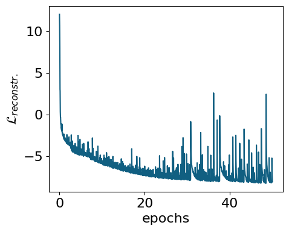

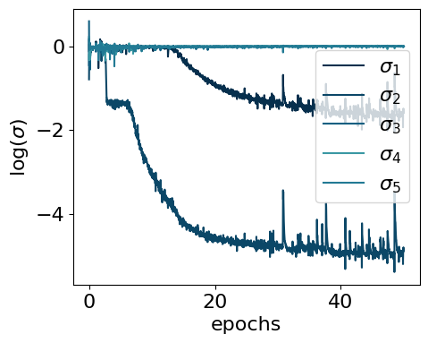

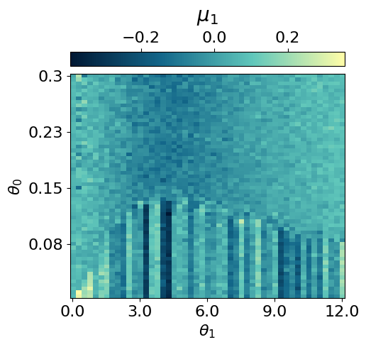

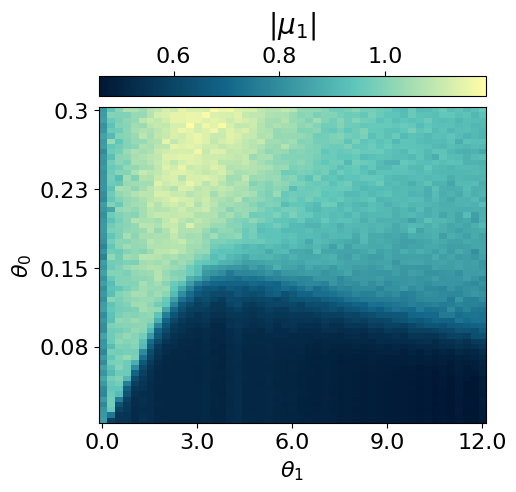

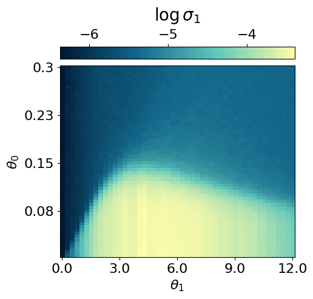

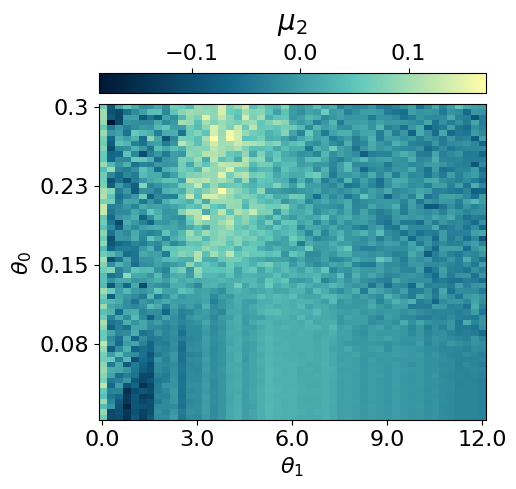

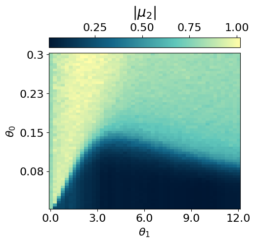

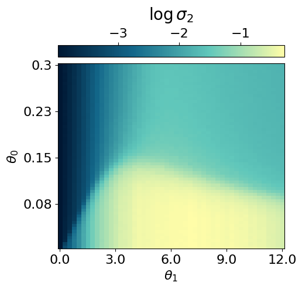

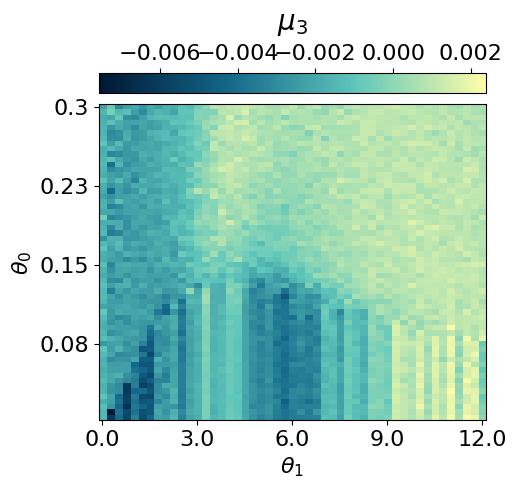

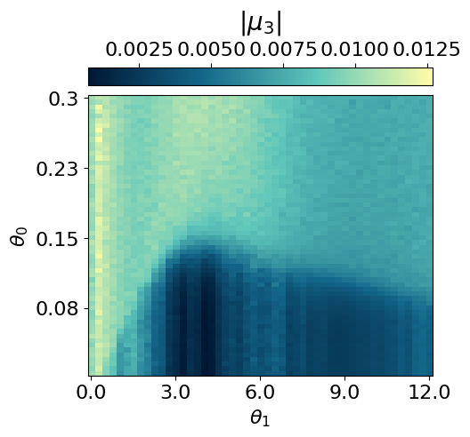

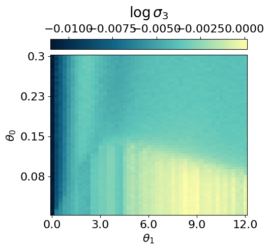

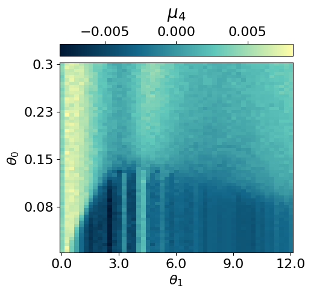

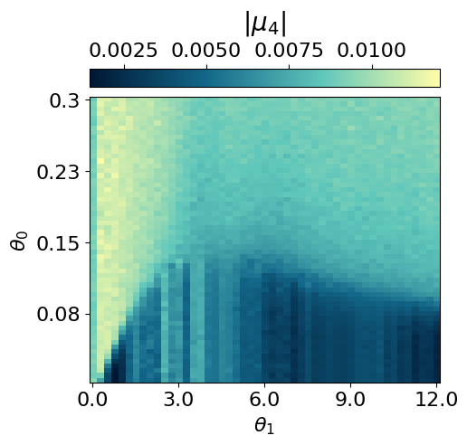

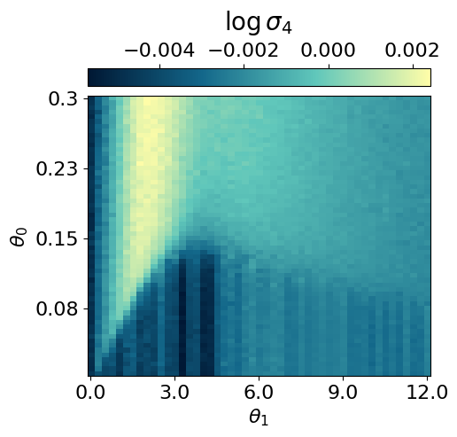

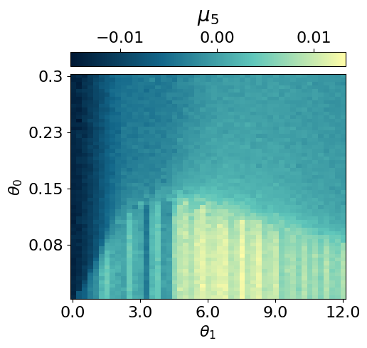

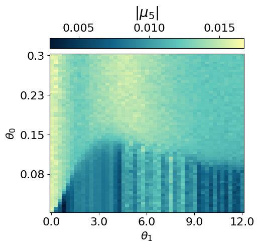

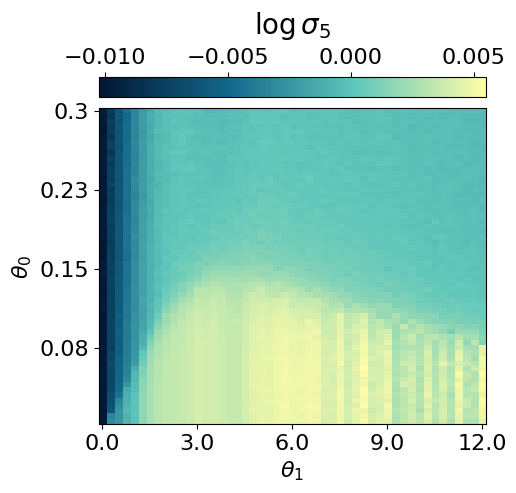

``` python
## saving the data ##
all_data = myvaetrainer.get_data()

with open('FKM_data_cpVAE2_QDisc2.pkl', 'wb') as f:
    pickle.dump(all_data, f)
```

## Looking at the conditional probabilities

As in the Radberg case, we can examine the conditional probabilities
output by the decoder to understand the ordering at different locations
in the parameter space.

``` python
with open('FKM_data_cpVAE2_QDisc2.pkl', 'rb') as f:
   all_data = pickle.load(f)
```

``` python
state = train_state.TrainState.create(
            apply_fn=myvaetrainer.model.apply,
            params=all_data['params'],
            tx=myvaetrainer.opt
        )

myvaetrainer.state = state
```

### OP

The ordered phase (OP) is characterised by a checkerboard pattern of f
and d particles. There is also interspecies repulsion induced by U,
which can be visualised by examining the conditional probabilities
within the OP at low and high U values.

``` python
locations = [(2,5), (2,40)]
key = jax.random.PRNGKey(6795)
all_cp = []


for i,j in locations:
  f_out, d_out = myvaetrainer.get_cp(dataset.data[i,j])
  p_f = jnp.exp(f_out)[...,1]
  p_d = d_out[...,0]
  cp = jnp.zeros((jnp.shape(dataset.data)[2],2*N))
  cp = cp.at[:,0::2].set(p_f)
  cp = cp.at[:,1::2].set(p_d)
  all_cp.append(cp)


  plt.rcParams['font.size'] = 16
  plt.figure(figsize=(5,5),dpi=100)

  plt.imshow(jnp.mean(cp*dataset.data[i,j][:,0][:,None],axis=0).reshape(4,8), cmap=cmap_brown2, aspect='auto')#,vmin=0.3)

  cbar = plt.colorbar(orientation="horizontal", pad=0.03, location="top")
  cbar.set_label(r'cp: $T={0:.2f}$, $U={1:.2f}$'.format(all_T[i], all_U[j]), fontsize=20, labelpad=10)


all_data['all_cp'] = all_cp
```

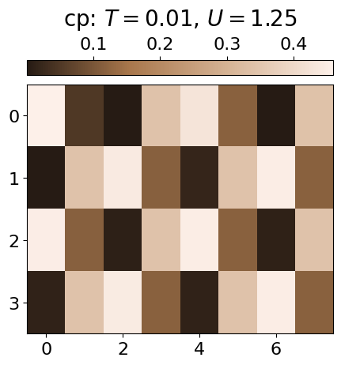

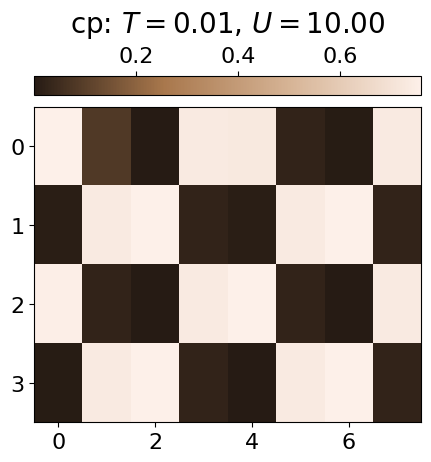

### Repulsion

The repulsion between the species can also be visualised throughout the
entire parameter space by calculating the average probability of a site
being occupied by both an f and a d particle.

``` python
key = jax.random.PRNGKey(6845)

cp_fd = jnp.zeros((dataset.data.shape[0],dataset.data.shape[1]))


for i in range(len(all_T)):
    for j in range(len(all_U)):
      f_out, d_out = myvaetrainer.get_cp(dataset.data[i,j])
      p_f = jnp.exp(f_out)[...,1]
      p_d = d_out[...,0]
      cp = jnp.zeros((jnp.shape(dataset.data)[2],2*N))
      cp = cp.at[:,0::2].set(p_f)
      cp = cp.at[:,1::2].set(p_d)

      cp_fd = cp_fd.at[i,j].set(jnp.mean(p_f*p_d))
```

``` python
plt.rcParams['font.size'] = 16
plt.figure(figsize=(5,4),dpi=100)

plt.imshow(jnp.flipud(cp_fd), cmap=cmap_brown2, aspect='auto')#,vmin=0.,vmax=0.8)

cbar = plt.colorbar(orientation="horizontal", pad=0.03, location="top")
cbar.set_label(r'cp(f)*cp(d)', fontsize=20, labelpad=10)


plt.xlabel(r'$U$')
plt.ylabel(r'$T$')
plt.xticks([i for i in range(0,len(all_U)+1,8)], [str(all_U[i]) for i in range(0,len(all_U)+1,8)])
plt.yticks([i for i in range(1,len(all_T),10)], [str(all_T[len(all_T)-i]) for i in range(1,len(all_T),10)])
''
plt.show()
```

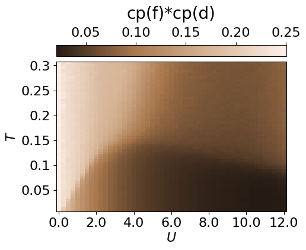

``` python
all_data['cp_fd'] = cp_fd
```

### IPR

From the conditional probabilities, one can also compute an inverse
participation ratio (IPR). This measures the degree of localisation of
f/d particles and highlights the weak localisation region.

``` python
key = jax.random.PRNGKey(6795)
all_cp = []


IPR_d = jnp.zeros((dataset.data.shape[0],dataset.data.shape[1]))
IPR_f = jnp.zeros((dataset.data.shape[0],dataset.data.shape[1]))
IPR_fd = jnp.zeros((dataset.data.shape[0],dataset.data.shape[1]))

for i in range(len(all_T)):
    for j in range(len(all_U)):
      f_out, d_out = myvaetrainer.get_cp(dataset.data[i,j])
      p_f = jnp.exp(f_out)[...,1]
      p_d = d_out[...,0]
      cp = jnp.zeros((jnp.shape(dataset.data)[2],2*N))
      cp = cp.at[:,0::2].set(p_f)
      cp = cp.at[:,1::2].set(p_d)
      all_cp.append(cp)


      IPR_d = IPR_d.at[i,j].set(jnp.mean(p_d**2))
      IPR_f = IPR_f.at[i,j].set(jnp.mean(p_f**2))
      IPR_fd = IPR_fd.at[i,j].set(jnp.mean(p_f**2*p_d**2))
```

``` python
plt.rcParams['font.size'] = 16
plt.figure(figsize=(5,4),dpi=100)

plt.imshow(jnp.flipud(IPR_f), cmap=cmap_brown2, aspect='auto')#,vmin=0.,vmax=0.8)

cbar = plt.colorbar(orientation="horizontal", pad=0.03, location="top")
cbar.set_label(r'IPR_f', fontsize=20, labelpad=10)


plt.xlabel(r'$U$')
plt.ylabel(r'$T$')
plt.xticks([i for i in range(0,len(all_U)+1,8)], [str(all_U[i]) for i in range(0,len(all_U)+1,8)])
plt.yticks([i for i in range(1,len(all_T),10)], [str(all_T[len(all_T)-i]) for i in range(1,len(all_T),10)])

plt.show()


plt.rcParams['font.size'] = 16
plt.figure(figsize=(5,4),dpi=100)

plt.imshow(jnp.flipud(IPR_d), cmap=cmap_brown2, aspect='auto')#,vmin=0.,vmax=0.8)

cbar = plt.colorbar(orientation="horizontal", pad=0.03, location="top")
cbar.set_label(r'IPR_d', fontsize=20, labelpad=10)


plt.xlabel(r'$U$')
plt.ylabel(r'$T$')
plt.xticks([i for i in range(0,len(all_U)+1,8)], [str(all_U[i]) for i in range(0,len(all_U)+1,8)])
plt.yticks([i for i in range(1,len(all_T),10)], [str(all_T[len(all_T)-i]) for i in range(1,len(all_T),10)])

plt.show()


plt.rcParams['font.size'] = 16
plt.figure(figsize=(5,4),dpi=100)

plt.imshow(jnp.flipud(IPR_fd), cmap=cmap_brown2, aspect='auto')#,vmin=0.,vmax=0.8)

cbar = plt.colorbar(orientation="horizontal", pad=0.03, location="top")
cbar.set_label(r'IPR_fd', fontsize=20, labelpad=10)


plt.xlabel(r'$U$')
plt.ylabel(r'$T$')
plt.xticks([i for i in range(0,len(all_U)+1,8)], [str(all_U[i]) for i in range(0,len(all_U)+1,8)])
plt.yticks([i for i in range(1,len(all_T),10)], [str(all_T[len(all_T)-i]) for i in range(1,len(all_T),10)])

plt.show()
```

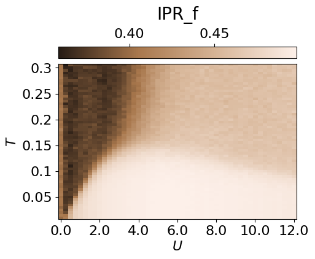

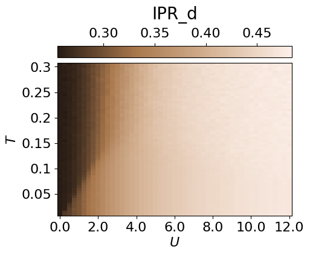

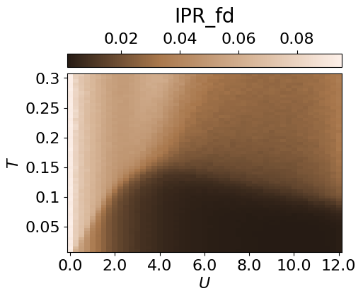

``` python
all_data['IPR'] = IPR_f
```

``` python
with open('FKM_data_cpVAE2_QDisc2.pkl', 'wb') as f:
    pickle.dump(all_data, f)
```

## Clustering the latent representation

In this case, it is not completely obvious how to **map the latent
representation onto a discrete phase-space diagram**. Therefore, we use
the Gaussian Mixture Model implemented in `QDisc.Clustering`. More
details are presented in the tutorail on the J1J2 model.

``` python
from qdisc.clustering.core import GaussianMixture

#get the latent representation

latvar = all_data['latvar']
mu0abs = latvar['mu0_abs']
mu1abs = latvar['mu1_abs']
theta_pair = (0,1)

#get the experimental parameters thetas to weight on the parameter space distance by alpha and have a smooter clustering
alpha = 0.5
theta1 = dataset.thetas[theta_pair[0]]
theta2 = dataset.thetas[theta_pair[1]]
theta1_norm = (theta1 - jnp.min(theta1)) / (jnp.max(theta1) - jnp.min(theta1))
theta2_norm = (theta2 - jnp.min(theta2)) / (jnp.max(theta2) - jnp.min(theta2))

#vector to perform the GMM one
X = jnp.array([mu0abs.reshape(-1),
               mu1abs.reshape(-1),
               alpha*jnp.tile(theta1_norm[:,None], reps=(jnp.size(theta2_norm),)).reshape(-1),
               alpha*jnp.tile(theta2_norm[None, :], reps=(jnp.size(theta1_norm),)).reshape(-1)]).transpose()


for n_components in [6]:

    print('GMM with n_components: {}'.format(n_components))

    clusterer = GaussianMixture(
                                n_components=n_components,
                                max_iter=500,
                                init_params="kmeans"
                            )

    clusterer.fit(X, key=jax.random.PRNGKey(4362))


    classes = clusterer.predict(X).reshape((jnp.size(theta1),jnp.size(theta2)))

    final_classes = jnp.zeros((jnp.size(theta1),jnp.size(theta2)))
    for i in range(jnp.size(theta1)):
      for j in range(jnp.size(theta2)):
        v, c = jnp.unique_counts(classes[i,j])
        final_classes = final_classes.at[i,j].set(v[jnp.argmax(c)])


    fig_shape = (len(theta1)/10, len(theta2)/10)

    plt.rcParams['font.size'] = 16
    plt.figure(figsize=fig_shape,dpi=100)


    plt.imshow(jnp.flipud(final_classes), aspect='auto')
    cbar = plt.colorbar(orientation="horizontal", pad=0.03, location="top")
    cbar.set_label(r'classification: #classes: {}'.format(n_components))

    plt.xlabel(r'$U$')
    plt.ylabel(r'$T$')
    plt.xticks([i for i in range(0,len(all_U)+1,8)], [str(all_U[i])[:3] for i in range(0,len(all_U)+1,8)])
    plt.yticks([i for i in range(1,len(all_T),10)], [str(all_T[len(all_T)-i]) for i in range(1,len(all_T),10)])


    plt.show()
```

    GMM with n_components: 6

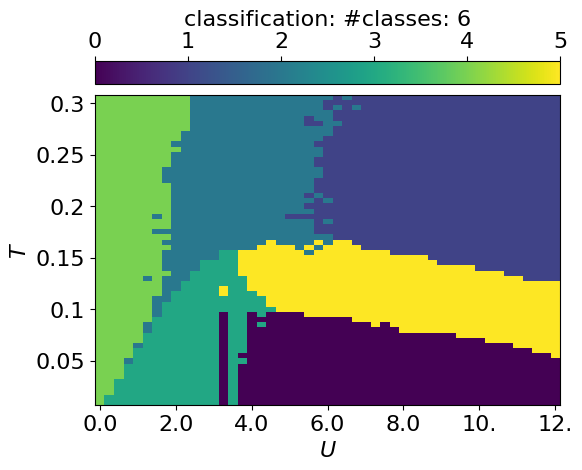

## Symbolic regression

In this section, we employ `QDisc.SR.SymbolicRegression` to investigate
the **nature of the additional cluster** observed in the latent
representation. We will use the `'2_body_correlator'` ansatz with the
**SR1** objective.

``` python
## set the index of the in/out classes for SR1 ##

import matplotlib.colors as mcolors
id_add_cluster = jnp.argwhere(classes == 3)

array_inisde_add_cluster = jnp.zeros((len(all_T),len(all_U)))
array_inisde_add_cluster = array_inisde_add_cluster.at[:14,7:11].add(1)
array_inisde_add_cluster = array_inisde_add_cluster.at[:19,9:11].set(1)
array_inisde_add_cluster = array_inisde_add_cluster.at[:4,3:11].set(1)
array_inisde_add_cluster = array_inisde_add_cluster.at[:9,5:11].set(1)

id_in_add_cluster = jnp.argwhere(array_inisde_add_cluster == 1)


array_outside_add_cluster = jnp.zeros((len(all_T),len(all_U)))
array_outside_add_cluster = array_outside_add_cluster.at[:20,25:].set(1)


id_out_add_cluster = jnp.argwhere(array_outside_add_cluster == 1)


array_add_cluster = jnp.ones((len(all_T),len(all_U)))

for i,j in id_add_cluster:
  array_add_cluster = array_add_cluster.at[i,j].set(2)

for i,j in id_in_add_cluster:
  array_add_cluster = array_add_cluster.at[i,j].set(3)

for i,j in id_out_add_cluster:
  array_add_cluster = array_add_cluster.at[i,j].set(0)


plt.rcParams['font.size'] = 16
plt.figure(figsize=(5,4),dpi=200)

n_bins = 4
bounds = jnp.linspace(0, 4, n_bins + 1)
mid_points = (bounds[:-1] + bounds[1:]) / 2
norm = mcolors.BoundaryNorm(boundaries=bounds, ncolors=cmap_blue.N, clip=True)

plt.imshow(jnp.flipud(array_add_cluster),cmap=cmap_blue, aspect='auto', norm=norm)
cbar = plt.colorbar(orientation="horizontal", pad=0.03, location="top", ticks=mid_points)
cbar.set_label(r'dataset SM1', fontsize=20, labelpad=10)
cbar.set_ticklabels([r'$y=out$', r'not used', r'add. cluster',r'$y=in$'], fontsize=12)


plt.xlabel(r'$U$')
plt.ylabel(r'$T$')
plt.xticks([i for i in range(0,len(all_U)+1,8)], [str(all_U[i]) for i in range(0,len(all_U)+1,8)])
plt.yticks([i for i in range(1,len(all_T),10)], [str(all_T[len(all_T)-i]) for i in range(1,len(all_T),10)])
plt.show()
```

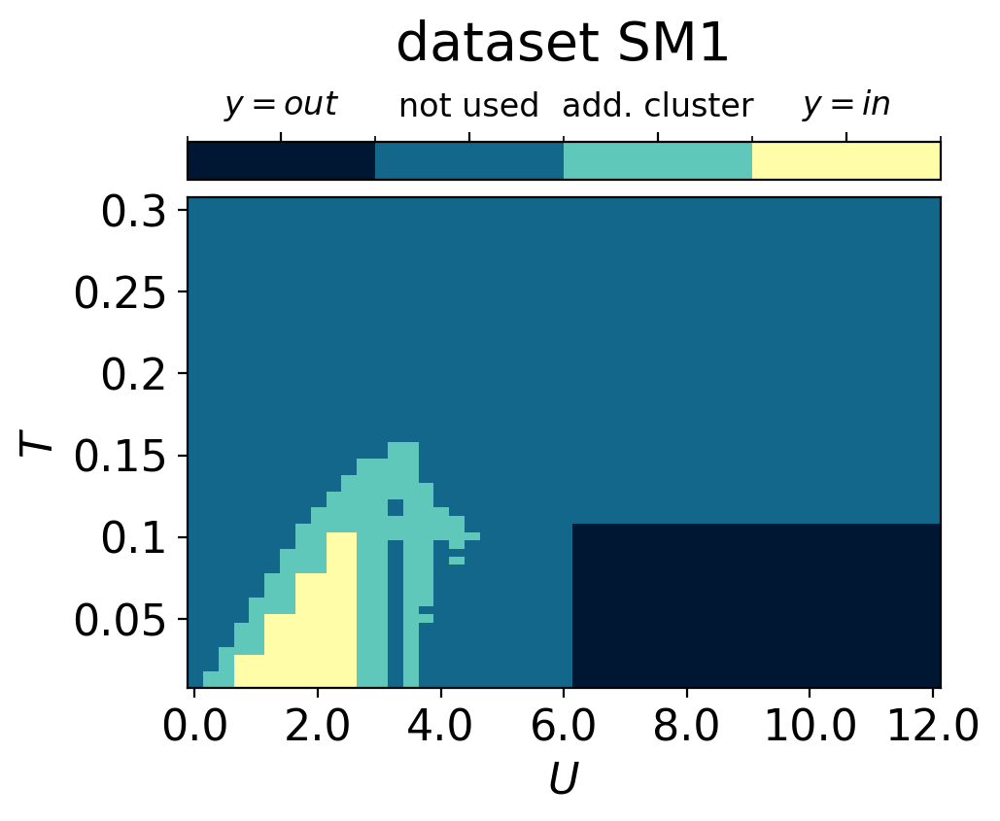

``` python
## 2BC with SR1 ##

from qdisc.sr.core import SymbolicRegression

cluster_idx_in = id_in_add_cluster
cluster_idx_out = id_out_add_cluster


f = jnp.arange(0,N,1)
d = jnp.arange(N,2*N,1)
fd = jnp.zeros((2*N,))
fd = fd.at[::2].set(f)
fd = fd.at[1::2].set(d).astype(jnp.int32)
fd = fd.reshape(4,8).tolist()
topology = fd

key = jax.random.PRNGKey(1011)

l1 = 2
mySR = SymbolicRegression(dataset,
                          cluster_idx_in=cluster_idx_in,
                          cluster_idx_out=cluster_idx_out,
                          objective='SR1',
                          shift_data=True,
                          add_constant=True)


_ = mySR.train_2BC(key, dataset_size=10000, L1_reg=l1, max_iter=1000)


mySR.plot_alpha(topology=topology, edge_scale=3, name='SR1', threshold=0.)
mySR.plot_alpha(topology=topology, edge_scale=3, name='SR1', threshold=1.)

## plot the classification prediction f(x)>0 ##
p = mySR.compute_and_plot_prediction(name='SR1', class_pred=True, theta_pair=(0,1))
p = mySR.compute_and_plot_prediction(name='SR1', class_pred=False, theta_pair=(0,1))
```

    ### Start preparing the dataset ###
    ### Dataset prepared, start the trainnig ###
    ### Training finished ###
      message: STOP: TOTAL NO. OF F,G EVALUATIONS EXCEEDS LIMIT
      success: False
       status: 1
          fun: 0.2666763252831029
            x: [-3.365e-02  2.370e-01 ...  1.979e-03  4.940e-01]
          nit: 28
          jac: [-3.676e-03  3.167e-03 ... -1.641e-04 -7.234e-05]
         nfev: 15438
         njev: 31
     hess_inv: <497x497 LbfgsInvHessProduct with dtype=float64>

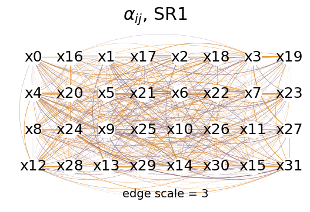

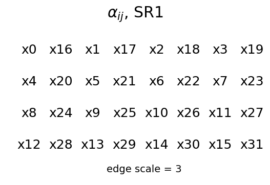

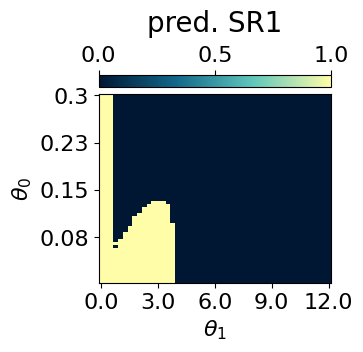

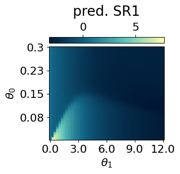

``` python
mySR.plot_alpha(topology=topology, edge_scale=10, name='SR1', threshold=0.35)
```

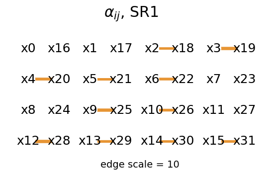
