# Rydberg atoms


<!-- WARNING: THIS FILE WAS AUTOGENERATED! DO NOT EDIT! -->

This notebook presents how to use QDisc to reproduce the results on the
Rydberg atom dataset.

## dataset and training

The data are experimental snapshots obtained from a programmable Rydberg
atom array. For more information, see the experimental paper:

https://www.nature.com/articles/s41586-021-03582-4

``` python
## load the data (not provided here, this will give an error) ##
with open('data_RydbergExpL13 (1).pkl', 'rb') as f:
    data = pickle.load(f)

snapshots = data['dataset']
all_Rb = jnp.array(data['all_Rb'])
all_delta = jnp.array(data['all_delta'])
L = 13
N = L*L
```

``` python
## cast them into a QDisc Dataset object ##
from qdisc.dataset.core import Dataset

dataset = Dataset(data=snapshots, thetas=[all_Rb, all_delta], data_type='discrete', local_dimension=2, local_states=jnp.array([0,1]))
```

``` python
## create Transformer encoder and decoder ##
from qdisc.nn.core import Transformer_encoder
from qdisc.nn.core import Transformer_decoder
from qdisc.vae.core import VAEmodel

encoder = Transformer_encoder(latent_dim=5, d_model=8, num_heads=4, num_layers=3, data_type='discrete')
decoder = Transformer_decoder(d_model=8, num_heads=4, num_layers=3, data_type='discrete')

myvae = VAEmodel(encoder=encoder, decoder=decoder)
```

``` python
## training and representation ##
from qdisc.vae.core import VAETrainer

myvaetrainer = VAETrainer(model=myvae, dataset=dataset)
key = jax.random.PRNGKey(6473)
num_epochs = 200
myvaetrainer.train(num_epochs=num_epochs, batch_size=3000, beta=0.45, gamma=0., key=key, printing_rate=10, re_shuffle=False)
```

    Start training...
    epoch=0 step=0 loss=119.569095476654 recon=117.79883895165419
    logvar=[ 1.07415317  0.77997939  0.72378845 -0.93821395 -0.10032408]
    epoch=10 step=0 loss=57.38552010440751 recon=56.24097025543754
    logvar=[-0.07107329 -0.16698306 -0.34394546 -4.30383545 -0.06234075]
    epoch=20 step=0 loss=56.43766805834163 recon=55.290590279764864
    logvar=[-5.25762906e-02 -2.62134787e-02 -9.96280070e-02 -4.49870754e+00
     -2.65689430e-03]
    epoch=30 step=0 loss=55.400550071167956 recon=54.15427316108366
    logvar=[-0.24448012 -0.03299001 -0.01156073 -4.82013867 -0.0088556 ]
    epoch=40 step=0 loss=54.83681362387403 recon=53.43010166759967
    logvar=[-1.07542669 -0.01479255 -0.00726525 -4.86872305  0.01455821]
    epoch=50 step=0 loss=54.53603219957166 recon=53.091557566642486
    logvar=[-1.23756027e+00 -1.23709528e-02 -5.47091283e-03 -4.94531256e+00
      3.28441727e-03]
    epoch=60 step=0 loss=54.43254836895113 recon=52.95765146657946
    logvar=[-1.31491583e+00  7.30443888e-03 -1.43214228e-03 -5.12444969e+00
     -1.06741663e-02]
    epoch=70 step=0 loss=54.1974911817511 recon=52.71919527568474
    logvar=[-1.32034127e+00 -2.37230897e-02  1.86053524e-02 -5.13348633e+00
     -1.70989903e-03]
    epoch=80 step=0 loss=54.12660673668517 recon=52.647385917253445
    logvar=[-1.3428631   0.02448355 -0.01474814 -4.96093612 -0.00953531]
    epoch=90 step=0 loss=53.92428452520894 recon=52.40086608436129
    logvar=[-1.34732496e+00 -6.91766618e-03  3.85537124e-03 -5.43389109e+00
      1.05323362e-02]
    epoch=100 step=0 loss=53.81375978950114 recon=52.284231036530535
    logvar=[-1.24221828e+00  1.59933671e-03  1.10860366e-02 -5.40422867e+00
      4.23926713e-03]
    epoch=110 step=0 loss=53.947662847043595 recon=52.389166815528945
    logvar=[-1.22268732 -0.01024584  0.01105267 -5.60247201  0.00754143]
    epoch=120 step=0 loss=53.65327323397351 recon=52.11970498272226
    logvar=[-1.14891570e+00  1.44860368e-03 -7.84471019e-03 -5.52474337e+00
     -3.39629913e-03]
    epoch=130 step=0 loss=53.58965383275648 recon=52.03493555562553
    logvar=[-1.21718777e+00 -1.95895586e-03  1.06011300e-02 -5.49717389e+00
     -1.73662012e-04]
    epoch=140 step=0 loss=53.741270003328054 recon=52.17246465086842
    logvar=[-1.20641303e+00  2.43419631e-03 -9.57970176e-03 -5.35377156e+00
      2.04272250e-02]
    epoch=150 step=0 loss=53.504663767647344 recon=51.920817517337696
    logvar=[-1.13939071e+00 -4.74558356e-02 -5.17827363e-03 -5.59386329e+00
     -1.79535286e-02]
    epoch=160 step=0 loss=53.42087330008696 recon=51.82503184617968
    logvar=[-1.20954355 -0.04384308 -0.06335316 -5.62403719 -0.01117719]
    epoch=170 step=0 loss=53.35845947168567 recon=51.74085816470033
    logvar=[-1.22017346 -0.04838106 -0.15391571 -5.70929859 -0.0138193 ]
    epoch=180 step=0 loss=53.38771218351293 recon=51.759155963089704
    logvar=[-1.18558398 -0.07025403 -0.13406768 -5.76573897 -0.01678924]
    epoch=190 step=0 loss=53.30599297063178 recon=51.645958555152056
    logvar=[-1.25971673 -0.01837498 -0.14288555 -5.67526412 -0.03959246]
    Training finished.

``` python
data = myvaetrainer.get_data()
```

``` python
myvaetrainer.plot_training(num_epochs = num_epochs)
```

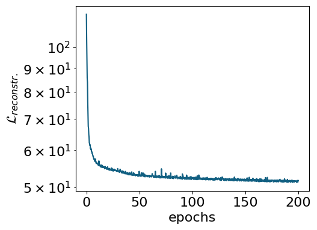

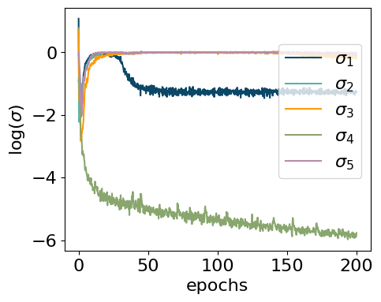

``` python
latvar = myvaetrainer.compute_repr2d(theta_pair=(0,1), return_latvar = True)
myvaetrainer.plot_repr2d(theta_pair=(0,1),subplot=False)
```

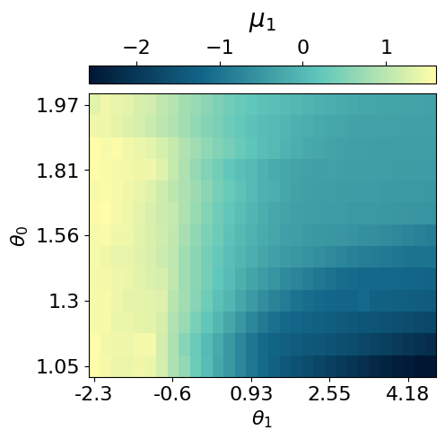

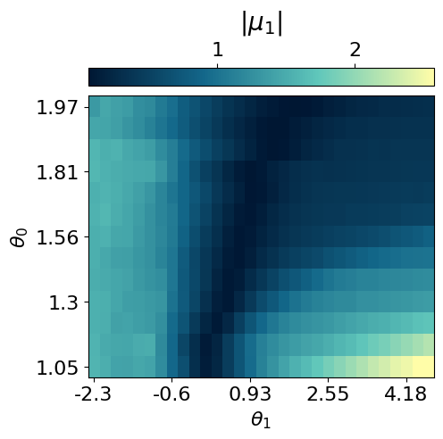

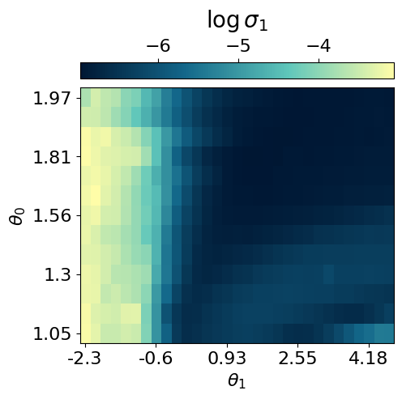

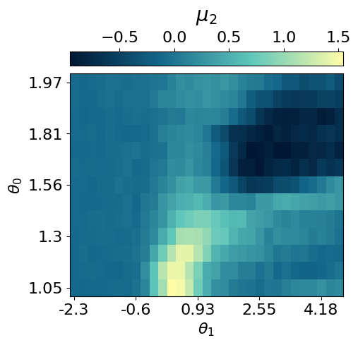

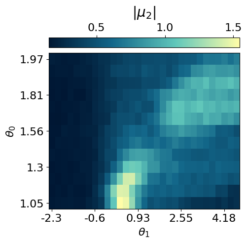

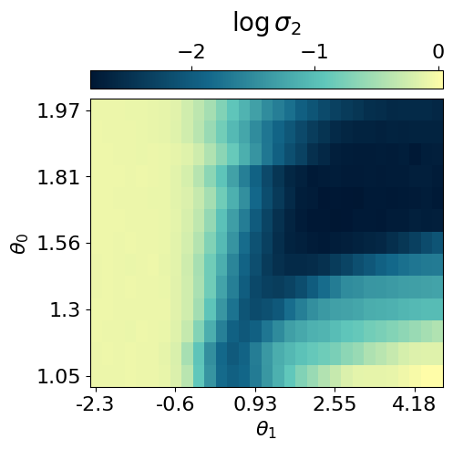

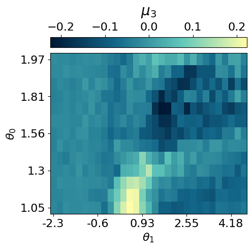


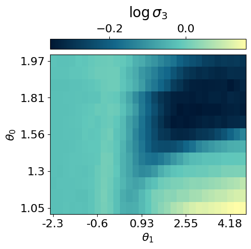

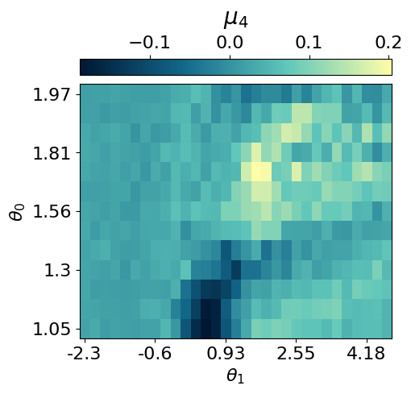

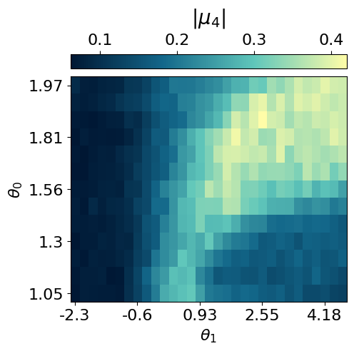

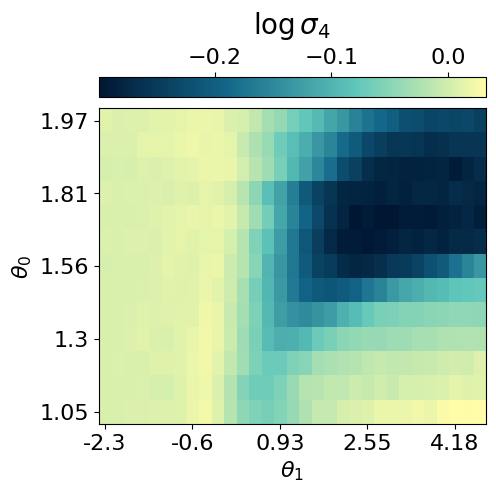

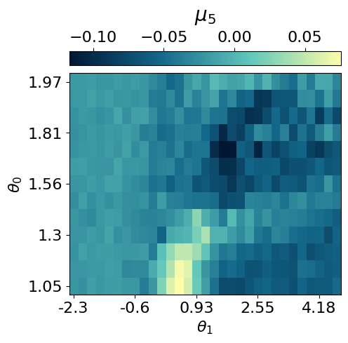

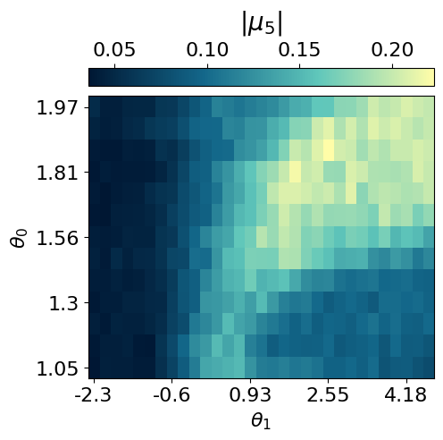

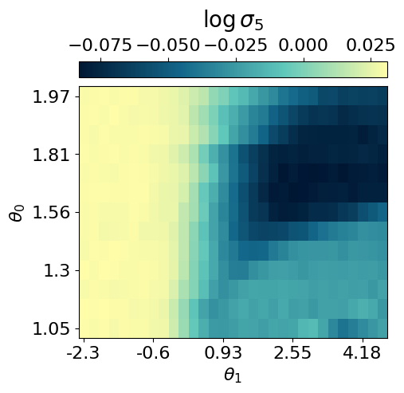

``` python
data.keys()
```

    dict_keys(['params', 'history_loss', 'history_recon', 'history_logvar', 'latvar'])

``` python
## saving the data ##
#data = myvaetrainer.get_data()

with open('RydbergExpL13_data_cpVAE2_QDisc.pkl', 'wb') as f:
    pickle.dump(data, f)
```

``` python
## example how to load the data ##
with open('RydbergExpL13_data_cpVAE2_QDisc.pkl', 'rb') as f:
    data = pickle.load(f)

VAE_params = data['params']
myvaetrainer = VAETrainer(model=myvae, dataset=dataset)
key = jax.random.PRNGKey(0)
myvaetrainer.init_state(key, dataset.data[0,0])
myvaetrainer.state = myvaetrainer.state.replace(params=VAE_params)
```

## Exploring conditional probabilities with the decoder

In this section, we demonstrate how the **decoder of the cpVAE** can be
used to gain further insight into the ordering of each phase by
examining the **conditional probabilities**.

The procedure is as follows: 1. Specify the values of the latent
variables corresponding to a region of interest in the latent space. 2.
Identify the dataset samples associated with these latent values. 3.
Input these samples into the decoder to compute the conditional
probabilities of the spin configurations.

``` python
latvar = myvaetrainer.latvar
latvar.keys()
```

    dict_keys(['id_lat', 'theta_pair', 'mu0', 'mu0_abs', 'logvar0', 'mu1', 'mu1_abs', 'logvar1', 'mu2', 'mu2_abs', 'logvar2', 'mu3', 'mu3_abs', 'logvar3', 'mu4', 'mu4_abs', 'logvar4'])

``` python
## a snake ordering is used, need it to map back to 2d for plotting ##
snake_idx = jnp.zeros((N,2))
for i in range(N):
  #position of each atoms using the snake numbering
  yp = i//L
  xp = (yp%2==0)*(i%L) + (yp%2==1)*(L-1-i%L)
  snake_idx = snake_idx.at[i].set(jnp.array([yp, xp]))

snake_idx = snake_idx.astype(jnp.int64)


def plot_cp(p_add_cluster):

    plt.rcParams['font.size'] = 16
    plt.figure(figsize=(5,5),dpi=75)

    p = jnp.mean(p_add_cluster,axis=0)[:,1]
    p2D = jnp.zeros((L,L))
    p2D = p2D.at[snake_idx[:,0], snake_idx[:,1]].set(p)

    plt.imshow(p2D, cmap=cmap_blue)

    cbar = plt.colorbar(orientation="horizontal", pad=0.03, location="top")

    cbar.set_label('conditional probabilities')

    plt.xlabel(r'$x$ position on the lattice')
    plt.ylabel(r'$y$ position on the lattice')

    x_tick_positions = [i for i in range(0,13,2)]
    x_tick_labels = [str(i) for i in range(1,14,2)]
    plt.xticks(x_tick_positions, x_tick_labels)

    y_tick_positions = x_tick_positions
    y_tick_labels = [str(14-i) for i in range(1,14,2)]
    plt.yticks(y_tick_positions, y_tick_labels)

    plt.show()

latvar = myvaetrainer.latvar

mu1 = latvar['mu1']
mu0 = latvar['mu0']

data_cond_prob = {}
```

``` python
## Additional cluter ##

mu1 = latvar['mu1']
idx_add_cluster = jnp.argwhere(mu1>1.25)

N = dataset.data.shape[-1]
data_add_cluster = dataset.data[idx_add_cluster[:,0],idx_add_cluster[:,1],:,:].reshape(-1,N)[:2000]

m = jnp.zeros((13,31))
for i in idx_add_cluster:
  m = m.at[i[0],i[1]].add(1)

plt.rcParams['font.size'] = 16
plt.figure(figsize=(5,4),dpi=75)
plt.imshow(jnp.flipud(m), aspect='auto')
plt.show()


input_samples = dataset.data[idx_add_cluster[:,0],idx_add_cluster[:,1],:,:].reshape(-1,N)

key = jax.random.PRNGKey(0)
cp = myvaetrainer.get_cp(input_samples)

p_add_cluster = jnp.exp(cp)

plot_cp(p_add_cluster)

data_cond_prob['idx_add_cluster'] = idx_add_cluster
data_cond_prob['cp_add_cluster'] = cp
```

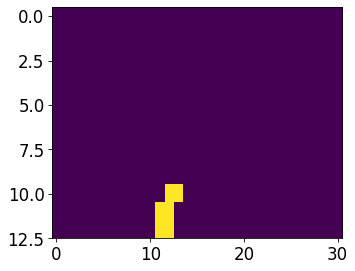

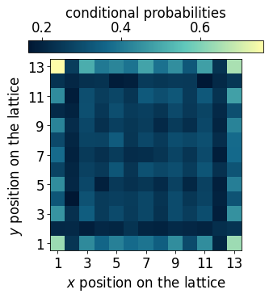

``` python
## Striated phase ##

id_somewhere_else = jnp.argwhere(mu1<-0.95)
data_somewhere_else= dataset.data[id_somewhere_else[:,0],id_somewhere_else[:,1],:,:].reshape(-1,N)[:2000]


m = jnp.zeros((13,31))
for i in id_somewhere_else:
  m = m.at[i[0],i[1]].add(1)


plt.rcParams['font.size'] = 16
plt.figure(figsize=(5,4),dpi=75)
plt.imshow(jnp.flipud(m), aspect='auto')

plt.show()


cp = myvaetrainer.get_cp(data_somewhere_else)
p_somewhere_else = jnp.exp(cp)

plot_cp(p_somewhere_else)

idx_striated = jnp.median(jnp.array(id_somewhere_else), axis=0)


data_cond_prob['idx_striated'] = idx_striated
data_cond_prob['cp_striated'] = cp
```

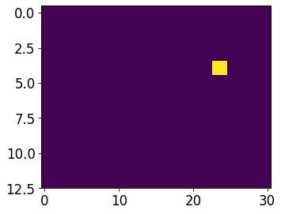

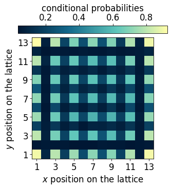

``` python
## Checkerboard phase ##

mu0 = latvar['mu0']
id_somewhere_else = jnp.argwhere(((mu0<-1.45)*1 + (mu0>-1.55)*1)==2)

#just take the ones starting with 1 to not have degeneracies effect
data_somewhere_else = dataset.data[id_somewhere_else[:,0],id_somewhere_else[:,1],:,:].reshape(-1,N)[:2000]#[jnp.argwhere(data_somewhere_else[:,0]==1)[:,0]]
#data_somewhere_else = data_somewhere_else[jnp.argwhere(data_somewhere_else[:,0]==1)[:,0]]


m = jnp.zeros((13,31))
for i in id_somewhere_else:
  m = m.at[i[0],i[1]].add(1)


plt.rcParams['font.size'] = 16
plt.figure(figsize=(5,4),dpi=75)
plt.imshow(jnp.flipud(m), aspect='auto')
cbar = plt.colorbar(orientation="horizontal", pad=0.03, location="top")
cbar.set_label(r'class', fontsize=20, labelpad=10)
plt.show()

cp = myvaetrainer.get_cp(data_somewhere_else)
p_somewhere_else = jnp.exp(cp)

plot_cp(p_somewhere_else)

idx_check = jnp.median(jnp.array(id_somewhere_else), axis=0)


data_cond_prob['idx_check'] = idx_check
data_cond_prob['cp_check'] = cp
```

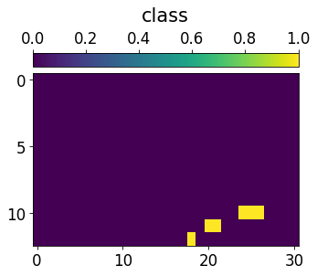

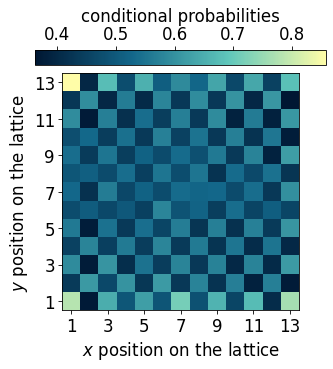

``` python
## Fully loaded lattice ##

id_somewhere_else = jnp.argwhere(mu0<-2.2)

data_somewhere_else= dataset.data[id_somewhere_else[:,0],id_somewhere_else[:,1],:,:].reshape(-1,N)[:2000]


m = jnp.zeros((13,31))
for i in id_somewhere_else:
  m = m.at[i[0],i[1]].add(1)


plt.rcParams['font.size'] = 16
plt.figure(figsize=(5,4),dpi=75)
plt.imshow(jnp.flipud(m), aspect='auto')
plt.show()


cp = myvaetrainer.get_cp(data_somewhere_else)
p_somewhere_else = jnp.exp(cp)
p = jnp.mean(p_somewhere_else,axis=0)[:,1]


plot_cp(p_somewhere_else)

idx_full = jnp.median(jnp.array(id_somewhere_else), axis=0)


data_cond_prob['idx_full'] = idx_full
data_cond_prob['cp_full'] = cp
```

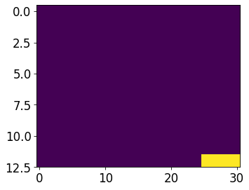

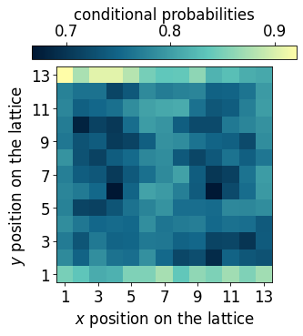

``` python
## Empty lattice ##

id_somewhere_else = jnp.argwhere(mu0>1.2)

data_somewhere_else= dataset.data[id_somewhere_else[:,0],id_somewhere_else[:,1],:,:].reshape(-1,N)[:2000,:]


m = jnp.zeros((13,31))
for i in id_somewhere_else:
  m = m.at[i[0],i[1]].add(1)


plt.rcParams['font.size'] = 16
plt.figure(figsize=(5,4),dpi=75)
plt.imshow(jnp.flipud(m), aspect='auto')
plt.show()


cp = myvaetrainer.get_cp(data_somewhere_else)
p_somewhere_else = jnp.exp(cp)
p = jnp.mean(p_somewhere_else,axis=0)[:,1]


plot_cp(p_somewhere_else)

idx_empty = jnp.median(jnp.array(id_somewhere_else), axis=0)


data_cond_prob['idx_empty'] = idx_empty
data_cond_prob['cp_empty'] = cp
```

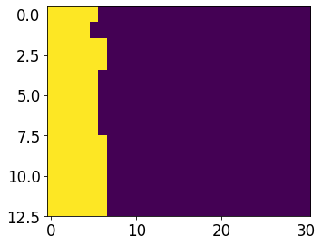

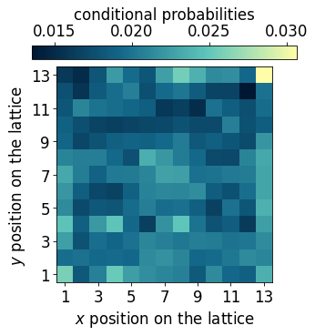

``` python
## Edge ordered phase ##

id_somewhere_else = jnp.argwhere(((mu1<1)*1 + (mu0>-.5)*1 + (mu0<0)*1 + (mu1>0.4)*1)==4)

data_somewhere_else= dataset.data[id_somewhere_else[:,0],id_somewhere_else[:,1],:,:].reshape(-1,N)[:2000,:]


m = jnp.zeros((13,31))
for i in id_somewhere_else:
  m = m.at[i[0],i[1]].add(1)


plt.rcParams['font.size'] = 16
plt.figure(figsize=(5,4),dpi=75)
plt.imshow(jnp.flipud(m), aspect='auto')
plt.show()


cp = myvaetrainer.get_cp(data_somewhere_else)
p_somewhere_else = jnp.exp(cp)
p = jnp.mean(p_somewhere_else,axis=0)[:,1]


plot_cp(p_somewhere_else)

idx_edge = jnp.median(jnp.array(id_somewhere_else), axis=0)


data_cond_prob['idx_edge'] = idx_edge
data_cond_prob['cp_edge'] = cp
```

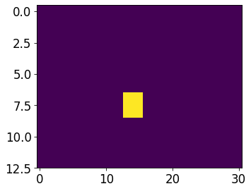

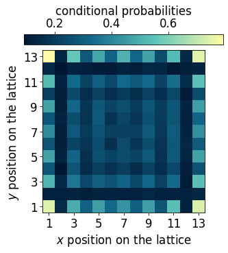

``` python
data['latvar'] = latvar
data['data_cond_prob'] = data_cond_prob

with open('RydbergExpL13_data_cpVAE2_QDisc.pkl', 'wb') as f:
    pickle.dump(data, f)
```

## Symbolic regression

In this section, we use `QDisc.SR.SymbolicRegression` with the
`'genetic'` search space and the SR1 objective to find a symbolic
function that characterizes the additional cluster.

``` python
#import pysr
import numpy as np
from pysr import PySRRegressor #this take around 7min
import sympy as sp
import pickle
from jax import numpy as jnp
import jax
from matplotlib import pyplot as plt
```

    [juliapkg] Found dependencies: /usr/local/lib/python3.12/dist-packages/juliapkg/juliapkg.json
    [juliapkg] Found dependencies: /usr/local/lib/python3.12/dist-packages/juliacall/juliapkg.json
    [juliapkg] Found dependencies: /usr/local/lib/python3.12/dist-packages/pysr/juliapkg.json
    [juliapkg] Locating Julia 1.10.3 - 1.11
    [juliapkg] Using Julia 1.11.5 at /usr/local/bin/julia
    [juliapkg] Using Julia project at /root/.julia/environments/pyjuliapkg
    [juliapkg] Writing Project.toml:
               | [deps]
               | PythonCall = "6099a3de-0909-46bc-b1f4-468b9a2dfc0d"
               | OpenSSL_jll = "458c3c95-2e84-50aa-8efc-19380b2a3a95"
               | SymbolicRegression = "8254be44-1295-4e6a-a16d-46603ac705cb"
               | Serialization = "9e88b42a-f829-5b0c-bbe9-9e923198166b"
               | 
               | [compat]
               | PythonCall = "=0.9.26"
               | OpenSSL_jll = "~3.0"
               | SymbolicRegression = "~1.11"
               | Serialization = "^1"
    [juliapkg] Installing packages:
               | import Pkg
               | Pkg.Registry.update()
               | Pkg.add([
               |   Pkg.PackageSpec(name="PythonCall", uuid="6099a3de-0909-46bc-b1f4-468b9a2dfc0d"),
               |   Pkg.PackageSpec(name="OpenSSL_jll", uuid="458c3c95-2e84-50aa-8efc-19380b2a3a95"),
               |   Pkg.PackageSpec(name="SymbolicRegression", uuid="8254be44-1295-4e6a-a16d-46603ac705cb"),
               |   Pkg.PackageSpec(name="Serialization", uuid="9e88b42a-f829-5b0c-bbe9-9e923198166b"),
               | ])
               | Pkg.resolve()
               | Pkg.precompile()
    Detected IPython. Loading juliacall extension. See https://juliapy.github.io/PythonCall.jl/stable/compat/#IPython

``` python
from matplotlib.colors import ListedColormap
from matplotlib.colors import LinearSegmentedColormap
import matplotlib.patches as patches

custom_palette = ['#001733', '#13678A', '#60C7BB', '#FFFDA8']
cmap_blue = LinearSegmentedColormap.from_list("custom_cmap", custom_palette)
custom_palette = ['#221226','#633D55','#A3648B','#F7FAFF']
cmap_purple = LinearSegmentedColormap.from_list("custom_cmap", custom_palette)
custom_palette = ['#0D090D','#365925','#DAF2B6']
cmap_green3 = LinearSegmentedColormap.from_list("custom_cmap", custom_palette)
```

``` python
id_add_cluster = jnp.argwhere(mu1>1.2)
id_add_cluster
```

    Array([[ 0, 11],
           [ 0, 12],
           [ 0, 13],
           [ 1, 11],
           [ 1, 12],
           [ 2, 12],
           [ 2, 13]], dtype=int64)

``` python
with open('data_RydbergExpL13.pkl', 'rb') as f:
    data = pickle.load(f)

snapshots = data['dataset']
all_Rb = jnp.array(data['all_Rb'])
all_delta = jnp.array(data['all_delta'])
L = 13
N = L*L


idx_add_cluster = jnp.array([[ 0, 11],
       [ 0, 12],
       [ 0, 13],
       [ 1, 11],
       [ 1, 12],
       [ 2, 12],
       [ 2, 13]])
```

``` python
## specify the indexe of the data labelled as outide and visualize ##
#id_add_cluster = jnp.argwhere(mu1<-1.2)

classes = 3*jnp.ones((13,31))
for i in idx_add_cluster:
  classes = classes.at[i[0],i[1]].set(1)


classes = classes.at[7:,12:17].set(2)


plt.rcParams['font.size'] = 16
plt.figure(figsize=(5,4),dpi=100)


cmap_2bins = ListedColormap([cmap_blue(0.75), cmap_purple(0.65), cmap_blue(0.)])

im = plt.imshow(jnp.flipud(classes), aspect='auto', cmap=cmap_2bins)
cbar = plt.colorbar(im, orientation="horizontal", pad=0.03, location="top", ticks=[1.33, 2, 2.66])
cbar.set_ticklabels(['0', '1', 'Not in'])
cbar.set_label(r'Dataset SR1')

plt.xlabel(r'$\Delta/\Omega$')
plt.ylabel(r'$R_b/a$')

x_tick_positions = [1, 10, 19, 27]  # Positions for the ticks
x_tick_labels = ['-2', '0', '2', '4']  # Labels for the ticks
plt.xticks(x_tick_positions, x_tick_labels)

y_tick_positions = [0,6,12]  # Positions for the ticks
y_tick_labels = ['2.0', '1.5', '1.0']  # Labels for the ticks
plt.yticks(y_tick_positions, y_tick_labels)

plt.show()

data = snapshots

all_corners = [[0,1,25,24], [12,13,11,14], [156,155,157,154], [168,167,143,144]]
data_corners = jnp.concatenate([snapshots[..., corners] for corners in all_corners], axis=2)


dataset_corners = Dataset(data=data_corners, thetas=[all_Rb, all_delta], data_type='discrete', local_dimension=2, local_states=jnp.array([0,1]))

cluster_idx_in = jnp.argwhere(classes==1)
cluster_idx_out = jnp.argwhere(classes==2)

mySR = SymbolicRegression(dataset = dataset_corners,
                          cluster_idx_in = cluster_idx_in,
                          cluster_idx_out = cluster_idx_out,
                          objective='SR1',
                          search_space = "2_body_correlator" )
```

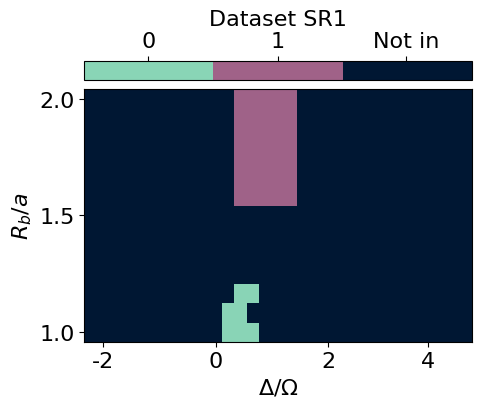

``` python
## restrict the data to the corners of the lattice ##
from qdisc.sr.core import SymbolicRegression

data = snapshots

all_corners = [[0,1,25,24], [12,13,11,14], [156,155,157,154], [168,167,143,144]]
data_corners = jnp.concatenate([snapshots[..., corners] for corners in all_corners], axis=2)


dataset_corners = Dataset(data=data_corners, thetas=[all_Rb, all_delta], data_type='discrete', local_dimension=2, local_states=jnp.array([0,1]))

cluster_idx_in = jnp.argwhere(classes==1)
cluster_idx_out = jnp.argwhere(classes==2)

mySR = SymbolicRegression(dataset = dataset_corners,
                          cluster_idx_in = cluster_idx_in,
                          cluster_idx_out = cluster_idx_out,
                          objective='SR1',
                          search_space = "genetic",
                          shift_data = False)
```

    PySRRegressor imported

``` python
## search ##
all_perf, all_eqs, all_terms = mySR.train(
    key = jax.random.PRNGKey(645),
    dataset_size = 5000,
    random_state = 123,     # seed for reproductibility
    niterations = 20,       # Number of iterations to search
    binary_operators = ["+", "*", "-"],  # Allowed binary operations
    elementwise_loss = "loss(x,y) = -y*log(1/(1+exp(-x)))-(1-y)*log(1-1/(1+exp(-x)))",  # sigmoid loss for SR1
    maxsize = 20,            # max complexity of the equations
    progress = True,         # Show progress during training
    extra_sympy_mappings = {"C": "C"}, # Allow PySR to use constants
    batching = True, #batching, usually big dataset
    batch_size = 1000,
    turbo = True,
    deterministic = True, #for reproductibility
    parallelism = 'serial')
```

    /usr/local/lib/python3.12/dist-packages/pysr/sr.py:2811: UserWarning: Note: it looks like you are running in Jupyter. The progress bar will be turned off.
      warnings.warn(
    Compiling Julia backend...
    INFO:pysr.sr:Compiling Julia backend...
       Resolving package versions...
       Installed ThreadingUtilities ─────────────── v0.5.5
       Installed BitTwiddlingConvenienceFunctions ─ v0.1.6
       Installed LayoutPointers ─────────────────── v0.1.17
       Installed HostCPUFeatures ────────────────── v0.1.18
       Installed ManualMemory ───────────────────── v0.1.8
       Installed SIMDTypes ──────────────────────── v0.1.0
       Installed VectorizationBase ──────────────── v0.21.72
       Installed LoopVectorization ──────────────── v0.12.173
       Installed SLEEFPirates ───────────────────── v0.6.43
       Installed PolyesterWeave ─────────────────── v0.2.2
       Installed UnPack ─────────────────────────── v1.0.2
       Installed CloseOpenIntervals ─────────────── v0.1.13
       Installed StaticArrayInterface ───────────── v1.9.0
        Updating `~/.julia/environments/pyjuliapkg/Project.toml`
      [bdcacae8] + LoopVectorization v0.12.173
        Updating `~/.julia/environments/pyjuliapkg/Manifest.toml`
      [62783981] + BitTwiddlingConvenienceFunctions v0.1.6
      [2a0fbf3d] + CPUSummary v0.2.7
      [fb6a15b2] + CloseOpenIntervals v0.1.13
      [f70d9fcc] + CommonWorldInvalidations v1.0.0
      [adafc99b] + CpuId v0.3.1
      [3e5b6fbb] + HostCPUFeatures v0.1.18
      [615f187c] + IfElse v0.1.1
      [10f19ff3] + LayoutPointers v0.1.17
      [bdcacae8] + LoopVectorization v0.12.173
      [d125e4d3] + ManualMemory v0.1.8
      [6fe1bfb0] + OffsetArrays v1.17.0
      [1d0040c9] + PolyesterWeave v0.2.2
      [94e857df] + SIMDTypes v0.1.0
      [476501e8] + SLEEFPirates v0.6.43
      [431bcebd] + SciMLPublic v1.0.1
      [aedffcd0] + Static v1.3.1
      [0d7ed370] + StaticArrayInterface v1.9.0
      [8290d209] + ThreadingUtilities v0.5.5
      [3a884ed6] + UnPack v1.0.2
      [3d5dd08c] + VectorizationBase v0.21.72
    Precompiling project...
       1893.7 ms  ✓ UnPack
       1769.5 ms  ✓ SIMDTypes
       2015.6 ms  ✓ ManualMemory
       2236.4 ms  ✓ BitTwiddlingConvenienceFunctions
       3408.0 ms  ✓ ThreadingUtilities
       4904.3 ms  ✓ StaticArrayInterface
       1641.3 ms  ✓ PolyesterWeave
       3839.5 ms  ✓ HostCPUFeatures
       1658.1 ms  ✓ StaticArrayInterface → StaticArrayInterfaceOffsetArraysExt
       1264.0 ms  ✓ CloseOpenIntervals
       1058.3 ms  ✓ LayoutPointers
      13491.4 ms  ✓ VectorizationBase
       1244.7 ms  ✓ SLEEFPirates
      61586.3 ms  ✓ LoopVectorization
       2773.2 ms  ✓ LoopVectorization → SpecialFunctionsExt
       2875.6 ms  ✓ LoopVectorization → ForwardDiffExt
       4768.5 ms  ✓ DynamicExpressions → DynamicExpressionsLoopVectorizationExt
      17 dependencies successfully precompiled in 92 seconds. 139 already precompiled.
      No Changes to `~/.julia/environments/pyjuliapkg/Project.toml`
      No Changes to `~/.julia/environments/pyjuliapkg/Manifest.toml`
    ┌ Warning: #= /root/.julia/packages/DynamicExpressions/cYbpm/ext/DynamicExpressionsLoopVectorizationExt.jl:142 =#:
    │ `LoopVectorization.check_args` on your inputs failed; running fallback `@inbounds @fastmath` loop instead.
    │ Use `warn_check_args=false`, e.g. `@turbo warn_check_args=false ...`, to disable this warning.
    └ @ DynamicExpressionsLoopVectorizationExt ~/.julia/packages/LoopVectorization/GKxH5/src/condense_loopset.jl:1166
    ┌ Warning: #= /root/.julia/packages/DynamicExpressions/cYbpm/ext/DynamicExpressionsLoopVectorizationExt.jl:152 =#:
    │ `LoopVectorization.check_args` on your inputs failed; running fallback `@inbounds @fastmath` loop instead.
    │ Use `warn_check_args=false`, e.g. `@turbo warn_check_args=false ...`, to disable this warning.
    └ @ DynamicExpressionsLoopVectorizationExt ~/.julia/packages/LoopVectorization/GKxH5/src/condense_loopset.jl:1166
    ┌ Warning: #= /root/.julia/packages/DynamicExpressions/cYbpm/ext/DynamicExpressionsLoopVectorizationExt.jl:187 =#:
    │ `LoopVectorization.check_args` on your inputs failed; running fallback `@inbounds @fastmath` loop instead.
    │ Use `warn_check_args=false`, e.g. `@turbo warn_check_args=false ...`, to disable this warning.
    └ @ DynamicExpressionsLoopVectorizationExt ~/.julia/packages/LoopVectorization/GKxH5/src/condense_loopset.jl:1166
    ┌ Warning: #= /root/.julia/packages/DynamicExpressions/cYbpm/ext/DynamicExpressionsLoopVectorizationExt.jl:161 =#:
    │ `LoopVectorization.check_args` on your inputs failed; running fallback `@inbounds @fastmath` loop instead.
    │ Use `warn_check_args=false`, e.g. `@turbo warn_check_args=false ...`, to disable this warning.
    └ @ DynamicExpressionsLoopVectorizationExt ~/.julia/packages/LoopVectorization/GKxH5/src/condense_loopset.jl:1166
    ┌ Warning: #= /root/.julia/packages/DynamicExpressions/cYbpm/ext/DynamicExpressionsLoopVectorizationExt.jl:212 =#:
    │ `LoopVectorization.check_args` on your inputs failed; running fallback `@inbounds @fastmath` loop instead.
    │ Use `warn_check_args=false`, e.g. `@turbo warn_check_args=false ...`, to disable this warning.
    └ @ DynamicExpressionsLoopVectorizationExt ~/.julia/packages/LoopVectorization/GKxH5/src/condense_loopset.jl:1166
    [ Info: Started!


    Expressions evaluated per second: 9.500e+02
    Progress: 46 / 620 total iterations (7.419%)
    ════════════════════════════════════════════════════════════════════════════════════════════════════
    ───────────────────────────────────────────────────────────────────────────────────────────────────
    Complexity  Loss       Score      Equation
    1           6.940e-01  0.000e+00  y = -0.081661
    3           6.346e-01  4.473e-02  y = x₁ + x₃
    5           6.208e-01  1.102e-02  y = (x₃ * 2.1711) + x₁
    7           6.018e-01  1.549e-02  y = (x₃ + (x₁ + -0.42624)) + x₃
    9           5.773e-01  2.080e-02  y = x₁ + (((x₃ - 0.21415) * 3.0877) + x₂)
    11          5.772e-01  1.125e-04  y = (((x₃ + (x₁ + x₃)) + -0.60713) + x₂) * 1.4292
    13          5.743e-01  2.526e-03  y = (x₃ * x₀) + (x₂ + ((-0.70466 + (x₃ + x₁)) + x₃))
    15          5.731e-01  1.021e-03  y = ((x₀ * (x₃ * 1.3817)) + (((x₂ + -0.70466) + x₃) + x₁))...
                                           + x₃
    17          5.726e-01  4.610e-04  y = ((x₀ * (x₃ * 0.91296)) + ((x₂ + -0.68221) + ((x₃ + x₁)...
                                           + x₃))) * 1.2419
    19          5.710e-01  1.364e-03  y = (((x₃ + (x₁ - ((-0.0098262 - x₂) * (x₁ + 0.75249)))) -...
                                           -0.0073776) - (x₃ * -1.9871)) - 0.75249
    ───────────────────────────────────────────────────────────────────────────────────────────────────
    ════════════════════════════════════════════════════════════════════════════════════════════════════
    Press 'q' and then <enter> to stop execution early.

    Expressions evaluated per second: 9.130e+02
    Progress: 84 / 620 total iterations (13.548%)
    ════════════════════════════════════════════════════════════════════════════════════════════════════
    ───────────────────────────────────────────────────────────────────────────────────────────────────
    Complexity  Loss       Score      Equation
    1           6.932e-01  0.000e+00  y = -0.012652
    3           6.346e-01  4.414e-02  y = x₁ + x₃
    5           6.208e-01  1.102e-02  y = (x₃ * 2.1711) + x₁
    7           6.016e-01  1.567e-02  y = x₁ + ((x₃ - 0.21415) * 3.0877)
    9           5.773e-01  2.061e-02  y = x₁ + (((x₃ - 0.21415) * 3.0877) + x₂)
    11          5.772e-01  1.125e-04  y = (((x₃ + (x₁ + x₃)) + -0.60713) + x₂) * 1.4292
    13          5.739e-01  2.856e-03  y = (x₃ * x₀) + (((x₂ + (x₃ + x₁)) + -0.64617) + x₃)
    15          5.731e-01  6.903e-04  y = ((x₀ * (x₃ * 1.3817)) + (((x₂ + -0.70466) + x₃) + x₁))...
                                           + x₃
    17          5.726e-01  4.610e-04  y = ((x₀ * (x₃ * 0.91296)) + ((x₂ + -0.68221) + ((x₃ + x₁)...
                                           + x₃))) * 1.2419
    19          5.710e-01  1.364e-03  y = (((x₃ + (x₁ - ((-0.0098262 - x₂) * (x₁ + 0.75249)))) -...
                                           -0.0073776) - (x₃ * -1.9871)) - 0.75249
    ───────────────────────────────────────────────────────────────────────────────────────────────────
    ════════════════════════════════════════════════════════════════════════════════════════════════════
    Press 'q' and then <enter> to stop execution early.

    Expressions evaluated per second: 9.440e+02
    Progress: 125 / 620 total iterations (20.161%)
    ════════════════════════════════════════════════════════════════════════════════════════════════════
    ───────────────────────────────────────────────────────────────────────────────────────────────────
    Complexity  Loss       Score      Equation
    1           6.931e-01  0.000e+00  y = 0
    3           6.346e-01  4.413e-02  y = x₁ + x₃
    5           6.208e-01  1.102e-02  y = (x₃ * 2.1711) + x₁
    7           6.016e-01  1.567e-02  y = x₁ + ((x₃ - 0.21415) * 3.0877)
    9           5.773e-01  2.061e-02  y = x₁ + (((x₃ - 0.21415) * 3.0877) + x₂)
    11          5.772e-01  1.125e-04  y = (((x₃ + (x₁ + x₃)) + -0.60713) + x₂) * 1.4292
    13          5.730e-01  3.664e-03  y = (((x₃ + x₃) * (x₀ + x₃)) + x₁) + (x₂ + -0.67966)
    15          5.701e-01  2.494e-03  y = (((x₃ + x₃) + x₃) + ((x₁ * x₂) + x₁)) + (x₂ + -0.76112...
                                          )
    17          5.691e-01  8.939e-04  y = x₃ + (x₃ + (x₃ + (((x₂ + (x₂ + x₁)) * x₁) + (x₂ + -0.5...
                                          7925))))
    ───────────────────────────────────────────────────────────────────────────────────────────────────
    ════════════════════════════════════════════════════════════════════════════════════════════════════
    Press 'q' and then <enter> to stop execution early.

    Expressions evaluated per second: 9.510e+02
    Progress: 163 / 620 total iterations (26.290%)
    ════════════════════════════════════════════════════════════════════════════════════════════════════
    ───────────────────────────────────────────────────────────────────────────────────────────────────
    Complexity  Loss       Score      Equation
    1           6.931e-01  0.000e+00  y = 0
    3           6.346e-01  4.413e-02  y = x₁ + x₃
    5           6.208e-01  1.102e-02  y = (x₃ * 2.1711) + x₁
    7           5.980e-01  1.866e-02  y = ((x₃ - 0.16037) * 2.7394) + x₁
    9           5.773e-01  1.762e-02  y = x₁ + (((x₃ - 0.21415) * 3.0877) + x₂)
    11          5.755e-01  1.549e-03  y = ((x₃ * (x₀ + 1.7235)) + x₁) + (x₂ + -0.67966)
    13          5.730e-01  2.228e-03  y = (((x₃ + x₃) * (x₀ + x₃)) + x₁) + (x₂ + -0.67966)
    15          5.701e-01  2.494e-03  y = (((x₃ + x₃) + x₃) + ((x₁ * x₂) + x₁)) + (x₂ + -0.76112...
                                          )
    17          5.691e-01  8.939e-04  y = x₃ + (x₃ + (x₃ + (((x₂ + (x₂ + x₁)) * x₁) + (x₂ + -0.5...
                                          7925))))
    ───────────────────────────────────────────────────────────────────────────────────────────────────
    ════════════════════════════════════════════════════════════════════════════════════════════════════
    Press 'q' and then <enter> to stop execution early.

    Expressions evaluated per second: 9.660e+02
    Progress: 205 / 620 total iterations (33.065%)
    ════════════════════════════════════════════════════════════════════════════════════════════════════
    ───────────────────────────────────────────────────────────────────────────────────────────────────
    Complexity  Loss       Score      Equation
    1           6.786e-01  0.000e+00  y = x₂
    3           6.346e-01  3.352e-02  y = x₁ + x₃
    5           6.207e-01  1.107e-02  y = (x₃ * 2.2239) + x₁
    7           5.979e-01  1.867e-02  y = ((x₃ - 0.1637) * 2.7958) + x₁
    9           5.773e-01  1.756e-02  y = x₁ + (((x₃ - 0.21415) * 3.0877) + x₂)
    11          5.755e-01  1.549e-03  y = ((x₃ * (x₀ + 1.7235)) + x₁) + (x₂ + -0.67966)
    13          5.730e-01  2.228e-03  y = (((x₃ + x₃) * (x₀ + x₃)) + x₁) + (x₂ + -0.67966)
    15          5.701e-01  2.494e-03  y = (((x₃ + x₃) + x₃) + ((x₁ * x₂) + x₁)) + (x₂ + -0.76112...
                                          )
    17          5.691e-01  8.939e-04  y = x₃ + (x₃ + (x₃ + (((x₂ + (x₂ + x₁)) * x₁) + (x₂ + -0.5...
                                          7925))))
    ───────────────────────────────────────────────────────────────────────────────────────────────────
    ════════════════════════════════════════════════════════════════════════════════════════════════════
    Press 'q' and then <enter> to stop execution early.

    Expressions evaluated per second: 9.800e+02
    Progress: 245 / 620 total iterations (39.516%)
    ════════════════════════════════════════════════════════════════════════════════════════════════════
    ───────────────────────────────────────────────────────────────────────────────────────────────────
    Complexity  Loss       Score      Equation
    1           6.786e-01  0.000e+00  y = x₂
    3           6.346e-01  3.352e-02  y = x₁ + x₃
    5           6.207e-01  1.108e-02  y = x₁ + (x₃ * 2.3544)
    7           5.979e-01  1.867e-02  y = (x₃ * 2.8277) + (x₁ + -0.48327)
    9           5.772e-01  1.762e-02  y = (x₃ * 3.0223) + ((x₁ + x₂) + -0.67966)
    11          5.755e-01  1.490e-03  y = ((x₃ * (x₀ + 1.7235)) + x₁) + (x₂ + -0.67966)
    13          5.722e-01  2.898e-03  y = ((x₂ + x₁) * x₂) + (x₁ + (-0.53616 + (x₃ * 2.8811)))
    15          5.701e-01  1.824e-03  y = (((x₃ + x₃) + x₃) + ((x₁ * x₂) + x₁)) + (x₂ + -0.76112...
                                          )
    17          5.673e-01  2.459e-03  y = (x₃ + (((x₃ + x₃) + ((x₂ + (x₁ + x₂)) * x₁)) + x₂)) + ...
                                          -0.69276
    19          5.673e-01  4.792e-05  y = x₃ + (((((x₁ + -0.61634) + x₂) * (x₂ + x₂)) + x₁) + (x...
                                          ₃ + (x₃ - 0.71109)))
    ───────────────────────────────────────────────────────────────────────────────────────────────────
    ════════════════════════════════════════════════════════════════════════════════════════════════════
    Press 'q' and then <enter> to stop execution early.

    Expressions evaluated per second: 9.530e+02
    Progress: 282 / 620 total iterations (45.484%)
    ════════════════════════════════════════════════════════════════════════════════════════════════════
    ───────────────────────────────────────────────────────────────────────────────────────────────────
    Complexity  Loss       Score      Equation
    1           6.786e-01  0.000e+00  y = x₂
    3           6.346e-01  3.352e-02  y = x₁ + x₃
    5           6.207e-01  1.108e-02  y = x₁ + (x₃ * 2.3544)
    7           5.979e-01  1.867e-02  y = (x₃ * 2.8277) + (x₁ + -0.48327)
    9           5.772e-01  1.762e-02  y = (x₃ * 3.0223) + ((x₁ + x₂) + -0.67966)
    11          5.755e-01  1.490e-03  y = ((x₃ * (x₀ + 1.7235)) + x₁) + (x₂ + -0.67966)
    13          5.722e-01  2.898e-03  y = ((x₂ + x₁) * x₂) + (x₁ + (-0.53616 + (x₃ * 2.8811)))
    15          5.673e-01  4.283e-03  y = (x₃ + (x₃ + x₃)) + (((x₂ + x₁) * (x₁ + x₂)) + -0.69276...
                                          )
    17          5.673e-01  4.426e-05  y = (x₃ + (x₃ + (((x₂ + (x₂ + x₁)) * x₁) + (x₃ + x₂)))) + ...
                                          -0.72049
    19          5.655e-01  1.575e-03  y = (x₀ * x₃) + (x₃ + (x₃ + ((((x₂ + (x₁ + x₂)) * x₁) + x₂...
                                          ) + -0.57925)))
    ───────────────────────────────────────────────────────────────────────────────────────────────────
    ════════════════════════════════════════════════════════════════════════════════════════════════════
    Press 'q' and then <enter> to stop execution early.

    Expressions evaluated per second: 1.000e+03
    Progress: 334 / 620 total iterations (53.871%)
    ════════════════════════════════════════════════════════════════════════════════════════════════════
    ───────────────────────────────────────────────────────────────────────────────────────────────────
    Complexity  Loss       Score      Equation
    1           6.512e-01  0.000e+00  y = x₃
    3           6.346e-01  1.288e-02  y = x₁ + x₃
    5           6.207e-01  1.108e-02  y = x₁ + (x₃ * 2.3544)
    7           5.979e-01  1.867e-02  y = (x₃ * 2.8277) + (x₁ + -0.48327)
    9           5.772e-01  1.762e-02  y = (x₃ * 3.0223) + ((x₁ + x₂) + -0.67966)
    11          5.755e-01  1.490e-03  y = ((x₃ * (x₀ + 1.7235)) + x₁) + (x₂ + -0.67966)
    13          5.673e-01  7.157e-03  y = (x₃ * 2.8811) + (((x₂ + x₁) * (x₁ + x₂)) + -0.72377)
    15          5.637e-01  3.256e-03  y = ((x₃ * (2.3752 + x₀)) + ((x₁ + x₂) * (x₁ + x₂))) + -0....
                                          72377
    ───────────────────────────────────────────────────────────────────────────────────────────────────
    ════════════════════════════════════════════════════════════════════════════════════════════════════
    Press 'q' and then <enter> to stop execution early.

    Expressions evaluated per second: 9.500e+02
    Progress: 367 / 620 total iterations (59.194%)
    ════════════════════════════════════════════════════════════════════════════════════════════════════
    ───────────────────────────────────────────────────────────────────────────────────────────────────
    Complexity  Loss       Score      Equation
    1           6.512e-01  0.000e+00  y = x₃
    3           6.346e-01  1.288e-02  y = x₁ + x₃
    5           6.207e-01  1.108e-02  y = x₁ + (x₃ * 2.3544)
    7           5.979e-01  1.867e-02  y = (x₃ * 2.8277) + (x₁ + -0.48327)
    9           5.772e-01  1.762e-02  y = (x₃ * 3.0223) + ((x₁ + x₂) + -0.67966)
    11          5.755e-01  1.490e-03  y = ((x₃ * (x₀ + 1.7235)) + x₁) + (x₂ + -0.67966)
    13          5.673e-01  7.157e-03  y = (x₃ * 2.8811) + (((x₂ + x₁) * (x₁ + x₂)) + -0.72377)
    15          5.637e-01  3.256e-03  y = ((x₃ * (2.3752 + x₀)) + ((x₁ + x₂) * (x₁ + x₂))) + -0....
                                          72377
    ───────────────────────────────────────────────────────────────────────────────────────────────────
    ════════════════════════════════════════════════════════════════════════════════════════════════════
    Press 'q' and then <enter> to stop execution early.

    Expressions evaluated per second: 9.520e+02
    Progress: 408 / 620 total iterations (65.806%)
    ════════════════════════════════════════════════════════════════════════════════════════════════════
    ───────────────────────────────────────────────────────────────────────────────────────────────────
    Complexity  Loss       Score      Equation
    1           6.512e-01  0.000e+00  y = x₃
    3           6.346e-01  1.288e-02  y = x₁ + x₃
    5           6.207e-01  1.108e-02  y = x₁ + (x₃ * 2.3544)
    7           5.979e-01  1.867e-02  y = (x₃ * 2.8277) + (x₁ + -0.48327)
    9           5.772e-01  1.762e-02  y = (x₃ * 3.0223) + ((x₁ + x₂) + -0.67966)
    11          5.755e-01  1.490e-03  y = ((x₃ * (x₀ + 1.7235)) + x₁) + (x₂ + -0.67966)
    13          5.673e-01  7.157e-03  y = (x₃ * 2.8811) + (((x₂ + x₁) * (x₁ + x₂)) + -0.72377)
    15          5.637e-01  3.256e-03  y = ((x₃ * (2.3752 + x₀)) + ((x₁ + x₂) * (x₁ + x₂))) + -0....
                                          72377
    ───────────────────────────────────────────────────────────────────────────────────────────────────
    ════════════════════════════════════════════════════════════════════════════════════════════════════
    Press 'q' and then <enter> to stop execution early.

    Expressions evaluated per second: 9.710e+02
    Progress: 441 / 620 total iterations (71.129%)
    ════════════════════════════════════════════════════════════════════════════════════════════════════
    ───────────────────────────────────────────────────────────────────────────────────────────────────
    Complexity  Loss       Score      Equation
    1           6.512e-01  0.000e+00  y = x₃
    3           6.346e-01  1.288e-02  y = x₁ + x₃
    5           6.207e-01  1.108e-02  y = x₁ + (x₃ * 2.3544)
    7           5.979e-01  1.867e-02  y = (x₃ * 2.8277) + (x₁ + -0.48327)
    9           5.772e-01  1.762e-02  y = (x₃ * 3.0223) + ((x₁ + x₂) + -0.67966)
    11          5.755e-01  1.490e-03  y = ((x₃ * (x₀ + 1.7235)) + x₁) + (x₂ + -0.67966)
    13          5.673e-01  7.157e-03  y = (x₃ * 2.8811) + (((x₂ + x₁) * (x₁ + x₂)) + -0.72377)
    15          5.637e-01  3.256e-03  y = ((x₃ * (2.3752 + x₀)) + ((x₁ + x₂) * (x₁ + x₂))) + -0....
                                          72377
    ───────────────────────────────────────────────────────────────────────────────────────────────────
    ════════════════════════════════════════════════════════════════════════════════════════════════════
    Press 'q' and then <enter> to stop execution early.

    Expressions evaluated per second: 8.780e+02
    Progress: 474 / 620 total iterations (76.452%)
    ════════════════════════════════════════════════════════════════════════════════════════════════════
    ───────────────────────────────────────────────────────────────────────────────────────────────────
    Complexity  Loss       Score      Equation
    1           6.512e-01  0.000e+00  y = x₃
    3           6.346e-01  1.288e-02  y = x₁ + x₃
    5           6.207e-01  1.108e-02  y = x₁ + (x₃ * 2.3544)
    7           5.979e-01  1.867e-02  y = (x₃ * 2.8277) + (x₁ + -0.48327)
    9           5.772e-01  1.762e-02  y = (x₃ * 3.0223) + ((x₁ + x₂) + -0.67966)
    11          5.755e-01  1.490e-03  y = ((x₃ * (x₀ + 1.7235)) + x₁) + (x₂ + -0.67966)
    13          5.673e-01  7.157e-03  y = (x₃ * 2.8811) + (((x₂ + x₁) * (x₁ + x₂)) + -0.72377)
    15          5.637e-01  3.256e-03  y = ((x₃ * (2.3752 + x₀)) + ((x₁ + x₂) * (x₁ + x₂))) + -0....
                                          72377
    ───────────────────────────────────────────────────────────────────────────────────────────────────
    ════════════════════════════════════════════════════════════════════════════════════════════════════
    Press 'q' and then <enter> to stop execution early.

    Expressions evaluated per second: 8.880e+02
    Progress: 518 / 620 total iterations (83.548%)
    ════════════════════════════════════════════════════════════════════════════════════════════════════
    ───────────────────────────────────────────────────────────────────────────────────────────────────
    Complexity  Loss       Score      Equation
    1           6.512e-01  0.000e+00  y = x₃
    3           6.346e-01  1.288e-02  y = x₁ + x₃
    5           6.207e-01  1.108e-02  y = x₁ + (x₃ * 2.3544)
    7           5.979e-01  1.867e-02  y = (x₃ * 2.8277) + (x₁ + -0.48327)
    9           5.772e-01  1.762e-02  y = (x₃ * 3.0223) + ((x₁ + x₂) + -0.67966)
    11          5.755e-01  1.490e-03  y = ((x₃ * (x₀ + 1.7235)) + x₁) + (x₂ + -0.67966)
    13          5.673e-01  7.157e-03  y = (x₃ * 2.8811) + (((x₂ + x₁) * (x₁ + x₂)) + -0.72377)
    15          5.637e-01  3.256e-03  y = ((x₃ * (2.3752 + x₀)) + ((x₁ + x₂) * (x₁ + x₂))) + -0....
                                          72377
    ───────────────────────────────────────────────────────────────────────────────────────────────────
    ════════════════════════════════════════════════════════════════════════════════════════════════════
    Press 'q' and then <enter> to stop execution early.

    Expressions evaluated per second: 8.760e+02
    Progress: 551 / 620 total iterations (88.871%)
    ════════════════════════════════════════════════════════════════════════════════════════════════════
    ───────────────────────────────────────────────────────────────────────────────────────────────────
    Complexity  Loss       Score      Equation
    1           6.512e-01  0.000e+00  y = x₃
    3           6.346e-01  1.288e-02  y = x₁ + x₃
    5           6.207e-01  1.109e-02  y = (x₃ * 2.251) + x₁
    7           5.979e-01  1.866e-02  y = (x₃ * 2.8277) + (x₁ + -0.48327)
    9           5.772e-01  1.762e-02  y = (x₃ * 3.0223) + ((x₁ + x₂) + -0.67966)
    11          5.755e-01  1.490e-03  y = ((x₃ * (x₀ + 1.7235)) + x₁) + (x₂ + -0.67966)
    13          5.673e-01  7.157e-03  y = (x₃ * 2.8811) + (((x₂ + x₁) * (x₁ + x₂)) + -0.72377)
    15          5.637e-01  3.256e-03  y = ((x₃ * (2.3752 + x₀)) + ((x₁ + x₂) * (x₁ + x₂))) + -0....
                                          72377
    ───────────────────────────────────────────────────────────────────────────────────────────────────
    ════════════════════════════════════════════════════════════════════════════════════════════════════
    Press 'q' and then <enter> to stop execution early.

    Expressions evaluated per second: 8.990e+02
    Progress: 595 / 620 total iterations (95.968%)
    ════════════════════════════════════════════════════════════════════════════════════════════════════
    ───────────────────────────────────────────────────────────────────────────────────────────────────
    Complexity  Loss       Score      Equation
    1           6.512e-01  0.000e+00  y = x₃
    3           6.346e-01  1.288e-02  y = x₁ + x₃
    5           6.207e-01  1.109e-02  y = (x₃ * 2.251) + x₁
    7           5.979e-01  1.866e-02  y = (x₃ * 2.8277) + (x₁ + -0.48327)
    9           5.772e-01  1.762e-02  y = (x₃ * 3.0223) + ((x₁ + x₂) + -0.67966)
    11          5.755e-01  1.490e-03  y = ((x₃ * (x₀ + 1.7235)) + x₁) + (x₂ + -0.67966)
    13          5.673e-01  7.157e-03  y = (x₃ * 2.8811) + (((x₂ + x₁) * (x₁ + x₂)) + -0.72377)
    15          5.637e-01  3.256e-03  y = ((x₃ * (2.3752 + x₀)) + ((x₁ + x₂) * (x₁ + x₂))) + -0....
                                          72377
    ───────────────────────────────────────────────────────────────────────────────────────────────────
    ════════════════════════════════════════════════════════════════════════════════════════════════════
    Press 'q' and then <enter> to stop execution early.
    ───────────────────────────────────────────────────────────────────────────────────────────────────
    Complexity  Loss       Score      Equation
    1           6.512e-01  0.000e+00  y = x₃
    3           6.346e-01  1.288e-02  y = x₁ + x₃
    5           6.207e-01  1.109e-02  y = (x₃ * 2.251) + x₁
    7           5.979e-01  1.866e-02  y = (x₃ * 2.8277) + (x₁ + -0.48327)
    9           5.772e-01  1.762e-02  y = (x₃ * 3.0223) + ((x₁ + x₂) + -0.67966)
    11          5.755e-01  1.490e-03  y = ((x₃ * (x₀ + 1.7235)) + x₁) + (x₂ + -0.67966)
    13          5.673e-01  7.157e-03  y = (x₃ * 2.8811) + (((x₂ + x₁) * (x₁ + x₂)) + -0.72377)
    15          5.637e-01  3.256e-03  y = ((x₃ * (2.3752 + x₀)) + ((x₁ + x₂) * (x₁ + x₂))) + -0....
                                          72377
    ───────────────────────────────────────────────────────────────────────────────────────────────────

    [ Info: Final population:
    [ Info: Results saved to:

      - outputs/20260213_091433_AHqlFf/hall_of_fame.csv

``` python
## look at the last equation ##
i = 7
perf = all_perf[i]
equation_sympy = all_eqs[i]
terms = all_terms[i]
print('equation {}: {}, terms: {}'.format(i,perf,terms))
print(equation_sympy)
print('\n')
```

    equation 7: 0.6969000101089478, terms: [1, x1**2, x2**2, x3, x0*x3, x1*x2]
    x0*x3 + x1**2 + 2*x1*x2 + x2**2 + 2.3751783*x3 - 0.72377163

``` python
import sympy as sp
import jax
import jax.numpy as jnp

f_str = '2.0894327*x0*x3 + 2.0894327*x1*x2 + 0.857685211456824*x1 + x2 + 2.0894327*x3 - 0.776886377897628'
f_str = 'x0*x3 + x1 + 2*x1*x2 + x2 + 2.3751783*x3 - 0.72377163'

f_sympy = sp.sympify(f_str)
x0, x1, x2, x3 = sp.symbols('x0 x1 x2 x3')
f_callable = sp.lambdify([x0, x1, x2, x3], f_sympy, 'jax')

all_corners = [[0,1,25,24], [12,13,11,14], [156,155,157,154], [168,167,143,144]]
snapshots_coners = jnp.concatenate([snapshots[..., corners] for corners in all_corners], axis=2)


all_predictions = f_callable(snapshots_coners[:,:,:,0], snapshots_coners[:,:,:,1], snapshots_coners[:,:,:,2], snapshots_coners[:,:,:,3])


plt.rcParams['font.size'] = 16
plt.figure(figsize=(5,4),dpi=100)


plt.imshow(jnp.flipud(jnp.mean(all_predictions, axis=-1)), cmap=cmap_blue, aspect='auto')
cbar = plt.colorbar(orientation="horizontal", pad=0.03, location="top")
cbar.set_label(r'f(x)')

plt.xlabel(r'$\Delta/\Omega$')
plt.ylabel(r'$R_b/a$')

x_tick_positions = [1, 10, 19, 27]  # Positions for the ticks
x_tick_labels = ['-2', '0', '2', '4']  # Labels for the ticks
plt.xticks(x_tick_positions, x_tick_labels)

y_tick_positions = [0,6,12]  # Positions for the ticks
y_tick_labels = ['2.0', '1.5', '1.0']  # Labels for the ticks
plt.yticks(y_tick_positions, y_tick_labels)

plt.show()


plt.rcParams['font.size'] = 16
plt.figure(figsize=(5,4),dpi=100)


plt.imshow(jnp.flipud(jnp.mean(all_predictions>0, axis=-1)), cmap=cmap_blue, aspect='auto')
cbar = plt.colorbar(orientation="horizontal", pad=0.03, location="top")
cbar.set_label(r'f(x)>0')

plt.xlabel(r'$\Delta/\Omega$')
plt.ylabel(r'$R_b/a$')

x_tick_positions = [1, 10, 19, 27]  # Positions for the ticks
x_tick_labels = ['-2', '0', '2', '4']  # Labels for the ticks
plt.xticks(x_tick_positions, x_tick_labels)

y_tick_positions = [0,6,12]  # Positions for the ticks
y_tick_labels = ['2.0', '1.5', '1.0']  # Labels for the ticks
plt.yticks(y_tick_positions, y_tick_labels)

plt.show()


plt.rcParams['font.size'] = 16
plt.figure(figsize=(5,4),dpi=100)


plt.imshow(jnp.flipud(jnp.mean(all_predictions, axis=-1)>0), cmap=cmap_blue, aspect='auto')
cbar = plt.colorbar(orientation="horizontal", pad=0.03, location="top")
cbar.set_label(r'f(x)>0')

plt.xlabel(r'$\Delta/\Omega$')
plt.ylabel(r'$R_b/a$')

x_tick_positions = [1, 10, 19, 27]  # Positions for the ticks
x_tick_labels = ['-2', '0', '2', '4']  # Labels for the ticks
plt.xticks(x_tick_positions, x_tick_labels)

y_tick_positions = [0,6,12]  # Positions for the ticks
y_tick_labels = ['2.0', '1.5', '1.0']  # Labels for the ticks
plt.yticks(y_tick_positions, y_tick_labels)

plt.show()
```

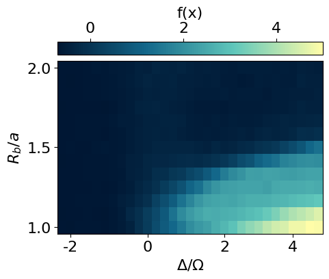

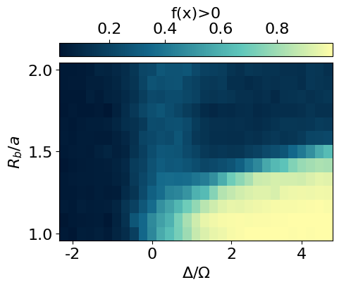

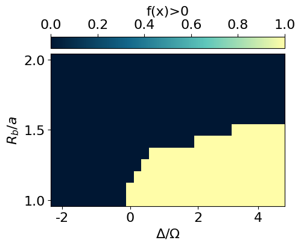

    [ColabKernelApp] WARNING | Error caught during object inspection: Can't clean for JSON: <class 'sympy.core.symbol.Symbol'>

Using our prior knowledge of the system, we can construct an order
parameter by using the found correlator on the corner and subtracting
the correlations on the edges and in the bulk.

``` python
def compute_correlation_bulk_pos(x):
  """Computes the bulk correlation of a single configuration."""
  c = []
  for i in range(N):
    if i>L and i<(L*L-L) and i%L!=0 and (i+1)%L!=0:
      yi = i//L
      xi = (yi%2==0)*(i%L) + (yi%2==1)*(L-1-i%L)
      j = i+1
      c.append(x[i]*x[j])
  return jnp.mean(jnp.array(c),axis=-1)/2

def compute_correlation_edges_pos(x):
  """Computes the edge correlation of a single configuration."""
  c = []
  for i in range(L-1):
    c.append(x[i]*x[i+1])
  for i in range(L*L-L,L*L-1):
    c.append(x[i]*x[i+1])
  for i in range(L-1,L*L,L):
    c.append(x[i]*x[i+1])
  for i in range(0,L*L,L):
    c.append(x[i]*x[i+25])

  return jnp.mean(jnp.array(c),axis=-1)

def compute_correlation_corner(x):
  """Computes the corner correlation of a single configuration."""
  c = []

  all_corners = [[0,1,25,24], [12,13,11,14], [156,155,157,154], [168,167,143,144]]
  x_corner = jnp.concatenate([x[None, corners] for corners in all_corners], axis=0)

  c.append(x_corner[:,0]*x_corner[:,3])
  c.append(2*x_corner[:,1]*x_corner[:,2])


  co = jnp.abs(jnp.mean(jnp.array(c).reshape(-1),axis=-1))
  ed = jnp.abs(compute_correlation_edges_pos(x))
  bu = jnp.abs(compute_correlation_bulk_pos(x))


  return  co - ed - bu


compute_correlation_corner_vmap = jax.vmap(jax.vmap(jax.vmap(compute_correlation_corner)))


plt.rcParams['font.size'] = 18
plt.figure(figsize=(3,3),dpi=200)

#S = data_exact['S']
cor = jnp.mean(compute_correlation_corner_vmap(snapshots*2-1), axis=-1)
plt.imshow(jnp.flipud(cor), cmap=cmap_green3, aspect='auto')

cbar = plt.colorbar(orientation="horizontal", pad=0.03, location="top")
cbar.set_label(r'f(x)', fontsize=20, labelpad=10)


plt.xlabel(r'$\Delta/\Omega$')
plt.ylabel(r'$R_b/a$')

x_tick_positions = [1, 10, 19, 27]  # Positions for the ticks
x_tick_labels = ['-2', '0', '2', '4']  # Labels for the ticks
plt.xticks(x_tick_positions, x_tick_labels)

y_tick_positions = [0,6,12]  # Positions for the ticks
y_tick_labels = ['2.0', '1.5', '1.0']  # Labels for the ticks
plt.yticks(y_tick_positions, y_tick_labels)


#cbar.set_label(r'$\langle Z(r_j)Z(r_i) \rangle$  $(r_j,r_i)\in NN$')

#plt.title('S')
plt.show()
```

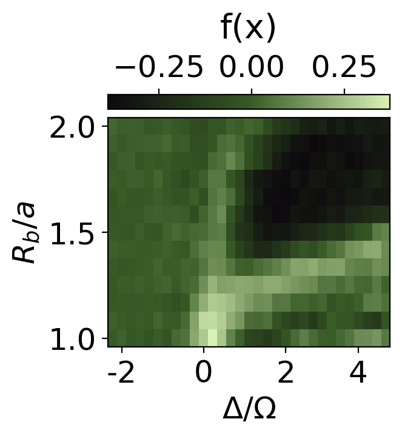

``` python
plt.rcParams['font.size'] = 18
plt.figure(figsize=(3,3),dpi=200)


plt.imshow(jnp.flipud(cor>0.2), cmap=cmap_green3, aspect='auto')

cbar = plt.colorbar(orientation="horizontal", pad=0.03, location="top")
cbar.set_label(r'f(x)', fontsize=20, labelpad=10)


plt.xlabel(r'$\Delta/\Omega$')
plt.ylabel(r'$R_b/a$')

x_tick_positions = [1, 10, 19, 27]  # Positions for the ticks
x_tick_labels = ['-2', '0', '2', '4']  # Labels for the ticks
plt.xticks(x_tick_positions, x_tick_labels)

y_tick_positions = [0,6,12]  # Positions for the ticks
y_tick_labels = ['2.0', '1.5', '1.0']  # Labels for the ticks
plt.yticks(y_tick_positions, y_tick_labels)


#cbar.set_label(r'$\langle Z(r_j)Z(r_i) \rangle$  $(r_j,r_i)\in NN$')

#plt.title('S')
plt.show()
```

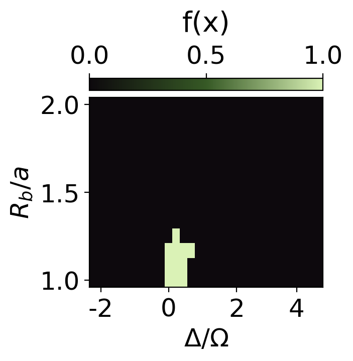
