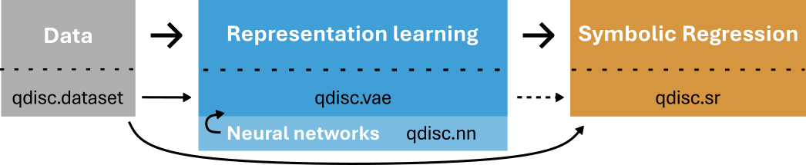

# Readme

<!-- WARNING: THIS FILE WAS AUTOGENERATED! DO NOT EDIT! -->

The library is organized around three core modules:

- `qdisc.dataset`: Handles the loading and management of quantum
  datasets, including their associated types and tuning parameters used
  throughout the pipeline.
- `qdisc.vae`: Implements the Variational Auto-Encoder (VAE) model and a
  Trainer wrapper that learns a low-dimensional representation of the
  quantum phase space.
- `qdisc.sr`: Provides Symbolic Regression (SR) methods to derive
  compact, interpretable analytical descriptors for the clusters
  identified in the learned representation.

The library also includes two supporting submodules:

- `qdisc.nn`: Contains neural network architectures used as building
  blocks within the pipeline.
- `qdisc.clustering`: Implements a clustering algorithm that can be
  applied to the learned representation to identify and label distinct
  phases.

The interplay between these modules across the full pipeline is
illustrated below:

The `qdisc.vae` module combines data from `qdisc.dataset` with neural
network architectures from `qdisc.nn` to learn a low-dimensional
representation of the phase space. The `qdisc.sr` module then operates
on this representation — and, for some approaches, on the VAE itself —
to produce compact, interpretable analytical expressions.
