# Training VAEs on quantum data


<!-- WARNING: THIS FILE WAS AUTOGENERATED! DO NOT EDIT! -->

In this first tutorial, we show how the **representation learning**
tools implemented in `qdisc` can be used to learn a representation of
the phase space directly from **unlabelled quantum data**.

We start by using `qdisc.dataset` to handle and preprocess the data
efficiently, then walk through the `qdisc.vae` module, which provides
tools to construct, customize, and train variational autoencoders (VAEs)
for phase-space representation learning.

The main entry point is the `qdisc.VAETrainer` class, initialized by
specifying:

- the data (an instance of `qdisc.Dataset`),
- a VAE model (an instance of `qdisc.VAEmodel`),
- a set of hyperparameters.

In the following we will:

1.  Generate raw quantum data.
2.  Train a VAE to learn a latent representation of the phase space.
3.  Inspect active latent variables and visualize the learned structure.
4.  Apply symbolic regression (SR) methods to extract compact analytical
    descriptors for the latent clusters (tutorial 2).

## Generating quantum data

We consider a quantum experiment with a set of controllable
**experimental parameters** *θ*<sub>1, …, *k*</sub>. For each parameter
configuration, a measurement yields a string **x**, which can in
principle take any form. Here we focus on experiments where individual
subsystems — spins, atoms, or qubits — can be measured locally, either
via discrete projective measurements in a fixed basis, measurements
along random directions, or continuous local density measurements. In
this case, **x** = {*x*<sub>*i*</sub>}<sub>*i* = 1</sub><sup>*N*</sup>,
where *N* is the number of subsystems.

As a compact toy example, we use the **J₁–J₂ model** on a 3 × 3 square
lattice with **open boundary conditions**, fixing *J*<sub>1</sub> = 1.
The Hamiltonian is

*H*<sub>*J*<sub>1</sub>*J*<sub>2</sub></sub> = ∑<sub>⟨*i*, *j*⟩</sub>*σ*<sub>*i*</sub><sup>*z*</sup>*σ*<sub>*j*</sub><sup>*z*</sup> + *J*<sub>2</sub>∑<sub>⟨⟨*i*, *j*⟩⟩</sub>*σ*<sub>*i*</sub><sup>*z*</sup>*σ*<sub>*j*</sub><sup>*z*</sup> + *h*∑<sub>*i*</sub>*σ*<sub>*i*</sub><sup>*x*</sup>,

where ⟨⋅⟩ and ⟨⟨⋅⟩⟩ denote nearest-neighbour (NN) and
next-nearest-neighbour (NNN) pairs, respectively.

The experimental tuning parameters are: -
*θ*<sub>1</sub> = *J*<sub>2</sub> ∈ \[0, 1.5\], and -
*θ*<sub>2</sub> = *h* ∈ \[0.1, 2\].

In this tutorial, the data consist of **measurement snapshots in the
*σ*<sup>*z*</sup> basis**, generated as follows:

1.  **Exact diagonalization** of the Hamiltonian over a grid of tuning
    parameter values (*θ*<sub>1</sub>, *θ*<sub>2</sub>).
2.  Computation of measurement probabilities from the resulting
    ground-state wavefunction.
3.  Sampling of snapshots from these probabilities in the
    *σ*<sup>*z*</sup> basis.

The Hamiltonian construction and exact diagonalization are performed
using [**NetKet**](https://www.netket.org/), a powerful library for
computational quantum physics.

``` python
## We define the Hamitonian using the NetKet Paulis operators ##
nk.config.netket_spin_ordering_warning = False

N = 9
hi = nk.hilbert.Spin(s=1/2, N=N)


def get_H(J1,J2,h,N=N):
    '''J1J2 Hamiltonian'''

    # NN interactions
    NN = [(0,1),(0,5),(1,4),(1,2),(2,3),(5,6),(5,4),(4,7),(4,3),(3,8),(6,7),(7,8)]
    H = sum([J1*sigmaz(hi,i)@sigmaz(hi,j) for i,j in NN])
    # NNN interactions
    NNN = [(0,4),(5,1),(1,3),(4,2),(5,7),(6,4),(4,8),(7,3)]
    H += sum([J2*sigmaz(hi,i)@sigmaz(hi,j) for i,j in NNN])
    # External field
    H += sum([h*sigmax(hi,i) for i in range(N)])

    return H
```

``` python
#size of the system
N = 9

#define the various observables we want to compute
NN = [(0,1),(0,5),(1,4),(1,2),(2,3),(5,6),(5,4),(4,7),(4,3),(3,8),(6,7),(7,8)]
NNN = [(0,4),(5,1),(1,3),(4,2),(5,7),(6,4),(4,8),(7,3)]
corr_op = sum([sigmaz(hi,i)@sigmaz(hi,j) for i,j in NN])
corr2_op = sum([sigmaz(hi,i)@sigmaz(hi,j) for i,j in NNN])

#H parameters
J1 = 1.
all_J2 = jnp.linspace(0, 1.5, 21)
all_h = jnp.linspace(0, 2., 21)[1:]

#containers for the observables
energies = jnp.zeros((len(all_J2),len(all_h)))
wave_fcts = jnp.zeros((len(all_J2), len(all_h), 2**N, 1))
corr_gs = jnp.zeros((len(all_J2),len(all_h)))
corr2_gs = jnp.zeros((len(all_J2),len(all_h)))

#exact diagonalization for every set of parameter of H
for i, J2 in enumerate(all_J2):
  for j, h in enumerate(all_h):

        #print('J2: {}, h: {}'.format(J2,h))

        H = get_H(J1,J2,h,N=N)
        E_gs, ket_gs = nk.exact.lanczos_ed(H, compute_eigenvectors=True)


        corr = (ket_gs.T.conj()@corr_op.to_linear_operator()@ket_gs).real[0,0]
        corr2 = (ket_gs.T.conj()@corr2_op.to_linear_operator()@ket_gs).real[0,0]


        energies = energies.at[i,j].set(E_gs[0])
        wave_fcts = wave_fcts.at[i,j].set(ket_gs)
        corr_gs = corr_gs.at[i,j].set(corr)
        corr2_gs = corr2_gs.at[i,j].set(corr2)


data_exact = {'energies': energies, 'wave_fcts': wave_fcts, 'corr_gs': corr_gs, 'corr2_gs': corr2_gs}
```

Across the explored parameter space, the system exhibits **three
distinct phases**.

1.  For small *J*<sub>2</sub> and weak transverse field *h*, the
    nearest-neighbour interactions dominate. This regime shows a
    **Néel-ordered phase**, characterized by antialigned
    nearest-neighbour spins.

2.  For large *J*<sub>2</sub> and small *h*, the next-nearest-neighbour
    couplings become dominant. The system then enters a **striped
    phase**, in which nearest-neighbour spins align while
    next-nearest-neighbour spins are antialigned.

3.  Finally, for sufficiently large transverse field *h*, the spins
    polarize along the *x* direction, forming a **polarized phase**.

We can visualize the phase space by looking at the next-nearest-neighbor
correlator:

``` python
plt.rcParams['font.size'] = 16
plt.figure(figsize=(5,5),dpi=100)

plt.imshow(jnp.rot90(data_exact['corr2_gs']))
plt.ylabel(r'$h$')
plt.xlabel(r'$J_2$')
plt.colorbar(shrink=0.675)
plt.title(r'corr')


y_tick_positions = [0,10,19]
y_tick_labels = ['2', '1', '0.1']
plt.yticks(y_tick_positions, y_tick_labels)

x_tick_positions = [0, 10, 20]
x_tick_labels = ['0', '0.75', '1.5']
plt.xticks(x_tick_positions, x_tick_labels)

plt.show()
```

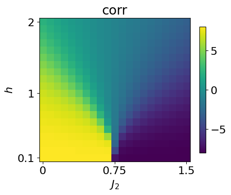

We now generate the data using the exact wavefunction. To do so, we
simply sample spin values from the probabilities given by the exact
wavefunction using the function
[`sample_spin_configurations`](https://qic-ibk.github.io/qdisc/lib_nbs/dataset/core.html#sample_spin_configurations)
from `qdisc.dataset`

``` python
## generate the data ##
from qdisc.dataset.core import sample_spin_configurations

num_sample_per_params = 1000
data = jnp.zeros([jnp.size(all_J2), jnp.size(all_h), num_sample_per_params, N])

key = jax.random.PRNGKey(8324)

wave_fcts = data_exact['wave_fcts']

for i, J2 in enumerate(all_J2):
  for j, h in enumerate(all_h):
      #print('J2: {}, h: {}'.format(J2,h))
      key, subkey = jax.random.split(key)
      samples = sample_spin_configurations(wave_fcts[i,j], num_samples=num_sample_per_params, N=N, key=subkey)
      data = data.at[i,j].set(samples)
```

To check that the data produced is correct, we can look at the
magnetization across the parameter space by just computing the average
mean

``` python
plt.rcParams['font.size'] = 16
plt.figure(figsize=(5,5),dpi=100)

plt.imshow(jnp.rot90(jnp.mean(jnp.abs(jnp.mean(data*2-1, axis=-1)), axis=-1)))
plt.ylabel(r'$h$')
plt.xlabel(r'$J_2$')
plt.colorbar(shrink=0.675)
plt.title(r'magnetization')


y_tick_positions = [0,10,19]
y_tick_labels = ['2', '1', '0.1']
plt.yticks(y_tick_positions, y_tick_labels)

x_tick_positions = [0, 10, 20]
x_tick_labels = ['0', '0.75', '1.5']
plt.xticks(x_tick_positions, x_tick_labels)

plt.show()
```

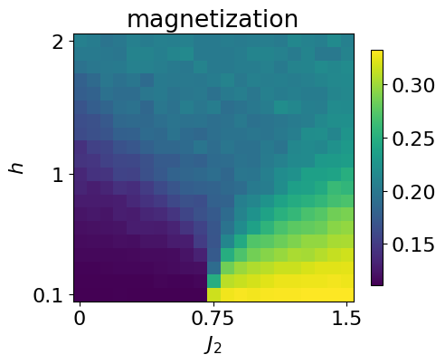

We next cast the generated data into a **`qdisc.Dataset`** object, which
provides a unified interface for handling quantum data within the qdisc
pipeline.

To construct the dataset, the following information must be specified: -
the values of the tuning parameters, - the type of quantum data, - the
dimension of the local Hilbert space, - the values of the local states
(for discrete data).

``` python
from qdisc.dataset.core import Dataset

dataset = Dataset(data=data, thetas=[all_J2, all_h], data_type='discrete', local_dimension=2, local_states=jnp.array([0,1]))
```

## Learning a latent representation of the phase space

With the dataset in hand, we now learn a representation of the phase
space using a **variational autoencoder** trained to reconstruct the
**conditional probabilities** of spin configurations.

The VAE consists of two neural networks: - an **encoder**, which takes a
spin configuration as input and outputs a mean *μ*<sub>*i*</sub> and
variance *σ*<sub>*i*</sub> defining a latent distribution
𝒩(*μ*<sub>*i*</sub>, *σ*<sub>*i*</sub>), from which a latent variable
*z*<sub>*i*</sub> is sampled; - a **decoder**, which reconstructs the
conditional probabilities of the spin configuration given the latent
variables **z**.

Both networks are implemented using the
[**Flax**](https://flax.readthedocs.io/) library. Several architectures
are available in `qdisc.nn`; given the simplicity of the present system,
we use: - a **convolutional neural network** for the encoder, and - a
**dense masked network** for the decoder.

A key strength of VAEs is their ability to **adaptively infer the
effective dimensionality** of the latent space: by choosing a latent
dimension larger than physically expected, the model learns to use only
the dimensions it needs. Here, we set `latent_dim = 5`.

``` python
from qdisc.nn.core import EncoderCNN2D, ARNNDense

encoder = EncoderCNN2D(latent_dim=5, conv_features = 4*N, dense_features = 4*N, num_conv_layers=3)
decoder = ARNNDense(num_layers=4, features=4*N)
```

With the encoder and decoder defined above, we can assemble the VAE
model using `qdisc.vae`:

``` python
from qdisc.vae.core import VAEmodel

myvae = VAEmodel(encoder=encoder, decoder=decoder)
```

The central object of this section is the
[`VAETrainer`](https://qic-ibk.github.io/qdisc/lib_nbs/vae/core.html#vaetrainer)
wrapper from `qdisc.vae`, which handles model training and computes the
learned representation. It is instantiated from a VAE model and a
dataset:

``` python
from qdisc.vae.core import VAETrainer

myvaetrainer = VAETrainer(model=myvae, dataset=dataset)
```

To train the model, we use the `.train()` method, specifying: - a random
key (for reproducibility), - the number of training epochs, - the loss
hyperparameters *α*, *β*, and *γ*.

The training objective is defined as

$$
\mathcal{L} = \frac{1}{M}\sum\_{m=1}^{M} \mathbb{E}\_q\[\log p(x^{(m)} \mid z)\] - \beta \\ \mathrm{KL}\[q(z \mid x^{(m)}) \\ p(z)\]
$$

where *M* is the number of training samples *x*<sup>(*m*)</sup>.

The first term promotes accurate probabilistic reconstruction of the
input data. The second is a regularization term that penalizes the
Kullback–Leibler (KL) divergence between the latent posterior
*q*(*z*<sub>*i*</sub>) ∼ 𝒩(*μ*<sub>*i*</sub>, *σ*<sub>*i*</sub>) and the
standard normal prior 𝒩(0, 1), keeping the latent representation close
to an uninformed prior.

The interplay between these two terms naturally yields a sparse latent
structure: only the latent neurons required for faithful reconstruction
deviate from the prior (**active neurons**), while the rest collapse to
it (**passive neurons**). The hyperparameter *β* controls the balance
between the two contributions.

The hyperparameter *γ* weights the statistical correlations between
latent neurons (total correlation regularization). This can improve
interpretability and, in some cases, simplify hyperparameter tuning —
see the [original TC-VAE paper](https://tinyurl.com/4r4pjkum) for
details.

For hybrid data, the reconstruction loss comprises two distinct terms,
whose relative weight is controlled by *α*. See the corresponding paper
or the [FKM example notebook](../examples/qdisc_FKM.ipynb) for details.

> **Important:** \# The following training takes a few seconds on a GPU,
> but around an hour on a CPU. If you don’t want to spend this time, you
> can just load the trained data by running the next cell.

``` python
key = jax.random.PRNGKey(9812)
num_epochs = 30
myvaetrainer.train(num_epochs=num_epochs, batch_size=5000, beta=.5, gamma=5, key=key, printing_rate=4)
```

    Start training...
    epoch=0 step=0 loss=-164.0816877940576 recon=6.24122033277154
    logvar=[ 0.02889643  0.06553731  0.08578867  0.07469489 -0.11742282]
    epoch=4 step=0 loss=-166.45211124671502 recon=2.5760088226371716
    logvar=[-1.36892477e-03 -4.82999374e-02 -6.22983538e-02 -5.30253240e-02
     -5.17253551e+00]
    epoch=8 step=0 loss=-166.69147796032797 recon=2.1487739147339293
    logvar=[ 0.00951258 -0.01400834 -0.02464279 -0.00858941 -5.84861374]
    epoch=12 step=0 loss=-166.7729565138266 recon=1.9637902448406568
    logvar=[-0.03862359 -0.04633447 -0.01720772 -0.0306454  -6.30670534]
    epoch=16 step=0 loss=-166.87305732748734 recon=1.8128534112447012
    logvar=[-0.0251713  -0.03875362 -0.02637963 -0.02864144 -6.4948804 ]
    epoch=20 step=0 loss=-166.8853334271902 recon=1.773370016137969
    logvar=[-0.01703035 -0.03162701 -0.02305127 -0.0382037  -6.62230354]
    epoch=24 step=0 loss=-166.97256104566398 recon=1.6597759778974905
    logvar=[-0.02856087 -0.04890603 -0.03495724 -0.03407848 -6.66632657]
    epoch=28 step=0 loss=-166.87848415521344 recon=1.7192362466692372
    logvar=[-2.64610119e-02 -4.01741369e-02 -1.93288443e-02  3.23893816e-03
     -6.80669410e+00]
    Training finished.

As indicated by simple observables such as the next-nearest-neighbour
correlator, the phase space of this system can be fully characterized by
a **single parameter**. We therefore expect only **one active latent
neuron**, with the remaining ones collapsing to the prior.

To encourage this behavior, we use relatively large weights for the **KL
divergence** and **total correlation (TC)** terms. The TC regularization
helps sparsify the latent representation, since an active latent
variable is typically weakly correlated with noise. When only one neuron
is active, the TC term does not alter the learned representation but
still suppresses spurious correlations among passive neurons.

To inspect the training progress, we can examine the reconstruction loss
and the log-variances of the latent neurons using the `.plot_training()`
method:

``` python
#load the trained model
with open('J1J2_data_cpVAE2_QDisc.pkl', 'rb') as f:
    all_data = pickle.load(f)

myvaetrainer.init_state(jax.random.PRNGKey(0), dataset.data[0,0])
myvaetrainer.state = myvaetrainer.state.replace(params=all_data['params'])
myvaetrainer.history_recon = all_data['history_recon']
myvaetrainer.history_logvar = all_data['history_logvar']
```

``` python
myvaetrainer.plot_training(num_epochs = num_epochs)
```

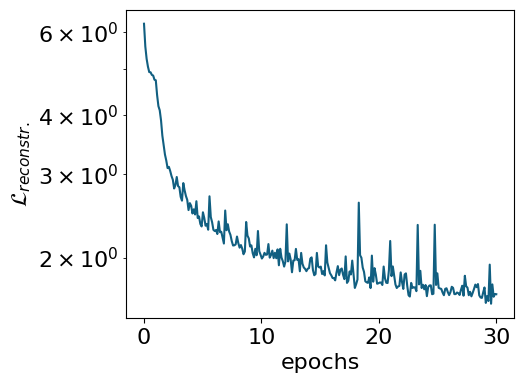

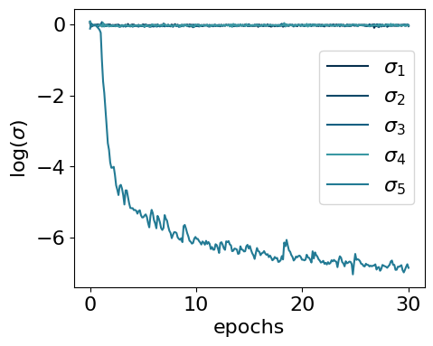

The model encodes information in a single active latent variable, with
the log-variance of all others collapsing to zero.

To inspect the learned representation, use `compute_repr2d()` to compute
it and `plot_repr2d()` to visualize it — or combine both steps with
`.compute_and_plot_repr2d()`, as shown below:

``` python
#latvar = myvaetrainer.compute_repr2d(return_latvar = True) #this also update the attribute latvar of the object
#myvaetrainer.plot_repr2d()

## or one can do both by just calling
# now the latent variables are ordered with respect to the values of their logvar: from low (most active) to high (most passive)
myvaetrainer.compute_and_plot_repr2d()
```

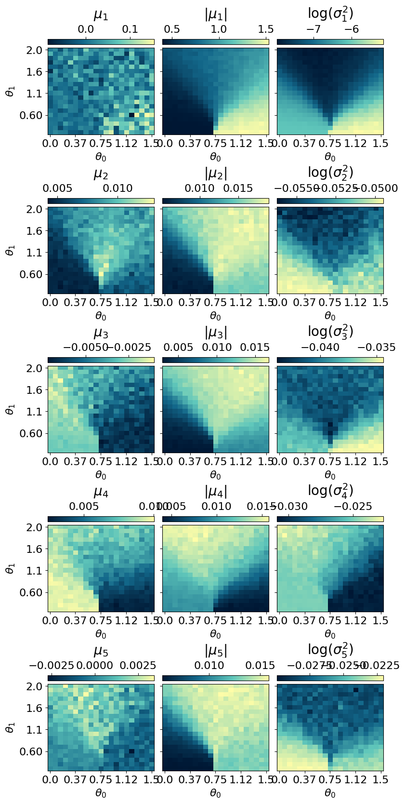

During training, the VAE reduces its reconstruction loss. However, a low
reconstruction loss alone does not guarantee that the model faithfully
approximates the true ground state. It is therefore essential to
explicitly assess the **quality of the reconstructed physical
observables**.

A common approach is to generate samples from the decoder and compute
statistical estimates of selected observables. In our example, this is
done by sampling spin configurations from the learned conditional
distribution.

Below, we use the `.reconstruct_sample()` method to generate spin
configurations at each point in parameter space and then compute the
**average magnetization** across the full parameter range.

``` python
reconstruct_sample = jnp.zeros_like(dataset.data)
key = jax.random.PRNGKey(2687)

for i in range(dataset.data.shape[0]):
  for j in range(dataset.data.shape[1]):
    subkey, key = jax.random.split(key)
    reconstruct_sample = reconstruct_sample.at[i,j].set(myvaetrainer.reconstruct_sample(dataset.data[i,j],subkey))
```

``` python
plt.rcParams['font.size'] = 16
plt.figure(figsize=(5,5),dpi=100)

plt.imshow(jnp.rot90(jnp.mean(jnp.abs(jnp.mean(reconstruct_sample*2-1,axis=(-1))),axis=-1)))
plt.ylabel(r'$h$')
plt.xlabel(r'$J_2$')
plt.colorbar(shrink=0.675)
plt.title(r'magn')


y_tick_positions = [0,10,19]
y_tick_labels = ['2', '1', '0.1']
plt.yticks(y_tick_positions, y_tick_labels)

x_tick_positions = [0, 10, 20]
x_tick_labels = ['0', '0.75', '1.5']
plt.xticks(x_tick_positions, x_tick_labels)

plt.show()
```

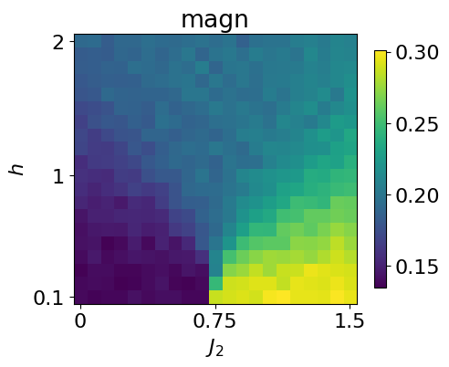

This can be compared with the magnetization computed directly from the
dataset.

``` python
plt.rcParams['font.size'] = 16
plt.figure(figsize=(5,5),dpi=100)

plt.imshow(jnp.rot90(jnp.mean(jnp.abs(jnp.mean(dataset.data*2-1,axis=(-1))),axis=-1)))
plt.ylabel(r'$h$')
plt.xlabel(r'$J_2$')
plt.colorbar(shrink=0.675)
plt.title(r'magn')


y_tick_positions = [0,10,19]
y_tick_labels = ['2', '1', '0.1']
plt.yticks(y_tick_positions, y_tick_labels)

x_tick_positions = [0, 10, 20]
x_tick_labels = ['0', '0.75', '1.5']
plt.xticks(x_tick_positions, x_tick_labels)

plt.show()
#quick comparaison without setting the same cbar
#given the patterns, should be ~1/9 for neel and ~1/3 for striped
#the apparent magnetization in the polarized phase is due to the fact that we make the average of the absolute magn. (all zero due to Z2 degene otherwise)
```

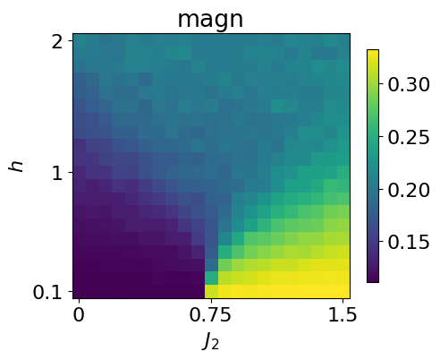

The `.get_data()` method returns a dictionary containing the training
history, the optimized VAE parameters, the learned representation, and
more.

``` python
all_data = myvaetrainer.get_data()
all_data.keys()
```

    dict_keys(['params', 'history_loss', 'history_recon', 'history_logvar', 'latvar'])

The data can then be saved using `pickle`:

``` python
## also add the data and the exact corr ##

all_data['corr_exact'] = data_exact['corr_gs']
all_data['corr2_exact'] = data_exact['corr2_gs']
all_data['data'] = dataset.data
```

``` python
with open('J1J2_data_cpVAE2_QDisc.pkl', 'wb') as f:
    pickle.dump(all_data, f)
```

And loaded back with:

``` python
with open('J1J2_data_cpVAE2_QDisc.pkl', 'rb') as f:
    all_data = pickle.load(f)
```

## Clustering the latent representation

In this toy example, the different phases are clearly visible in the
learned latent representation. For more complex phase diagrams or
higher-dimensional representations, however, identifying phase
boundaries by eye becomes challenging. To address this, **`qdisc`
provides clustering tools** that operate directly on the latent space to
automatically identify distinct phases.

The clustering algorithm currently implemented is a **Gaussian Mixture
Model (GMM)**, applied to a feature vector *X* constructed as follows: -
the first component is the average value of the **active latent
variable** across the parameter space; - the (normalized) tuning
parameters *θ*<sub>*i*</sub> are appended to this vector.

Including the tuning parameters helps the GMM find clusters with
smoother, better-defined boundaries. Their relative contribution is
controlled by a weighting parameter *α*.

To use `qdisc.clustering.GaussianMixture`, one must specify: - the
number of clusters (phases), - the maximum number of iterations.

An optional *k*-means initialization can be enabled via
`init_params="kmeans"`.

``` python
from qdisc.clustering.core import GaussianMixture

## get the latent representation
#latvar = myvaetrainer.latvar
latvar = all_data['latvar']
data = all_data['data']
mu0abs = latvar['mu0_abs']
theta_pair = (1,0)#latvar['theta_pair']

#get the experimental parameters thetas to weight on the parameter space distance by alpha and have a smooter clustering
alpha = 0.001
theta1 = dataset.thetas[theta_pair[0]]
theta2 = dataset.thetas[theta_pair[1]]
theta1_norm = (theta1 - jnp.min(theta1)) / (jnp.max(theta1) - jnp.min(theta1))
theta2_norm = (theta2 - jnp.min(theta2)) / (jnp.max(theta2) - jnp.min(theta2))

#vector to perform the GMM one
X = jnp.array([mu0abs.reshape(-1), alpha*jnp.tile(theta1_norm[:,None], reps=(jnp.size(theta2_norm),)).reshape(-1), alpha*jnp.tile(theta2_norm[None, :], reps=(jnp.size(theta1_norm),)).reshape(-1)]).transpose()


for n_components in [2,3,4,5]:

    print('GMM with n_components: {}'.format(n_components))

    clusterer = GaussianMixture(
                                n_components=n_components,
                                max_iter=500,
                                init_params="kmeans"
                            )

    clusterer.fit(X, key=jax.random.PRNGKey(4362))


    classes = clusterer.predict(X).reshape((jnp.size(theta1),jnp.size(theta2)))

    final_classes = jnp.zeros((jnp.size(theta1),jnp.size(theta2)))
    for i in range(jnp.size(theta1)):
      for j in range(jnp.size(theta2)):
        v, c = jnp.unique_counts(classes[i,j])
        final_classes = final_classes.at[i,j].set(v[jnp.argmax(c)])


    fig_shape = (len(theta1)/5, len(theta2)/5)

    plt.rcParams['font.size'] = 16
    plt.figure(figsize=fig_shape,dpi=100)

    plt.imshow(jnp.flipud(final_classes), aspect='auto')
    cbar = plt.colorbar(orientation="horizontal", pad=0.03, location="top")
    cbar.set_label(r'classification: #classes={}'.format(n_components))


    plt.ylabel(r'$\theta_{}$'.format(theta_pair[0]))
    plt.xlabel(r'$\theta_{}$'.format(theta_pair[1]))
    plt.yticks([i for i in range(0,len(theta1),len(theta1)//4)], [str(theta1[len(theta1)-i])[:3] for i in range(0,len(theta1),len(theta1)//4)])
    plt.xticks([i for i in range(0,len(theta2)+1,len(theta2)//4)], [str(theta2[i])[:3] for i in range(1,len(theta2)+1,len(theta2)//4)])

    plt.show()
```

    GMM with n_components: 2

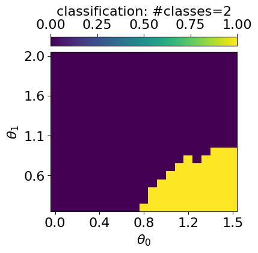

    GMM with n_components: 3

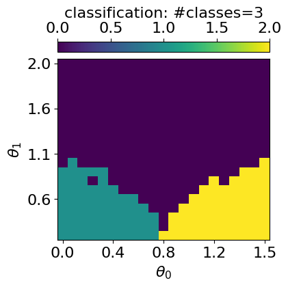

    GMM with n_components: 4

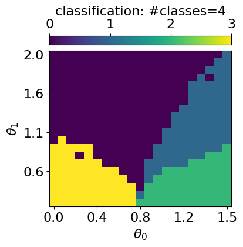

    GMM with n_components: 5

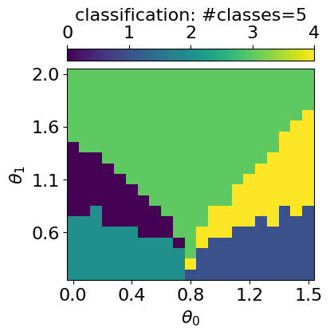

To determine the optimal number of clusters, `qdisc.clustering` provides
the
[`select_n_components()`](https://qic-ibk.github.io/qdisc/lib_nbs/clustering/core.html#select_n_components)
function, used as shown below:

``` python
from qdisc.clustering.core import select_n_components
## Can also compute some metrics to evaluate the optimal number of class

ks = range(2, 7)  # ranges of n_components tested
results = select_n_components(X, ks, n_init=5, max_iter=500, random_seed=2546)

# collect bic/aic/loglikelihood
bics = jnp.array([results[k]['metrics']['bic'] for k in ks])
aics = jnp.array([results[k]['metrics']['aic'] for k in ks])
avg_lls = jnp.array([results[k]['metrics']['avg_log_likelihood'] for k in ks])

# K that minimizes BIC/AIC
best_k_bic = ks[jnp.argmin(bics)]
best_k_aic = ks[jnp.argmin(aics)]
print("Best K (BIC):", best_k_bic, "Best K (AIC):", best_k_aic)

#3 is indeed the best (neel, pola, striped), the fourth one is a phase boundary (can also be interesting)
```

    Trying K=2
    Trying K=3
    Trying K=4
    Trying K=5
    Trying K=6
    Best K (BIC): 3 Best K (AIC): 5

``` python
## plot of each metrics

from matplotlib import pyplot as plt


for i, k in enumerate(ks):
  print('results GMM n_components: {}'.format(k))
  print('BIC: {}'.format(bics[i]))
  print('AIC: {}'.format(aics[i]))
  print('avg_log_likelihood: {}'.format(avg_lls[i]))


plt.rcParams['font.size'] = 16
plt.figure(figsize=(5,4),dpi=100)

plt.plot(ks, bics, 'o-', label='BIC')
plt.plot(ks, aics, 'o-', label='AIC')
#plt.plot(ks, avg_lls, 'o-', label='avg_log_likelihood')

plt.xlabel('n_components')
plt.ylabel('score')
plt.legend()


plt.rcParams['font.size'] = 16
plt.figure(figsize=(5,4),dpi=100)

plt.plot(ks, avg_lls, 'o-', label='avg_log_likelihood')
plt.xlabel('n_components')
plt.ylabel('avg_log_likelihood')

plt.show()
#3 also leads to a big increase og log_likelihood
```

    results GMM n_components: 2
    BIC: -9700.291536668057
    AIC: -9777.056376182329
    avg_log_likelihood: 11.684590924026583
    results GMM n_components: 3
    BIC: -9810.477975436434
    AIC: -9927.645362063478
    avg_log_likelihood: 11.88767305007557
    results GMM n_components: 4
    BIC: -9763.699312877627
    AIC: -9921.269246617445
    avg_log_likelihood: 11.903891960258864
    results GMM n_components: 5
    BIC: -9738.231419973254
    AIC: -9936.203900825847
    avg_log_likelihood: 11.945480834316486
    results GMM n_components: 6
    BIC: -9683.22510978266
    AIC: -9921.600137748026
    avg_log_likelihood: 11.951904925890508

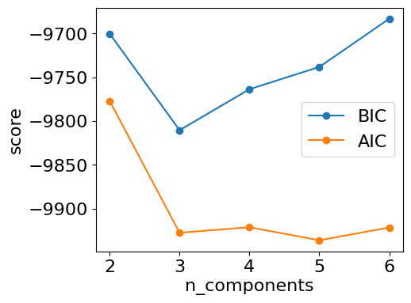

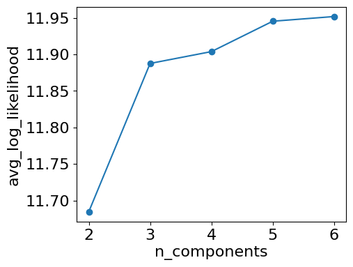

## Symbolic regression

For the **symbolic regression (SR)** tools implemented in `qdisc`, see
the second tutorial notebook.
