# Extracting order parameters with SR


<!-- WARNING: THIS FILE WAS AUTOGENERATED! DO NOT EDIT! -->

In this second tutorial, using the J1J2 model (see [first
tutorial](J1J2_tuto1_VAE.ipynb)), we show how the **symbolic regression
(SR)** tools implemented in qdisc can be used. These methods aim to
identify **compact analytic descriptors** of latent clusters, which can
often be interpreted as candidate order parameters.

The main entry point is the `qdisc.sr.SymbolicRegression()` class. It is
initialized by specifying the following attributes:

- the dataset (an instance of `qdisc.Dataset`),
- the index (in *θ*-space) of the cluster to be analyzed,
- the objective used to define the loss / fitness function:
  - a **classification objective** (SR1),
  - a **boundary-matching objective** in *x*-space (SR2),
  - a **boundary-matching objective** in *θ*-space (SR3),
- for SR1, the indices of data points labeled as outside the cluster,
- For SR2 and SR3, the VAE should also be provided with the index of the
  latent variable where the cluster appears
- for SR3, the method used to construct the projector *v*<sub>*k*</sub>
  (currently `'delta'` or `'cp'`).

In addition, the **search space** of the symbolic expression must be
specified. qdisc currently supports two options: - a **two-body
correlator ansatz**,
*f*(*x*) = ∑<sub>*i*, *j* \> *i*</sub>*α*<sub>*i*, *j*</sub> *x*<sub>*i*</sub>*x*<sub>*j*</sub> + *b*,
 - a more expressive search space based on **genetic programming**. By
setting the option to `'genetic'`, qdisc interfaces with **PySR**. For
the moment, this is only available with the SR1 objective. For further
details, we refer the reader to the PySR documentation:
https://github.com/MilesCranmer/PySR

In the following, we use qdisc to identify a symbolic expression
characterizing the **Néel phase**, employing the two-body correlator
ansatz and comparing the different symbolic regression objectives.

``` python
## load/create the necessary objects
from qdisc.nn.core import EncoderCNN2D, ARNNDense
from qdisc.vae.core import VAEmodel
from qdisc.sr.core import SymbolicRegression
from qdisc.sr.core import spearman_rho
from qdisc.sr.core import auc_from_scores_labels
from qdisc.dataset.core import Dataset

#dataset
with open('J1J2_data_cpVAE2_QDisc.pkl', 'rb') as f:
    all_data = pickle.load(f)

all_J2 = jnp.linspace(0, 1.5, 21)
all_h = jnp.linspace(0, 2., 21)[1:]

dataset = Dataset(data=all_data['data'], thetas=[all_J2, all_h], data_type='discrete', local_dimension=2, local_states=jnp.array([0,1]))

#vae
N = 9
encoder = EncoderCNN2D(latent_dim=5, conv_features = 4*N, dense_features = 4*N, num_conv_layers=3)
decoder = ARNNDense(num_layers=4, features=4*N)

VAE_model = VAEmodel(encoder=encoder, decoder=decoder)
VAE_params = all_data['params']
latvar = all_data['latvar']
```

## classifying the Neel phase

We first try to look for a compact expression f(x) characterizing the
Néel phase, which is defined below:

``` python
## we first specify the indexe of the cluster ##
# could use the GMM results, in this toy example, can also just set a threshold
mu0abs = latvar['mu0_abs']
threshold = 0.5
# ! the idx are related to dataset thetas order, if latvar were computed using (1,0) order (as before), need to transpose 
cluster_idx_in_neel = jnp.argwhere(mu0abs.transpose()<threshold)

# also compute a label array (used later to compute the auc)
labels_neel = jnp.zeros_like(jnp.mean(dataset.data, axis=(-1,-2)))
for id in cluster_idx_in_neel:
  labels_neel = labels_neel.at[id[0],id[1]].set(1)
labels_neel = labels_neel[:10,:].reshape(-1)


plt.rcParams['font.size'] = 16
plt.figure(figsize=(6,5),dpi=100)

plt.imshow(jnp.flipud(mu0abs<threshold), aspect='auto')
plt.colorbar()
plt.title(r'Neel phase label for SR')
plt.yticks([0,10,19], ['2', '1', '0.1'])
plt.xticks([0, 10, 20], ['0', '0.75', '1.5'])
plt.ylabel(r'$h$')
plt.xlabel(r'$J_2$')
plt.show()
```

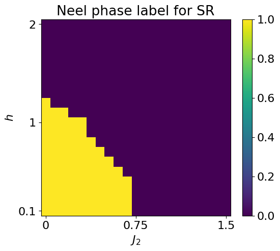

After initializing a
[`SymbolicRegression`](https://qic-ibk.github.io/qdisc/lib_nbs/sr/core.html#symbolicregression)
object, the symbolic search can be launched by simply calling the
`.train()` method.

For the two-body correlator ansatz, qdisc provides visualization
utilities to help interpret the learned expression. In particular, the
`.plot_alpha()` method displays the learned coefficients
*α*<sub>*i*, *j*</sub>, given the specified topology of the quantum
system.

Once a symbolic expression *f*(*x*) is obtained, its predictions can be
computed and visualized using the `.compute_and_plot_prediction()`
method.

Finally, to quantify the quality of the symbolic descriptor *f*(*x*),
one can compute the **Spearman correlation coefficient** between the
model predictions and a reference physical observable (here, the
nearest-neighbour correlator).

``` python
## we then perform SR1 on the neel phase ##

mySR = SymbolicRegression(dataset, cluster_idx_in_neel, objective='SR1', search_space = "2_body_correlator")
key = jax.random.PRNGKey(3246)
res = mySR.train(key, dataset_size=2000)

## plot the alpha ##
topology = [[0,1,2],[5,4,3],[6,7,8]]
mySR.plot_alpha(topology=topology, edge_scale=5, name='SR1')


## plot the prediction ##
p = mySR.compute_and_plot_prediction(name='SR1')
_ = mySR.compute_and_plot_prediction(name='SR1', class_pred=True)

## containers to save the results
all_alpha_neel = {}
all_alpha_neel['SR1'] = mySR.model.alpha
all_prediction_fx_neel = {}
all_prediction_fx_neel['SR1'] = p

## compute the spearman ##
#only on the left part of the parameter space where the Neel phase is
a = p[:,:10].transpose().reshape(-1)
c = all_data['corr_exact'][:10,:].reshape(-1)
s = jnp.abs(spearman_rho(a, c))

print('spearman between pred and exact corr: ', s)

## compute the auc ##
scores = p.transpose()[:10,:].reshape(-1)
#for classification, we could use the final classification for the score: p>0. But it is unfair with the other SR which are not binary.
auc = auc_from_scores_labels(scores, labels_neel)

print('auc: ', auc)
```

    ### Start preparing the dataset ###
    ### Dataset prepared, start the trainnig ###
    ### Training finished ###
      message: CONVERGENCE: NORM OF PROJECTED GRADIENT <= PGTOL
      success: True
       status: 0
          fun: 0.3136450401569233
            x: [ 1.095e-01  5.870e-02 ...  1.315e-01  4.198e-01]
          nit: 24
          jac: [ 5.185e-06 -3.036e-06 ...  2.331e-07 -5.995e-07]
         nfev: 1036
         njev: 28
     hess_inv: <36x36 LbfgsInvHessProduct with dtype=float64>

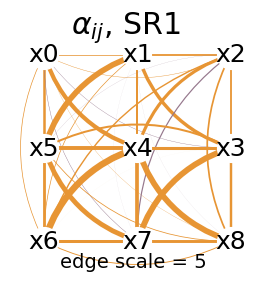


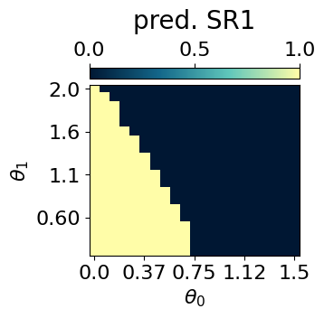

    spearman between pred and exact corr:  0.9766054
    auc:  0.9994868637110015

The symbolic expression obtained using qdisc successfully
**characterises the Néel phase**. It also has a quite regular structure,
which already gives some insight into the physical interactions.

To have an even clearer structure, we can add a L1 regularization to the
loss, as shown below.

``` python
res = mySR.train(key, dataset_size=2000, L1_reg=5, print_info=False)

mySR.plot_alpha(topology=topology, edge_scale=20, name='SR1 with L1')
all_alpha_neel['SR1_L1'] = mySR.model.alpha
```

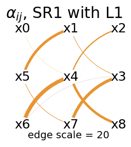

This expression is especially insightful, as its structure naturally
reflects the **topology and interactions of the system**.

An example of `qdisc.sr.SymbolicRegression()` using the **genetic search
space** is available in the Rydberg example.

Using the **two-body correlator ansatz**, qdisc also allows further
simplification of the learned coefficients *α*<sub>*i**j*</sub> into a
**compact symbolic expression** by calling **PySR**. This can be done
via the `.reduce_alpha()` method. An example of this workflow is
presented in the cluster Ising example.

Below, we will apply the other SR objectives and also look for
expressions characterizing the striped and polarised phases. This will
reproduce the results presented in the paper.

## Characterising the Néel phase with the other SR objectives

### SR2

``` python
## same but with the SR2 objective ##
mySR = SymbolicRegression(dataset,
                          cluster_idx_in_neel,
                          objective='SR2',
                          idx_mu_cluster=latvar['id_lat'][0],
                          VAE_model=VAE_model,
                          VAE_params=VAE_params,
                          mu_cluster = mu0abs.transpose())

key = jax.random.PRNGKey(456)
res = mySR.train(key)

## plot the alpha ##
topology = [[0,1,2],[5,4,3],[6,7,8]]
mySR.plot_alpha(topology=topology, edge_scale=3, name='SR2')


## plot the prediction ##
p = mySR.compute_and_plot_prediction(name='SR2')

all_alpha_neel['SR2'] = mySR.model.alpha
all_prediction_fx_neel['SR2'] = p


## compute the spearman ##
a = p[:,:10].transpose().reshape(-1)
c = all_data['corr_exact'][:10,:].reshape(-1)
s = jnp.abs(spearman_rho(a, c))

print('spearman between pred and exact corr: ', s)


## compute the auc ##
scores = p.transpose()[:10,:].reshape(-1)
auc = auc_from_scores_labels(scores, labels_neel)

print('auc: ', auc)
```

    ### Start preparing the dataset ###
    ### Dataset prepared, start the trainnig ###
    ### Training finished ###
      message: CONVERGENCE: RELATIVE REDUCTION OF F <= FACTR*EPSMCH
      success: True
       status: 0
          fun: 4881.1623685647
            x: [ 2.200e-03  1.492e-01 ...  1.189e-01  1.828e+00]
          nit: 52
          jac: [-1.728e-03  6.457e-03 ...  4.457e-03 -2.910e-03]
         nfev: 2146
         njev: 58
     hess_inv: <36x36 LbfgsInvHessProduct with dtype=float64>

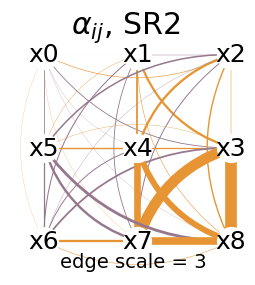

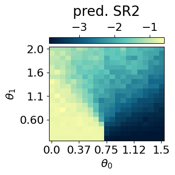

    spearman between pred and exact corr:  0.8680327
    auc:  0.9802955665024629

``` python
## with L1 reg ##
res = mySR.train(key, dataset_size=2000, L1_reg=1, print_info=False)

mySR.plot_alpha(topology=topology, edge_scale=200, name='SR2 with L1')
all_alpha_neel['SR2_L1'] = mySR.model.alpha
```

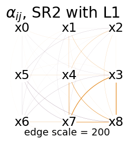

### SR3

``` python
## same but with the SR3 delta objective ##
mySR = SymbolicRegression(dataset, cluster_idx_in_neel, objective='SR3',
                                type_of_vk = 'delta',
                                idx_mu_cluster=latvar['id_lat'][0],
                                VAE_model=VAE_model,
                                VAE_params=VAE_params,
                                mu_cluster = mu0abs.transpose())
key = jax.random.PRNGKey(4352)
res = mySR.train(key)

## plot the alpha ##
mySR.plot_alpha(topology=topology, edge_scale=10, name=r'SR3$\Delta$')

## plot the prediction ##
p = mySR.compute_and_plot_prediction(name=r'SR3$\Delta$')

all_alpha_neel['SR3delta'] = mySR.model.alpha
all_prediction_fx_neel['SR3delta'] = p


## compute the spearman ##
a = p[:,:10].transpose().reshape(-1)
c = all_data['corr_exact'][:10,:].reshape(-1)
s = jnp.abs(spearman_rho(a, c))

print('spearman between pred and exact corr: ', s)


## compute the auc ##
scores = p.transpose()[:10,:].reshape(-1)
auc = auc_from_scores_labels(scores, labels_neel)

print('auc: ', 1-auc)#grad matching doesnt impose <0 or >0 in the cluster, can just set what it has learned
```

    ### Start preparing the dataset ###
    small MLP training started...
    step: 0, loss: 1.3135101195052237
    step: 200, loss: 0.02557339298028621
    step: 400, loss: 0.01930058812059929
    step: 600, loss: 0.015483271911861551
    step: 800, loss: 0.011208458239182977
    step: 1000, loss: 0.00790998208938923
    step: 1200, loss: 0.006366884336649446
    step: 1400, loss: 0.005594927228562557
    step: 1600, loss: 0.00513847305819626
    step: 1800, loss: 0.004802868143484069
    small MLP training finished!

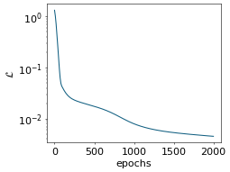

    ### Dataset prepared, start the trainnig ###
    ### Training finished ###
      message: CONVERGENCE: NORM OF PROJECTED GRADIENT <= PGTOL
      success: True
       status: 0
          fun: 4.741423295412271e-05
            x: [ 1.949e-01 -2.133e-01 ...  1.710e-01  1.932e-01]
          nit: 1
          jac: [-3.266e-06 -5.524e-07 ...  3.798e-06 -3.777e-06]
         nfev: 74
         njev: 2
     hess_inv: <36x36 LbfgsInvHessProduct with dtype=float64>

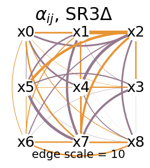

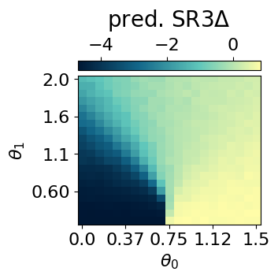

    spearman between pred and exact corr:  0.9952689
    auc:  0.9995894909688013

``` python
# with L1 reg #
res = mySR.train(key, dataset_size=2000, L1_reg=0.001, print_info=False)

mySR.plot_alpha(topology=topology, edge_scale=200, name='SR3delta with L1')
all_alpha_neel['SR3delta_L1'] = mySR.model.alpha
```

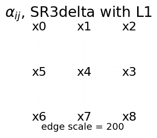

``` python
#cannot sparse the alphas, just put all toward zero -> scale the edged more to see a bit the structure
mySR.plot_alpha(topology=topology, edge_scale=2000, name='SR3delta with L1')
all_alpha_neel['SR3delta_L1'] = mySR.model.alpha
```

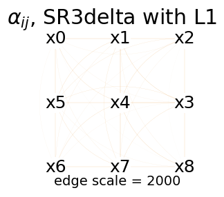

``` python
## same but with the SR3 cp objective ##
mySR = SymbolicRegression(dataset, cluster_idx_in_neel, objective='SR3',
                                type_of_vk = 'cp',
                                idx_mu_cluster=latvar['id_lat'][0],
                                VAE_model=VAE_model,
                                VAE_params=VAE_params,
                                mu_cluster = mu0abs.transpose())
key = jax.random.PRNGKey(78324)
res = mySR.train(key)

## plot the alpha ##
mySR.plot_alpha(topology=topology, edge_scale=5, name='SR3 cp')

## plot the prediction ##
p = mySR.compute_and_plot_prediction(name='SR3 cp')

all_alpha_neel['SR3cp'] = mySR.model.alpha
all_prediction_fx_neel['SR3cp'] = p


## compute the spearman ##
a = p[:,:10].transpose().reshape(-1)#.reshape(10,-1)#all_prediction_neel_SR1[:,:10,:].reshape(10,-1)
c = all_data['corr_exact'][:10,:].reshape(-1)
s = jnp.abs(spearman_rho(a, c))

print('spearman between pred and exact corr: ', s)


## compute the auc ##
scores = p.transpose()[:10,:].reshape(-1)
auc = auc_from_scores_labels(scores, labels_neel)

print('auc: ', 1-auc)
```

    ### Start preparing the dataset ###
    small MLP training started...
    step: 0, loss: 0.8108281329182488
    step: 200, loss: 0.022990639752391587
    step: 400, loss: 0.018379645545828816
    step: 600, loss: 0.013792992514905896
    step: 800, loss: 0.007126792849677581
    step: 1000, loss: 0.005054293962080803
    step: 1200, loss: 0.004554070353060676
    step: 1400, loss: 0.0041908284761713885
    step: 1600, loss: 0.003924599748744378
    step: 1800, loss: 0.0037443782009684433
    small MLP training finished!


    ### Dataset prepared, start the trainnig ###
    ### Training finished ###
      message: CONVERGENCE: NORM OF PROJECTED GRADIENT <= PGTOL
      success: True
       status: 0
          fun: 3.028903275465175e-05
            x: [ 3.691e-02  2.518e-01 ...  3.132e-01  4.880e-02]
          nit: 3
          jac: [-1.199e-07 -1.170e-06 ...  2.010e-06 -1.214e-06]
         nfev: 148
         njev: 4
     hess_inv: <36x36 LbfgsInvHessProduct with dtype=float64>

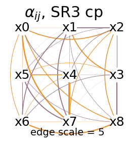

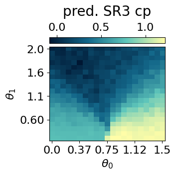

    spearman between pred and exact corr:  0.8883972
    auc:  0.0034893267651889825

``` python
# with L1 reg #
res = mySR.train(key, dataset_size=2000, L1_reg=0.001, print_info=False)

mySR.plot_alpha(topology=topology, edge_scale=200, name='SR3cp with L1')
all_alpha_neel['SR3cp_L1'] = mySR.model.alpha
```

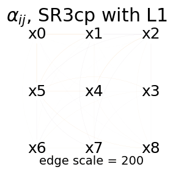

``` python
mySR.plot_alpha(topology=topology, edge_scale=2000, name='SR3cp with L1')
all_alpha_neel['SR3cp_L1'] = mySR.model.alpha
```

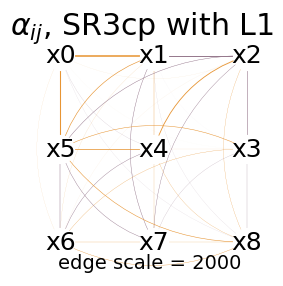

## Characterising the Striped phase

Now we can do the same by finding a symbolic function characterizing the
striped phase. Here we will see that adding an L1 regularization can
have significant impact on the structure of the optimal alpha.

``` python
threshold = 1.2
cluster_idx_in_striped = jnp.argwhere(mu0abs.transpose()>threshold)

labels_striped = jnp.zeros_like(jnp.mean(dataset.data, axis=(-1,-2)))
for id in cluster_idx_in_striped:
  labels_striped = labels_striped.at[id[0],id[1]].set(1)
labels_striped = labels_striped[10:,:].reshape(-1)

plt.rcParams['font.size'] = 16
plt.figure(figsize=(6,5),dpi=100)

plt.imshow(jnp.flipud(mu0abs>threshold), aspect='auto')
plt.colorbar()
plt.title(r'Striped phase label for SR')
plt.show()
```

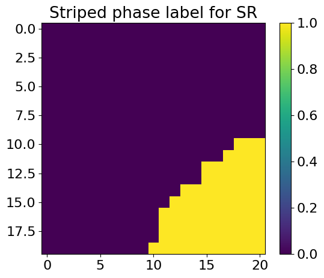

### SR1

``` python
## we then parform SR1 ##
mySR = SymbolicRegression(dataset, cluster_idx_in_striped, objective='SR1', search_space = "2_body_correlator")
key = jax.random.PRNGKey(451)
res = mySR.train(key, dataset_size=2000)

## plot the alpha ##
topology = [[0,1,2],[5,4,3],[6,7,8]]
mySR.plot_alpha(topology=topology, edge_scale=5, name='SR1')

## plot the prediction ##
p = mySR.compute_and_plot_prediction(name='SR1')
#_ = mySR.compute_and_plot_prediction(name='SR1', class_pred=True)

## containers to save the results
all_alpha_striped = {}
all_alpha_striped['SR1'] = mySR.model.alpha
all_prediction_fx_striped = {}
all_prediction_fx_striped['SR1'] = p


## compute the spearman ##
#only on the left part of the parameter space where the Neel phase is
a = p[:,10:].transpose().reshape(-1)
c = all_data['corr2_exact'][10:,:].reshape(-1)
s = jnp.abs(spearman_rho(a, c))

print('spearman between pred and exact corr: ', s)


## compute the auc ##
scores = p.transpose()[10:,:].reshape(-1)
auc = auc_from_scores_labels(scores, labels_striped)

print('auc: ', auc)
```

    ### Start preparing the dataset ###
    ### Dataset prepared, start the trainnig ###
    ### Training finished ###
      message: CONVERGENCE: NORM OF PROJECTED GRADIENT <= PGTOL
      success: True
       status: 0
          fun: 0.35385772926529285
            x: [ 2.416e-01  2.626e-01 ...  2.984e-01  5.520e-01]
          nit: 27
          jac: [ 1.138e-06 -2.831e-07 ...  1.443e-06  1.787e-06]
         nfev: 1147
         njev: 31
     hess_inv: <36x36 LbfgsInvHessProduct with dtype=float64>

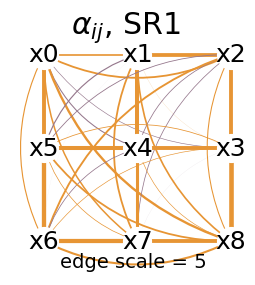

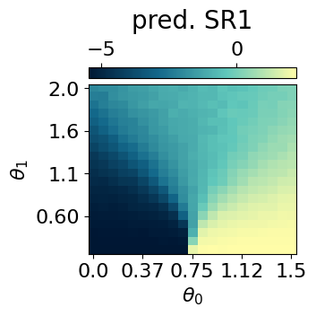

    spearman between pred and exact corr:  0.9856973
    auc:  0.9995459086368176

We see that the learned function successfully characterizes the striped
phase. However, what is coming out from the structure of the alpha is
mostly the NN interactions. NN correlations alone are not enough to
separate the striped phase from the polarized phase. Thus, the SR uses
NN links to put negative weights to the configurations coming from the
Neel phase, but also uses other (smaller) links to separate the
configurations of the striped phase from those of the polarized phase.
The fact that small links play an important role motivates the use of
the L1 regularization. It has the effect of making the structure of the
alpha sparser.

``` python
res = mySR.train(key, dataset_size=2000, L1_reg=5, print_info=False)

mySR.plot_alpha(topology=topology, edge_scale=20, name='SR1 with L1')
all_alpha_striped['SR1_L1'] = mySR.model.alpha
```

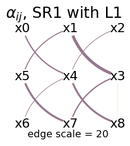

Since with the L1 regularization, it is costly to have small links, it
forces the model to find another structure. The latter, only composed of
NNN links, truly reflects the physics

### SR2

``` python
## same but with the SR2 objective ##
mySR = SymbolicRegression(dataset,
                          cluster_idx_in_striped,
                          objective='SR2',
                          idx_mu_cluster=latvar['id_lat'][0],
                          VAE_model=VAE_model,
                          VAE_params=VAE_params,
                          mu_cluster = mu0abs.transpose())

key = jax.random.PRNGKey(4352)
res = mySR.train(key)

## plot the alpha ##
topology = [[0,1,2],[5,4,3],[6,7,8]]
mySR.plot_alpha(topology=topology, edge_scale=3, name='SR2')


## plot the prediction ##
p = mySR.compute_and_plot_prediction(name='SR2')


all_alpha_striped['SR2'] = mySR.model.alpha
all_prediction_fx_striped['SR2'] = p

## compute the spearman ##
a = p[:,10:].transpose().reshape(-1)
c = all_data['corr2_exact'][10:,:].reshape(-1)
s = jnp.abs(spearman_rho(a, c))

print('spearman between pred and exact corr: ', s)

## compute the auc ##
scores = p.transpose()[10:,:].reshape(-1)
auc = auc_from_scores_labels(scores, labels_striped)

print('auc: ', auc)
```

    ### Start preparing the dataset ###
    ### Dataset prepared, start the trainnig ###
    ### Training finished ###
      message: CONVERGENCE: RELATIVE REDUCTION OF F <= FACTR*EPSMCH
      success: True
       status: 0
          fun: 6112.24118796894
            x: [ 1.597e-02 -2.176e-02 ...  4.569e-01  4.823e+00]
          nit: 142
          jac: [ 3.750e+01 -6.173e+01 ... -3.012e+01  4.504e+01]
         nfev: 5920
         njev: 160
     hess_inv: <36x36 LbfgsInvHessProduct with dtype=float64>

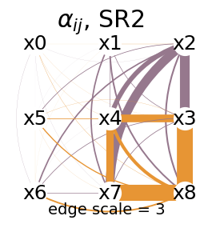

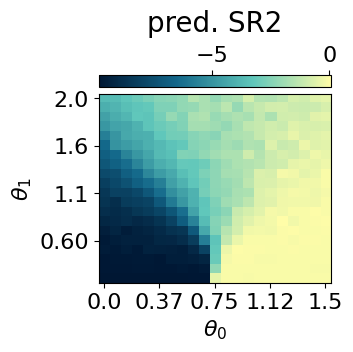

    spearman between pred and exact corr:  0.9123445
    auc:  0.9853782581055307

``` python
res = mySR.train(key, dataset_size=2000, L1_reg=5, print_info=False)

mySR.plot_alpha(topology=topology, edge_scale=2, name='SR2 with L1')
all_alpha_striped['SR2_L1'] = mySR.model.alpha
```

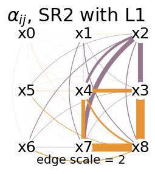

### SR3

``` python
## same but with the SR3 delta objective ##
mySR = SymbolicRegression(dataset, cluster_idx_in_striped, objective='SR3',
                                type_of_vk = 'delta',
                                idx_mu_cluster=latvar['id_lat'][0],
                                VAE_model=VAE_model,
                                VAE_params=VAE_params,
                                mu_cluster = mu0abs.transpose())
key = jax.random.PRNGKey(43)
res = mySR.train(key)

## plot the alpha ##
mySR.plot_alpha(topology=topology, edge_scale=5, name=r'SR3$\Delta$')

## plot the prediction ##
p = mySR.compute_and_plot_prediction(name=r'SR3$\Delta$')

all_alpha_striped['SR3delta'] = mySR.model.alpha
all_prediction_fx_striped['SR3delta'] = p

## compute the spearman ##
a = p[:,10:].transpose().reshape(-1)
c = all_data['corr2_exact'][10:,:].reshape(-1)
s = jnp.abs(spearman_rho(a, c))

print('spearman between pred and exact corr: ', s)

## compute the auc ##
scores = p.transpose()[10:,:].reshape(-1)
auc = auc_from_scores_labels(scores, labels_striped)

print('auc: ', 1-auc)
```

    ### Start preparing the dataset ###
    small MLP training started...
    step: 0, loss: 0.8306435624033267
    step: 200, loss: 0.022729998733001314
    step: 400, loss: 0.012853822483299545
    step: 600, loss: 0.009001298929735141
    step: 800, loss: 0.006472594732634401
    step: 1000, loss: 0.0053942774443079475
    step: 1200, loss: 0.004843800840597344
    step: 1400, loss: 0.004416942913320327
    step: 1600, loss: 0.004095027750714443
    step: 1800, loss: 0.0038483704481203193
    small MLP training finished!


    ### Dataset prepared, start the trainnig ###
    ### Training finished ###
      message: CONVERGENCE: NORM OF PROJECTED GRADIENT <= PGTOL
      success: True
       status: 0
          fun: 5.033572095590647e-05
            x: [ 1.583e-01 -3.731e-01 ... -2.044e-01  1.133e-01]
          nit: 1
          jac: [-1.883e-07 -1.702e-06 ... -1.041e-06 -6.664e-07]
         nfev: 74
         njev: 2
     hess_inv: <36x36 LbfgsInvHessProduct with dtype=float64>

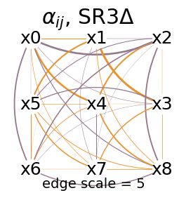

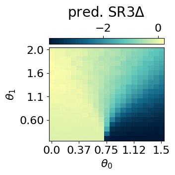

    spearman between pred and exact corr:  0.9957388
    auc:  0.9999091817273635

``` python
res = mySR.train(key, dataset_size=2000, L1_reg=0.001, print_info=False)

mySR.plot_alpha(topology=topology, edge_scale=100000, name='SR3delta with L1')
all_alpha_striped['SR3delta_L1'] = mySR.model.alpha
```

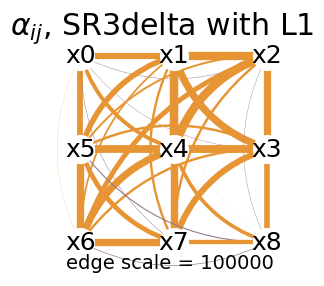

``` python
## same but with the SR3 cp objective ##
mySR = SymbolicRegression(dataset, cluster_idx_in_striped, objective='SR3',
                                type_of_vk = 'cp',
                                idx_mu_cluster=latvar['id_lat'][0],
                                VAE_model=VAE_model,
                                VAE_params=VAE_params,
                                mu_cluster = mu0abs.transpose())
key = jax.random.PRNGKey(11122)
model = mySR.train(key)

## plot the alpha ##
mySR.plot_alpha(topology=topology, edge_scale=5, name='SR3 cp')

## plot the prediction ##
p = mySR.compute_and_plot_prediction(name='SR3 cp')

all_alpha_striped['SR3cp'] = mySR.model.alpha
all_prediction_fx_striped['SR3cp'] = p

## compute the spearman ##
a = p[:,10:].transpose().reshape(-1)
c = all_data['corr2_exact'][10:,:].reshape(-1)
s = jnp.abs(spearman_rho(a, c))

print('spearman between pred and exact corr: ', s)


## compute the auc ##
scores = p.transpose()[10:,:].reshape(-1)
auc = auc_from_scores_labels(scores, labels_striped)

print('auc: ', 1-auc)
```

    ### Start preparing the dataset ###
    small MLP training started...
    step: 0, loss: 1.0204663818001058
    step: 200, loss: 0.022198006678656765
    step: 400, loss: 0.015752300675528446
    step: 600, loss: 0.008494966136517072
    step: 800, loss: 0.006575532075133302
    step: 1000, loss: 0.005692395010923643
    step: 1200, loss: 0.005104944107537137
    step: 1400, loss: 0.0046760973153922285
    step: 1600, loss: 0.004366116851316101
    step: 1800, loss: 0.00415812396293911
    small MLP training finished!

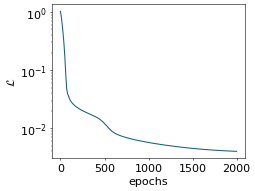

    ### Dataset prepared, start the trainnig ###
    ### Training finished ###
      message: CONVERGENCE: NORM OF PROJECTED GRADIENT <= PGTOL
      success: True
       status: 0
          fun: 3.6736764372466765e-05
            x: [ 3.881e-02 -8.508e-02 ...  4.114e-01 -4.009e-02]
          nit: 2
          jac: [-6.732e-07 -2.398e-07 ... -6.565e-07  2.584e-06]
         nfev: 111
         njev: 3
     hess_inv: <36x36 LbfgsInvHessProduct with dtype=float64>

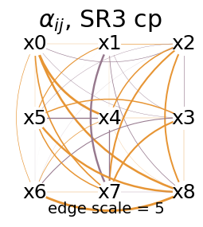

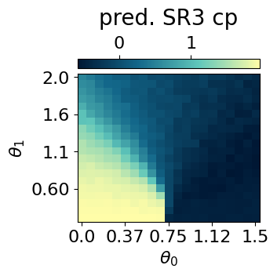

    spearman between pred and exact corr:  0.8544463
    auc:  0.9323403868858414

``` python
res = mySR.train(key, dataset_size=2000, L1_reg=0.001, print_info=False)

mySR.plot_alpha(topology=topology, edge_scale=10000, name='SR3cp with L1')
all_alpha_striped['SR3cp_L1'] = mySR.model.alpha
```

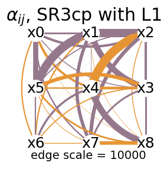

## Characterising the polarized phase

Finally, we use the symbolic method to find a function characterizing
the Polarized phase, or, equivalently, both Neel and striped phases from
the rest.

``` python
threshold = 1.2
cluster_idx_in_both = jnp.argwhere(((mu0abs<threshold)*1 + (mu0abs<0.5)*1).transpose()!=1)

labels_both = jnp.zeros_like(jnp.mean(dataset.data, axis=(-1,-2)))
for id in cluster_idx_in_both:
  labels_both = labels_both.at[id[0],id[1]].set(1)
labels_both = labels_both[:,:].reshape(-1)


plt.rcParams['font.size'] = 16
plt.figure(figsize=(6,5),dpi=100)

plt.imshow(jnp.flipud(((mu0abs<threshold)*1 + (mu0abs<0.5)*1)!=1), aspect='auto')
plt.colorbar()
plt.title(r'Need U Striped phase label for SR')
plt.show()
```

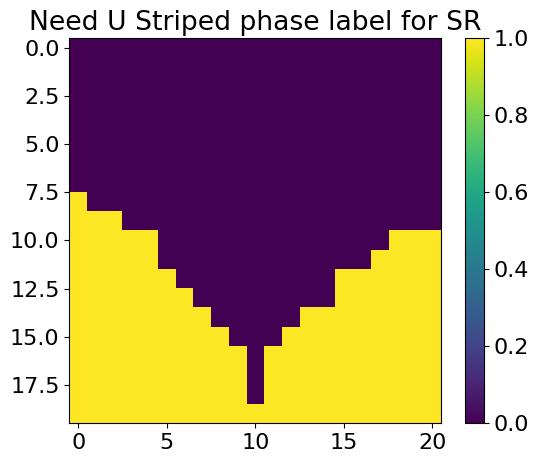

### SR1

``` python
## we then parform SR1 ##
mySR = SymbolicRegression(dataset, cluster_idx_in_both, objective='SR1', search_space = "2_body_correlator" )
key = jax.random.PRNGKey(432)
res = mySR.train(key, dataset_size=2000)

## plot the alpha ##
topology = [[0,1,2],[5,4,3],[6,7,8]]
mySR.plot_alpha(topology=topology, edge_scale=10, name='SR1')

## plot the prediction ##
p = mySR.compute_and_plot_prediction(name='SR1')

## containers to safe the results
all_alpha_both = {}
all_alpha_both['SR1'] = mySR.model.alpha
all_prediction_fx_both = {}
all_prediction_fx_both['SR1'] = p


## compute the spearman ##
#only on the left part of the parameter space where the Neel phase is
a = p[:,:].transpose().reshape(-1)
c = jnp.abs(all_data['corr2_exact'])[:,:].reshape(-1)
s = jnp.abs(spearman_rho(a, c))

print('spearman between pred and exact corr: ', s)

## compute the auc ##
scores = p.transpose().reshape(-1)
auc = auc_from_scores_labels(scores, labels_both)

print('auc: ', auc)
```

    ### Start preparing the dataset ###
    ### Dataset prepared, start the trainnig ###
    ### Training finished ###
      message: CONVERGENCE: NORM OF PROJECTED GRADIENT <= PGTOL
      success: True
       status: 0
          fun: 0.5392219078205132
            x: [ 2.660e-01  1.081e-01 ...  3.508e-01  3.615e-01]
          nit: 26
          jac: [-8.993e-07  3.497e-06 ...  2.354e-06  6.439e-07]
         nfev: 1184
         njev: 32
     hess_inv: <36x36 LbfgsInvHessProduct with dtype=float64>

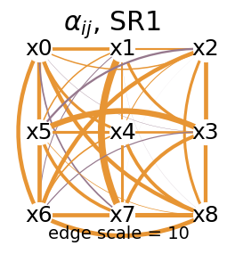

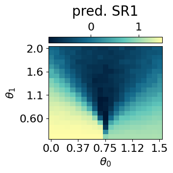

    spearman between pred and exact corr:  0.94364965
    auc:  0.9939087268279815

``` python
res = mySR.train(key, dataset_size=2000, L1_reg=5, print_info=False)

mySR.plot_alpha(topology=topology, edge_scale=100, name='SR1 with L1')
all_alpha_both['SR1_L1'] = mySR.model.alpha
```

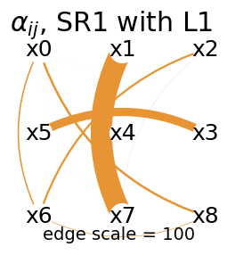

With the spins being aligned in the x direction, the polarized case
doesn’t have a clear structure in the measurement basis. Thus, the
structure of the function characterizing this phase is not very nice

### SR2

``` python
## same but with the SR2 objective ##
mySR = SymbolicRegression(dataset,
                          cluster_idx_in_both,
                          objective='SR2',
                          idx_mu_cluster=latvar['id_lat'][0],
                          VAE_model=VAE_model,
                          VAE_params=VAE_params,
                          mu_cluster = mu0abs.transpose())

key = jax.random.PRNGKey(996)
res = mySR.train(key)

## plot the alpha ##
topology = [[0,1,2],[5,4,3],[6,7,8]]
mySR.plot_alpha(topology=topology, edge_scale=3, name='SR2')


## plot the prediction ##
p = mySR.compute_and_plot_prediction(name='SR2')


all_alpha_both['SR2'] = mySR.model.alpha
all_prediction_fx_both['SR2'] = p

## compute the spearman ##
a = p[:,:].transpose().reshape(-1)
c = jnp.abs(all_data['corr2_exact'])[:,:].reshape(-1)
s = jnp.abs(spearman_rho(a, c))

print('spearman between pred and exact corr: ', s)

## compute the auc ##
scores = p.transpose().reshape(-1)
auc = auc_from_scores_labels(scores, labels_both)

print('auc: ', auc)
```

    ### Start preparing the dataset ###
    ### Dataset prepared, start the trainnig ###
    ### Training finished ###
      message: CONVERGENCE: RELATIVE REDUCTION OF F <= FACTR*EPSMCH
      success: True
       status: 0
          fun: 10732.869753169098
            x: [ 8.631e-03 -5.888e-03 ...  6.422e-02  1.905e+00]
          nit: 99
          jac: [-9.387e+02  2.210e+03 ... -1.967e+03  1.093e+02]
         nfev: 7474
         njev: 202
     hess_inv: <36x36 LbfgsInvHessProduct with dtype=float64>

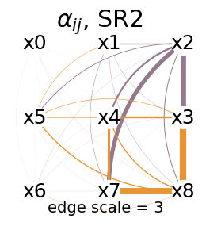

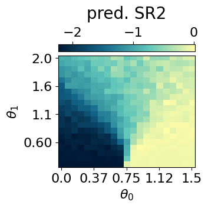

    spearman between pred and exact corr:  0.0026733226
    auc:  0.4688361831218974

``` python
res = mySR.train(key, dataset_size=2000, L1_reg=10, print_info=False)

mySR.plot_alpha(topology=topology, edge_scale=2, name='SR2 with L1')
all_alpha_both['SR2_L1'] = mySR.model.alpha
```

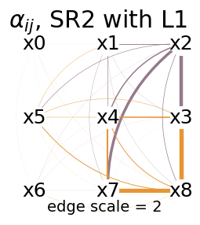

### SR3

``` python
## same but with the SR3 delta objective ##
mySR = SymbolicRegression(dataset, cluster_idx_in_both, objective='SR3',
                                type_of_vk = 'delta',
                                idx_mu_cluster=latvar['id_lat'][0],
                                VAE_model=VAE_model,
                                VAE_params=VAE_params,
                                mu_cluster = mu0abs.transpose())
key = jax.random.PRNGKey(439)
res = mySR.train(key)

## plot the alpha ##
mySR.plot_alpha(topology=topology, edge_scale=5, name=r'SR3$\Delta$')

## plot the prediction ##
p = mySR.compute_and_plot_prediction(name=r'SR3$\Delta$')

all_alpha_both['SR3delta'] = mySR.model.alpha
all_prediction_fx_both['SR3delta'] = p

## compute the spearman ##
a = p[:,:].transpose().reshape(-1)
c = jnp.abs(all_data['corr2_exact'])[:,:].reshape(-1)
s = jnp.abs(spearman_rho(a, c))

print('spearman between pred and exact corr: ', s)

## compute the auc ##
scores = p.transpose().reshape(-1)
auc = auc_from_scores_labels(scores, labels_both)

print('auc: ', 1-auc)
```

    ### Start preparing the dataset ###
    small MLP training started...
    step: 0, loss: 1.5711885593078965
    step: 200, loss: 0.029661849174511697
    step: 400, loss: 0.019414914643345688
    step: 600, loss: 0.01446558024228287
    step: 800, loss: 0.011838310234110156
    step: 1000, loss: 0.010241172457702667
    step: 1200, loss: 0.008904530822363583
    step: 1400, loss: 0.007550049233107614
    step: 1600, loss: 0.006433031709706265
    step: 1800, loss: 0.005693161142466824
    small MLP training finished!

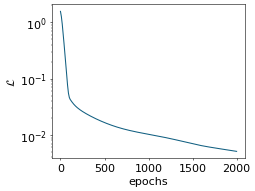

    ### Dataset prepared, start the trainnig ###
    ### Training finished ###
      message: CONVERGENCE: NORM OF PROJECTED GRADIENT <= PGTOL
      success: True
       status: 0
          fun: 2.616992265663539e-05
            x: [ 6.206e-02 -3.043e-01 ... -2.726e-01 -5.906e-03]
          nit: 2
          jac: [-1.459e-06  1.605e-08 ... -2.588e-07 -7.735e-07]
         nfev: 111
         njev: 3
     hess_inv: <36x36 LbfgsInvHessProduct with dtype=float64>

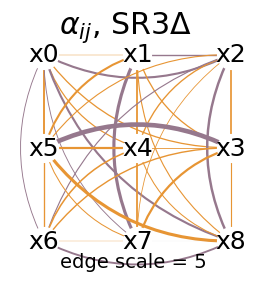

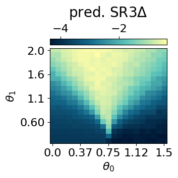

    spearman between pred and exact corr:  0.9798321
    auc:  0.9979136190316314

``` python
res = mySR.train(key, dataset_size=2000, L1_reg=0.001, print_info=False)

mySR.plot_alpha(topology=topology, edge_scale=200000, name='SR3delta with L1')
all_alpha_both['SR3delta_L1'] = mySR.model.alpha
```

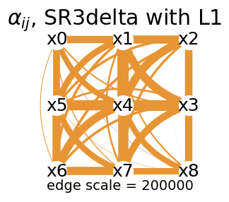

``` python
## same but with the SR3 cp objective ##
mySR = SymbolicRegression(dataset, cluster_idx_in_both, objective='SR3',
                                type_of_vk = 'cp',
                                idx_mu_cluster=latvar['id_lat'][0],
                                VAE_model=VAE_model,
                                VAE_params=VAE_params,
                                mu_cluster = mu0abs.transpose())
key = jax.random.PRNGKey(54631)
model = mySR.train(key)

## plot the alpha ##
mySR.plot_alpha(topology=topology, edge_scale=5, name='SR3 cp')

## plot the prediction ##
p = mySR.compute_and_plot_prediction(name='SR3 cp')

all_alpha_both['SR3cp'] = mySR.model.alpha
all_prediction_fx_both['SR3cp'] = p

## compute the spearman ##
a = p[:,:].transpose().reshape(-1)
c = jnp.abs(all_data['corr2_exact'])[:,:].reshape(-1)
s = jnp.abs(spearman_rho(a, c))

print('spearman between pred and exact corr: ', s)

## compute the auc ##
scores = p.transpose().reshape(-1)
auc = auc_from_scores_labels(scores, labels_both)

print('auc: ', auc)
```

    ### Start preparing the dataset ###
    small MLP training started...
    step: 0, loss: 0.8257745814735783
    step: 200, loss: 0.01860260827326228
    step: 400, loss: 0.011823513169308493
    step: 600, loss: 0.007060975685731395
    step: 800, loss: 0.00489831556162105
    step: 1000, loss: 0.004153469428332058
    step: 1200, loss: 0.0037614909812640936
    step: 1400, loss: 0.0035468095783897195
    step: 1600, loss: 0.0034031894757354936
    step: 1800, loss: 0.0032945502351812675
    small MLP training finished!

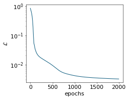

    ### Dataset prepared, start the trainnig ###
    ### Training finished ###
      message: CONVERGENCE: NORM OF PROJECTED GRADIENT <= PGTOL
      success: True
       status: 0
          fun: 2.5508192516536702e-05
            x: [ 9.475e-03  1.658e-01 ...  5.183e-01  1.482e-01]
          nit: 1
          jac: [-5.482e-07  8.301e-07 ...  5.014e-06 -3.561e-06]
         nfev: 74
         njev: 2
     hess_inv: <36x36 LbfgsInvHessProduct with dtype=float64>

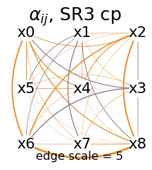

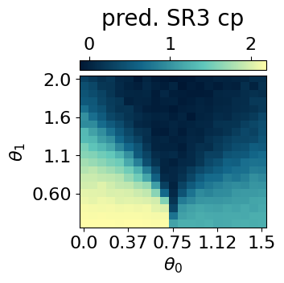

    spearman between pred and exact corr:  0.9045025
    auc:  0.9791841530971965

``` python
res = mySR.train(key, dataset_size=2000, L1_reg=0.001, print_info=False)

mySR.plot_alpha(topology=topology, edge_scale=20000, name='SR3cp with L1')
all_alpha_both['SR3cp_L1'] = mySR.model.alpha
```

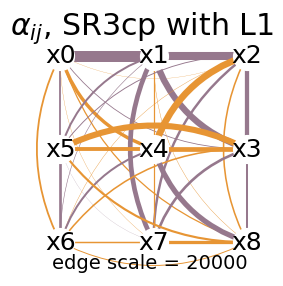

``` python
## also add the data and the exact corr ##

all_data['alpha_neel'] = all_alpha_neel
all_data['prediction_fx_neel'] = all_prediction_fx_neel
all_data['alpha_striped'] = all_alpha_striped
all_data['prediction_fx_striped'] = all_prediction_fx_striped
all_data['alpha_both'] = all_alpha_both
all_data['prediction_fx_both'] = all_prediction_fx_both
```

``` python
## plus some other values needed for some plots
mySR = SymbolicRegression(dataset, cluster_idx_in_neel, objective='SR3',
                                type_of_vk = 'delta',
                                idx_mu_cluster=latvar['id_lat'][0],
                                VAE_model=VAE_model,
                                VAE_params=VAE_params,
                                mu_cluster = mu0abs.transpose())
key = jax.random.PRNGKey(89)
G = mySR.get_grad_mu_wrt_theta_SR3(key, cluster_idx_in_neel)
all_data['grad_mu1_neel_boundaries'] = G
```

    small MLP training started...
    step: 0, loss: 0.9165100857669783
    step: 200, loss: 0.023040097177329327
    step: 400, loss: 0.018953575042534948
    step: 600, loss: 0.014705703456012941
    step: 800, loss: 0.009733298547767298
    step: 1000, loss: 0.006713810330803795
    step: 1200, loss: 0.005106953388377555
    step: 1400, loss: 0.0045086195023626464
    step: 1600, loss: 0.0041721548633482375
    step: 1800, loss: 0.0039043747535851977
    small MLP training finished!

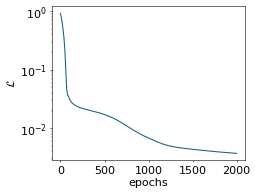

``` python
with open('J1J2_data_cpVAE2_QDisc.pkl', 'wb') as f:
    pickle.dump(all_data, f)
```

## Challenging the robustness of SR1

We will now test the robustness of SR1 with respect to changes in the
labels definition. We will then observe the effect on the structure of
the learned expression, as well as on the various performance metrics.  
Both with and without a L1 regularization will be considered.

``` python
## 'True' labels used above ##
mu0abs = latvar['mu0_abs']
threshold = 0.5
cluster_idx_in_neel = jnp.argwhere(mu0abs.transpose()<threshold)

labels_neel = jnp.zeros_like(jnp.mean(dataset.data, axis=(-1,-2)))
for id in cluster_idx_in_neel:
  labels_neel = labels_neel.at[id[0],id[1]].set(1)
labels_neel = labels_neel[:10,:].reshape(-1)

plt.rcParams['font.size'] = 14
plt.figure(figsize=(4,3),dpi=100)

plt.imshow(jnp.flipud(mu0abs<threshold), aspect='auto')
plt.colorbar()
plt.title(r'True Neel phase label')
plt.yticks([0,10,19], ['2', '1', '0.1'])
plt.xticks([0, 10, 20], ['0', '0.75', '1.5'])
plt.ylabel(r'$h$')
plt.xlabel(r'$J_2$')
plt.show()


label_neel_noise1 = jnp.zeros((dataset.data.shape[1], dataset.data.shape[0]))
label_neel_noise2 = jnp.zeros_like(label_neel_noise1)
label_neel_noise3 = jnp.zeros_like(label_neel_noise1)


for i in range(label_neel_noise1.shape[0]):
    for j in range(label_neel_noise1.shape[1]):
        if i + 1.2*j < 8:
            label_neel_noise1 = label_neel_noise1.at[i,j].set(1)
        if i + 1.4*j < 20 and j<13:
            label_neel_noise2 = label_neel_noise2.at[i,j].set(1)
        if j<4:
            label_neel_noise3 = label_neel_noise3.at[i,j].set(1)


all_noise_label = [label_neel_noise1.T, label_neel_noise2.T, label_neel_noise3.T]

for i,l in enumerate(all_noise_label):

        plt.rcParams['font.size'] = 14
        plt.figure(figsize=(4,3),dpi=100)
        
        plt.imshow(jnp.rot90(l), aspect='auto')
        plt.colorbar()
        plt.title(r'Noisy Neel phase label ({})'.format(i+1))
        plt.yticks([0,10,19], ['2', '1', '0.1'])
        plt.xticks([0, 10, 20], ['0', '0.75', '1.5'])
        plt.ylabel(r'$h$')
        plt.xlabel(r'$J_2$')
        plt.show()
```

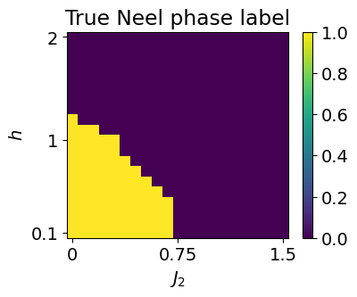

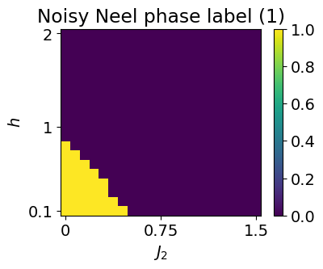

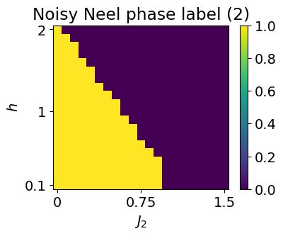

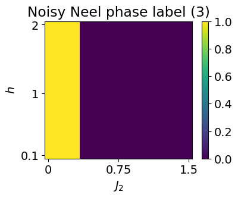

### without L1

``` python
topology = [[0,1,2],[5,4,3],[6,7,8]]

key = jax.random.PRNGKey(534)

all_spearman_SR1 = []
all_auc_SR1 = []
all_alpha_SR1 = []
example_labels = []
example_pred = []
all_percentage_in_in_in_label = []
all_percentage_in_in_out_label = []
all_percentage_out_in_in_label = []
all_percentage_out_in_out_label = []


for label in all_noise_label:
    all_s = []
    all_auc = []
    all_alpha = []
    percentage_in_in_in_label = []
    percentage_in_in_out_label = []
    percentage_out_in_in_label = []
    percentage_out_in_out_label = []
    l1 = 0
    for i in range(10):
                  
        cluster_idx_in_neel_noisy = jnp.argwhere(label==1)
        
        if i == 0:

            example_labels.append(label)
            
            plt.rcParams['font.size'] = 16
            plt.figure(figsize=(4,3),dpi=80)
            
            plt.imshow(jnp.rot90(label), aspect='auto')
            plt.colorbar()
            plt.title('Neel phase label for SR')
            plt.yticks([0,10,19], ['2', '1', '0.1'])
            plt.xticks([0, 10, 20], ['0', '0.75', '1.5'])
            plt.ylabel(r'$h$')
            plt.xlabel(r'$J_2$')
            plt.show()
        
    
        ## perform SR1 on the neel phase ##
    
        mySR = SymbolicRegression(dataset, cluster_idx_in_neel_noisy, objective='SR1', search_space = "2_body_correlator")
        key, subkey = jax.random.split(key)
        res = mySR.train(subkey, dataset_size=2000, print_info = False)
    
        all_alpha.append(mySR.model.alpha)
        if i == 0:
            mySR.plot_alpha(topology=topology, edge_scale=5, name='SR1')
        
        if i == 0:
            p = mySR.compute_and_plot_prediction(name='SR1')
            _ = mySR.compute_and_plot_prediction(name='SR1', class_pred=True)
            example_pred.append(p)
        else:
            p = mySR.compute_prediction()
        a = p[:,:10].transpose().reshape(-1)
        s = jnp.abs(spearman_rho(a, c))
        
        all_s.append(s)
        
        scores = p.transpose()[:10,:].reshape(-1)
        auc = auc_from_scores_labels(scores, labels_neel)

        if auc < 0.5:
            auc = 1 - auc
        
        all_auc.append(auc)
      

        parameter_space_shape = [len(dataset.thetas[i]) for i in range(len(dataset.thetas))]
        grid = jnp.indices(parameter_space_shape)      # (k, ...)
        grid = grid.reshape(len(parameter_space_shape), -1).T  # (N, k)
        equal = jnp.all(grid[:, None, :] == cluster_idx_in_neel[None, :, :], axis=-1)
        in_cluster = jnp.any(equal, axis=1)
        cluster_idx_out_neel = grid[~in_cluster]

        cluster_idx_out_neel_noisy = mySR.cluster_idx_out

        in_in_in_label = sum([(jnp.sum(jnp.array([idx == o for o in cluster_idx_in_neel]), axis=-1) == 2).any() for idx in cluster_idx_in_neel_noisy])/jnp.shape(cluster_idx_in_neel_noisy)[0]
        percentage_in_in_in_label.append(in_in_in_label)

        in_in_out_label = sum([(jnp.sum(jnp.array([idx == o for o in cluster_idx_out_neel]), axis=-1) == 2).any() for idx in cluster_idx_in_neel_noisy])/jnp.shape(cluster_idx_in_neel_noisy)[0]
        percentage_in_in_out_label.append(in_in_out_label)
     
        out_in_in_label = sum([(jnp.sum(jnp.array([idx == o for o in cluster_idx_in_neel]), axis=-1) == 2).any() for idx in cluster_idx_out_neel_noisy])/jnp.shape(cluster_idx_out_neel_noisy)[0]
        percentage_out_in_in_label.append(out_in_in_label)

        out_in_out_label = sum([(jnp.sum(jnp.array([idx == o for o in cluster_idx_out_neel]), axis=-1) == 2).any() for idx in cluster_idx_out_neel_noisy])/jnp.shape(cluster_idx_out_neel_noisy)[0]
        percentage_out_in_out_label.append(out_in_out_label)
        
        print('In in in: {:.2f}%, in in out: {:.2f}%, out in in: {:.2f}%, out in out: {:.2f}%, s={:.4f}, auc={:.4f}, final loss = {:.3}'.format(in_in_in_label*100, in_in_out_label*100, out_in_in_label*100, out_in_out_label*100, s,auc, res[1]['fun']))

    all_spearman_SR1.append(all_s)
    all_alpha_SR1.append(all_alpha)
    all_auc_SR1.append(all_auc)
    all_percentage_in_in_in_label.append(percentage_in_in_in_label)
    all_percentage_in_in_out_label.append(percentage_in_in_out_label)
    all_percentage_out_in_in_label.append(percentage_out_in_in_label)
    all_percentage_out_in_out_label.append(percentage_out_in_out_label)


all_data_robustness_SR1 = {}
all_data_robustness_SR1['spearman'] = all_spearman_SR1
all_data_robustness_SR1['alpha'] = all_alpha_SR1
all_data_robustness_SR1['auc'] = all_auc_SR1
all_data_robustness_SR1['in_in_in'] = all_percentage_in_in_in_label
all_data_robustness_SR1['out_in_out'] = all_percentage_out_in_out_label
all_data_robustness_SR1['example_label'] = example_labels
all_data_robustness_SR1['example_pred'] = example_pred
```


    In in in: 100.00%, in in out: 0.00%, out in in: 13.18%, out in out: 86.82%, s=0.9688, auc=0.9991, final loss = 0.377
    In in in: 100.00%, in in out: 0.00%, out in in: 13.18%, out in out: 86.82%, s=0.9693, auc=0.9991, final loss = 0.373
    In in in: 100.00%, in in out: 0.00%, out in in: 13.18%, out in out: 86.82%, s=0.9681, auc=0.9987, final loss = 0.369
    In in in: 100.00%, in in out: 0.00%, out in in: 13.18%, out in out: 86.82%, s=0.9691, auc=0.9993, final loss = 0.378
    In in in: 100.00%, in in out: 0.00%, out in in: 13.18%, out in out: 86.82%, s=0.9682, auc=0.9992, final loss = 0.373
    In in in: 100.00%, in in out: 0.00%, out in in: 13.18%, out in out: 86.82%, s=0.9695, auc=0.9991, final loss = 0.379
    In in in: 100.00%, in in out: 0.00%, out in in: 13.18%, out in out: 86.82%, s=0.9684, auc=0.9991, final loss = 0.38
    In in in: 100.00%, in in out: 0.00%, out in in: 13.18%, out in out: 86.82%, s=0.9684, auc=0.9993, final loss = 0.374
    In in in: 100.00%, in in out: 0.00%, out in in: 13.18%, out in out: 86.82%, s=0.9680, auc=0.9991, final loss = 0.354
    In in in: 100.00%, in in out: 0.00%, out in in: 13.18%, out in out: 86.82%, s=0.9703, auc=0.9993, final loss = 0.359


    In in in: 53.85%, in in out: 46.15%, out in in: 0.00%, out in out: 100.00%, s=0.9912, auc=0.9997, final loss = 0.423
    In in in: 53.85%, in in out: 46.15%, out in in: 0.00%, out in out: 100.00%, s=0.9893, auc=0.9998, final loss = 0.419
    In in in: 53.85%, in in out: 46.15%, out in in: 0.00%, out in out: 100.00%, s=0.9897, auc=0.9997, final loss = 0.43
    In in in: 53.85%, in in out: 46.15%, out in in: 0.00%, out in out: 100.00%, s=0.9901, auc=0.9997, final loss = 0.427
    In in in: 53.85%, in in out: 46.15%, out in in: 0.00%, out in out: 100.00%, s=0.9889, auc=0.9997, final loss = 0.426
    In in in: 53.85%, in in out: 46.15%, out in in: 0.00%, out in out: 100.00%, s=0.9900, auc=0.9997, final loss = 0.429
    In in in: 53.85%, in in out: 46.15%, out in in: 0.00%, out in out: 100.00%, s=0.9899, auc=0.9997, final loss = 0.424
    In in in: 53.85%, in in out: 46.15%, out in in: 0.00%, out in out: 100.00%, s=0.9909, auc=0.9997, final loss = 0.415
    In in in: 53.85%, in in out: 46.15%, out in in: 0.00%, out in out: 100.00%, s=0.9895, auc=0.9998, final loss = 0.422
    In in in: 53.85%, in in out: 46.15%, out in in: 0.00%, out in out: 100.00%, s=0.9888, auc=0.9997, final loss = 0.421


    In in in: 54.00%, in in out: 46.00%, out in in: 9.38%, out in out: 90.62%, s=0.9800, auc=0.9992, final loss = 0.44
    In in in: 54.00%, in in out: 46.00%, out in in: 9.38%, out in out: 90.62%, s=0.9814, auc=0.9994, final loss = 0.446
    In in in: 54.00%, in in out: 46.00%, out in in: 9.38%, out in out: 90.62%, s=0.9807, auc=0.9994, final loss = 0.449
    In in in: 54.00%, in in out: 46.00%, out in in: 9.38%, out in out: 90.62%, s=0.9796, auc=0.9992, final loss = 0.456
    In in in: 54.00%, in in out: 46.00%, out in in: 9.38%, out in out: 90.62%, s=0.9787, auc=0.9991, final loss = 0.445
    In in in: 54.00%, in in out: 46.00%, out in in: 9.38%, out in out: 90.62%, s=0.9803, auc=0.9992, final loss = 0.453
    In in in: 54.00%, in in out: 46.00%, out in in: 9.38%, out in out: 90.62%, s=0.9810, auc=0.9993, final loss = 0.467
    In in in: 54.00%, in in out: 46.00%, out in in: 9.38%, out in out: 90.62%, s=0.9793, auc=0.9992, final loss = 0.453
    In in in: 54.00%, in in out: 46.00%, out in in: 9.38%, out in out: 90.62%, s=0.9803, auc=0.9992, final loss = 0.455
    In in in: 54.00%, in in out: 46.00%, out in in: 9.38%, out in out: 90.62%, s=0.9823, auc=0.9993, final loss = 0.444

``` python
all_spearman_SR1 = jnp.array(all_data_robustness_SR1['spearman'])
all_auc_SR1 = jnp.array(all_data_robustness_SR1['auc'])
all_percentage_in_in_in_label = jnp.array(all_data_robustness_SR1['in_in_in'])
all_percentage_out_in_out_label = jnp.array(all_data_robustness_SR1['out_in_out'])


print('all percentage noisy in labels:')
for (m,s) in zip(jnp.mean(all_percentage_in_in_in_label, axis=-1), jnp.std(all_percentage_in_in_in_label, axis=-1)):
    print(str(m) + ' +/- ' + str(s))

print('\n')

print('all percentage noisy out labels:')
for (m,s) in zip(jnp.mean(all_percentage_out_in_out_label, axis=-1), jnp.std(all_percentage_out_in_out_label, axis=-1)):
    print(str(m) + ' +/- ' + str(s))

print('\n')

print('all spearman measures:')
for (m,s) in zip(jnp.mean(all_spearman_SR1, axis=-1), jnp.std(all_spearman_SR1, axis=-1)):
    print(str(m) + ' +/- ' + str(s))

print('\n')

print('all auc measures:')
for (m,s) in zip(jnp.mean(all_auc_SR1, axis=-1), jnp.std(all_auc_SR1, axis=-1)):
    print(str(m) + ' +/- ' + str(s))
```

    all percentage noisy in labels:
    1.0 +/- 0.0
    0.5384615384615384 +/- 0.0
    0.54 +/- 0.0


    all percentage noisy out labels:
    0.8682170542635659 +/- 0.0
    1.0 +/- 0.0
    0.90625 +/- 0.0


    all spearman measures:
    0.9688202 +/- 0.0006923764
    0.9898391 +/- 0.0007568837
    0.9803551 +/- 0.000980462


    all auc measures:
    0.9991071428571425 +/- 0.00017203463274056898
    0.9997126436781607 +/- 4.105090311989912e-05
    0.9992302955665023 +/- 9.4617656581399e-05

In terms of performance, we see that SR1 is extremely robust. In terms
of interpretability, the structure of the two body weights starts to
have small links trying to compensate the mislabelization. We will now
investigate whether adding an L1 regularisation would help maintain a
good structure for longer and how it affects the performance.

### with L1

``` python
topology = [[0,1,2],[5,4,3],[6,7,8]]

key = jax.random.PRNGKey(534)

all_spearman_SR1 = []
all_auc_SR1 = []
all_alpha_SR1 = []
example_labels = []
example_pred = []
all_percentage_in_in_in_label = []
all_percentage_in_in_out_label = []
all_percentage_out_in_in_label = []
all_percentage_out_in_out_label = []


all_l1 = [2, 2, 2, 2]

for j, label in enumerate(all_noise_label):
    all_s = []
    all_auc = []
    all_alpha = []
    percentage_in_in_in_label = []
    percentage_in_in_out_label = []
    percentage_out_in_in_label = []
    percentage_out_in_out_label = []
    l1 = all_l1[j]
    for i in range(10):
                  
        cluster_idx_in_neel_noisy = jnp.argwhere(label==1)
        
        if i == 0:

            example_labels.append(label)
            
            plt.rcParams['font.size'] = 16
            plt.figure(figsize=(4,3),dpi=80)
            
            plt.imshow(jnp.rot90(label), aspect='auto')
            plt.colorbar()
            plt.title('Neel phase label for SR')
            plt.yticks([0,10,19], ['2', '1', '0.1'])
            plt.xticks([0, 10, 20], ['0', '0.75', '1.5'])
            plt.ylabel(r'$h$')
            plt.xlabel(r'$J_2$')
            plt.show()
        
    
        ## perform SR1 on the neel phase ##
    
        mySR = SymbolicRegression(dataset, cluster_idx_in_neel_noisy, objective='SR1', search_space = "2_body_correlator")
        key, subkey = jax.random.split(key)
        res = mySR.train(subkey, dataset_size=2000, print_info = False, L1_reg = l1)
    
        all_alpha.append(mySR.model.alpha)
        if i == 0:
            mySR.plot_alpha(topology=topology, edge_scale=40, name='SR1')
        
        if i == 0:
            p = mySR.compute_and_plot_prediction(name='SR1')
            _ = mySR.compute_and_plot_prediction(name='SR1', class_pred=True)
            example_pred.append(p)
        else:
            p = mySR.compute_prediction()
        a = p[:,:10].transpose().reshape(-1)
        s = jnp.abs(spearman_rho(a, c))
        
        all_s.append(s)
        
        scores = p.transpose()[:10,:].reshape(-1)
        auc = auc_from_scores_labels(scores, labels_neel)

        if auc < 0.5:
            auc = 1 - auc
        
        all_auc.append(auc)
      

        parameter_space_shape = [len(dataset.thetas[i]) for i in range(len(dataset.thetas))]
        grid = jnp.indices(parameter_space_shape)      # (k, ...)
        grid = grid.reshape(len(parameter_space_shape), -1).T  # (N, k)
        equal = jnp.all(grid[:, None, :] == cluster_idx_in_neel[None, :, :], axis=-1)
        in_cluster = jnp.any(equal, axis=1)
        cluster_idx_out_neel = grid[~in_cluster]

        cluster_idx_out_neel_noisy = mySR.cluster_idx_out

        in_in_in_label = sum([(jnp.sum(jnp.array([idx == o for o in cluster_idx_in_neel]), axis=-1) == 2).any() for idx in cluster_idx_in_neel_noisy])/jnp.shape(cluster_idx_in_neel_noisy)[0]
        percentage_in_in_in_label.append(in_in_in_label)

        in_in_out_label = sum([(jnp.sum(jnp.array([idx == o for o in cluster_idx_out_neel]), axis=-1) == 2).any() for idx in cluster_idx_in_neel_noisy])/jnp.shape(cluster_idx_in_neel_noisy)[0]
        percentage_in_in_out_label.append(in_in_out_label)
     
        out_in_in_label = sum([(jnp.sum(jnp.array([idx == o for o in cluster_idx_in_neel]), axis=-1) == 2).any() for idx in cluster_idx_out_neel_noisy])/jnp.shape(cluster_idx_out_neel_noisy)[0]
        percentage_out_in_in_label.append(out_in_in_label)

        out_in_out_label = sum([(jnp.sum(jnp.array([idx == o for o in cluster_idx_out_neel]), axis=-1) == 2).any() for idx in cluster_idx_out_neel_noisy])/jnp.shape(cluster_idx_out_neel_noisy)[0]
        percentage_out_in_out_label.append(out_in_out_label)
        
        print('In in in: {:.2f}%, in in out: {:.2f}%, out in in: {:.2f}%, out in out: {:.2f}%, s={:.4f}, auc={:.4f}, final loss = {:.3}'.format(in_in_in_label*100, in_in_out_label*100, out_in_in_label*100, out_in_out_label*100, s,auc, res[1]['fun']))

    all_spearman_SR1.append(all_s)
    all_alpha_SR1.append(all_alpha)
    all_auc_SR1.append(all_auc)
    all_percentage_in_in_in_label.append(percentage_in_in_in_label)
    all_percentage_in_in_out_label.append(percentage_in_in_out_label)
    all_percentage_out_in_in_label.append(percentage_out_in_in_label)
    all_percentage_out_in_out_label.append(percentage_out_in_out_label)


all_data_robustness_SR1_l1 = {}
all_data_robustness_SR1_l1['spearman'] = all_spearman_SR1
all_data_robustness_SR1_l1['alpha'] = all_alpha_SR1
all_data_robustness_SR1_l1['auc'] = all_auc_SR1
all_data_robustness_SR1_l1['in_in_in'] = all_percentage_in_in_in_label
all_data_robustness_SR1_l1['out_in_out'] = all_percentage_out_in_out_label
all_data_robustness_SR1_l1['example_label'] = example_labels
all_data_robustness_SR1_l1['example_pred'] = example_pred
```


    In in in: 100.00%, in in out: 0.00%, out in in: 13.18%, out in out: 86.82%, s=0.9898, auc=0.9996, final loss = 0.551
    In in in: 100.00%, in in out: 0.00%, out in in: 13.18%, out in out: 86.82%, s=0.9895, auc=0.9996, final loss = 0.548
    In in in: 100.00%, in in out: 0.00%, out in in: 13.18%, out in out: 86.82%, s=0.9896, auc=0.9996, final loss = 0.55
    In in in: 100.00%, in in out: 0.00%, out in in: 13.18%, out in out: 86.82%, s=0.9892, auc=0.9996, final loss = 0.552
    In in in: 100.00%, in in out: 0.00%, out in in: 13.18%, out in out: 86.82%, s=0.9897, auc=0.9996, final loss = 0.549
    In in in: 100.00%, in in out: 0.00%, out in in: 13.18%, out in out: 86.82%, s=0.9894, auc=0.9996, final loss = 0.548
    In in in: 100.00%, in in out: 0.00%, out in in: 13.18%, out in out: 86.82%, s=0.9892, auc=0.9996, final loss = 0.548
    In in in: 100.00%, in in out: 0.00%, out in in: 13.18%, out in out: 86.82%, s=0.9896, auc=0.9996, final loss = 0.549
    In in in: 100.00%, in in out: 0.00%, out in in: 13.18%, out in out: 86.82%, s=0.9896, auc=0.9996, final loss = 0.54
    In in in: 100.00%, in in out: 0.00%, out in in: 13.18%, out in out: 86.82%, s=0.9898, auc=0.9996, final loss = 0.537


    In in in: 53.85%, in in out: 46.15%, out in in: 0.00%, out in out: 100.00%, s=0.9895, auc=0.9996, final loss = 0.551
    In in in: 53.85%, in in out: 46.15%, out in in: 0.00%, out in out: 100.00%, s=0.9894, auc=0.9996, final loss = 0.552
    In in in: 53.85%, in in out: 46.15%, out in in: 0.00%, out in out: 100.00%, s=0.9901, auc=0.9996, final loss = 0.56
    In in in: 53.85%, in in out: 46.15%, out in in: 0.00%, out in out: 100.00%, s=0.9896, auc=0.9996, final loss = 0.554
    In in in: 53.85%, in in out: 46.15%, out in in: 0.00%, out in out: 100.00%, s=0.9896, auc=0.9996, final loss = 0.559
    In in in: 53.85%, in in out: 46.15%, out in in: 0.00%, out in out: 100.00%, s=0.9897, auc=0.9996, final loss = 0.556
    In in in: 53.85%, in in out: 46.15%, out in in: 0.00%, out in out: 100.00%, s=0.9895, auc=0.9996, final loss = 0.557
    In in in: 53.85%, in in out: 46.15%, out in in: 0.00%, out in out: 100.00%, s=0.9894, auc=0.9996, final loss = 0.548
    In in in: 53.85%, in in out: 46.15%, out in in: 0.00%, out in out: 100.00%, s=0.9897, auc=0.9996, final loss = 0.553
    In in in: 53.85%, in in out: 46.15%, out in in: 0.00%, out in out: 100.00%, s=0.9897, auc=0.9996, final loss = 0.553


    In in in: 54.00%, in in out: 46.00%, out in in: 9.38%, out in out: 90.62%, s=0.9897, auc=0.9995, final loss = 0.571
    In in in: 54.00%, in in out: 46.00%, out in in: 9.38%, out in out: 90.62%, s=0.9896, auc=0.9996, final loss = 0.572
    In in in: 54.00%, in in out: 46.00%, out in in: 9.38%, out in out: 90.62%, s=0.9895, auc=0.9996, final loss = 0.576
    In in in: 54.00%, in in out: 46.00%, out in in: 9.38%, out in out: 90.62%, s=0.9893, auc=0.9996, final loss = 0.582
    In in in: 54.00%, in in out: 46.00%, out in in: 9.38%, out in out: 90.62%, s=0.9898, auc=0.9996, final loss = 0.573
    In in in: 54.00%, in in out: 46.00%, out in in: 9.38%, out in out: 90.62%, s=0.9896, auc=0.9996, final loss = 0.577
    In in in: 54.00%, in in out: 46.00%, out in in: 9.38%, out in out: 90.62%, s=0.9894, auc=0.9995, final loss = 0.585
    In in in: 54.00%, in in out: 46.00%, out in in: 9.38%, out in out: 90.62%, s=0.9894, auc=0.9997, final loss = 0.576
    In in in: 54.00%, in in out: 46.00%, out in in: 9.38%, out in out: 90.62%, s=0.9893, auc=0.9996, final loss = 0.581
    In in in: 54.00%, in in out: 46.00%, out in in: 9.38%, out in out: 90.62%, s=0.9896, auc=0.9996, final loss = 0.57

``` python
all_spearman_SR1 = jnp.array(all_data_robustness_SR1_l1['spearman'])
all_auc_SR1 = jnp.array(all_data_robustness_SR1_l1['auc'])
all_percentage_in_in_in_label = jnp.array(all_data_robustness_SR1_l1['in_in_in'])
all_percentage_out_in_out_label = jnp.array(all_data_robustness_SR1_l1['out_in_out'])


print('all percentage noisy in labels:')
for (m,s) in zip(jnp.mean(all_percentage_in_in_in_label, axis=-1), jnp.std(all_percentage_in_in_in_label, axis=-1)):
    print(str(m) + ' +/- ' + str(s))

print('\n')

print('all percentage noisy out labels:')
for (m,s) in zip(jnp.mean(all_percentage_out_in_out_label, axis=-1), jnp.std(all_percentage_out_in_out_label, axis=-1)):
    print(str(m) + ' +/- ' + str(s))

print('\n')

print('all spearman measures:')
for (m,s) in zip(jnp.mean(all_spearman_SR1, axis=-1), jnp.std(all_spearman_SR1, axis=-1)):
    print(str(m) + ' +/- ' + str(s))

print('\n')

print('all auc measures:')
for (m,s) in zip(jnp.mean(all_auc_SR1, axis=-1), jnp.std(all_auc_SR1, axis=-1)):
    print(str(m) + ' +/- ' + str(s))
```

    all percentage noisy in labels:
    1.0 +/- 0.0
    0.5384615384615384 +/- 0.0
    0.54 +/- 0.0


    all percentage noisy out labels:
    0.8682170542635659 +/- 0.0
    1.0 +/- 0.0
    0.90625 +/- 0.0


    all spearman measures:
    0.9895446 +/- 0.00019946064
    0.9896019 +/- 0.00018373126
    0.98951226 +/- 0.00015033506


    all auc measures:
    0.9995894909688012 +/- 1.1102230246251565e-16
    0.9995894909688012 +/- 1.1102230246251565e-16
    0.9995792282430213 +/- 5.52664696955324e-05

We see that incorporating L1 regularization further enhances both
performance and stability. The structure of the learned two-body
coefficients remains largely intact. Even with a poor labelization, SR1
with the L1 regularization is able to learn structures matching the NNN
correlator. In addition, the predicted function f(x) consistently
highlights the Néel phase across all noise levels considered,
underscoring the robustness of the SR1 approach.

``` python
## saving the data :) ##

all_data['robustness_SR1'] = all_data_robustness_SR1
all_data['robustness_SR1_l1'] = all_data_robustness_SR1_l1

with open('J1J2_data_cpVAE2_QDisc.pkl', 'wb') as f:
    pickle.dump(all_data, f)
```

## Genetic search

To benchmark the symbolic regression methods under controlled and
comparable conditions, we have restricted the search to the 2-body
correlator Ansatz thereby limiting the exploration to a class of
functions consistent with prior knowledge.

However, some prior knowledge may not always be available. In such
cases, genetic-algorithm-based approaches enable the exploration of vast
spaces of mathematical expressions by combining a defined set of
elementary operations (e.g., +, -, \*, exp(), sin(), …) up to a
prescribed level of complexity. To do so, `qdisc` calls `PySR`. Further
details can be found on [GitHub](https://github.com/MilesCranmer/PySR)
or [arXiv](https://arxiv.org/abs/2305.01582).

We will now examine the performance of the genetic search when looking
at the symbolic expression that classifies the Néel configurations.

### search

``` python
## we perform SR1 on the neel phase using the "genetic" search space ##

mySR = SymbolicRegression(dataset, cluster_idx_in_neel, objective='SR1', search_space = "genetic")
key = jax.random.PRNGKey(3246)
res = mySR.train(key, 
                 dataset_size=2000, 
                 random_state = 2575,     # seed for reproductibility
                 niterations = 200,       # Number of iterations to search
                 binary_operators = ["+", "*", "/", "-"], #Allowed binary operations
                 unary_operators = ["exp", "log", "sin", "cos", "tanh"], #Other allowed operations
                 maxsize = 30,            # max complexity of the equations
                 progress = True,         # Show progress during training
                 extra_sympy_mappings = {"C": "C"}, # Allow PySR to use constants
                 batching = True, #batching, usually big dataset
                 batch_size = 500)
```

    Detected IPython. Loading juliacall extension. See https://juliapy.github.io/PythonCall.jl/stable/compat/#IPython
    PySRRegressor imported

    /home/paulin_ds/qdisc/.venv/lib/python3.12/site-packages/pysr/sr.py:2811: UserWarning: Note: it looks like you are running in Jupyter. The progress bar will be turned off.
      warnings.warn(
    Compiling Julia backend...
    ┌ Warning: #= /home/paulin_ds/.julia/packages/DynamicExpressions/cYbpm/ext/DynamicExpressionsLoopVectorizationExt.jl:212 =#:
    │ `LoopVectorization.check_args` on your inputs failed; running fallback `@inbounds @fastmath` loop instead.
    │ Use `warn_check_args=false`, e.g. `@turbo warn_check_args=false ...`, to disable this warning.
    └ @ DynamicExpressionsLoopVectorizationExt ~/.julia/packages/LoopVectorization/GKxH5/src/condense_loopset.jl:1166
    ┌ Warning: #= /home/paulin_ds/.julia/packages/DynamicExpressions/cYbpm/ext/DynamicExpressionsLoopVectorizationExt.jl:142 =#:
    │ `LoopVectorization.check_args` on your inputs failed; running fallback `@inbounds @fastmath` loop instead.
    │ Use `warn_check_args=false`, e.g. `@turbo warn_check_args=false ...`, to disable this warning.
    └ @ DynamicExpressionsLoopVectorizationExt ~/.julia/packages/LoopVectorization/GKxH5/src/condense_loopset.jl:1166
    ┌ Warning: #= /home/paulin_ds/.julia/packages/DynamicExpressions/cYbpm/ext/DynamicExpressionsLoopVectorizationExt.jl:187 =#:
    │ `LoopVectorization.check_args` on your inputs failed; running fallback `@inbounds @fastmath` loop instead.
    │ Use `warn_check_args=false`, e.g. `@turbo warn_check_args=false ...`, to disable this warning.
    └ @ DynamicExpressionsLoopVectorizationExt ~/.julia/packages/LoopVectorization/GKxH5/src/condense_loopset.jl:1166
    ┌ Warning: #= /home/paulin_ds/.julia/packages/DynamicExpressions/cYbpm/ext/DynamicExpressionsLoopVectorizationExt.jl:152 =#:
    │ `LoopVectorization.check_args` on your inputs failed; running fallback `@inbounds @fastmath` loop instead.
    │ Use `warn_check_args=false`, e.g. `@turbo warn_check_args=false ...`, to disable this warning.
    └ @ DynamicExpressionsLoopVectorizationExt ~/.julia/packages/LoopVectorization/GKxH5/src/condense_loopset.jl:1166
    ┌ Warning: #= /home/paulin_ds/.julia/packages/DynamicExpressions/cYbpm/ext/DynamicExpressionsLoopVectorizationExt.jl:161 =#:
    │ `LoopVectorization.check_args` on your inputs failed; running fallback `@inbounds @fastmath` loop instead.
    │ Use `warn_check_args=false`, e.g. `@turbo warn_check_args=false ...`, to disable this warning.
    └ @ DynamicExpressionsLoopVectorizationExt ~/.julia/packages/LoopVectorization/GKxH5/src/condense_loopset.jl:1166
    [ Info: Started!


    Expressions evaluated per second: 3.210e+03
    Progress: 105 / 6200 total iterations (1.694%)
    ════════════════════════════════════════════════════════════════════════════════════════════════════
    ───────────────────────────────────────────────────────────────────────────────────────────────────
    Complexity  Loss       Score      Equation
    1           6.931e-01  0.000e+00  y = -0.0067747
    3           5.070e-01  1.564e-01  y = x₇ / x₃
    5           4.486e-01  6.121e-02  y = x₄ * (x₂ + x₀)
    7           4.231e-01  2.930e-02  y = ((x₃ + x₅) * x₇) + -0.35102
    9           4.016e-01  2.602e-02  y = ((x₁ * x₅) + -1.0676) + (x₄ / x₂)
    11          3.569e-01  5.897e-02  y = (((x₃ * x₇) + (x₅ * x₁)) + -1.001) * 1.6273
    13          3.329e-01  3.485e-02  y = ((x₄ * x₆) + ((x₁ * x₅) + -1.0676)) + (x₂ / x₄)
    25          3.308e-01  5.257e-04  y = ((((x₇ + -1.4629) - x₇) - (((x₃ * 0.60741) - x₈) * x₄)...
                                          ) + -0.22969) + ((x₃ / x₁) - ((-1.0286 / x₄) * x₀))
    27          3.169e-01  2.147e-02  y = (((x₇ * 1.1424) + (x₂ * -0.65414)) * (x₃ + ((x₂ * -0.9...
                                          0967) * ((x₇ / x₅) * 0.7511)))) + (((x₅ * x₁) + -1.8311) /...
                                           0.94003)
    ───────────────────────────────────────────────────────────────────────────────────────────────────
    ════════════════════════════════════════════════════════════════════════════════════════════════════
    Press 'q' and then <enter> to stop execution early.

    Expressions evaluated per second: 3.030e+03
    Progress: 212 / 6200 total iterations (3.419%)
    ════════════════════════════════════════════════════════════════════════════════════════════════════
    ───────────────────────────────────────────────────────────────────────────────────────────────────
    Complexity  Loss       Score      Equation
    1           6.931e-01  0.000e+00  y = -0.0067747
    3           5.070e-01  1.564e-01  y = x₇ / x₃
    5           4.486e-01  6.121e-02  y = x₄ * (x₂ + x₀)
    7           4.028e-01  5.380e-02  y = ((x₃ + x₅) * x₁) + -0.81212
    9           3.737e-01  3.756e-02  y = (((x₇ + x₅) + x₃) * x₁) + -1.3447
    11          3.329e-01  5.779e-02  y = ((x₂ + x₆) * x₄) + (-1.0676 + (x₅ / x₁))
    15          3.303e-01  1.939e-03  y = ((x₄ * x₆) + (((x₁ / 0.91688) * x₅) + -1.503)) + (x₂ /...
                                           x₄)
    17          3.247e-01  8.532e-03  y = (x₃ / (x₇ - (-0.31606 * (x₂ + x₄)))) + ((x₅ * (x₁ - -0...
                                          .032296)) - 1.4729)
    19          3.170e-01  1.201e-02  y = (((x₃ / (x₇ - (-0.31606 * (x₂ + x₄)))) + (x₅ * (x₁ - -...
                                          0.032296))) - 1.4729) - 0.38721
    21          3.143e-01  4.279e-03  y = (((x₅ / 0.71692) / x₁) - 1.6924) + (((x₃ / (x₇ - ((x₂ ...
                                          + x₄) * -0.34811))) - -0.16503) + -1.055)
    23          3.137e-01  9.394e-04  y = (((((x₅ / 0.71692) / x₁) - 1.5604) + (x₃ / (x₇ - (-0.3...
                                          4811 * (x₂ + x₄))))) - (0.13204 - 0.29707)) + -1.055
    25          3.128e-01  1.423e-03  y = (((x₇ + (x₂ * -0.65414)) * (x₃ + (((x₇ / 1.0401) * (x₇...
                                           / x₅)) * 0.7511))) + (-1.8311 / 0.94003)) + (x₁ * x₅)
    27          3.123e-01  8.577e-04  y = (((((x₇ / 1.0401) + (x₂ * -0.65414)) * (x₃ + ((x₇ / ((...
                                          x₇ * 1.0401) / x₅)) * 0.7511))) + -1.8311) / 0.94003) + (x...
                                          ₁ * x₅)
    ───────────────────────────────────────────────────────────────────────────────────────────────────
    ════════════════════════════════════════════════════════════════════════════════════════════════════
    Press 'q' and then <enter> to stop execution early.

    Expressions evaluated per second: 3.160e+03
    Progress: 333 / 6200 total iterations (5.371%)
    ════════════════════════════════════════════════════════════════════════════════════════════════════
    ───────────────────────────────────────────────────────────────────────────────────────────────────
    Complexity  Loss       Score      Equation
    1           6.931e-01  0.000e+00  y = -0.0067747
    3           5.070e-01  1.564e-01  y = x₇ / x₃
    5           4.348e-01  7.677e-02  y = (x₂ + x₆) / x₄
    7           3.924e-01  5.135e-02  y = ((x₂ + x₆) / x₄) - 0.7894
    9           3.737e-01  2.445e-02  y = (((x₇ + x₅) + x₃) * x₁) + -1.3447
    11          3.175e-01  8.150e-02  y = ((x₇ + x₁) * ((x₅ * 0.66023) + x₃)) + -1.6769
    13          3.129e-01  7.173e-03  y = ((x₇ + x₁) * (x₅ + (x₃ * (1.5491 / 1.5888)))) + -1.717...
                                          3
    15          3.114e-01  2.462e-03  y = ((x₇ + x₁) * ((0.87902 * x₅) + (x₃ * (1.5491 / 1.5888)...
                                          ))) + -1.7173
    27          3.048e-01  1.782e-03  y = (((x₇ * 0.71871) * ((((x₁ - (x₈ / 1.951)) + x₇) * (x₃ ...
                                          + (x₅ / 1.041))) + -3.0115)) * x₇) + ((x₇ * x₇) + -0.4563)
    ───────────────────────────────────────────────────────────────────────────────────────────────────
    ════════════════════════════════════════════════════════════════════════════════════════════════════
    Press 'q' and then <enter> to stop execution early.

    Expressions evaluated per second: 3.250e+03
    Progress: 453 / 6200 total iterations (7.306%)
    ════════════════════════════════════════════════════════════════════════════════════════════════════
    ───────────────────────────────────────────────────────────────────────────────────────────────────
    Complexity  Loss       Score      Equation
    1           6.931e-01  0.000e+00  y = -0.0003932
    3           5.070e-01  1.564e-01  y = x₇ / x₃
    5           4.348e-01  7.677e-02  y = (x₂ + x₆) / x₄
    7           3.924e-01  5.139e-02  y = ((x₆ + x₂) * x₄) - 0.7798
    9           3.123e-01  1.142e-01  y = ((x₅ + x₃) * (x₁ + x₇)) + -1.8911
    11          3.114e-01  1.382e-03  y = ((x₇ + x₁) * ((0.87902 * x₅) + x₃)) + -1.7173
    27          3.048e-01  1.335e-03  y = (((x₇ * 0.71871) * ((((x₁ - (x₈ / 1.951)) + x₇) * (x₃ ...
                                          + (x₅ / 1.041))) + -3.0115)) * x₇) + ((x₇ * x₇) + -0.4563)
    ───────────────────────────────────────────────────────────────────────────────────────────────────
    ════════════════════════════════════════════════════════════════════════════════════════════════════
    Press 'q' and then <enter> to stop execution early.

    Expressions evaluated per second: 3.380e+03
    Progress: 582 / 6200 total iterations (9.387%)
    ════════════════════════════════════════════════════════════════════════════════════════════════════
    ───────────────────────────────────────────────────────────────────────────────────────────────────
    Complexity  Loss       Score      Equation
    1           6.931e-01  0.000e+00  y = -0.0003932
    3           5.070e-01  1.564e-01  y = x₇ / x₃
    5           4.348e-01  7.677e-02  y = (x₂ + x₆) / x₄
    7           3.924e-01  5.139e-02  y = ((x₆ + x₂) * x₄) - 0.7798
    9           3.123e-01  1.142e-01  y = ((x₅ + x₃) * (x₁ + x₇)) + -1.8911
    11          3.114e-01  1.382e-03  y = ((x₇ + x₁) * ((0.87902 * x₅) + x₃)) + -1.7173
    15          2.996e-01  9.669e-03  y = ((x₇ + x₁) * (x₃ + x₅)) + (((x₄ * x₈) * 0.32692) + -1....
                                          9792)
    17          2.938e-01  9.685e-03  y = ((x₁ + x₇) * (x₃ + x₅)) + (((x₄ + (x₁ * 0.32231)) * x₈...
                                          ) + -2.0438)
    21          2.904e-01  2.932e-03  y = ((((x₃ + ((x₄ * 2.6158) + x₂)) * x₀) * 0.37987) + -2.2...
                                          741) + ((x₇ + x₁) * (x₅ + x₃))
    ───────────────────────────────────────────────────────────────────────────────────────────────────
    ════════════════════════════════════════════════════════════════════════════════════════════════════
    Press 'q' and then <enter> to stop execution early.

    Expressions evaluated per second: 3.380e+03
    Progress: 688 / 6200 total iterations (11.097%)
    ════════════════════════════════════════════════════════════════════════════════════════════════════
    ───────────────────────────────────────────────────────────────────────────────────────────────────
    Complexity  Loss       Score      Equation
    1           6.931e-01  0.000e+00  y = -0.0003932
    3           5.070e-01  1.564e-01  y = x₇ / x₃
    5           4.348e-01  7.677e-02  y = (x₂ + x₆) / x₄
    7           3.924e-01  5.139e-02  y = ((x₆ + x₂) * x₄) - 0.7798
    9           3.123e-01  1.142e-01  y = ((x₅ + x₃) * (x₁ + x₇)) + -1.8911
    11          3.114e-01  1.382e-03  y = ((x₇ + x₁) * ((0.87902 * x₅) + x₃)) + -1.7173
    13          2.950e-01  2.702e-02  y = ((x₁ + x₇) * (x₃ + x₅)) + ((x₈ / x₄) + -2.0438)
    15          2.862e-01  1.512e-02  y = ((((x₃ + x₅) * (x₁ + x₇)) + (x₄ * x₆)) * 0.85254) + -1...
                                          .9792
    ───────────────────────────────────────────────────────────────────────────────────────────────────
    ════════════════════════════════════════════════════════════════════════════════════════════════════
    Press 'q' and then <enter> to stop execution early.

    Expressions evaluated per second: 3.540e+03
    Progress: 828 / 6200 total iterations (13.355%)
    ════════════════════════════════════════════════════════════════════════════════════════════════════
    ───────────────────────────────────────────────────────────────────────────────────────────────────
    Complexity  Loss       Score      Equation
    1           6.931e-01  0.000e+00  y = -0.0003932
    3           5.070e-01  1.564e-01  y = x₇ / x₃
    5           4.348e-01  7.677e-02  y = (x₂ + x₆) / x₄
    7           3.924e-01  5.139e-02  y = ((x₆ + x₂) * x₄) - 0.7798
    9           3.123e-01  1.142e-01  y = ((x₅ + x₃) * (x₇ + x₁)) + -1.8725
    11          3.114e-01  1.377e-03  y = ((x₇ + x₁) * ((0.87902 * x₅) + x₃)) + -1.7173
    13          2.950e-01  2.702e-02  y = ((x₁ + x₇) * (x₃ + x₅)) + ((x₈ / x₄) + -2.0438)
    15          2.862e-01  1.512e-02  y = ((((x₃ + x₅) * (x₁ + x₇)) + (x₄ * x₆)) * 0.85254) + -1...
                                          .9792
    21          2.859e-01  1.980e-04  y = (((((x₃ + (x₄ * 2.6158)) + x₂) * x₈) * 0.37987) + -2.2...
                                          741) + ((x₇ + x₁) * (x₅ + x₃))
    ───────────────────────────────────────────────────────────────────────────────────────────────────
    ════════════════════════════════════════════════════════════════════════════════════════════════════
    Press 'q' and then <enter> to stop execution early.

    Expressions evaluated per second: 3.430e+03
    Progress: 937 / 6200 total iterations (15.113%)
    ════════════════════════════════════════════════════════════════════════════════════════════════════
    ───────────────────────────────────────────────────────────────────────────────────────────────────
    Complexity  Loss       Score      Equation
    1           6.931e-01  0.000e+00  y = -0.0003932
    3           5.070e-01  1.564e-01  y = x₇ / x₃
    5           4.348e-01  7.677e-02  y = (x₂ + x₆) / x₄
    7           3.923e-01  5.143e-02  y = (x₄ * (x₆ + x₂)) - 0.75673
    9           3.123e-01  1.141e-01  y = ((x₅ + x₃) * (x₇ + x₁)) + -1.8725
    11          3.114e-01  1.377e-03  y = ((x₇ + x₁) * ((0.87902 * x₅) + x₃)) + -1.7173
    13          2.950e-01  2.702e-02  y = ((x₁ + x₇) * (x₃ + x₅)) + ((x₈ / x₄) + -2.0438)
    15          2.862e-01  1.512e-02  y = ((((x₃ + x₅) * (x₁ + x₇)) + (x₄ * x₆)) * 0.85254) + -1...
                                          .9792
    21          2.859e-01  1.980e-04  y = (((((x₃ + (x₄ * 2.6158)) + x₂) * x₈) * 0.37987) + -2.2...
                                          741) + ((x₇ + x₁) * (x₅ + x₃))
    23          2.837e-01  3.901e-03  y = ((((x₄ * 2.6827) + x₂) * 0.30778) * x₈) + ((((x₇ + 0.0...
                                          78899) + x₁) * (x₅ + (x₃ / 1.3))) + -2.0396)
    25          2.800e-01  6.546e-03  y = (x₈ * ((x₃ + ((x₂ + x₄) * 2.6827)) * 0.30778)) + ((((x...
                                          ₇ + (x₁ + 0.078899)) * (x₅ + x₃)) / 1.3) + -2.0396)
    ───────────────────────────────────────────────────────────────────────────────────────────────────
    ════════════════════════════════════════════════════════════════════════════════════════════════════
    Press 'q' and then <enter> to stop execution early.

    Expressions evaluated per second: 3.420e+03
    Progress: 1063 / 6200 total iterations (17.145%)
    ════════════════════════════════════════════════════════════════════════════════════════════════════
    ───────────────────────────────────────────────────────────────────────────────────────────────────
    Complexity  Loss       Score      Equation
    1           6.931e-01  0.000e+00  y = -0.0003932
    3           5.070e-01  1.564e-01  y = x₇ / x₃
    5           4.348e-01  7.677e-02  y = (x₂ + x₆) / x₄
    7           3.923e-01  5.143e-02  y = (x₄ * (x₆ + x₂)) - 0.75673
    9           3.123e-01  1.141e-01  y = ((x₅ + x₃) * (x₇ + x₁)) + -1.8725
    11          3.114e-01  1.377e-03  y = ((x₇ + x₁) * ((0.87902 * x₅) + x₃)) + -1.7173
    13          2.950e-01  2.702e-02  y = ((x₁ + x₇) * (x₃ + x₅)) + ((x₈ / x₄) + -2.0438)
    15          2.861e-01  1.540e-02  y = (x₄ * x₆) + ((((x₃ + x₅) * (x₁ + x₇)) + -2.5699) * 0.8...
                                          2483)
    21          2.800e-01  3.550e-03  y = (((0.30778 * x₆) * ((x₄ * 2.6827) + x₂)) + -2.0396) + ...
                                          (((x₃ + x₅) / 1.3) * (x₁ + x₇))
    25          2.800e-01  5.532e-05  y = (x₈ * ((x₃ + ((x₂ + x₄) * 2.6827)) * 0.30778)) + ((((x...
                                          ₇ + (x₁ + 0.078899)) * (x₅ + x₃)) / 1.3) + -2.0396)
    ───────────────────────────────────────────────────────────────────────────────────────────────────
    ════════════════════════════════════════════════════════════════════════════════════════════════════
    Press 'q' and then <enter> to stop execution early.

    Expressions evaluated per second: 3.510e+03
    Progress: 1178 / 6200 total iterations (19.000%)
    ════════════════════════════════════════════════════════════════════════════════════════════════════
    ───────────────────────────────────────────────────────────────────────────────────────────────────
    Complexity  Loss       Score      Equation
    1           6.931e-01  0.000e+00  y = -0.0003932
    3           5.070e-01  1.564e-01  y = x₇ / x₃
    5           4.348e-01  7.677e-02  y = (x₂ + x₆) / x₄
    7           3.923e-01  5.143e-02  y = (x₄ * (x₆ + x₂)) - 0.75673
    9           3.123e-01  1.141e-01  y = ((x₅ + x₃) * (x₇ + x₁)) + -1.8725
    11          3.114e-01  1.377e-03  y = ((x₇ + x₁) * ((0.87902 * x₅) + x₃)) + -1.7173
    13          2.950e-01  2.702e-02  y = ((x₁ + x₇) * (x₃ + x₅)) + ((x₈ / x₄) + -2.0438)
    15          2.861e-01  1.540e-02  y = (x₄ * x₆) + ((((x₃ + x₅) * (x₁ + x₇)) + -2.5699) * 0.8...
                                          2483)
    21          2.796e-01  3.811e-03  y = ((x₆ * ((x₄ * 2.6827) + x₂)) * 0.30778) + (((x₁ + x₇) ...
                                          * ((x₃ + x₅) / 1.3)) + -1.9607)
    23          2.791e-01  9.238e-04  y = ((((x₁ + x₇) * (x₅ + x₃)) / 1.2795) + -2.0743) + (((x₆...
                                           * ((x₄ * 2.6669) + x₂)) + 0.087779) * 0.33878)
    29          2.758e-01  1.959e-03  y = ((((x₁ + x₇) - x₂) * ((x₅ + x₃) / 1.6998)) + -1.9674) ...
                                          + ((((((x₄ / 2.721) + x₄) - x₈) / 1.3408) + (x₆ * 0.72929)...
                                          ) * x₈)
    ───────────────────────────────────────────────────────────────────────────────────────────────────
    ════════════════════════════════════════════════════════════════════════════════════════════════════
    Press 'q' and then <enter> to stop execution early.

    Expressions evaluated per second: 3.360e+03
    Progress: 1297 / 6200 total iterations (20.919%)
    ════════════════════════════════════════════════════════════════════════════════════════════════════
    ───────────────────────────────────────────────────────────────────────────────────────────────────
    Complexity  Loss       Score      Equation
    1           6.931e-01  0.000e+00  y = -0.0003932
    3           5.070e-01  1.564e-01  y = x₇ / x₃
    5           4.348e-01  7.677e-02  y = (x₂ + x₆) / x₄
    7           3.923e-01  5.143e-02  y = (x₄ * (x₆ + x₂)) - 0.75673
    9           3.123e-01  1.141e-01  y = ((x₅ + x₃) * (x₇ + x₁)) + -1.8725
    11          3.114e-01  1.377e-03  y = ((x₇ + x₁) * ((0.87902 * x₅) + x₃)) + -1.7173
    13          2.903e-01  3.503e-02  y = (x₈ / x₄) + (((x₇ + x₁) * (x₃ + x₅)) + -2.2889)
    15          2.861e-01  7.397e-03  y = (x₄ * x₆) + ((((x₃ + x₅) * (x₁ + x₇)) + -2.5699) * 0.8...
                                          2483)
    17          2.848e-01  2.307e-03  y = (x₄ / (0.92528 * x₈)) + ((-2.5699 + ((x₃ + x₅) * (x₁ +...
                                           x₇))) * 0.82483)
    19          2.794e-01  9.444e-03  y = ((((x₆ * (x₂ + x₄)) * 0.82568) + ((x₇ + x₁) * (x₅ + x₃...
                                          ))) / 1.3) + -1.9607
    21          2.785e-01  1.580e-03  y = ((x₀ + (x₂ - 0.087779)) * (x₄ * 0.54222)) + (-2.0743 +...
                                           ((x₇ + x₁) * ((x₅ + x₃) / 1.2795)))
    23          2.783e-01  4.087e-04  y = ((0.33878 * (x₆ * (((x₄ * 2.6669) + x₂) + x₀))) + -2.0...
                                          743) + ((x₁ + x₇) * ((x₅ + x₃) / 1.2795))
    25          2.758e-01  4.600e-03  y = ((x₁ + (x₇ - x₂)) * ((x₅ + x₃) / 1.6998)) + (-1.9674 +...
                                           (((x₄ - (x₈ / 1.3408)) + (x₆ * 0.72929)) * x₈))
    ───────────────────────────────────────────────────────────────────────────────────────────────────
    ════════════════════════════════════════════════════════════════════════════════════════════════════
    Press 'q' and then <enter> to stop execution early.

    Expressions evaluated per second: 3.500e+03
    Progress: 1421 / 6200 total iterations (22.919%)
    ════════════════════════════════════════════════════════════════════════════════════════════════════
    ───────────────────────────────────────────────────────────────────────────────────────────────────
    Complexity  Loss       Score      Equation
    1           6.931e-01  0.000e+00  y = -0.0003932
    3           5.070e-01  1.564e-01  y = x₇ / x₃
    5           4.348e-01  7.677e-02  y = (x₂ + x₆) / x₄
    7           3.923e-01  5.143e-02  y = (x₄ * (x₆ + x₂)) - 0.75673
    9           3.123e-01  1.141e-01  y = ((x₅ + x₃) * (x₇ + x₁)) + -1.8725
    11          3.114e-01  1.377e-03  y = ((x₇ + x₁) * ((0.87902 * x₅) + x₃)) + -1.7173
    13          2.903e-01  3.503e-02  y = (x₈ / x₄) + (((x₇ + x₁) * (x₃ + x₅)) + -2.2889)
    15          2.861e-01  7.397e-03  y = (x₄ * x₆) + ((((x₃ + x₅) * (x₁ + x₇)) + -2.5699) * 0.8...
                                          2483)
    17          2.811e-01  8.751e-03  y = (((x₆ * (x₂ + x₄)) + ((x₇ + x₁) * (x₅ + x₃))) / 1.3) +...
                                           -1.9607
    19          2.790e-01  3.743e-03  y = (((x₇ + x₁) * ((x₅ + x₃) / 1.3239)) + -2.4184) + ((x₀ ...
                                          + (x₂ - 0.070071)) * x₄)
    21          2.785e-01  8.369e-04  y = ((x₀ + (x₂ - 0.087779)) * (x₄ * 0.54222)) + (-2.0743 +...
                                           ((x₇ + x₁) * ((x₅ + x₃) / 1.2795)))
    23          2.720e-01  1.183e-02  y = ((((x₇ + x₁) * ((x₅ + x₃) / 1.3458)) + -1.9603) + (((x...
                                          ₀ + (x₈ * 0.94538)) - 0.072888) * x₄)) + -0.33026
    ───────────────────────────────────────────────────────────────────────────────────────────────────
    ════════════════════════════════════════════════════════════════════════════════════════════════════
    Press 'q' and then <enter> to stop execution early.

    Expressions evaluated per second: 3.450e+03
    Progress: 1548 / 6200 total iterations (24.968%)
    ════════════════════════════════════════════════════════════════════════════════════════════════════
    ───────────────────────────────────────────────────────────────────────────────────────────────────
    Complexity  Loss       Score      Equation
    1           6.931e-01  0.000e+00  y = -0.0003932
    3           5.070e-01  1.564e-01  y = x₇ / x₃
    5           4.348e-01  7.677e-02  y = (x₂ + x₆) / x₄
    7           3.923e-01  5.143e-02  y = (x₄ * (x₆ + x₂)) - 0.75673
    9           3.123e-01  1.141e-01  y = ((x₅ + x₃) * (x₇ + x₁)) + -1.8725
    11          3.114e-01  1.377e-03  y = ((x₇ + x₁) * ((0.87902 * x₅) + x₃)) + -1.7173
    13          2.903e-01  3.503e-02  y = (x₈ / x₄) + (((x₇ + x₁) * (x₃ + x₅)) + -2.2889)
    15          2.861e-01  7.397e-03  y = (x₄ * x₆) + ((((x₃ + x₅) * (x₁ + x₇)) + -2.5699) * 0.8...
                                          2483)
    17          2.792e-01  1.221e-02  y = (((x₇ + x₁) * ((x₅ + x₃) / 1.3239)) + -2.4184) + ((x₀ ...
                                          + x₂) * x₄)
    19          2.790e-01  2.888e-04  y = (((x₇ + x₁) * ((x₅ + x₃) / 1.3239)) + -2.4184) + ((x₀ ...
                                          + (x₂ - 0.070071)) * x₄)
    21          2.727e-01  1.150e-02  y = ((((x₇ + x₁) * ((x₅ + x₃) / 1.3239)) + -2.4184) + ((x₈...
                                           + (x₀ - -0.13164)) / x₄)) * 0.93648
    23          2.720e-01  1.164e-03  y = ((((x₇ + x₁) * ((x₅ + x₃) / 1.3458)) + -1.9603) + (((x...
                                          ₀ + (x₈ * 0.94538)) - 0.072888) * x₄)) + -0.33026
    ───────────────────────────────────────────────────────────────────────────────────────────────────
    ════════════════════════════════════════════════════════════════════════════════════════════════════
    Press 'q' and then <enter> to stop execution early.

    Expressions evaluated per second: 3.450e+03
    Progress: 1659 / 6200 total iterations (26.758%)
    ════════════════════════════════════════════════════════════════════════════════════════════════════
    ───────────────────────────────────────────────────────────────────────────────────────────────────
    Complexity  Loss       Score      Equation
    1           6.931e-01  0.000e+00  y = -0.0003932
    3           5.070e-01  1.564e-01  y = x₇ / x₃
    5           4.348e-01  7.677e-02  y = (x₂ + x₆) / x₄
    7           3.923e-01  5.143e-02  y = (x₄ * (x₆ + x₂)) - 0.75673
    9           3.123e-01  1.141e-01  y = ((x₁ + x₇) * (x₅ + x₃)) + -1.8819
    11          3.114e-01  1.375e-03  y = ((x₇ + x₁) * ((0.87902 * x₅) + x₃)) + -1.7173
    13          2.903e-01  3.503e-02  y = (x₈ / x₄) + (((x₇ + x₁) * (x₃ + x₅)) + -2.2889)
    15          2.855e-01  8.410e-03  y = (((x₈ / x₄) + -2.2889) + ((x₇ + x₁) * (x₃ + x₅))) / 1....
                                          1748
    17          2.725e-01  2.330e-02  y = ((((x₁ + x₇) * (x₅ + x₃)) / 1.3458) + ((x₀ + x₈) * x₄)...
                                          ) + -2.4266
    21          2.712e-01  1.217e-03  y = (((((x₈ + x₀) / x₄) + ((x₇ + x₁) * ((x₅ + x₃) * 0.8867...
                                          7))) + -1.9617) * 0.75799) + -0.45406
    23          2.661e-01  9.371e-03  y = (((x₁ + x₇) * ((x₃ + x₅) / 1.2795)) + ((((x₀ + x₂) - (...
                                          0.28764 - x₈)) * x₄) * 0.54222)) + -2.3165
    25          2.631e-01  5.661e-03  y = ((((x₀ + x₈) * x₄) * 0.81638) + -2.2085) + (((x₃ * -0....
                                          77344) * x₆) + (((x₃ + x₅) * (x₇ + x₁)) / 1.6567))
    29          2.629e-01  2.486e-04  y = (-2.2085 + ((x₃ * -0.77344) * x₆)) + (((((x₃ + x₅) * (...
                                          x₇ + x₁)) / 1.6567) - 0.29426) + ((x₈ + (x₂ + x₀)) * (x₄ *...
                                           0.81638)))
    ───────────────────────────────────────────────────────────────────────────────────────────────────
    ════════════════════════════════════════════════════════════════════════════════════════════════════
    Press 'q' and then <enter> to stop execution early.

    Expressions evaluated per second: 3.540e+03
    Progress: 1787 / 6200 total iterations (28.823%)
    ════════════════════════════════════════════════════════════════════════════════════════════════════
    ───────────────────────────────────────────────────────────────────────────────────────────────────
    Complexity  Loss       Score      Equation
    1           6.931e-01  0.000e+00  y = -0.0003932
    3           5.070e-01  1.564e-01  y = x₇ / x₃
    5           4.348e-01  7.677e-02  y = (x₂ + x₆) / x₄
    7           3.923e-01  5.143e-02  y = (x₄ * (x₆ + x₂)) - 0.75673
    9           3.123e-01  1.141e-01  y = ((x₁ + x₇) * (x₅ + x₃)) + -1.8819
    11          3.114e-01  1.375e-03  y = ((x₇ + x₁) * ((0.87902 * x₅) + x₃)) + -1.7173
    13          2.900e-01  3.558e-02  y = ((x₈ * x₄) + -2.3202) + ((x₃ + x₅) * (x₁ + x₇))
    15          2.855e-01  7.856e-03  y = (((x₈ / x₄) + -2.2889) + ((x₇ + x₁) * (x₃ + x₅))) / 1....
                                          1748
    17          2.725e-01  2.330e-02  y = ((((x₁ + x₇) * (x₅ + x₃)) / 1.3458) + ((x₀ + x₈) * x₄)...
                                          ) + -2.4266
    21          2.712e-01  1.217e-03  y = (((((x₈ + x₀) / x₄) + ((x₇ + x₁) * ((x₅ + x₃) * 0.8867...
                                          7))) + -1.9617) * 0.75799) + -0.45406
    23          2.654e-01  1.075e-02  y = ((x₁ + x₇) * ((x₃ + x₅) / 1.582)) + ((((x₆ + (x₂ - (x₅...
                                           - x₈))) * x₄) * 0.54222) + -2.3165)
    25          2.631e-01  4.282e-03  y = ((((x₀ + x₈) * x₄) * 0.81638) + -2.2085) + (((x₃ * -0....
                                          77344) * x₆) + (((x₃ + x₅) * (x₇ + x₁)) / 1.6567))
    27          2.627e-01  8.187e-04  y = ((x₀ + x₈) * (x₄ * 0.81638)) + ((((x₃ * -0.77344) * x₆...
                                          ) + (((x₇ + x₁) * ((x₃ + x₅) / 1.6567)) - -1.4568)) + -3.7...
                                          87)
    29          2.597e-01  5.671e-03  y = (((x₃ * (x₆ * -0.77344)) + ((((x₃ + x₅) * ((x₇ + x₁) /...
                                           1.6567)) - 0.3099) + ((x₂ + (x₀ + x₈)) * x₄))) * 0.81638)...
                                           + -2.2085
    ───────────────────────────────────────────────────────────────────────────────────────────────────
    ════════════════════════════════════════════════════════════════════════════════════════════════════
    Press 'q' and then <enter> to stop execution early.

    Expressions evaluated per second: 3.460e+03
    Progress: 1907 / 6200 total iterations (30.758%)
    ════════════════════════════════════════════════════════════════════════════════════════════════════
    ───────────────────────────────────────────────────────────────────────────────────────────────────
    Complexity  Loss       Score      Equation
    1           6.931e-01  0.000e+00  y = -0.0003932
    3           5.070e-01  1.564e-01  y = x₇ / x₃
    5           4.348e-01  7.677e-02  y = (x₂ + x₆) / x₄
    7           3.923e-01  5.143e-02  y = (x₄ * (x₆ + x₂)) - 0.75673
    9           3.123e-01  1.141e-01  y = ((x₁ + x₇) * (x₅ + x₃)) + -1.8819
    11          3.114e-01  1.375e-03  y = ((x₇ + x₁) * ((0.87902 * x₅) + x₃)) + -1.7173
    13          2.900e-01  3.558e-02  y = ((x₈ * x₄) + -2.3202) + ((x₃ + x₅) * (x₁ + x₇))
    15          2.855e-01  7.856e-03  y = (((x₈ / x₄) + -2.2889) + ((x₇ + x₁) * (x₃ + x₅))) / 1....
                                          1748
    17          2.725e-01  2.330e-02  y = ((((x₁ + x₇) * (x₅ + x₃)) / 1.3458) + ((x₀ + x₈) * x₄)...
                                          ) + -2.4266
    21          2.650e-01  7.006e-03  y = ((((x₅ + x₃) * (x₇ + x₁)) / 1.4998) + -1.9332) + ((x₄ ...
                                          * ((x₂ + x₀) + x₈)) * 0.55665)
    23          2.638e-01  2.139e-03  y = ((x₇ + x₁) * (((x₃ + x₅) + 0.059099) / 1.467)) + (((x₄...
                                           * ((x₂ + x₈) + x₀)) * 0.66532) + -2.1861)
    25          2.585e-01  1.015e-02  y = (((((x₅ + x₃) * (x₇ + x₁)) + (x₄ * x₆)) / 1.4998) + -2...
                                          .1399) + ((x₄ * (x₂ + (x₀ + x₈))) * 0.55665)
    ───────────────────────────────────────────────────────────────────────────────────────────────────
    ════════════════════════════════════════════════════════════════════════════════════════════════════
    Press 'q' and then <enter> to stop execution early.

    Expressions evaluated per second: 3.580e+03
    Progress: 2048 / 6200 total iterations (33.032%)
    ════════════════════════════════════════════════════════════════════════════════════════════════════
    ───────────────────────────────────────────────────────────────────────────────────────────────────
    Complexity  Loss       Score      Equation
    1           6.931e-01  0.000e+00  y = -0.0003932
    3           5.070e-01  1.564e-01  y = x₇ / x₃
    5           4.348e-01  7.677e-02  y = (x₂ + x₆) / x₄
    7           3.923e-01  5.143e-02  y = (x₄ * (x₆ + x₂)) - 0.75673
    9           3.123e-01  1.141e-01  y = ((x₁ + x₇) * (x₅ + x₃)) + -1.8819
    11          3.114e-01  1.375e-03  y = ((x₇ + x₁) * ((0.87902 * x₅) + x₃)) + -1.7173
    13          2.900e-01  3.558e-02  y = ((x₈ * x₄) + -2.3202) + ((x₃ + x₅) * (x₁ + x₇))
    15          2.855e-01  7.856e-03  y = (((x₈ / x₄) + -2.2889) + ((x₇ + x₁) * (x₃ + x₅))) / 1....
                                          1748
    17          2.725e-01  2.330e-02  y = ((((x₁ + x₇) * (x₅ + x₃)) / 1.3458) + ((x₀ + x₈) * x₄)...
                                          ) + -2.4266
    21          2.633e-01  8.618e-03  y = (((x₅ + x₃) * (x₇ + x₁)) / 1.4998) + (-1.9332 + ((x₄ *...
                                           (x₆ + (x₀ + x₈))) * 0.55665))
    23          2.631e-01  2.700e-04  y = (((((x₃ + x₅) * (x₇ + x₁)) / 1.4998) + -1.9332) + ((x₄...
                                           * ((x₆ + x₀) + x₈)) * 0.55665)) - 0.092902
    25          2.585e-01  8.791e-03  y = (((((x₅ + x₃) * (x₇ + x₁)) + (x₄ * x₆)) / 1.4998) + -2...
                                          .1399) + ((x₄ * (x₂ + (x₀ + x₈))) * 0.55665)
    29          2.583e-01  1.994e-04  y = (((x₃ + x₅) * ((x₁ + x₇) / 1.6567)) - 0.29426) + (((((...
                                          x₈ + x₂) + x₀) * (x₄ * 0.72645)) + ((x₃ * -0.77344) / x₆))...
                                           + -2.2085)
    ───────────────────────────────────────────────────────────────────────────────────────────────────
    ════════════════════════════════════════════════════════════════════════════════════════════════════
    Press 'q' and then <enter> to stop execution early.

    Expressions evaluated per second: 3.530e+03
    Progress: 2157 / 6200 total iterations (34.790%)
    ════════════════════════════════════════════════════════════════════════════════════════════════════
    ───────────────────────────────────────────────────────────────────────────────────────────────────
    Complexity  Loss       Score      Equation
    1           6.931e-01  0.000e+00  y = -0.0003932
    3           5.070e-01  1.564e-01  y = x₇ / x₃
    5           4.348e-01  7.677e-02  y = (x₂ + x₆) / x₄
    7           3.923e-01  5.143e-02  y = (x₄ * (x₆ + x₂)) - 0.75673
    9           3.123e-01  1.141e-01  y = ((x₁ + x₇) * (x₅ + x₃)) + -1.8819
    11          3.114e-01  1.383e-03  y = (((x₅ * 0.87902) + x₃) * (x₇ + x₁)) + -1.7187
    13          2.899e-01  3.571e-02  y = (x₈ / x₄) + (((x₁ + x₇) * (x₃ + x₅)) + -2.5931)
    15          2.855e-01  7.721e-03  y = (((x₈ / x₄) + -2.2889) + ((x₇ + x₁) * (x₃ + x₅))) / 1....
                                          1748
    17          2.725e-01  2.330e-02  y = ((((x₁ + x₇) * (x₅ + x₃)) / 1.3458) + ((x₀ + x₈) * x₄)...
                                          ) + -2.4266
    19          2.724e-01  1.949e-04  y = (((x₃ + x₅) * ((x₁ + x₇) / 1.472)) + -1.857) + ((x₄ * ...
                                          (x₀ + x₈)) * 0.65932)
    21          2.633e-01  1.704e-02  y = (((x₅ + x₃) * (x₇ + x₁)) / 1.4998) + (-1.9332 + ((x₄ *...
                                           (x₆ + (x₀ + x₈))) * 0.55665))
    23          2.615e-01  3.443e-03  y = ((x₃ + x₅) * ((x₁ + x₇) / 1.4998)) + (((x₄ * (x₆ + (x₂...
                                           + (x₀ + x₈)))) * 0.55665) + -1.9332)
    25          2.564e-01  9.840e-03  y = ((((x₁ + x₇) * (x₃ + x₅)) + (x₆ * x₄)) / 1.6593) + ((x...
                                          ₄ * ((x₈ + (x₂ + x₀)) * 0.59259)) + -2.2175)
    ───────────────────────────────────────────────────────────────────────────────────────────────────
    ════════════════════════════════════════════════════════════════════════════════════════════════════
    Press 'q' and then <enter> to stop execution early.

    Expressions evaluated per second: 3.540e+03
    Progress: 2283 / 6200 total iterations (36.823%)
    ════════════════════════════════════════════════════════════════════════════════════════════════════
    ───────────────────────────────────────────────────────────────────────────────────────────────────
    Complexity  Loss       Score      Equation
    1           6.931e-01  0.000e+00  y = -0.0003932
    3           5.070e-01  1.564e-01  y = x₇ / x₃
    5           4.348e-01  7.677e-02  y = (x₂ + x₆) / x₄
    7           3.923e-01  5.143e-02  y = (x₄ * (x₆ + x₂)) - 0.75673
    9           3.123e-01  1.141e-01  y = ((x₁ + x₇) * (x₅ + x₃)) + -1.8819
    11          3.114e-01  1.383e-03  y = (((x₅ * 0.87902) + x₃) * (x₇ + x₁)) + -1.7187
    13          2.899e-01  3.571e-02  y = (x₈ / x₄) + (((x₁ + x₇) * (x₃ + x₅)) + -2.5931)
    15          2.855e-01  7.721e-03  y = (((x₈ / x₄) + -2.2889) + ((x₇ + x₁) * (x₃ + x₅))) / 1....
                                          1748
    17          2.724e-01  2.341e-02  y = (x₄ * (x₈ + x₀)) + ((((x₅ + x₃) * (x₇ + x₁)) / 1.3951)...
                                           + -2.3527)
    19          2.724e-01  8.590e-05  y = (((x₃ + x₅) * ((x₁ + x₇) / 1.472)) + -1.857) + ((x₄ * ...
                                          (x₀ + x₈)) * 0.65932)
    21          2.633e-01  1.704e-02  y = (((x₅ + x₃) * (x₇ + x₁)) / 1.4998) + (-1.9332 + ((x₄ *...
                                           (x₆ + (x₀ + x₈))) * 0.55665))
    23          2.615e-01  3.443e-03  y = ((x₃ + x₅) * ((x₁ + x₇) / 1.4998)) + (((x₄ * (x₆ + (x₂...
                                           + (x₀ + x₈)))) * 0.55665) + -1.9332)
    25          2.564e-01  9.840e-03  y = ((((x₁ + x₇) * (x₃ + x₅)) + (x₆ * x₄)) / 1.6593) + ((x...
                                          ₄ * ((x₈ + (x₂ + x₀)) * 0.59259)) + -2.2175)
    27          2.563e-01  1.784e-04  y = ((((x₁ + x₇) * (x₃ + x₅)) + (x₆ * x₄)) / 1.6593) + ((x...
                                          ₄ * (((x₂ + x₀) + x₈) * (-0.47351 / -0.8552))) + -2.2175)
    ───────────────────────────────────────────────────────────────────────────────────────────────────
    ════════════════════════════════════════════════════════════════════════════════════════════════════
    Press 'q' and then <enter> to stop execution early.

    Expressions evaluated per second: 3.510e+03
    Progress: 2400 / 6200 total iterations (38.710%)
    ════════════════════════════════════════════════════════════════════════════════════════════════════
    ───────────────────────────────────────────────────────────────────────────────────────────────────
    Complexity  Loss       Score      Equation
    1           6.931e-01  0.000e+00  y = -0.0003932
    3           5.070e-01  1.564e-01  y = x₇ / x₃
    5           4.348e-01  7.677e-02  y = (x₂ + x₆) / x₄
    7           3.923e-01  5.143e-02  y = (x₄ * (x₆ + x₂)) - 0.75673
    9           3.123e-01  1.141e-01  y = ((x₁ + x₇) * (x₅ + x₃)) + -1.8819
    11          3.114e-01  1.383e-03  y = (((x₅ * 0.87902) + x₃) * (x₇ + x₁)) + -1.7187
    13          2.899e-01  3.571e-02  y = (x₈ / x₄) + (((x₁ + x₇) * (x₃ + x₅)) + -2.5931)
    15          2.855e-01  7.721e-03  y = (((x₈ / x₄) + -2.2889) + ((x₇ + x₁) * (x₃ + x₅))) / 1....
                                          1748
    17          2.705e-01  2.701e-02  y = (((x₄ * (x₈ + x₀)) + ((x₁ + x₇) * (x₅ + x₃))) / 1.2862...
                                          ) + -2.2113
    21          2.633e-01  6.766e-03  y = (((x₅ + x₃) * (x₇ + x₁)) / 1.4998) + (-1.9332 + ((x₄ *...
                                           (x₆ + (x₀ + x₈))) * 0.55665))
    23          2.566e-01  1.282e-02  y = ((x₃ + x₅) * ((x₁ + x₇) / 1.6907)) + ((x₄ * (((x₆ + (x...
                                          ₂ + x₀)) + x₈) * 0.54795)) + -2.0658)
    25          2.562e-01  6.957e-04  y = (((((x₁ + x₇) * (x₃ + x₅)) + (x₄ * x₆)) / 1.6593) + ((...
                                          x₈ + (x₂ + x₀)) * (x₄ * 0.55965))) + -2.2175
    ───────────────────────────────────────────────────────────────────────────────────────────────────
    ════════════════════════════════════════════════════════════════════════════════════════════════════
    Press 'q' and then <enter> to stop execution early.

    Expressions evaluated per second: 3.570e+03
    Progress: 2543 / 6200 total iterations (41.016%)
    ════════════════════════════════════════════════════════════════════════════════════════════════════
    ───────────────────────────────────────────────────────────────────────────────────────────────────
    Complexity  Loss       Score      Equation
    1           6.931e-01  0.000e+00  y = -0.0003932
    3           5.070e-01  1.564e-01  y = x₇ / x₃
    5           4.348e-01  7.677e-02  y = (x₂ + x₆) / x₄
    7           3.923e-01  5.143e-02  y = (x₄ * (x₆ + x₂)) - 0.75673
    9           3.123e-01  1.141e-01  y = ((x₁ + x₇) * (x₅ + x₃)) + -1.8819
    11          3.114e-01  1.383e-03  y = (((x₅ * 0.87902) + x₃) * (x₇ + x₁)) + -1.7187
    13          2.899e-01  3.571e-02  y = (x₈ / x₄) + (((x₁ + x₇) * (x₃ + x₅)) + -2.5931)
    15          2.854e-01  7.810e-03  y = (x₈ * x₄) + ((((x₁ + x₇) * (x₃ + x₅)) / 1.1748) + -1.9...
                                          703)
    17          2.705e-01  2.692e-02  y = (((x₄ * (x₈ + x₀)) + ((x₁ + x₇) * (x₅ + x₃))) / 1.2862...
                                          ) + -2.2113
    21          2.633e-01  6.766e-03  y = (((x₅ + x₃) * (x₇ + x₁)) / 1.4998) + (-1.9332 + ((x₄ *...
                                           (x₆ + (x₀ + x₈))) * 0.55665))
    23          2.566e-01  1.282e-02  y = ((x₃ + x₅) * ((x₁ + x₇) / 1.6907)) + ((x₄ * (((x₆ + (x...
                                          ₂ + x₀)) + x₈) * 0.54795)) + -2.0658)
    25          2.562e-01  6.957e-04  y = (((((x₁ + x₇) * (x₃ + x₅)) + (x₄ * x₆)) / 1.6593) + ((...
                                          x₈ + (x₂ + x₀)) * (x₄ * 0.55965))) + -2.2175
    ───────────────────────────────────────────────────────────────────────────────────────────────────
    ════════════════════════════════════════════════════════════════════════════════════════════════════
    Press 'q' and then <enter> to stop execution early.

    Expressions evaluated per second: 3.520e+03
    Progress: 2649 / 6200 total iterations (42.726%)
    ════════════════════════════════════════════════════════════════════════════════════════════════════
    ───────────────────────────────────────────────────────────────────────────────────────────────────
    Complexity  Loss       Score      Equation
    1           6.931e-01  0.000e+00  y = -0.0003932
    3           5.070e-01  1.564e-01  y = x₇ / x₃
    5           4.348e-01  7.677e-02  y = (x₂ + x₆) / x₄
    7           3.923e-01  5.143e-02  y = (x₄ * (x₆ + x₂)) - 0.75673
    9           3.123e-01  1.141e-01  y = ((x₁ + x₇) * (x₅ + x₃)) + -1.8819
    11          3.114e-01  1.383e-03  y = (((x₅ * 0.87902) + x₃) * (x₇ + x₁)) + -1.7187
    13          2.899e-01  3.571e-02  y = (x₈ / x₄) + (((x₁ + x₇) * (x₃ + x₅)) + -2.5931)
    15          2.854e-01  7.810e-03  y = (x₈ * x₄) + ((((x₁ + x₇) * (x₃ + x₅)) / 1.1748) + -1.9...
                                          703)
    17          2.705e-01  2.692e-02  y = (((x₄ * (x₈ + x₀)) + ((x₁ + x₇) * (x₅ + x₃))) / 1.2862...
                                          ) + -2.2113
    21          2.633e-01  6.766e-03  y = (((x₅ + x₃) * (x₇ + x₁)) / 1.4998) + (-1.9332 + ((x₄ *...
                                           (x₆ + (x₀ + x₈))) * 0.55665))
    23          2.566e-01  1.282e-02  y = ((x₃ + x₅) * ((x₁ + x₇) / 1.6907)) + ((x₄ * (((x₆ + (x...
                                          ₂ + x₀)) + x₈) * 0.54795)) + -2.0658)
    25          2.562e-01  6.957e-04  y = (((((x₁ + x₇) * (x₃ + x₅)) + (x₄ * x₆)) / 1.6593) + ((...
                                          x₈ + (x₂ + x₀)) * (x₄ * 0.55965))) + -2.2175
    27          2.562e-01  1.226e-04  y = (((((x₁ + x₇) * (x₃ + x₅)) + (x₄ * x₆)) / 1.6593) + ((...
                                          (x₈ + (x₂ + x₀)) * (x₄ * 0.55965)) + -2.2175)) / 0.97643
    ───────────────────────────────────────────────────────────────────────────────────────────────────
    ════════════════════════════════════════════════════════════════════════════════════════════════════
    Press 'q' and then <enter> to stop execution early.

    Expressions evaluated per second: 3.520e+03
    Progress: 2778 / 6200 total iterations (44.806%)
    ════════════════════════════════════════════════════════════════════════════════════════════════════
    ───────────────────────────────────────────────────────────────────────────────────────────────────
    Complexity  Loss       Score      Equation
    1           6.931e-01  0.000e+00  y = -0.0003932
    3           5.070e-01  1.564e-01  y = x₇ / x₃
    5           4.348e-01  7.677e-02  y = (x₂ + x₆) / x₄
    7           3.923e-01  5.143e-02  y = (x₄ * (x₆ + x₂)) - 0.75673
    9           3.123e-01  1.141e-01  y = ((x₁ + x₇) * (x₅ + x₃)) + -1.8819
    11          3.114e-01  1.383e-03  y = (((x₅ * 0.87902) + x₃) * (x₇ + x₁)) + -1.7187
    13          2.896e-01  3.635e-02  y = (((x₅ + x₃) * (x₁ + x₇)) + -2.3822) + (x₄ / x₈)
    15          2.854e-01  7.167e-03  y = (x₈ * x₄) + ((((x₁ + x₇) * (x₃ + x₅)) / 1.1748) + -1.9...
                                          703)
    17          2.705e-01  2.692e-02  y = (((x₄ * (x₈ + x₀)) + ((x₁ + x₇) * (x₅ + x₃))) / 1.2862...
                                          ) + -2.2113
    21          2.633e-01  6.766e-03  y = (((x₅ + x₃) * (x₇ + x₁)) / 1.4998) + (-1.9332 + ((x₄ *...
                                           (x₆ + (x₀ + x₈))) * 0.55665))
    23          2.566e-01  1.282e-02  y = ((x₃ + x₅) * ((x₁ + x₇) / 1.6907)) + ((x₄ * (((x₆ + (x...
                                          ₂ + x₀)) + x₈) * 0.54795)) + -2.0658)
    25          2.562e-01  6.957e-04  y = (((((x₁ + x₇) * (x₃ + x₅)) + (x₄ * x₆)) / 1.6593) + ((...
                                          x₈ + (x₂ + x₀)) * (x₄ * 0.55965))) + -2.2175
    27          2.562e-01  1.226e-04  y = (((((x₁ + x₇) * (x₃ + x₅)) + (x₄ * x₆)) / 1.6593) + ((...
                                          (x₈ + (x₂ + x₀)) * (x₄ * 0.55965)) + -2.2175)) / 0.97643
    ───────────────────────────────────────────────────────────────────────────────────────────────────
    ════════════════════════════════════════════════════════════════════════════════════════════════════
    Press 'q' and then <enter> to stop execution early.

    Expressions evaluated per second: 3.590e+03
    Progress: 2906 / 6200 total iterations (46.871%)
    ════════════════════════════════════════════════════════════════════════════════════════════════════
    ───────────────────────────────────────────────────────────────────────────────────────────────────
    Complexity  Loss       Score      Equation
    1           6.931e-01  0.000e+00  y = -0.0003932
    3           5.070e-01  1.564e-01  y = x₇ / x₃
    5           4.348e-01  7.677e-02  y = (x₂ + x₆) / x₄
    7           3.923e-01  5.143e-02  y = (x₄ * (x₆ + x₂)) - 0.75673
    9           3.123e-01  1.141e-01  y = ((x₁ + x₇) * (x₅ + x₃)) + -1.8819
    11          3.114e-01  1.383e-03  y = (((x₅ * 0.87902) + x₃) * (x₇ + x₁)) + -1.7187
    13          2.896e-01  3.635e-02  y = (((x₅ + x₃) * (x₁ + x₇)) + -2.3822) + (x₄ / x₈)
    15          2.848e-01  8.237e-03  y = ((x₈ * x₄) + ((x₁ + x₇) * ((x₃ + x₅) * 0.8044))) + -1....
                                          939
    17          2.705e-01  2.585e-02  y = (((x₄ * (x₈ + x₀)) + ((x₁ + x₇) * (x₅ + x₃))) / 1.2862...
                                          ) + -2.2113
    21          2.633e-01  6.766e-03  y = (((x₅ + x₃) * (x₇ + x₁)) / 1.4998) + (-1.9332 + ((x₄ *...
                                           (x₆ + (x₀ + x₈))) * 0.55665))
    23          2.566e-01  1.282e-02  y = ((x₃ + x₅) * ((x₁ + x₇) / 1.6907)) + ((x₄ * (((x₆ + (x...
                                          ₂ + x₀)) + x₈) * 0.54795)) + -2.0658)
    25          2.562e-01  6.957e-04  y = (((((x₁ + x₇) * (x₃ + x₅)) + (x₄ * x₆)) / 1.6593) + ((...
                                          x₈ + (x₂ + x₀)) * (x₄ * 0.55965))) + -2.2175
    27          2.562e-01  1.226e-04  y = (((((x₁ + x₇) * (x₃ + x₅)) + (x₄ * x₆)) / 1.6593) + ((...
                                          (x₈ + (x₂ + x₀)) * (x₄ * 0.55965)) + -2.2175)) / 0.97643
    ───────────────────────────────────────────────────────────────────────────────────────────────────
    ════════════════════════════════════════════════════════════════════════════════════════════════════
    Press 'q' and then <enter> to stop execution early.

    Expressions evaluated per second: 3.500e+03
    Progress: 3034 / 6200 total iterations (48.935%)
    ════════════════════════════════════════════════════════════════════════════════════════════════════
    ───────────────────────────────────────────────────────────────────────────────────────────────────
    Complexity  Loss       Score      Equation
    1           6.931e-01  0.000e+00  y = -0.0003932
    3           5.070e-01  1.564e-01  y = x₇ / x₃
    5           4.348e-01  7.677e-02  y = (x₂ + x₆) / x₄
    7           3.923e-01  5.143e-02  y = (x₄ * (x₆ + x₂)) - 0.75673
    9           3.123e-01  1.141e-01  y = ((x₁ + x₇) * (x₅ + x₃)) + -1.8819
    11          3.114e-01  1.383e-03  y = (((x₅ * 0.87902) + x₃) * (x₇ + x₁)) + -1.7187
    13          2.894e-01  3.669e-02  y = (x₄ / x₈) + (((x₅ + x₃) * (x₁ + x₇)) + -2.4426)
    15          2.848e-01  7.897e-03  y = ((x₈ * x₄) + ((x₁ + x₇) * ((x₃ + x₅) * 0.8044))) + -1....
                                          939
    17          2.705e-01  2.585e-02  y = (((x₄ * (x₈ + x₀)) + ((x₁ + x₇) * (x₅ + x₃))) / 1.2862...
                                          ) + -2.2113
    21          2.624e-01  7.572e-03  y = (((x₅ + x₃) * ((x₇ + x₁) / 1.4882)) + ((x₄ * ((x₆ + x₀...
                                          ) + x₈)) * 0.68976)) + -2.3229
    23          2.566e-01  1.121e-02  y = ((x₃ + x₅) * ((x₁ + x₇) / 1.6907)) + ((x₄ * (((x₆ + (x...
                                          ₂ + x₀)) + x₈) * 0.54795)) + -2.0658)
    25          2.562e-01  6.957e-04  y = (((((x₁ + x₇) * (x₃ + x₅)) + (x₄ * x₆)) / 1.6593) + ((...
                                          x₈ + (x₂ + x₀)) * (x₄ * 0.55965))) + -2.2175
    27          2.562e-01  1.226e-04  y = (((((x₁ + x₇) * (x₃ + x₅)) + (x₄ * x₆)) / 1.6593) + ((...
                                          (x₈ + (x₂ + x₀)) * (x₄ * 0.55965)) + -2.2175)) / 0.97643
    ───────────────────────────────────────────────────────────────────────────────────────────────────
    ════════════════════════════════════════════════════════════════════════════════════════════════════
    Press 'q' and then <enter> to stop execution early.

    Expressions evaluated per second: 3.540e+03
    Progress: 3152 / 6200 total iterations (50.839%)
    ════════════════════════════════════════════════════════════════════════════════════════════════════
    ───────────────────────────────────────────────────────────────────────────────────────────────────
    Complexity  Loss       Score      Equation
    1           6.931e-01  0.000e+00  y = -0.0003932
    3           5.070e-01  1.564e-01  y = x₇ / x₃
    5           4.348e-01  7.677e-02  y = (x₂ + x₆) / x₄
    7           3.923e-01  5.143e-02  y = (x₄ * (x₆ + x₂)) - 0.75673
    9           3.123e-01  1.141e-01  y = ((x₁ + x₇) * (x₅ + x₃)) + -1.8819
    11          3.114e-01  1.383e-03  y = (((x₅ * 0.87902) + x₃) * (x₇ + x₁)) + -1.7187
    13          2.894e-01  3.669e-02  y = (x₄ / x₈) + (((x₅ + x₃) * (x₁ + x₇)) + -2.4426)
    15          2.848e-01  7.897e-03  y = ((x₈ * x₄) + ((x₁ + x₇) * ((x₃ + x₅) * 0.8044))) + -1....
                                          939
    17          2.705e-01  2.585e-02  y = (((x₄ * (x₈ + x₀)) + ((x₁ + x₇) * (x₅ + x₃))) / 1.2862...
                                          ) + -2.2113
    19          2.623e-01  1.530e-02  y = ((((x₁ + x₇) * (x₃ + x₅)) + (((x₆ + x₀) + x₈) * x₄)) +...
                                           -3.2313) / 1.5474
    23          2.566e-01  5.529e-03  y = ((x₃ + x₅) * ((x₁ + x₇) / 1.6907)) + ((x₄ * (((x₆ + (x...
                                          ₂ + x₀)) + x₈) * 0.54795)) + -2.0658)
    25          2.562e-01  6.957e-04  y = (((((x₁ + x₇) * (x₃ + x₅)) + (x₄ * x₆)) / 1.6593) + ((...
                                          x₈ + (x₂ + x₀)) * (x₄ * 0.55965))) + -2.2175
    27          2.562e-01  1.226e-04  y = (((((x₁ + x₇) * (x₃ + x₅)) + (x₄ * x₆)) / 1.6593) + ((...
                                          (x₈ + (x₂ + x₀)) * (x₄ * 0.55965)) + -2.2175)) / 0.97643
    ───────────────────────────────────────────────────────────────────────────────────────────────────
    ════════════════════════════════════════════════════════════════════════════════════════════════════
    Press 'q' and then <enter> to stop execution early.

    Expressions evaluated per second: 3.600e+03
    Progress: 3286 / 6200 total iterations (53.000%)
    ════════════════════════════════════════════════════════════════════════════════════════════════════
    ───────────────────────────────────────────────────────────────────────────────────────────────────
    Complexity  Loss       Score      Equation
    1           6.931e-01  0.000e+00  y = -0.0003932
    3           5.070e-01  1.564e-01  y = x₇ / x₃
    5           4.348e-01  7.677e-02  y = (x₂ + x₆) / x₄
    7           3.923e-01  5.143e-02  y = (x₄ * (x₆ + x₂)) - 0.75673
    9           3.123e-01  1.141e-01  y = -1.8819 + ((x₅ + x₃) * (x₁ + x₇))
    11          3.114e-01  1.382e-03  y = (((x₅ * 0.87902) + x₃) * (x₇ + x₁)) + -1.7187
    13          2.894e-01  3.669e-02  y = (x₄ / x₈) + (((x₅ + x₃) * (x₁ + x₇)) + -2.4426)
    15          2.842e-01  8.923e-03  y = ((x₆ + x₈) * x₄) + (((x₁ + x₇) * (x₃ + x₅)) + -3.2313)
    17          2.705e-01  2.482e-02  y = (((x₄ * (x₈ + x₀)) + ((x₁ + x₇) * (x₅ + x₃))) / 1.2862...
                                          ) + -2.2113
    19          2.623e-01  1.530e-02  y = ((((x₁ + x₇) * (x₃ + x₅)) + (((x₆ + x₀) + x₈) * x₄)) +...
                                           -3.2313) / 1.5474
    21          2.623e-01  1.163e-04  y = ((((x₁ + x₇) * (x₃ + x₅)) + ((((x₆ + x₀) + x₈) * x₄) +...
                                           -3.2313)) / 1.5474) / 0.95171
    23          2.566e-01  1.094e-02  y = ((x₃ + x₅) * ((x₁ + x₇) / 1.6907)) + ((x₄ * (((x₆ + (x...
                                          ₂ + x₀)) + x₈) * 0.54795)) + -2.0658)
    25          2.562e-01  6.957e-04  y = (((((x₁ + x₇) * (x₃ + x₅)) + (x₄ * x₆)) / 1.6593) + -2...
                                          .2175) + (x₄ * (0.55965 * ((x₈ + x₂) + x₀)))
    27          2.562e-01  1.225e-04  y = (((((x₁ + x₇) * (x₃ + x₅)) + (x₄ * x₆)) / 1.6593) + ((...
                                          (x₈ + (x₂ + x₀)) * (x₄ * 0.55965)) + -2.2175)) / 0.97643
    ───────────────────────────────────────────────────────────────────────────────────────────────────
    ════════════════════════════════════════════════════════════════════════════════════════════════════
    Press 'q' and then <enter> to stop execution early.

    Expressions evaluated per second: 3.580e+03
    Progress: 3400 / 6200 total iterations (54.839%)
    ════════════════════════════════════════════════════════════════════════════════════════════════════
    ───────────────────────────────────────────────────────────────────────────────────────────────────
    Complexity  Loss       Score      Equation
    1           6.931e-01  0.000e+00  y = -0.0003932
    3           5.070e-01  1.564e-01  y = x₇ / x₃
    5           4.348e-01  7.677e-02  y = (x₂ + x₆) / x₄
    7           3.923e-01  5.143e-02  y = (x₄ * (x₆ + x₂)) - 0.75673
    9           3.123e-01  1.141e-01  y = -1.8819 + ((x₅ + x₃) * (x₁ + x₇))
    11          3.114e-01  1.382e-03  y = (((x₅ * 0.87902) + x₃) * (x₇ + x₁)) + -1.7187
    13          2.894e-01  3.669e-02  y = (x₄ / x₈) + (((x₅ + x₃) * (x₁ + x₇)) + -2.4426)
    15          2.842e-01  8.923e-03  y = ((x₆ + x₈) * x₄) + (((x₁ + x₇) * (x₃ + x₅)) + -3.2313)
    17          2.705e-01  2.482e-02  y = (((x₄ * (x₈ + x₀)) + ((x₁ + x₇) * (x₅ + x₃))) / 1.2862...
                                          ) + -2.2113
    19          2.621e-01  1.565e-02  y = (((x₃ + x₅) * (x₇ + x₁)) + ((x₄ * (x₀ + (x₆ + x₈))) + ...
                                          -3.2811)) / 1.5114
    21          2.621e-01  5.490e-05  y = ((x₄ * ((x₆ + x₀) + x₈)) + (((x₁ + (x₇ + 0.057202)) * ...
                                          (x₃ + x₅)) + -3.2313)) / 1.5114
    23          2.566e-01  1.065e-02  y = ((x₃ + x₅) * ((x₁ + x₇) / 1.6907)) + ((x₄ * (((x₆ + (x...
                                          ₂ + x₀)) + x₈) * 0.54795)) + -2.0658)
    25          2.562e-01  6.957e-04  y = (((((x₁ + x₇) * (x₃ + x₅)) + (x₄ * x₆)) / 1.6593) + -2...
                                          .2175) + (x₄ * (0.55965 * ((x₈ + x₂) + x₀)))
    27          2.562e-01  1.225e-04  y = (((((x₁ + x₇) * (x₃ + x₅)) + (x₄ * x₆)) / 1.6593) + ((...
                                          (x₈ + (x₂ + x₀)) * (x₄ * 0.55965)) + -2.2175)) / 0.97643
    ───────────────────────────────────────────────────────────────────────────────────────────────────
    ════════════════════════════════════════════════════════════════════════════════════════════════════
    Press 'q' and then <enter> to stop execution early.

    Expressions evaluated per second: 3.480e+03
    Progress: 3525 / 6200 total iterations (56.855%)
    ════════════════════════════════════════════════════════════════════════════════════════════════════
    ───────────────────────────────────────────────────────────────────────────────────────────────────
    Complexity  Loss       Score      Equation
    1           6.931e-01  0.000e+00  y = -0.0003932
    3           5.070e-01  1.564e-01  y = x₇ / x₃
    5           4.348e-01  7.677e-02  y = (x₂ + x₆) / x₄
    7           3.923e-01  5.143e-02  y = (x₄ * (x₆ + x₂)) - 0.75673
    9           3.123e-01  1.141e-01  y = -1.8819 + ((x₅ + x₃) * (x₁ + x₇))
    11          3.114e-01  1.382e-03  y = (((x₅ * 0.87902) + x₃) * (x₇ + x₁)) + -1.7187
    13          2.894e-01  3.669e-02  y = (x₄ / x₈) + (((x₅ + x₃) * (x₁ + x₇)) + -2.4426)
    15          2.835e-01  1.020e-02  y = ((x₄ * (x₀ + x₈)) + ((x₃ + x₅) * (x₇ + x₁))) + -3.2006
    17          2.705e-01  2.355e-02  y = (((x₄ * (x₈ + x₀)) + ((x₁ + x₇) * (x₅ + x₃))) / 1.2862...
                                          ) + -2.2113
    19          2.621e-01  1.565e-02  y = (((x₃ + x₅) * (x₇ + x₁)) + ((x₄ * (x₀ + (x₆ + x₈))) + ...
                                          -3.2811)) / 1.5114
    21          2.621e-01  5.490e-05  y = ((x₄ * ((x₆ + x₀) + x₈)) + (((x₁ + (x₇ + 0.057202)) * ...
                                          (x₃ + x₅)) + -3.2313)) / 1.5114
    23          2.566e-01  1.065e-02  y = ((x₃ + x₅) * ((x₁ + x₇) / 1.6907)) + ((x₄ * (((x₆ + (x...
                                          ₂ + x₀)) + x₈) * 0.54795)) + -2.0658)
    25          2.562e-01  6.957e-04  y = (((((x₁ + x₇) * (x₃ + x₅)) + (x₄ * x₆)) / 1.6593) + -2...
                                          .2175) + (x₄ * (0.55965 * ((x₈ + x₂) + x₀)))
    27          2.562e-01  1.225e-04  y = (((((x₁ + x₇) * (x₃ + x₅)) + (x₄ * x₆)) / 1.6593) + ((...
                                          (x₈ + (x₂ + x₀)) * (x₄ * 0.55965)) + -2.2175)) / 0.97643
    ───────────────────────────────────────────────────────────────────────────────────────────────────
    ════════════════════════════════════════════════════════════════════════════════════════════════════
    Press 'q' and then <enter> to stop execution early.

    Expressions evaluated per second: 3.580e+03
    Progress: 3656 / 6200 total iterations (58.968%)
    ════════════════════════════════════════════════════════════════════════════════════════════════════
    ───────────────────────────────────────────────────────────────────────────────────────────────────
    Complexity  Loss       Score      Equation
    1           6.931e-01  0.000e+00  y = -0.0003932
    3           5.070e-01  1.564e-01  y = x₇ / x₃
    5           4.348e-01  7.677e-02  y = (x₂ + x₆) / x₄
    7           3.923e-01  5.143e-02  y = (x₄ * (x₆ + x₂)) - 0.75673
    9           3.123e-01  1.141e-01  y = -1.881 + ((x₃ + x₅) * (x₇ + x₁))
    11          3.114e-01  1.382e-03  y = (((x₅ * 0.87902) + x₃) * (x₇ + x₁)) + -1.7187
    13          2.894e-01  3.669e-02  y = (x₄ / x₈) + (((x₅ + x₃) * (x₁ + x₇)) + -2.4426)
    15          2.835e-01  1.020e-02  y = ((x₄ * (x₀ + x₈)) + ((x₃ + x₅) * (x₇ + x₁))) + -3.2006
    17          2.705e-01  2.355e-02  y = (((x₄ * (x₈ + x₀)) + ((x₁ + x₇) * (x₅ + x₃))) / 1.2862...
                                          ) + -2.2113
    19          2.621e-01  1.565e-02  y = (((x₃ + x₅) * (x₇ + x₁)) + ((x₄ * (x₀ + (x₆ + x₈))) + ...
                                          -3.2811)) / 1.5114
    21          2.620e-01  2.513e-04  y = ((((x₃ + x₅) * (x₇ + x₁)) + (x₄ * (x₆ + (x₈ + (-0.1842...
                                          9 + x₀))))) + -3.2811) / 1.5114
    23          2.566e-01  1.047e-02  y = ((x₄ * (((x₈ + x₂) + (x₀ + x₆)) * 0.57524)) + -2.1581)...
                                           + ((x₅ + x₃) * ((x₁ + x₇) / 1.7419))
    25          2.562e-01  6.834e-04  y = (((((x₁ + x₇) * (x₃ + x₅)) + (x₄ * x₆)) / 1.6593) + -2...
                                          .2175) + (x₄ * (0.55965 * ((x₈ + x₂) + x₀)))
    27          2.562e-01  1.225e-04  y = (((((x₁ + x₇) * (x₃ + x₅)) + (x₄ * x₆)) / 1.6593) + ((...
                                          (x₈ + (x₂ + x₀)) * (x₄ * 0.55965)) + -2.2175)) / 0.97643
    ───────────────────────────────────────────────────────────────────────────────────────────────────
    ════════════════════════════════════════════════════════════════════════════════════════════════════
    Press 'q' and then <enter> to stop execution early.

    Expressions evaluated per second: 3.530e+03
    Progress: 3779 / 6200 total iterations (60.952%)
    ════════════════════════════════════════════════════════════════════════════════════════════════════
    ───────────────────────────────────────────────────────────────────────────────────────────────────
    Complexity  Loss       Score      Equation
    1           6.931e-01  0.000e+00  y = -0.0003932
    3           5.070e-01  1.564e-01  y = x₇ / x₃
    5           4.348e-01  7.677e-02  y = (x₂ + x₆) / x₄
    7           3.923e-01  5.143e-02  y = (x₄ * (x₆ + x₂)) - 0.75673
    9           3.123e-01  1.141e-01  y = -1.881 + ((x₃ + x₅) * (x₇ + x₁))
    11          3.114e-01  1.382e-03  y = (((x₅ * 0.87902) + x₃) * (x₇ + x₁)) + -1.7187
    13          2.894e-01  3.669e-02  y = (x₄ / x₈) + (((x₅ + x₃) * (x₁ + x₇)) + -2.4426)
    15          2.835e-01  1.020e-02  y = ((x₄ * (x₀ + x₈)) + ((x₃ + x₅) * (x₇ + x₁))) + -3.2006
    17          2.705e-01  2.355e-02  y = (((x₄ * (x₈ + x₀)) + ((x₁ + x₇) * (x₅ + x₃))) / 1.2862...
                                          ) + -2.2113
    19          2.621e-01  1.565e-02  y = (((x₃ + x₅) * (x₇ + x₁)) + ((x₄ * (x₀ + (x₆ + x₈))) + ...
                                          -3.2811)) / 1.5114
    21          2.620e-01  2.513e-04  y = ((((x₃ + x₅) * (x₇ + x₁)) + (x₄ * (x₆ + (x₈ + (-0.1842...
                                          9 + x₀))))) + -3.2811) / 1.5114
    23          2.566e-01  1.047e-02  y = ((x₄ * (((x₈ + x₂) + (x₀ + x₆)) * 0.57524)) + -2.1581)...
                                           + ((x₅ + x₃) * ((x₁ + x₇) / 1.7419))
    25          2.562e-01  7.080e-04  y = (((x₄ * x₆) + ((x₃ + x₅) * (x₁ + x₇))) / 1.6593) + (((...
                                          (x₈ + (x₂ + x₀)) * x₄) * 0.55965) + -2.2041)
    27          2.562e-01  9.788e-05  y = (((((x₁ + x₇) * (x₃ + x₅)) + (x₄ * x₆)) / 1.6593) + ((...
                                          (x₈ + (x₂ + x₀)) * (x₄ * 0.55965)) + -2.2175)) / 0.97643
    ───────────────────────────────────────────────────────────────────────────────────────────────────
    ════════════════════════════════════════════════════════════════════════════════════════════════════
    Press 'q' and then <enter> to stop execution early.

    Expressions evaluated per second: 3.590e+03
    Progress: 3903 / 6200 total iterations (62.952%)
    ════════════════════════════════════════════════════════════════════════════════════════════════════
    ───────────────────────────────────────────────────────────────────────────────────────────────────
    Complexity  Loss       Score      Equation
    1           6.931e-01  0.000e+00  y = -0.0003932
    3           5.070e-01  1.564e-01  y = x₇ / x₃
    5           4.348e-01  7.677e-02  y = (x₂ + x₆) / x₄
    7           3.923e-01  5.143e-02  y = (x₄ * (x₆ + x₂)) - 0.75673
    9           3.123e-01  1.141e-01  y = -1.881 + ((x₃ + x₅) * (x₇ + x₁))
    11          3.114e-01  1.382e-03  y = (((x₅ * 0.87902) + x₃) * (x₇ + x₁)) + -1.7187
    13          2.894e-01  3.669e-02  y = (x₄ / x₈) + (((x₅ + x₃) * (x₁ + x₇)) + -2.4426)
    15          2.835e-01  1.020e-02  y = ((x₄ * (x₀ + x₈)) + ((x₃ + x₅) * (x₇ + x₁))) + -3.2006
    17          2.705e-01  2.355e-02  y = (((x₄ * (x₈ + x₀)) + ((x₁ + x₇) * (x₅ + x₃))) / 1.2862...
                                          ) + -2.2113
    19          2.621e-01  1.565e-02  y = (((x₃ + x₅) * (x₇ + x₁)) + ((x₄ * (x₀ + (x₆ + x₈))) + ...
                                          -3.2811)) / 1.5114
    21          2.620e-01  2.513e-04  y = ((((x₃ + x₅) * (x₇ + x₁)) + (x₄ * (x₆ + (x₈ + (-0.1842...
                                          9 + x₀))))) + -3.2811) / 1.5114
    23          2.566e-01  1.047e-02  y = ((x₄ * (((x₈ + x₂) + (x₀ + x₆)) * 0.57524)) + -2.1581)...
                                           + ((x₅ + x₃) * ((x₁ + x₇) / 1.7419))
    25          2.562e-01  7.080e-04  y = (((x₄ * x₆) + ((x₃ + x₅) * (x₁ + x₇))) / 1.6593) + (((...
                                          (x₈ + (x₂ + x₀)) * x₄) * 0.55965) + -2.2041)
    27          2.562e-01  9.788e-05  y = (((((x₁ + x₇) * (x₃ + x₅)) + (x₄ * x₆)) / 1.6593) + ((...
                                          (x₈ + (x₂ + x₀)) * (x₄ * 0.55965)) + -2.2175)) / 0.97643
    ───────────────────────────────────────────────────────────────────────────────────────────────────
    ════════════════════════════════════════════════════════════════════════════════════════════════════
    Press 'q' and then <enter> to stop execution early.

    Expressions evaluated per second: 3.650e+03
    Progress: 4030 / 6200 total iterations (65.000%)
    ════════════════════════════════════════════════════════════════════════════════════════════════════
    ───────────────────────────────────────────────────────────────────────────────────────────────────
    Complexity  Loss       Score      Equation
    1           6.931e-01  0.000e+00  y = -0.0003932
    3           5.070e-01  1.564e-01  y = x₇ / x₃
    5           4.348e-01  7.677e-02  y = (x₂ + x₆) / x₄
    7           3.923e-01  5.143e-02  y = (x₄ * (x₆ + x₂)) - 0.75673
    9           3.123e-01  1.141e-01  y = ((x₁ + x₇) * (x₅ + x₃)) + -1.8808
    11          3.114e-01  1.380e-03  y = (((x₅ * 0.87902) + x₃) * (x₇ + x₁)) + -1.7187
    13          2.894e-01  3.669e-02  y = (x₄ / x₈) + (((x₅ + x₃) * (x₁ + x₇)) + -2.4426)
    15          2.835e-01  1.020e-02  y = ((x₄ * (x₀ + x₈)) + ((x₃ + x₅) * (x₇ + x₁))) + -3.2006
    17          2.705e-01  2.355e-02  y = (((x₄ * (x₈ + x₀)) + ((x₁ + x₇) * (x₅ + x₃))) / 1.2862...
                                          ) + -2.2113
    19          2.621e-01  1.565e-02  y = (((x₃ + x₅) * (x₇ + x₁)) + ((x₄ * (x₀ + (x₆ + x₈))) + ...
                                          -3.2811)) / 1.5114
    21          2.620e-01  2.513e-04  y = ((((x₃ + x₅) * (x₇ + x₁)) + (x₄ * (x₆ + (x₈ + (-0.1842...
                                          9 + x₀))))) + -3.2811) / 1.5114
    23          2.566e-01  1.047e-02  y = ((x₄ * (((x₈ + x₂) + (x₀ + x₆)) * 0.57524)) + -2.1581)...
                                           + ((x₅ + x₃) * ((x₁ + x₇) / 1.7419))
    25          2.562e-01  7.080e-04  y = (((x₄ * x₆) + ((x₃ + x₅) * (x₁ + x₇))) / 1.6593) + (((...
                                          (x₈ + (x₂ + x₀)) * x₄) * 0.55965) + -2.2041)
    27          2.562e-01  9.788e-05  y = (((((x₁ + x₇) * (x₃ + x₅)) + (x₄ * x₆)) / 1.6593) + ((...
                                          (x₈ + (x₂ + x₀)) * (x₄ * 0.55965)) + -2.2175)) / 0.97643
    ───────────────────────────────────────────────────────────────────────────────────────────────────
    ════════════════════════════════════════════════════════════════════════════════════════════════════
    Press 'q' and then <enter> to stop execution early.

    Expressions evaluated per second: 3.470e+03
    Progress: 4146 / 6200 total iterations (66.871%)
    ════════════════════════════════════════════════════════════════════════════════════════════════════
    ───────────────────────────────────────────────────────────────────────────────────────────────────
    Complexity  Loss       Score      Equation
    1           6.931e-01  0.000e+00  y = -0.0003932
    3           5.070e-01  1.564e-01  y = x₇ / x₃
    5           4.348e-01  7.677e-02  y = (x₂ + x₆) / x₄
    7           3.923e-01  5.143e-02  y = (x₄ * (x₆ + x₂)) - 0.75673
    9           3.123e-01  1.141e-01  y = ((x₁ + x₇) * (x₅ + x₃)) + -1.8808
    11          3.114e-01  1.380e-03  y = (((x₅ * 0.87902) + x₃) * (x₇ + x₁)) + -1.7187
    13          2.894e-01  3.669e-02  y = (x₄ / x₈) + (((x₅ + x₃) * (x₁ + x₇)) + -2.4426)
    15          2.835e-01  1.020e-02  y = ((x₄ * (x₀ + x₈)) + ((x₃ + x₅) * (x₇ + x₁))) + -3.2006
    17          2.705e-01  2.355e-02  y = (((x₄ * (x₈ + x₀)) + ((x₁ + x₇) * (x₅ + x₃))) / 1.2862...
                                          ) + -2.2113
    19          2.621e-01  1.565e-02  y = (((x₃ + x₅) * (x₇ + x₁)) + ((x₄ * (x₀ + (x₆ + x₈))) + ...
                                          -3.2811)) / 1.5114
    21          2.620e-01  2.513e-04  y = ((((x₃ + x₅) * (x₇ + x₁)) + (x₄ * (x₆ + (x₈ + (-0.1842...
                                          9 + x₀))))) + -3.2811) / 1.5114
    23          2.566e-01  1.047e-02  y = ((x₄ * (((x₈ + x₂) + (x₀ + x₆)) * 0.57524)) + -2.1581)...
                                           + ((x₅ + x₃) * ((x₁ + x₇) / 1.7419))
    25          2.562e-01  7.080e-04  y = (((x₄ * x₆) + ((x₃ + x₅) * (x₁ + x₇))) / 1.6593) + (((...
                                          (x₈ + (x₂ + x₀)) * x₄) * 0.55965) + -2.2041)
    27          2.562e-01  9.788e-05  y = (((((x₁ + x₇) * (x₃ + x₅)) + (x₄ * x₆)) / 1.6593) + ((...
                                          (x₈ + (x₂ + x₀)) * (x₄ * 0.55965)) + -2.2175)) / 0.97643
    ───────────────────────────────────────────────────────────────────────────────────────────────────
    ════════════════════════════════════════════════════════════════════════════════════════════════════
    Press 'q' and then <enter> to stop execution early.

    Expressions evaluated per second: 3.530e+03
    Progress: 4273 / 6200 total iterations (68.919%)
    ════════════════════════════════════════════════════════════════════════════════════════════════════
    ───────────────────────────────────────────────────────────────────────────────────────────────────
    Complexity  Loss       Score      Equation
    1           6.931e-01  0.000e+00  y = -0.0003932
    3           5.070e-01  1.564e-01  y = x₇ / x₃
    5           4.348e-01  7.677e-02  y = (x₂ + x₆) / x₄
    7           3.923e-01  5.143e-02  y = (x₄ * (x₆ + x₂)) - 0.75673
    9           3.123e-01  1.141e-01  y = ((x₁ + x₇) * (x₅ + x₃)) + -1.8808
    11          3.114e-01  1.380e-03  y = (((x₅ * 0.87902) + x₃) * (x₇ + x₁)) + -1.7187
    13          2.894e-01  3.669e-02  y = (x₄ / x₈) + (((x₅ + x₃) * (x₁ + x₇)) + -2.4426)
    15          2.826e-01  1.179e-02  y = ((x₄ * (x₈ + x₀)) + ((x₁ + x₇) * (x₃ + x₅))) + -3.0251
    17          2.705e-01  2.196e-02  y = (((x₄ * (x₈ + x₀)) + ((x₁ + x₇) * (x₅ + x₃))) / 1.2862...
                                          ) + -2.2113
    19          2.621e-01  1.565e-02  y = (((x₃ + x₅) * (x₇ + x₁)) + ((x₄ * (x₀ + (x₆ + x₈))) + ...
                                          -3.2811)) / 1.5114
    21          2.620e-01  2.513e-04  y = ((((x₃ + x₅) * (x₇ + x₁)) + (x₄ * (x₆ + (x₈ + (-0.1842...
                                          9 + x₀))))) + -3.2811) / 1.5114
    23          2.566e-01  1.047e-02  y = ((x₄ * (((x₈ + x₂) + (x₀ + x₆)) * 0.57524)) + -2.1581)...
                                           + ((x₅ + x₃) * ((x₁ + x₇) / 1.7419))
    25          2.562e-01  7.080e-04  y = (((x₄ * x₆) + ((x₃ + x₅) * (x₁ + x₇))) / 1.6593) + (((...
                                          (x₈ + (x₂ + x₀)) * x₄) * 0.55965) + -2.2041)
    27          2.562e-01  9.788e-05  y = (((((x₁ + x₇) * (x₃ + x₅)) + (x₄ * x₆)) / 1.6593) + ((...
                                          (x₈ + (x₂ + x₀)) * (x₄ * 0.55965)) + -2.2175)) / 0.97643
    ───────────────────────────────────────────────────────────────────────────────────────────────────
    ════════════════════════════════════════════════════════════════════════════════════════════════════
    Press 'q' and then <enter> to stop execution early.

    Expressions evaluated per second: 3.470e+03
    Progress: 4386 / 6200 total iterations (70.742%)
    ════════════════════════════════════════════════════════════════════════════════════════════════════
    ───────────────────────────────────────────────────────────────────────────────────────────────────
    Complexity  Loss       Score      Equation
    1           6.931e-01  0.000e+00  y = -0.0003932
    3           5.070e-01  1.564e-01  y = x₇ / x₃
    5           4.348e-01  7.677e-02  y = (x₂ + x₆) / x₄
    7           3.923e-01  5.143e-02  y = (x₄ * (x₆ + x₂)) - 0.75673
    9           3.123e-01  1.141e-01  y = ((x₁ + x₇) * (x₅ + x₃)) + -1.8808
    11          3.114e-01  1.380e-03  y = (((x₅ * 0.87902) + x₃) * (x₇ + x₁)) + -1.7187
    13          2.894e-01  3.669e-02  y = (x₄ / x₈) + (((x₅ + x₃) * (x₁ + x₇)) + -2.4426)
    15          2.826e-01  1.179e-02  y = ((x₄ * (x₈ + x₀)) + ((x₁ + x₇) * (x₃ + x₅))) + -3.0251
    17          2.705e-01  2.196e-02  y = (((x₄ * (x₈ + x₀)) + ((x₁ + x₇) * (x₅ + x₃))) / 1.2862...
                                          ) + -2.2113
    19          2.621e-01  1.565e-02  y = (((x₃ + x₅) * (x₇ + x₁)) + ((x₄ * (x₀ + (x₆ + x₈))) + ...
                                          -3.2811)) / 1.5114
    21          2.620e-01  2.513e-04  y = ((((x₃ + x₅) * (x₇ + x₁)) + (x₄ * (x₆ + (x₈ + (-0.1842...
                                          9 + x₀))))) + -3.2811) / 1.5114
    23          2.566e-01  1.047e-02  y = ((x₄ * (((x₈ + x₂) + (x₀ + x₆)) * 0.57524)) + -2.1581)...
                                           + ((x₅ + x₃) * ((x₁ + x₇) / 1.7419))
    25          2.562e-01  7.080e-04  y = (((x₄ * x₆) + ((x₃ + x₅) * (x₁ + x₇))) / 1.6593) + (((...
                                          (x₈ + (x₂ + x₀)) * x₄) * 0.55965) + -2.2041)
    27          2.562e-01  9.788e-05  y = (((((x₁ + x₇) * (x₃ + x₅)) + (x₄ * x₆)) / 1.6593) + ((...
                                          (x₈ + (x₂ + x₀)) * (x₄ * 0.55965)) + -2.2175)) / 0.97643
    ───────────────────────────────────────────────────────────────────────────────────────────────────
    ════════════════════════════════════════════════════════════════════════════════════════════════════
    Press 'q' and then <enter> to stop execution early.

    Expressions evaluated per second: 3.450e+03
    Progress: 4514 / 6200 total iterations (72.806%)
    ════════════════════════════════════════════════════════════════════════════════════════════════════
    ───────────────────────────────────────────────────────────────────────────────────────────────────
    Complexity  Loss       Score      Equation
    1           6.931e-01  0.000e+00  y = -0.0003932
    3           5.070e-01  1.564e-01  y = x₇ / x₃
    5           4.348e-01  7.677e-02  y = (x₂ + x₆) / x₄
    7           3.923e-01  5.143e-02  y = (x₄ * (x₆ + x₂)) - 0.75673
    9           3.123e-01  1.141e-01  y = ((x₁ + x₇) * (x₅ + x₃)) + -1.8808
    11          3.114e-01  1.380e-03  y = (((x₅ * 0.87902) + x₃) * (x₇ + x₁)) + -1.7187
    13          2.894e-01  3.669e-02  y = (x₄ / x₈) + (((x₅ + x₃) * (x₁ + x₇)) + -2.4426)
    15          2.826e-01  1.179e-02  y = ((x₄ * (x₈ + x₀)) + ((x₁ + x₇) * (x₃ + x₅))) + -3.0251
    17          2.705e-01  2.196e-02  y = (((x₄ * (x₈ + x₀)) + ((x₁ + x₇) * (x₅ + x₃))) / 1.2862...
                                          ) + -2.2113
    19          2.621e-01  1.565e-02  y = (((x₃ + x₅) * (x₇ + x₁)) + ((x₄ * (x₀ + (x₆ + x₈))) + ...
                                          -3.2811)) / 1.5114
    21          2.619e-01  4.115e-04  y = (((((x₈ + -0.11179) + (x₀ + x₆)) * x₄) + -3.2811) + ((...
                                          x₅ + x₃) * (x₁ + x₇))) / 1.5114
    23          2.566e-01  1.033e-02  y = ((x₄ * ((x₈ + x₂) + (x₀ + x₆))) * 0.57524) + ((((x₅ + ...
                                          x₃) * (x₁ + x₇)) / 1.7419) + -2.1469)
    25          2.562e-01  6.913e-04  y = (((x₄ * x₆) + ((x₃ + x₅) * (x₁ + x₇))) / 1.6593) + (((...
                                          (x₈ + (x₂ + x₀)) * x₄) * 0.55965) + -2.2041)
    27          2.562e-01  9.788e-05  y = (((((x₁ + x₇) * (x₃ + x₅)) + (x₄ * x₆)) / 1.6593) + ((...
                                          (x₈ + (x₂ + x₀)) * (x₄ * 0.55965)) + -2.2175)) / 0.97643
    ───────────────────────────────────────────────────────────────────────────────────────────────────
    ════════════════════════════════════════════════════════════════════════════════════════════════════
    Press 'q' and then <enter> to stop execution early.

    Expressions evaluated per second: 3.610e+03
    Progress: 4642 / 6200 total iterations (74.871%)
    ════════════════════════════════════════════════════════════════════════════════════════════════════
    ───────────────────────────────────────────────────────────────────────────────────────────────────
    Complexity  Loss       Score      Equation
    1           6.931e-01  0.000e+00  y = -0.0003932
    3           5.070e-01  1.564e-01  y = x₇ / x₃
    5           4.348e-01  7.677e-02  y = (x₂ + x₆) / x₄
    7           3.923e-01  5.143e-02  y = (x₄ * (x₆ + x₂)) - 0.75673
    9           3.123e-01  1.141e-01  y = ((x₁ + x₇) * (x₅ + x₃)) + -1.8808
    11          3.114e-01  1.380e-03  y = (((x₅ * 0.87902) + x₃) * (x₇ + x₁)) + -1.7187
    13          2.894e-01  3.669e-02  y = (x₄ / x₈) + (((x₅ + x₃) * (x₁ + x₇)) + -2.4426)
    15          2.826e-01  1.179e-02  y = ((x₄ * (x₈ + x₀)) + ((x₁ + x₇) * (x₃ + x₅))) + -3.0251
    17          2.705e-01  2.196e-02  y = (((x₄ * (x₈ + x₀)) + ((x₁ + x₇) * (x₅ + x₃))) / 1.2862...
                                          ) + -2.2113
    19          2.621e-01  1.565e-02  y = (((x₃ + x₅) * (x₇ + x₁)) + ((x₄ * (x₀ + (x₆ + x₈))) + ...
                                          -3.2811)) / 1.5114
    21          2.619e-01  4.115e-04  y = (((((x₈ + -0.11179) + (x₀ + x₆)) * x₄) + -3.2811) + ((...
                                          x₅ + x₃) * (x₁ + x₇))) / 1.5114
    23          2.566e-01  1.033e-02  y = ((x₄ * ((x₈ + x₂) + (x₀ + x₆))) * 0.57524) + ((((x₅ + ...
                                          x₃) * (x₁ + x₇)) / 1.7419) + -2.1469)
    25          2.562e-01  6.913e-04  y = (((x₄ * x₆) + ((x₃ + x₅) * (x₁ + x₇))) / 1.6593) + (((...
                                          (x₈ + (x₂ + x₀)) * x₄) * 0.55965) + -2.2041)
    27          2.562e-01  9.788e-05  y = (((((x₁ + x₇) * (x₃ + x₅)) + (x₄ * x₆)) / 1.6593) + ((...
                                          (x₈ + (x₂ + x₀)) * (x₄ * 0.55965)) + -2.2175)) / 0.97643
    29          2.553e-01  1.723e-03  y = (((x₆ / x₄) + ((x₇ + x₁) * (((x₂ * -0.11337) + x₅) + x...
                                          ₃))) / 1.6665) + (((x₄ * ((x₀ + x₂) + x₈)) * 0.49292) + -2...
                                          .1723)
    ───────────────────────────────────────────────────────────────────────────────────────────────────
    ════════════════════════════════════════════════════════════════════════════════════════════════════
    Press 'q' and then <enter> to stop execution early.

    Expressions evaluated per second: 3.500e+03
    Progress: 4761 / 6200 total iterations (76.790%)
    ════════════════════════════════════════════════════════════════════════════════════════════════════
    ───────────────────────────────────────────────────────────────────────────────────────────────────
    Complexity  Loss       Score      Equation
    1           6.931e-01  0.000e+00  y = -0.0003932
    3           5.070e-01  1.564e-01  y = x₇ / x₃
    5           4.348e-01  7.677e-02  y = (x₂ + x₆) / x₄
    7           3.923e-01  5.143e-02  y = (x₄ * (x₆ + x₂)) - 0.75673
    9           3.123e-01  1.141e-01  y = ((x₁ + x₇) * (x₅ + x₃)) + -1.8808
    11          3.114e-01  1.380e-03  y = (((x₅ * 0.87902) + x₃) * (x₇ + x₁)) + -1.7187
    13          2.894e-01  3.669e-02  y = (x₄ / x₈) + (((x₅ + x₃) * (x₁ + x₇)) + -2.4426)
    15          2.826e-01  1.179e-02  y = ((x₄ * (x₈ + x₀)) + ((x₁ + x₇) * (x₃ + x₅))) + -3.0251
    17          2.705e-01  2.196e-02  y = (((x₄ * (x₈ + x₀)) + ((x₁ + x₇) * (x₅ + x₃))) / 1.2862...
                                          ) + -2.2113
    19          2.621e-01  1.565e-02  y = (((x₃ + x₅) * (x₇ + x₁)) + ((x₄ * (x₀ + (x₆ + x₈))) + ...
                                          -3.2811)) / 1.5114
    21          2.619e-01  4.115e-04  y = (((((x₈ + -0.11179) + (x₀ + x₆)) * x₄) + -3.2811) + ((...
                                          x₅ + x₃) * (x₁ + x₇))) / 1.5114
    23          2.563e-01  1.079e-02  y = (x₄ * ((((x₂ + x₈) + x₆) + x₀) * 0.53272)) + (((x₃ + x...
                                          ₅) * ((x₁ + x₇) / 1.5386)) + -2.2066)
    25          2.562e-01  2.251e-04  y = (((x₄ * x₆) + ((x₃ + x₅) * (x₁ + x₇))) / 1.6593) + (((...
                                          (x₈ + (x₂ + x₀)) * x₄) * 0.55965) + -2.2041)
    27          2.562e-01  9.788e-05  y = (((((x₁ + x₇) * (x₃ + x₅)) + (x₄ * x₆)) / 1.6593) + ((...
                                          (x₈ + (x₂ + x₀)) * (x₄ * 0.55965)) + -2.2175)) / 0.97643
    29          2.553e-01  1.723e-03  y = (((x₆ / x₄) + ((x₇ + x₁) * (((x₂ * -0.11337) + x₅) + x...
                                          ₃))) / 1.6665) + (((x₄ * ((x₀ + x₂) + x₈)) * 0.49292) + -2...
                                          .1723)
    ───────────────────────────────────────────────────────────────────────────────────────────────────
    ════════════════════════════════════════════════════════════════════════════════════════════════════
    Press 'q' and then <enter> to stop execution early.

    Expressions evaluated per second: 3.640e+03
    Progress: 4890 / 6200 total iterations (78.871%)
    ════════════════════════════════════════════════════════════════════════════════════════════════════
    ───────────────────────────────────────────────────────────────────────────────────────────────────
    Complexity  Loss       Score      Equation
    1           6.931e-01  0.000e+00  y = -0.0003932
    3           5.070e-01  1.564e-01  y = x₇ / x₃
    5           4.348e-01  7.677e-02  y = (x₂ + x₆) / x₄
    7           3.923e-01  5.143e-02  y = (x₄ * (x₆ + x₂)) - 0.75673
    9           3.123e-01  1.141e-01  y = ((x₁ + x₇) * (x₅ + x₃)) + -1.8808
    11          3.114e-01  1.380e-03  y = (((x₅ * 0.87902) + x₃) * (x₇ + x₁)) + -1.7187
    13          2.894e-01  3.669e-02  y = (x₄ / x₈) + (((x₅ + x₃) * (x₁ + x₇)) + -2.4426)
    15          2.826e-01  1.179e-02  y = ((x₄ * (x₈ + x₀)) + ((x₁ + x₇) * (x₃ + x₅))) + -3.0251
    17          2.705e-01  2.196e-02  y = (((x₄ * (x₈ + x₀)) + ((x₁ + x₇) * (x₅ + x₃))) / 1.2862...
                                          ) + -2.2113
    19          2.621e-01  1.565e-02  y = ((((x₈ + (x₆ + x₀)) / x₄) + -3.2811) + ((x₁ + x₇) * (x...
                                          ₅ + x₃))) / 1.5114
    21          2.619e-01  4.114e-04  y = (((((x₈ + -0.11179) + (x₀ + x₆)) * x₄) + -3.2811) + ((...
                                          x₅ + x₃) * (x₁ + x₇))) / 1.5114
    23          2.563e-01  1.079e-02  y = (x₄ * ((((x₂ + x₈) + x₆) + x₀) * 0.53272)) + (((x₃ + x...
                                          ₅) * ((x₁ + x₇) / 1.5386)) + -2.2066)
    25          2.562e-01  2.251e-04  y = (((x₄ * x₆) + ((x₃ + x₅) * (x₁ + x₇))) / 1.6593) + (((...
                                          (x₈ + (x₂ + x₀)) * x₄) * 0.55965) + -2.2041)
    27          2.562e-01  9.788e-05  y = (((((x₁ + x₇) * (x₃ + x₅)) + (x₄ * x₆)) / 1.6593) + ((...
                                          (x₈ + (x₂ + x₀)) * (x₄ * 0.55965)) + -2.2175)) / 0.97643
    29          2.553e-01  1.723e-03  y = (((x₆ / x₄) + ((x₇ + x₁) * (((x₂ * -0.11337) + x₅) + x...
                                          ₃))) / 1.6665) + (((x₄ * ((x₀ + x₂) + x₈)) * 0.49292) + -2...
                                          .1723)
    ───────────────────────────────────────────────────────────────────────────────────────────────────
    ════════════════════════════════════════════════════════════════════════════════════════════════════
    Press 'q' and then <enter> to stop execution early.

    Expressions evaluated per second: 3.590e+03
    Progress: 5016 / 6200 total iterations (80.903%)
    ════════════════════════════════════════════════════════════════════════════════════════════════════
    ───────────────────────────────────────────────────────────────────────────────────────────────────
    Complexity  Loss       Score      Equation
    1           6.931e-01  0.000e+00  y = -0.0003932
    3           5.070e-01  1.564e-01  y = x₇ / x₃
    5           4.348e-01  7.677e-02  y = (x₂ + x₆) / x₄
    7           3.923e-01  5.143e-02  y = (x₄ * (x₆ + x₂)) - 0.75673
    9           3.123e-01  1.141e-01  y = ((x₁ + x₇) * (x₅ + x₃)) + -1.8808
    11          3.114e-01  1.380e-03  y = (((x₅ * 0.87902) + x₃) * (x₇ + x₁)) + -1.7187
    13          2.894e-01  3.669e-02  y = (x₄ / x₈) + (((x₅ + x₃) * (x₁ + x₇)) + -2.4426)
    15          2.826e-01  1.179e-02  y = ((x₄ * (x₈ + x₀)) + ((x₁ + x₇) * (x₃ + x₅))) + -3.0251
    17          2.705e-01  2.196e-02  y = (((x₄ * (x₈ + x₀)) + ((x₁ + x₇) * (x₅ + x₃))) / 1.2862...
                                          ) + -2.2113
    19          2.621e-01  1.565e-02  y = ((((x₈ + (x₆ + x₀)) / x₄) + -3.2811) + ((x₁ + x₇) * (x...
                                          ₅ + x₃))) / 1.5114
    21          2.619e-01  4.114e-04  y = (((((x₈ + -0.11179) + (x₀ + x₆)) * x₄) + -3.2811) + ((...
                                          x₅ + x₃) * (x₁ + x₇))) / 1.5114
    23          2.563e-01  1.082e-02  y = (((x₃ + x₅) * (x₇ + x₁)) / 1.5386) + ((x₄ * ((x₆ + ((x...
                                          ₈ + x₂) + x₀)) * 0.54617)) + -2.2066)
    25          2.562e-01  1.939e-04  y = (((x₄ * x₆) + ((x₃ + x₅) * (x₁ + x₇))) / 1.6593) + (((...
                                          (x₈ + (x₂ + x₀)) * x₄) * 0.55965) + -2.2041)
    27          2.562e-01  9.788e-05  y = (((((x₁ + x₇) * (x₃ + x₅)) + (x₄ * x₆)) / 1.6593) + ((...
                                          (x₈ + (x₂ + x₀)) * (x₄ * 0.55965)) + -2.2175)) / 0.97643
    29          2.553e-01  1.723e-03  y = (((x₆ / x₄) + ((x₇ + x₁) * (((x₂ * -0.11337) + x₅) + x...
                                          ₃))) / 1.6665) + (((x₄ * ((x₀ + x₂) + x₈)) * 0.49292) + -2...
                                          .1723)
    ───────────────────────────────────────────────────────────────────────────────────────────────────
    ════════════════════════════════════════════════════════════════════════════════════════════════════
    Press 'q' and then <enter> to stop execution early.

    Expressions evaluated per second: 3.580e+03
    Progress: 5137 / 6200 total iterations (82.855%)
    ════════════════════════════════════════════════════════════════════════════════════════════════════
    ───────────────────────────────────────────────────────────────────────────────────────────────────
    Complexity  Loss       Score      Equation
    1           6.931e-01  0.000e+00  y = -0.0003932
    3           5.070e-01  1.564e-01  y = x₇ / x₃
    5           4.348e-01  7.677e-02  y = (x₂ + x₆) / x₄
    7           3.923e-01  5.143e-02  y = (x₄ * (x₆ + x₂)) - 0.75673
    9           3.123e-01  1.141e-01  y = ((x₁ + x₇) * (x₅ + x₃)) + -1.8808
    11          3.114e-01  1.380e-03  y = (((x₅ * 0.87902) + x₃) * (x₇ + x₁)) + -1.7187
    13          2.894e-01  3.669e-02  y = (x₄ / x₈) + (((x₅ + x₃) * (x₁ + x₇)) + -2.4426)
    15          2.826e-01  1.179e-02  y = ((x₄ * (x₈ + x₀)) + ((x₁ + x₇) * (x₃ + x₅))) + -3.0251
    17          2.705e-01  2.196e-02  y = (((x₄ * (x₈ + x₀)) + ((x₁ + x₇) * (x₅ + x₃))) / 1.2862...
                                          ) + -2.2113
    19          2.621e-01  1.565e-02  y = ((((x₈ + (x₆ + x₀)) / x₄) + -3.2811) + ((x₁ + x₇) * (x...
                                          ₅ + x₃))) / 1.5114
    21          2.619e-01  4.114e-04  y = (((((x₈ + -0.11179) + (x₀ + x₆)) * x₄) + -3.2811) + ((...
                                          x₅ + x₃) * (x₁ + x₇))) / 1.5114
    23          2.563e-01  1.082e-02  y = (((x₃ + x₅) * (x₇ + x₁)) / 1.5386) + ((x₄ * ((x₆ + ((x...
                                          ₈ + x₂) + x₀)) * 0.54617)) + -2.2066)
    25          2.562e-01  1.939e-04  y = (((x₄ * x₆) + ((x₃ + x₅) * (x₁ + x₇))) / 1.6593) + (((...
                                          (x₈ + (x₂ + x₀)) * x₄) * 0.55965) + -2.2041)
    27          2.562e-01  9.788e-05  y = (((((x₁ + x₇) * (x₃ + x₅)) + (x₄ * x₆)) / 1.6593) + ((...
                                          (x₈ + (x₂ + x₀)) * (x₄ * 0.55965)) + -2.2175)) / 0.97643
    29          2.553e-01  1.723e-03  y = (((x₆ / x₄) + ((x₇ + x₁) * (((x₂ * -0.11337) + x₅) + x...
                                          ₃))) / 1.6665) + (((x₄ * ((x₀ + x₂) + x₈)) * 0.49292) + -2...
                                          .1723)
    ───────────────────────────────────────────────────────────────────────────────────────────────────
    ════════════════════════════════════════════════════════════════════════════════════════════════════
    Press 'q' and then <enter> to stop execution early.

    Expressions evaluated per second: 3.590e+03
    Progress: 5260 / 6200 total iterations (84.839%)
    ════════════════════════════════════════════════════════════════════════════════════════════════════
    ───────────────────────────────────────────────────────────────────────────────────────────────────
    Complexity  Loss       Score      Equation
    1           6.931e-01  0.000e+00  y = -0.0003932
    3           5.070e-01  1.564e-01  y = x₇ / x₃
    5           4.348e-01  7.677e-02  y = (x₂ + x₆) / x₄
    7           3.923e-01  5.143e-02  y = (x₄ * (x₆ + x₂)) - 0.75673
    9           3.123e-01  1.141e-01  y = ((x₁ + x₇) * (x₅ + x₃)) + -1.8808
    11          3.114e-01  1.380e-03  y = (((x₅ * 0.87902) + x₃) * (x₇ + x₁)) + -1.7187
    13          2.894e-01  3.669e-02  y = (x₄ / x₈) + (((x₅ + x₃) * (x₁ + x₇)) + -2.4426)
    15          2.826e-01  1.179e-02  y = ((x₄ * (x₈ + x₀)) + ((x₁ + x₇) * (x₃ + x₅))) + -3.0251
    17          2.705e-01  2.196e-02  y = (((x₄ * (x₈ + x₀)) + ((x₁ + x₇) * (x₅ + x₃))) / 1.2862...
                                          ) + -2.2113
    19          2.621e-01  1.565e-02  y = ((((x₈ + (x₆ + x₀)) / x₄) + -3.2811) + ((x₁ + x₇) * (x...
                                          ₅ + x₃))) / 1.5114
    21          2.619e-01  4.114e-04  y = (((((x₈ + -0.11179) + (x₀ + x₆)) * x₄) + -3.2811) + ((...
                                          x₅ + x₃) * (x₁ + x₇))) / 1.5114
    23          2.563e-01  1.082e-02  y = (((x₃ + x₅) * (x₇ + x₁)) / 1.5386) + ((x₄ * ((x₆ + ((x...
                                          ₈ + x₂) + x₀)) * 0.54617)) + -2.2066)
    25          2.562e-01  1.939e-04  y = (((x₄ * x₆) + ((x₃ + x₅) * (x₁ + x₇))) / 1.6593) + (((...
                                          (x₈ + (x₂ + x₀)) * x₄) * 0.55965) + -2.2041)
    27          2.562e-01  9.788e-05  y = (((((x₁ + x₇) * (x₃ + x₅)) + (x₄ * x₆)) / 1.6593) + ((...
                                          (x₈ + (x₂ + x₀)) * (x₄ * 0.55965)) + -2.2175)) / 0.97643
    29          2.546e-01  3.171e-03  y = (((x₆ / x₄) + ((x₅ + (x₃ + (x₂ * -0.20137))) * (x₁ + x...
                                          ₇))) / 1.6665) + ((x₄ * ((x₈ + (x₂ + x₀)) * 0.49292)) + -2...
                                          .1723)
    ───────────────────────────────────────────────────────────────────────────────────────────────────
    ════════════════════════════════════════════════════════════════════════════════════════════════════
    Press 'q' and then <enter> to stop execution early.

    Expressions evaluated per second: 3.550e+03
    Progress: 5385 / 6200 total iterations (86.855%)
    ════════════════════════════════════════════════════════════════════════════════════════════════════
    ───────────────────────────────────────────────────────────────────────────────────────────────────
    Complexity  Loss       Score      Equation
    1           6.931e-01  0.000e+00  y = -0.0003932
    3           5.070e-01  1.564e-01  y = x₇ / x₃
    5           4.348e-01  7.677e-02  y = (x₂ + x₆) / x₄
    7           3.923e-01  5.143e-02  y = (x₄ * (x₆ + x₂)) - 0.75673
    9           3.123e-01  1.141e-01  y = ((x₁ + x₇) * (x₅ + x₃)) + -1.8808
    11          3.114e-01  1.380e-03  y = (((x₅ * 0.87902) + x₃) * (x₇ + x₁)) + -1.7187
    13          2.894e-01  3.669e-02  y = (x₄ / x₈) + (((x₅ + x₃) * (x₁ + x₇)) + -2.4426)
    15          2.826e-01  1.179e-02  y = ((x₄ * (x₈ + x₀)) + ((x₁ + x₇) * (x₃ + x₅))) + -3.0251
    17          2.705e-01  2.196e-02  y = (((x₄ * (x₈ + x₀)) + ((x₁ + x₇) * (x₅ + x₃))) / 1.2862...
                                          ) + -2.2113
    19          2.621e-01  1.565e-02  y = ((((x₈ + (x₆ + x₀)) / x₄) + -3.2811) + ((x₁ + x₇) * (x...
                                          ₅ + x₃))) / 1.5114
    21          2.568e-01  1.028e-02  y = (((x₄ * (x₈ + ((x₀ + x₂) + x₆))) + -3.8611) + ((x₃ + x...
                                          ₅) * (x₇ + x₁))) / 1.5778
    23          2.563e-01  9.558e-04  y = (((x₃ + x₅) * (x₇ + x₁)) / 1.5386) + ((x₄ * ((x₆ + ((x...
                                          ₈ + x₂) + x₀)) * 0.54617)) + -2.2066)
    25          2.562e-01  1.939e-04  y = (((x₄ * x₆) + ((x₃ + x₅) * (x₁ + x₇))) / 1.6593) + (((...
                                          (x₈ + (x₂ + x₀)) * x₄) * 0.55965) + -2.2041)
    27          2.562e-01  9.788e-05  y = (((((x₁ + x₇) * (x₃ + x₅)) + (x₄ * x₆)) / 1.6593) + ((...
                                          (x₈ + (x₂ + x₀)) * (x₄ * 0.55965)) + -2.2175)) / 0.97643
    29          2.546e-01  3.171e-03  y = (((x₆ / x₄) + ((x₅ + (x₃ + (x₂ * -0.20137))) * (x₁ + x...
                                          ₇))) / 1.6665) + ((x₄ * ((x₈ + (x₂ + x₀)) * 0.49292)) + -2...
                                          .1723)
    ───────────────────────────────────────────────────────────────────────────────────────────────────
    ════════════════════════════════════════════════════════════════════════════════════════════════════
    Press 'q' and then <enter> to stop execution early.

    Expressions evaluated per second: 3.650e+03
    Progress: 5516 / 6200 total iterations (88.968%)
    ════════════════════════════════════════════════════════════════════════════════════════════════════
    ───────────────────────────────────────────────────────────────────────────────────────────────────
    Complexity  Loss       Score      Equation
    1           6.931e-01  0.000e+00  y = -0.0003932
    3           5.070e-01  1.564e-01  y = x₇ / x₃
    5           4.348e-01  7.677e-02  y = (x₂ + x₆) / x₄
    7           3.923e-01  5.143e-02  y = (x₄ * (x₆ + x₂)) - 0.75673
    9           3.123e-01  1.141e-01  y = ((x₁ + x₇) * (x₅ + x₃)) + -1.8808
    11          3.114e-01  1.380e-03  y = (((x₅ * 0.87902) + x₃) * (x₇ + x₁)) + -1.7187
    13          2.894e-01  3.669e-02  y = (x₄ / x₈) + (((x₅ + x₃) * (x₁ + x₇)) + -2.4426)
    15          2.826e-01  1.179e-02  y = ((x₄ * (x₈ + x₀)) + ((x₁ + x₇) * (x₃ + x₅))) + -3.0251
    17          2.705e-01  2.196e-02  y = (((x₄ * (x₈ + x₀)) + ((x₁ + x₇) * (x₅ + x₃))) / 1.2862...
                                          ) + -2.2113
    19          2.621e-01  1.565e-02  y = ((((x₈ + (x₆ + x₀)) / x₄) + -3.2811) + ((x₁ + x₇) * (x...
                                          ₅ + x₃))) / 1.5114
    21          2.568e-01  1.028e-02  y = (((x₄ * (x₈ + ((x₀ + x₂) + x₆))) + -3.8611) + ((x₃ + x...
                                          ₅) * (x₇ + x₁))) / 1.5778
    23          2.563e-01  9.558e-04  y = (((x₃ + x₅) * (x₇ + x₁)) / 1.5386) + ((x₄ * ((x₆ + ((x...
                                          ₈ + x₂) + x₀)) * 0.54617)) + -2.2066)
    25          2.562e-01  1.939e-04  y = (((x₄ * x₆) + ((x₃ + x₅) * (x₁ + x₇))) / 1.6593) + (((...
                                          (x₈ + (x₂ + x₀)) * x₄) * 0.55965) + -2.2041)
    27          2.562e-01  9.788e-05  y = (((((x₁ + x₇) * (x₃ + x₅)) + (x₄ * x₆)) / 1.6593) + ((...
                                          (x₈ + (x₂ + x₀)) * (x₄ * 0.55965)) + -2.2175)) / 0.97643
    29          2.546e-01  3.171e-03  y = (((x₆ / x₄) + ((x₅ + (x₃ + (x₂ * -0.20137))) * (x₁ + x...
                                          ₇))) / 1.6665) + ((x₄ * ((x₈ + (x₂ + x₀)) * 0.49292)) + -2...
                                          .1723)
    ───────────────────────────────────────────────────────────────────────────────────────────────────
    ════════════════════════════════════════════════════════════════════════════════════════════════════
    Press 'q' and then <enter> to stop execution early.

    Expressions evaluated per second: 3.380e+03
    Progress: 5614 / 6200 total iterations (90.548%)
    ════════════════════════════════════════════════════════════════════════════════════════════════════
    ───────────────────────────────────────────────────────────────────────────────────────────────────
    Complexity  Loss       Score      Equation
    1           6.931e-01  0.000e+00  y = -0.0003932
    3           5.070e-01  1.564e-01  y = x₇ / x₃
    5           4.348e-01  7.677e-02  y = (x₂ + x₆) / x₄
    7           3.923e-01  5.143e-02  y = (x₄ * (x₆ + x₂)) - 0.75673
    9           3.123e-01  1.141e-01  y = ((x₁ + x₇) * (x₅ + x₃)) + -1.8808
    11          3.114e-01  1.380e-03  y = (((x₅ * 0.87902) + x₃) * (x₇ + x₁)) + -1.7187
    13          2.894e-01  3.669e-02  y = (x₄ / x₈) + (((x₅ + x₃) * (x₁ + x₇)) + -2.4426)
    15          2.826e-01  1.179e-02  y = ((x₄ * (x₈ + x₀)) + ((x₁ + x₇) * (x₃ + x₅))) + -3.0251
    17          2.705e-01  2.196e-02  y = (((x₄ * (x₈ + x₀)) + ((x₁ + x₇) * (x₅ + x₃))) / 1.2862...
                                          ) + -2.2113
    19          2.621e-01  1.565e-02  y = ((((x₈ + (x₆ + x₀)) / x₄) + -3.2811) + ((x₁ + x₇) * (x...
                                          ₅ + x₃))) / 1.5114
    21          2.568e-01  1.028e-02  y = (((x₄ * (x₈ + ((x₀ + x₂) + x₆))) + -3.8611) + ((x₃ + x...
                                          ₅) * (x₇ + x₁))) / 1.5778
    23          2.563e-01  9.558e-04  y = (((x₃ + x₅) * (x₇ + x₁)) / 1.5386) + ((x₄ * ((x₆ + ((x...
                                          ₈ + x₂) + x₀)) * 0.54617)) + -2.2066)
    25          2.562e-01  1.939e-04  y = (((x₄ * x₆) + ((x₃ + x₅) * (x₁ + x₇))) / 1.6593) + (((...
                                          (x₈ + (x₂ + x₀)) * x₄) * 0.55965) + -2.2041)
    27          2.562e-01  9.788e-05  y = (((((x₁ + x₇) * (x₃ + x₅)) + (x₄ * x₆)) / 1.6593) + ((...
                                          (x₈ + (x₂ + x₀)) * (x₄ * 0.55965)) + -2.2175)) / 0.97643
    29          2.546e-01  3.171e-03  y = (((x₆ / x₄) + ((x₅ + (x₃ + (x₂ * -0.20137))) * (x₁ + x...
                                          ₇))) / 1.6665) + ((x₄ * ((x₈ + (x₂ + x₀)) * 0.49292)) + -2...
                                          .1723)
    ───────────────────────────────────────────────────────────────────────────────────────────────────
    ════════════════════════════════════════════════════════════════════════════════════════════════════
    Press 'q' and then <enter> to stop execution early.

    Expressions evaluated per second: 3.550e+03
    Progress: 5752 / 6200 total iterations (92.774%)
    ════════════════════════════════════════════════════════════════════════════════════════════════════
    ───────────────────────────────────────────────────────────────────────────────────────────────────
    Complexity  Loss       Score      Equation
    1           6.931e-01  0.000e+00  y = -0.0003932
    3           5.070e-01  1.564e-01  y = x₇ / x₃
    5           4.348e-01  7.677e-02  y = (x₂ + x₆) / x₄
    7           3.923e-01  5.143e-02  y = (x₄ * (x₆ + x₂)) - 0.75673
    9           3.123e-01  1.141e-01  y = ((x₁ + x₇) * (x₅ + x₃)) + -1.8808
    11          3.114e-01  1.380e-03  y = (((x₅ * 0.87902) + x₃) * (x₇ + x₁)) + -1.7187
    13          2.894e-01  3.669e-02  y = (x₄ / x₈) + (((x₅ + x₃) * (x₁ + x₇)) + -2.4426)
    15          2.826e-01  1.179e-02  y = ((x₄ * (x₈ + x₀)) + ((x₁ + x₇) * (x₃ + x₅))) + -3.0169
    17          2.705e-01  2.195e-02  y = (((x₄ * (x₈ + x₀)) + ((x₁ + x₇) * (x₅ + x₃))) / 1.2862...
                                          ) + -2.2113
    19          2.621e-01  1.565e-02  y = ((((x₈ + (x₆ + x₀)) / x₄) + -3.2811) + ((x₁ + x₇) * (x...
                                          ₅ + x₃))) / 1.5114
    21          2.568e-01  1.028e-02  y = (((x₄ * (x₈ + ((x₀ + x₂) + x₆))) + -3.8611) + ((x₃ + x...
                                          ₅) * (x₇ + x₁))) / 1.5778
    23          2.563e-01  9.558e-04  y = (((x₃ + x₅) * (x₇ + x₁)) / 1.5386) + ((x₄ * ((x₆ + ((x...
                                          ₈ + x₂) + x₀)) * 0.54617)) + -2.2066)
    25          2.562e-01  1.939e-04  y = (((x₄ * x₆) + ((x₃ + x₅) * (x₁ + x₇))) / 1.6593) + (((...
                                          (x₈ + (x₂ + x₀)) * x₄) * 0.55965) + -2.2041)
    27          2.562e-01  9.788e-05  y = (((((x₁ + x₇) * (x₃ + x₅)) + (x₄ * x₆)) / 1.6593) + ((...
                                          (x₈ + (x₂ + x₀)) * (x₄ * 0.55965)) + -2.2175)) / 0.97643
    29          2.546e-01  3.171e-03  y = (((x₆ / x₄) + ((x₅ + (x₃ + (x₂ * -0.20137))) * (x₁ + x...
                                          ₇))) / 1.6665) + ((x₄ * ((x₈ + (x₂ + x₀)) * 0.49292)) + -2...
                                          .1723)
    ───────────────────────────────────────────────────────────────────────────────────────────────────
    ════════════════════════════════════════════════════════════════════════════════════════════════════
    Press 'q' and then <enter> to stop execution early.

    Expressions evaluated per second: 3.540e+03
    Progress: 5876 / 6200 total iterations (94.774%)
    ════════════════════════════════════════════════════════════════════════════════════════════════════
    ───────────────────────────────────────────────────────────────────────────────────────────────────
    Complexity  Loss       Score      Equation
    1           6.931e-01  0.000e+00  y = -0.0003932
    3           5.070e-01  1.564e-01  y = x₇ / x₃
    5           4.348e-01  7.677e-02  y = (x₂ + x₆) / x₄
    7           3.923e-01  5.143e-02  y = (x₄ * (x₆ + x₂)) - 0.75673
    9           3.123e-01  1.141e-01  y = ((x₁ + x₇) * (x₅ + x₃)) + -1.8808
    11          3.114e-01  1.380e-03  y = (((x₅ * 0.87902) + x₃) * (x₇ + x₁)) + -1.7187
    13          2.894e-01  3.669e-02  y = (x₄ / x₈) + (((x₅ + x₃) * (x₁ + x₇)) + -2.4426)
    15          2.826e-01  1.179e-02  y = ((x₄ * (x₈ + x₀)) + ((x₁ + x₇) * (x₃ + x₅))) + -3.0169
    17          2.705e-01  2.195e-02  y = (((x₄ * (x₈ + x₀)) + ((x₁ + x₇) * (x₅ + x₃))) / 1.2862...
                                          ) + -2.2113
    19          2.621e-01  1.565e-02  y = ((((x₈ + (x₆ + x₀)) / x₄) + -3.2811) + ((x₁ + x₇) * (x...
                                          ₅ + x₃))) / 1.5114
    21          2.568e-01  1.028e-02  y = (((x₄ * (x₈ + ((x₀ + x₂) + x₆))) + -3.8611) + ((x₃ + x...
                                          ₅) * (x₇ + x₁))) / 1.5778
    23          2.563e-01  9.558e-04  y = (((x₃ + x₅) * (x₇ + x₁)) / 1.5386) + ((x₄ * ((x₆ + ((x...
                                          ₈ + x₂) + x₀)) * 0.54617)) + -2.2066)
    25          2.562e-01  1.939e-04  y = (((x₄ * x₆) + ((x₃ + x₅) * (x₁ + x₇))) / 1.6593) + (((...
                                          (x₈ + (x₂ + x₀)) * x₄) * 0.55965) + -2.2041)
    27          2.562e-01  9.788e-05  y = (((((x₁ + x₇) * (x₃ + x₅)) + (x₄ * x₆)) / 1.6593) + ((...
                                          (x₈ + (x₂ + x₀)) * (x₄ * 0.55965)) + -2.2175)) / 0.97643
    29          2.546e-01  3.171e-03  y = (((x₆ / x₄) + ((x₅ + (x₃ + (x₂ * -0.20137))) * (x₁ + x...
                                          ₇))) / 1.6665) + ((x₄ * ((x₈ + (x₂ + x₀)) * 0.49292)) + -2...
                                          .1723)
    ───────────────────────────────────────────────────────────────────────────────────────────────────
    ════════════════════════════════════════════════════════════════════════════════════════════════════
    Press 'q' and then <enter> to stop execution early.

    Expressions evaluated per second: 3.470e+03
    Progress: 6004 / 6200 total iterations (96.839%)
    ════════════════════════════════════════════════════════════════════════════════════════════════════
    ───────────────────────────────────────────────────────────────────────────────────────────────────
    Complexity  Loss       Score      Equation
    1           6.931e-01  0.000e+00  y = -0.0003932
    3           5.070e-01  1.564e-01  y = x₇ / x₃
    5           4.348e-01  7.677e-02  y = (x₂ + x₆) / x₄
    7           3.923e-01  5.143e-02  y = (x₄ * (x₆ + x₂)) - 0.75673
    9           3.123e-01  1.141e-01  y = ((x₁ + x₇) * (x₅ + x₃)) + -1.8808
    11          3.114e-01  1.380e-03  y = (((x₅ * 0.87902) + x₃) * (x₇ + x₁)) + -1.7187
    13          2.894e-01  3.669e-02  y = (x₄ / x₈) + (((x₅ + x₃) * (x₁ + x₇)) + -2.4426)
    15          2.826e-01  1.179e-02  y = ((x₄ * (x₈ + x₀)) + ((x₁ + x₇) * (x₃ + x₅))) + -3.0169
    17          2.705e-01  2.195e-02  y = (((x₄ * (x₈ + x₀)) + ((x₁ + x₇) * (x₅ + x₃))) / 1.2862...
                                          ) + -2.2113
    19          2.621e-01  1.565e-02  y = ((((x₈ + (x₆ + x₀)) / x₄) + -3.2811) + ((x₁ + x₇) * (x...
                                          ₅ + x₃))) / 1.5114
    21          2.568e-01  1.028e-02  y = (((x₄ * (x₈ + ((x₀ + x₂) + x₆))) + -3.8611) + ((x₃ + x...
                                          ₅) * (x₇ + x₁))) / 1.5778
    23          2.563e-01  9.558e-04  y = (((x₃ + x₅) * (x₇ + x₁)) / 1.5386) + ((x₄ * ((x₆ + ((x...
                                          ₈ + x₂) + x₀)) * 0.54617)) + -2.2066)
    25          2.562e-01  1.939e-04  y = (((x₄ * x₆) + ((x₃ + x₅) * (x₁ + x₇))) / 1.6593) + (((...
                                          (x₈ + (x₂ + x₀)) * x₄) * 0.55965) + -2.2041)
    27          2.562e-01  9.788e-05  y = (((((x₁ + x₇) * (x₃ + x₅)) + (x₄ * x₆)) / 1.6593) + ((...
                                          (x₈ + (x₂ + x₀)) * (x₄ * 0.55965)) + -2.2175)) / 0.97643
    29          2.546e-01  3.171e-03  y = (((x₆ / x₄) + ((x₅ + (x₃ + (x₂ * -0.20137))) * (x₁ + x...
                                          ₇))) / 1.6665) + ((x₄ * ((x₈ + (x₂ + x₀)) * 0.49292)) + -2...
                                          .1723)
    ───────────────────────────────────────────────────────────────────────────────────────────────────
    ════════════════════════════════════════════════════════════════════════════════════════════════════
    Press 'q' and then <enter> to stop execution early.

    Expressions evaluated per second: 3.680e+03
    Progress: 6128 / 6200 total iterations (98.839%)
    ════════════════════════════════════════════════════════════════════════════════════════════════════
    ───────────────────────────────────────────────────────────────────────────────────────────────────
    Complexity  Loss       Score      Equation
    1           6.931e-01  0.000e+00  y = -0.0003932
    3           5.070e-01  1.564e-01  y = x₇ / x₃
    5           4.348e-01  7.677e-02  y = (x₂ + x₆) / x₄
    7           3.923e-01  5.143e-02  y = (x₄ * (x₆ + x₂)) - 0.75673
    9           3.123e-01  1.141e-01  y = ((x₁ + x₇) * (x₅ + x₃)) + -1.8808
    11          3.114e-01  1.380e-03  y = (((x₅ * 0.87902) + x₃) * (x₇ + x₁)) + -1.7187
    13          2.894e-01  3.669e-02  y = (x₄ / x₈) + (((x₅ + x₃) * (x₁ + x₇)) + -2.4426)
    15          2.826e-01  1.179e-02  y = ((x₄ * (x₈ + x₀)) + ((x₁ + x₇) * (x₃ + x₅))) + -3.0169
    17          2.705e-01  2.195e-02  y = (((x₄ * (x₈ + x₀)) + ((x₁ + x₇) * (x₅ + x₃))) / 1.2862...
                                          ) + -2.2113
    19          2.621e-01  1.565e-02  y = ((((x₈ + (x₆ + x₀)) / x₄) + -3.2811) + ((x₁ + x₇) * (x...
                                          ₅ + x₃))) / 1.5114
    21          2.568e-01  1.028e-02  y = (((x₄ * (x₈ + ((x₀ + x₂) + x₆))) + -3.8611) + ((x₃ + x...
                                          ₅) * (x₇ + x₁))) / 1.5778
    23          2.563e-01  9.558e-04  y = (((x₃ + x₅) * (x₇ + x₁)) / 1.5386) + ((x₄ * ((x₆ + ((x...
                                          ₈ + x₂) + x₀)) * 0.54617)) + -2.2066)
    25          2.561e-01  3.664e-04  y = (((x₃ + x₅) * ((x₇ + x₁) / 1.5386)) + (x₄ * ((x₆ + (((...
                                          x₈ - 0.10155) + x₂) + x₀)) * 0.54617))) + -2.2066
    29          2.546e-01  1.548e-03  y = (((x₆ / x₄) + ((x₅ + (x₃ + (x₂ * -0.20137))) * (x₁ + x...
                                          ₇))) / 1.6665) + ((x₄ * ((x₈ + (x₂ + x₀)) * 0.49292)) + -2...
                                          .1723)
    ───────────────────────────────────────────────────────────────────────────────────────────────────
    ════════════════════════════════════════════════════════════════════════════════════════════════════
    Press 'q' and then <enter> to stop execution early.
    ───────────────────────────────────────────────────────────────────────────────────────────────────
    Complexity  Loss       Score      Equation
    1           6.931e-01  0.000e+00  y = -0.0003932
    3           5.070e-01  1.564e-01  y = x₇ / x₃
    5           4.348e-01  7.677e-02  y = (x₂ + x₆) / x₄
    7           3.923e-01  5.143e-02  y = (x₄ * (x₆ + x₂)) - 0.75673
    9           3.123e-01  1.141e-01  y = ((x₁ + x₇) * (x₅ + x₃)) + -1.8808
    11          3.114e-01  1.380e-03  y = (((x₅ * 0.87902) + x₃) * (x₇ + x₁)) + -1.7187
    13          2.894e-01  3.669e-02  y = (x₄ / x₈) + (((x₅ + x₃) * (x₁ + x₇)) + -2.4426)
    15          2.826e-01  1.179e-02  y = ((x₄ * (x₈ + x₀)) + ((x₁ + x₇) * (x₃ + x₅))) + -3.0169
    17          2.705e-01  2.195e-02  y = (((x₄ * (x₈ + x₀)) + ((x₁ + x₇) * (x₅ + x₃))) / 1.2862...
                                          ) + -2.2113
    19          2.621e-01  1.565e-02  y = ((((x₈ + (x₆ + x₀)) / x₄) + -3.2811) + ((x₁ + x₇) * (x...
                                          ₅ + x₃))) / 1.5114
    21          2.568e-01  1.028e-02  y = (((x₄ * (x₈ + ((x₀ + x₂) + x₆))) + -3.8611) + ((x₃ + x...
                                          ₅) * (x₇ + x₁))) / 1.5778
    23          2.563e-01  9.558e-04  y = (((x₃ + x₅) * (x₇ + x₁)) / 1.5386) + ((x₄ * ((x₆ + ((x...
                                          ₈ + x₂) + x₀)) * 0.54617)) + -2.2066)
    25          2.561e-01  3.664e-04  y = (((x₃ + x₅) * ((x₇ + x₁) / 1.5386)) + (x₄ * ((x₆ + (((...
                                          x₈ - 0.10155) + x₂) + x₀)) * 0.54617))) + -2.2066
    29          2.546e-01  1.548e-03  y = (((x₆ / x₄) + ((x₅ + (x₃ + (x₂ * -0.20137))) * (x₁ + x...
                                          ₇))) / 1.6665) + ((x₄ * ((x₈ + (x₂ + x₀)) * 0.49292)) + -2...
                                          .1723)
    ───────────────────────────────────────────────────────────────────────────────────────────────────

    [ Info: Final population:
    [ Info: Results saved to:

      - outputs/20260401_141505_igarmw/hall_of_fame.csv

### results

The results are the final population of symbolic expressions, ordered by
complexity. Specifically, `qdisc` returns each expression alongside its
prediction accuracy and the terms it is composed of.

``` python
all_perf, all_eqs, all_terms = res

#look at the expression with the best performance
i = jnp.argmax(jnp.array(all_perf))
print('Expression with the highest accuracy is: Equation {} with accuracy: {}'.format(i,all_perf[i]))
print('It is composed of the following terms: {}'.format(all_terms[i]))
print('The entire expression is:')
print(all_eqs[i])
```

    Expression with the highest accuracy is: Equation 10 with accuracy: 0.906000018119812
    It is composed of the following terms: [1, x0*x4, x1*x3, x1*x5, x2*x4, x3*x7, x4*x6, x4*x8, x5*x7]
    The entire expression is:
    0.633807909681866*x0*x4 + 0.633807909681866*x1*x3 + 0.633807909681866*x1*x5 + 0.633807909681866*x2*x4 + 0.633807909681866*x3*x7 + 0.633807909681866*x4*x6 + 0.633807909681866*x4*x8 + 0.633807909681866*x5*x7 - 2.44719572007265

We observe that the expression achieving the highest prediction accuracy
corresponds exactly to the next-nearest neighbor correlator (up to a
constant term). We emphasise that, in this case, the search space
contains functions with any order of correlations (up to the predefined
maximum complexity).
